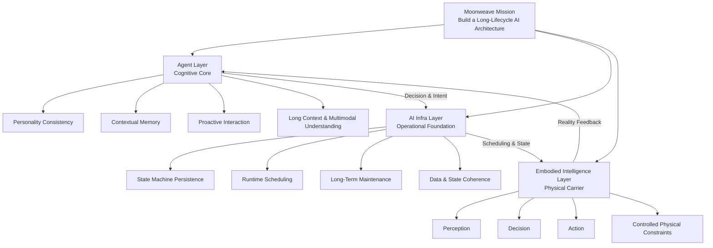
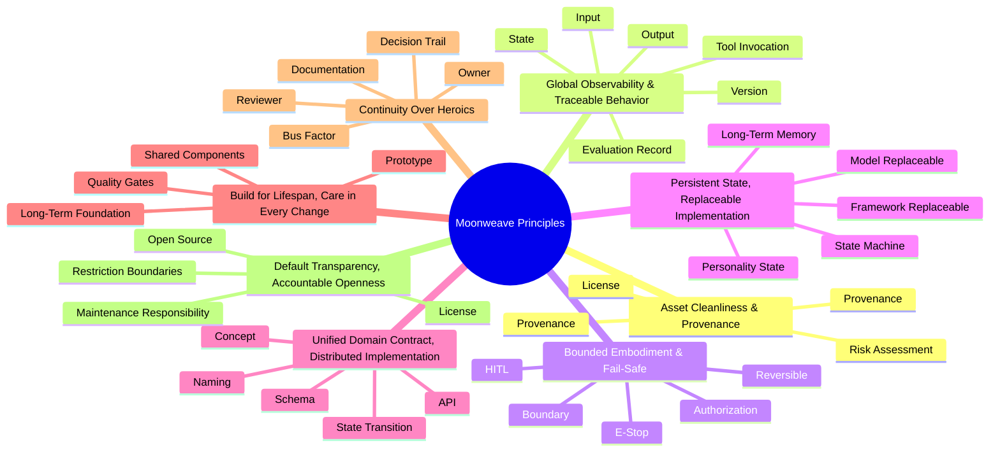
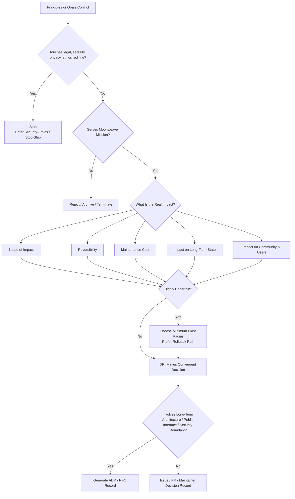

# Kaguya Project Principles

> Named for Kaguya, heart inheriting Iroha — In the digital world, grant long-lived beings enduring companionship that spans the years; and ultimately, in embodied form, complete the leap from the digital world into physical reality.

In *Super Dimension Kaguya Hime!*, Iroha Sakai found Kaguya beside a glowing utility pole and brought her home. Together they sang and grew in the virtual world "Tsukuyomi"; when Kaguya was taken away on a night of the full moon, she hid through long ages under the name "Tsukimi Yachiyo," until at last a world returned in which they could meet again. And Iroha, once she understood the truth, did not stop at sentimental illusion — she threw herself into research, forging the vow of "meeting again" into a body that could truly stand in the real world.

---

## Mission

Build a long-lifecycle AI architecture with Agent (intelligent agent) as the cognitive core, embodied intelligence as the physical carrier, and AI Infra (infrastructure) as the operational foundation.

- **Agent layer:** Integrate personality consistency, contextual memory, and proactive interaction logic; based on long context and multimodal understanding, provide companion-style interaction with sustained emotional awareness and proactive response capabilities.
- **AI Infra layer:** Provide state-machine persistence, runtime scheduling, and long-term maintenance mechanisms to ensure the system maintains data and state coherence and high availability across extended timelines.
- **Embodied intelligence layer:** Under controlled real-world physical constraints, convert Agent decision commands into a "perceive–decide–act" closed loop on physical terminals, enabling a smooth transition from digital space to the physical world.

---

## Principles

### Asset Cleanliness & Provenance

> For the Kaguya Project to grow into its own form, it must not borrow vitality through dependency on others.

Core assets must not rely on unauthorized protected expression — character likeness, voice, scripts, music, identifiable imagery, or datasets of unclear origin. Any reference, homage, stylistic borrowing, data collection, or third-party material must leave a clear record of permission, provenance, and risk assessment. Attribution and provenance are prerequisites for standing up to public scrutiny and long-term evolution. See `02-Security-Ethics.md` and engineering standards for specific review processes and REUSE/SPDX implementation.

### Observability & Reproducibility

> Iroha only acted after she saw the truth of "Tsukuyomi" and Tsukimi Yachiyo; only by first acknowledging gaps can a system preserve its identity across long years.

Internally and externally, first account for what exists, what is missing, and what is limited. Key decisions must retain sufficient records of inputs, state, versions, tool invocations, outputs, and evaluations so they can be traced, audited, explained, or replayed under reasonable conditions to the extent needed to locate problems; internal state that cannot be measured, verified, or traced is treated as uncontrollable. Models must not use hallucination or vague responses to mask errors; when context confidence is insufficient, uncertainty must be stated explicitly — concealment harms trust more than slowness. See standards in `../../04-Engineering/en` for thresholds and specific metrics.

### Bounded Embodiment & Fail-Safe

> Moving from virtual companionship to physical action is the heaviest and slowest step in Iroha's story: once an agent enters others' space, mistakes cannot be erased with an apology.

Any intelligent behavior that can affect the real physical environment must by default be constrained by boundaries, tiered authorization, supervision, abort capability, and fail-safe mechanisms. Physical execution authority is not a natural extension of model capability, but a high-risk permission that must be separately granted, verified, and revoked; release progressively according to what is supervisable, reversible, and abortable — simulation, takeover, and emergency stop are part of the design itself, not after-the-fact patches. What we want is the ability to approach reality safely, not unsupervised autonomy. See `02-Security-Ethics.md` and embodied standards for specific gates, sandboxes, and hardware emergency-stop specifications.

### Persistent State, Replaceable Implementation

> What sustains the bond between Iroha and Kaguya is identity across the years, not any particular digital place or incidental tool. Existence matters more than tools.

Models, languages, frameworks, processes, and organizational forms are all tools; none should become the ultimate dependency that binds the system's life. The primary criterion for evaluating the system is whether it can support an Agent's personality, memory, and state machine persisting intact across years or longer. Keep tools that work well; replace those that do not; no one earns permanent standing by saying "we've always used it." Both stability and novelty must prove they serve the system itself, not the reverse — making the system change its identity.

### Unified Domain Contract, Distributed Implementation

> "Tsukuyomi" and the mechanical skeleton of reality differ vastly in implementation at either end, yet the core of "reunion and companionship" stays consistent — meaning must be shared; implementation may diverge.

Domain concepts, naming, Schema, API/protocol, state transitions, and version compatibility across repositories and modules should have reliable shared meaning; implementation language and internal structure at each location need not be uniform. Abstract only when there is genuine shared need; if deviation from convention is necessary, document the reason, who is responsible, what is affected, and when it will be reconciled. What is unified is the contract, not the tech stack.

### Sustainability & Quality Gates

> What Iroha built was not a temporary assignment, but a lifelong project supporting long companionship. Expected lifespan directly determines how much care must be invested.

One-off experiments, reusable prototypes, shared components, and long-term foundations require different levels of rigor: short-lived things need not be platformized early; things many will depend on cannot still be treated as drafts. When lifespan changes, requirements change with it; quality should not pile up for final acceptance — every merge should account for overall health. Emergency bypass may exist, but must record who will fix what, and by when.

### Continuity Over Heroics

> The Kaguya Project must live a long time — longer than any single person stays within it. The system's continuity cannot depend on one person's tacit memory, private environment, or personal judgment.

Critical knowledge, permissions, maintenance responsibility, and decision rationale must be inheritable by the team: documentation first, decisions recorded, Owner and Reviewer handoffs possible, bus factor not equal to 1. Heroic individual sprints may save the day, but must not become the norm — whatever one person alone holds up is what will break in the future.

### Default Transparency, Accountable Openness

> The bond between Iroha and Kaguya ultimately stepped into the sunlight of reality; a truly resilient system withstands public oversight and scrutiny.

General code, documentation, decisions, and research, when not touching security, privacy, law, or others' rights, belong in the open by default. Openness means clear licensing, traceable provenance, readable status, and active maintenance; dumping files into a public repository with no owner is not openness. Claiming open source requires OSI-compatible licensing and meeting requirements for redistribution, derivatives, and maintenance responsibility — open source is not a synonym for "public code." When openness is legitimately restricted, state where the restriction applies and on what basis.

---

## Our Commitments

1. **Capability transparency and risk exposure**
    - **Fact alignment:** Do not package defects, limitations, or bottlenecks as capabilities; expose incomplete and high-risk items promptly.
    - **Explicit marking:** High-risk components and incomplete modules that are not fully validated must be explicitly labeled in interfaces and documentation.
2. **Embodied and high-risk release gates**
    - **Triple gate:** Embodied control terminals and high-risk proactive Agent behavior may be released only after "registration ➔ security review ➔ CI/CD quality gate."
    - **Safety foundation:** Simulation, takeover (HITL), and hardware emergency stop (E-Stop) must always be reachable.
    - **Synthetic provenance:** Multimodal generated content must indicate whether it is original, licensed, referenced, or AI-synthesized.
3. **Upstream-first and controlled contract deviation**
    - **Community give-back:** For upstream dependencies, prioritize sending fixes and improvements back rather than long-term solo maintenance of a fork.
    - **Controlled technical debt:** When deviating from shared conventions, leave a trail and preserve a path back to alignment.
4. **Evidence-driven and RFC consensus mechanism**
    - **Objective orientation:** Discussions weigh evidence and argument, not rank; strip away seniority and organizational interference.
    - **rough consensus:** After seriously addressing technical dissent, form a judgment that can move forward — neither majority vote nor requirement that everyone be satisfied; minority views are archived, but evolution does not stall. See the RFC process for specific consensus methods.

---

## Conflict and Revision

1. **Conflict Priority Cascade**
When several principles pull at once, resolve in the following priority order:
    - **Baseline review:** First ask whether legal and security-ethics red lines are crossed.
    - **Mission alignment:** Then ask whether it still serves the mission.
    - **Real impact:** Compare actual impact magnitude, not whose title sounds louder.
    - **Risk-avoidance strategy:** When uncertain, choose the step that is easier to roll back and has smaller blast radius.
2. **DRI & ADR**
    - **Final decision:** Technical disputes are ultimately converged by the designated Directly Responsible Individual (DRI) to preserve forward momentum.
    - **ADR scope:** For long-term architecture, cross-repository contracts, public interfaces, major security boundaries, or decisions that cannot easily be rolled back, produce an Architecture Decision Record (ADR) documenting points of dispute, final choice, decision rationale, trade-offs, minority dissent, and re-evaluation timeline. Ordinary implementation disputes may be resolved via Issue/PR/Maintainer decision without necessarily going through ADR.
3. **Governance Revision**
    - **Principles stable, practices flexible:** Strictly distinguish stable "principles" (e.g., default transparency, fail-safe) from frequently tunable "practices" (e.g., license choice, model selection). The latter may change often; the former should hold steady.
    - **Trigger conditions:** Revisions to principles themselves go through a public RFC, stating whether the environment changed, an old conflict remains unresolved, or the principle has been shown to cause harm.
    - **Historical traceability:** Prior versions of principles and ADRs are permanently stored in version control and available for lookup at any time.
