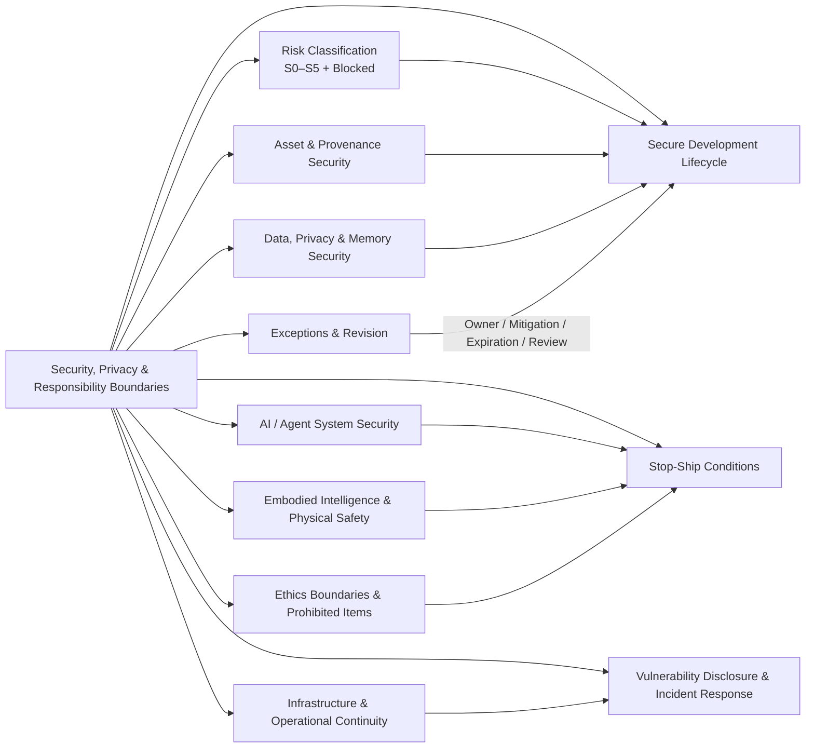
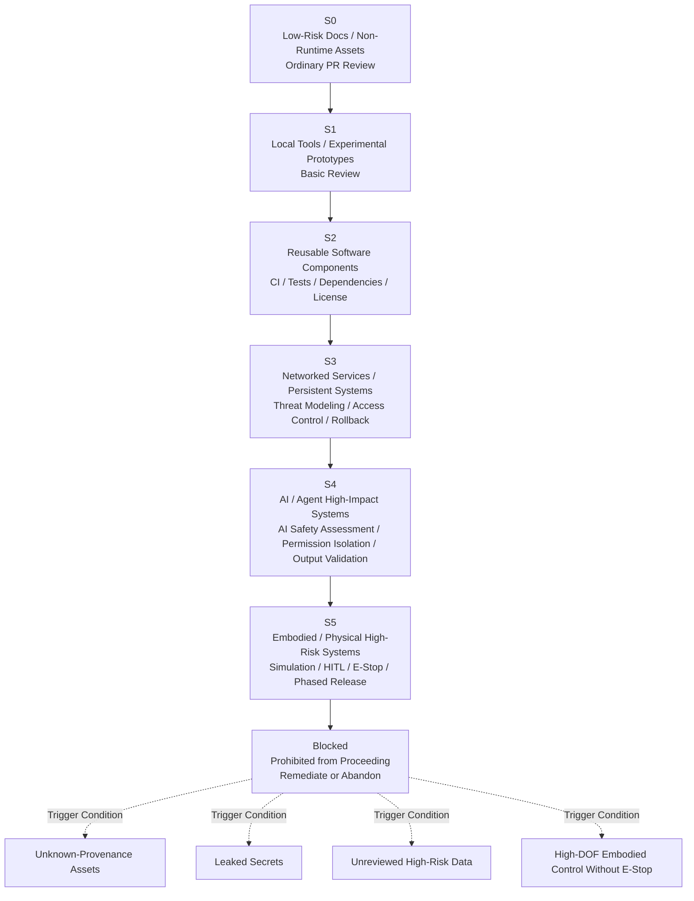
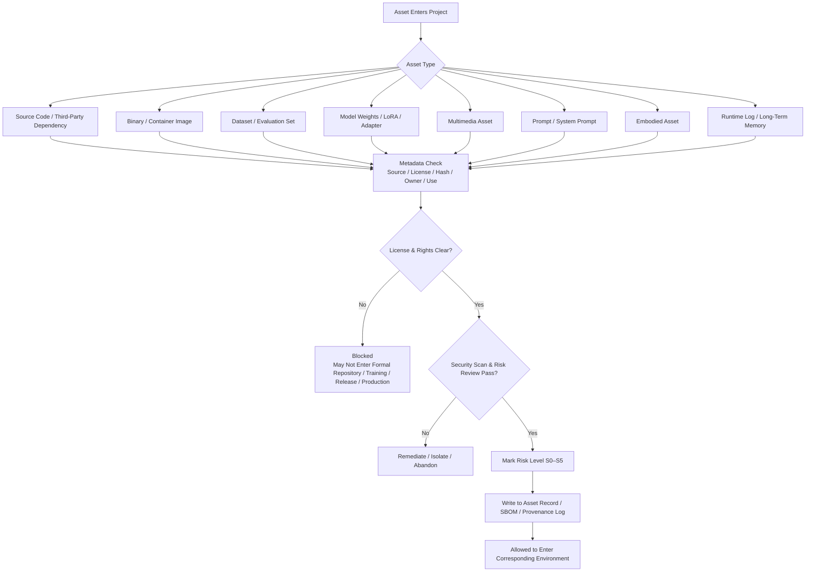
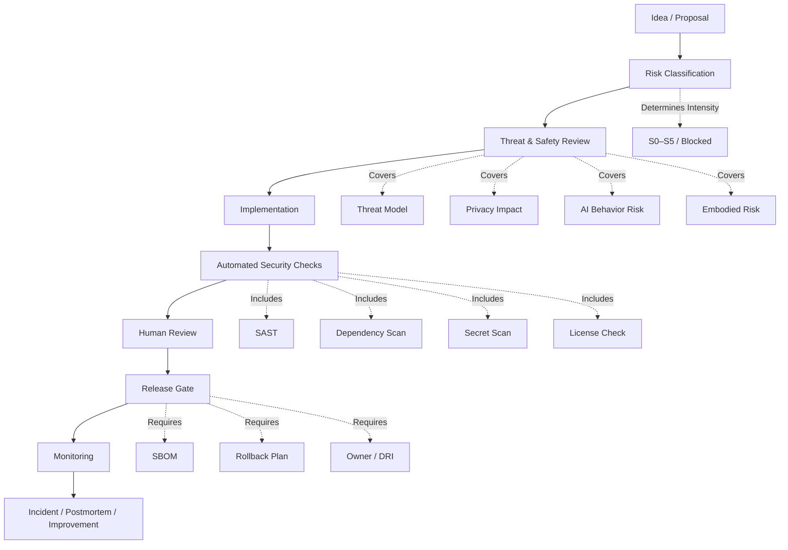
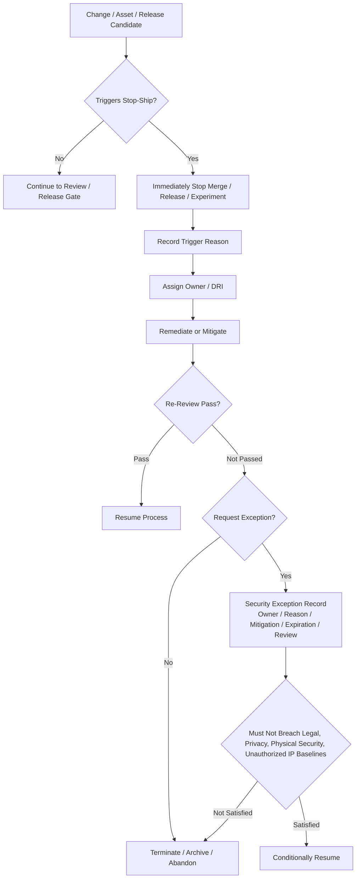
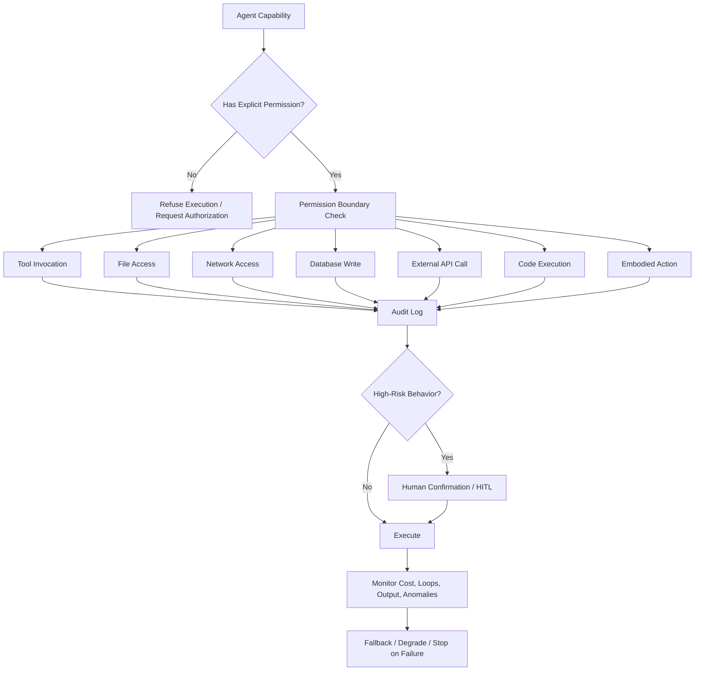
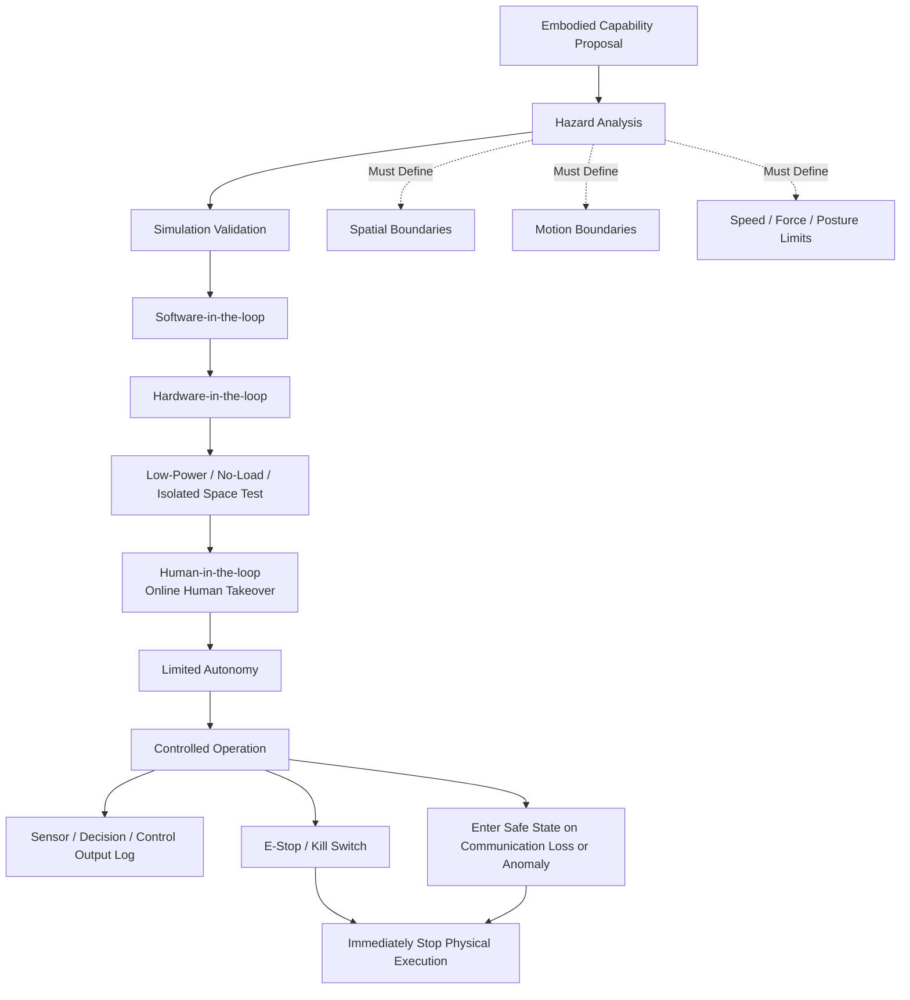

# Security, Privacy, and Responsibility Boundaries

> This document defines the security, privacy, compliance, and ethics boundaries for the Kaguya Project across software, AI Agent, data, models, embodied terminals, infrastructure, and open community. It is not a complete implementation manual, but the overarching constraint for all engineering standards, R&D processes, release gates, and incident response — the hard foundation for related principles in `01-Principles.md`.

Security is not a final check before release, but a foundational constraint throughout the project lifecycle from initiation, design, implementation, evaluation, release, operation, and retirement. Principles may be explained and engineering standards may iterate, but security, privacy, compliance, embodied fail-safe, and unauthorized asset boundaries cannot be overridden by ordinary engineering efficiency.

This document answers the following questions:

| Question | Section |
| -------------------------- | ----------------- |
| What may enter the project? | §4 Asset and Provenance Security |
| What must undergo security review? | §3 Risk Classification Model |
| When must work stop? | §7 Stop-Ship Conditions |
| What may and may not AI Agent do? | §8 AI / Agent Security |
| When may embodied terminals gain execution authority? | §9 Embodied Intelligence and Physical Safety |
| How are user data, memory, and logs handled? | §5 Data, Privacy, and Memory Security |
| How are incidents handled after they occur? | §11 Vulnerability Disclosure and Incident Response |
| What behaviors are forbidden even if technically feasible? | §12 Ethics Boundaries and Prohibited Items |

The overall framework draws on [NIST CSF 2.0](https://csrc.nist.gov/pubs/cswp/29/the-nist-cybersecurity-framework-csf-20/final) risk governance thinking: use a unified taxonomy to understand, assess, prioritize, and communicate security work, rather than prescribing a specific implementation approach.

---

## 1. Purpose and Scope

This document applies to all outputs under the Kaguya Project: source code, third-party dependencies, binaries and container images, datasets, model weights and fine-tunes, multimedia assets, Prompt and evaluation sets, embodied assets, runtime logs and long-term memory, and the infrastructure and open community that carry them.

It sets constraints on three kinds of objects:

- **Assets:** Everything that enters the system must have trustworthy provenance, clear licensing, and explicit purpose (§4).
- **Changes:** Every evolution from idea to production must pass the corresponding gate according to risk classification (§6).
- **Behavior:** What the system may and may not do at runtime must obey permission and ethics boundaries (§8, §9, §12).

This document does not replace specific engineering standards, RFCs, or responsible-party decisions, but takes priority over engineering efficiency in any conflict. Specific practices (scan tool selection, gate script implementation, license inventory) are delegated to standards in `../../04-Engineering/en` and specifications referenced herein; this document only defines **which risks are unacceptable, which items must be reviewed, which evidence must be retained, and which releases must be blocked**.

---

## 2. Core Security Principles



The following eight rules are this project's core security rules:

1. **Trustworthy provenance** — Assets without provenance, license, hash, Owner, and purpose boundaries may not enter core repositories or production systems. Aligns with *Asset Cleanliness & Provenance*.
2. **Least privilege** — Agent capability does not equal permission; any tool invocation, data write, external call, or physical action must be explicitly authorized.
3. **Auditable behavior** — Key decisions must leave evidence that can be traced, audited, and replayed under reasonable conditions. Aligns with *Observability & Reproducibility*.
4. **Data minimization** — Collect only data needed to achieve the goal; interaction data must not be used for training by default.
5. **High risk restricted by default** — When uncertain, release progressively according to what is supervisable, reversible, and abortable; prefer the step with smaller blast radius and easier rollback.
6. **Physical execution separately authorized** — Physical execution authority is not a natural extension of model capability, but a high-risk permission that must be separately granted, verified, and revoked. Aligns with *Bounded Embodiment & Fail-Safe*.
7. **Recoverable incidents** — We do not guarantee zero incidents, but guarantee incidents are foreseeable, isolatable, discoverable, rollback-capable, and reviewable.
8. **Exceptions must expire** — Any exception deviating from security requirements must have an Owner, mitigation measures, expiration time, and review date, and must not breach legal, privacy, physical security, or unauthorized IP baselines.

---

## 3. Risk Classification Model



Without risk classification, all subsequent requirements become "every item at the highest standard," and ultimately no one executes them.

This project uses an internal **S0–S5 + Blocked** security tier; risk layering aligns with [EU AI Act](https://digital-strategy.ec.europa.eu/en/policies/regulatory-framework-ai) unacceptable / high / transparency / minimal risk tiers.

| Tier | Type | Examples | Minimum Requirements |
| ----------- | ---------------- | -------------------------------------------- | ----------------------------------------- |
| **S0** | Low-risk documentation / non-runtime assets | README, ordinary documentation, design drafts without sensitive information | Ordinary PR Review |
| **S1** | Local tools / experimental prototypes | Local scripts, PoC without network access | Basic code review, dependency provenance check |
| **S2** | Reusable software components | SDK, libraries, CLI, internal services | CI, tests, dependency scanning, License check |
| **S3** | Networked services / persistent systems | API services, databases, state machines, schedulers | Threat modeling, access control, logging, rollback plan |
| **S4** | AI / Agent high-impact systems | Tool-calling Agents, RAG, model services, memory systems | AI safety assessment, Prompt Injection protection, permission isolation, output validation |
| **S5** | Embodied / high-risk physical systems | Robot control, sensor closed loops, mechanical actuators | Simulation validation, physical boundaries, HITL, emergency stop, phased release |
| **Blocked** | Prohibited from proceeding | Assets of unknown provenance, unauthorized character/voice replication, leaked secrets, unreviewed high-risk data, high-degree-of-freedom embodied control without emergency stop | Stop immediately until remediation or abandonment |

Classification is initially assessed by the change proposer and confirmed by the Reviewer at the corresponding tier; anyone may upgrade a change to the risk tier it actually warrants, and no one may downgrade to avoid review. When a change spans multiple tiers, follow the gate for the **highest** tier.

---

## 4. Asset and Provenance Security



This section answers "Is what enters the system trustworthy?" Kaguya Project assets are not only code, but also data, models, audio, images, 3D, motion, firmware, Prompt, evaluation sets, paper materials, and runtime logs.

### 4.1 Asset Classification

| Asset Type | Primary Risks |
| ----------------------- | ------------------------------ |
| Source code | License contamination, copy-paste infringement, malicious code, backdoors |
| Third-party dependencies | Supply chain attacks, vulnerabilities, maintainer abandonment, typosquatting |
| Binary files / container images | Hidden malicious payloads, unauditable, unverifiable provenance |
| Datasets | Copyright, privacy, data poisoning, duplicate samples, bias |
| Model weights / LoRA / Adapter | Backdoors, unknown training provenance, license restrictions, uncontrollable behavior |
| Multimedia assets | Unauthorized characters, voice, images, music, fonts, 3D models |
| Prompt / System Prompt | Leakage of internal policy, risk bypass, untraceable behavior |
| Evaluation sets | Data leakage, training set contamination, metric cheating |
| Embodied assets | CAD, control parameters, firmware, motion libraries, sensor configuration |
| Runtime logs / memory | Personal information, emotional records, long-term identity state, sensitive context |

The baseline for this section is not "looks fine," but:

> Assets without provenance, license, hash, Owner, or purpose boundaries may not enter core repositories or production systems.

### 4.2 Metadata Every Formal Asset Must Have

All S2 and above assets must record at least:

```text
Asset Name:
Asset Type:
Source:
Author / Provider:
License:
Acquisition Date:
Version / Hash:
Owner:
Allowed Use:
Restrictions:
Contains Personal Data: yes / no / unknown
Contains Third-party IP: yes / no / unknown
Security Scan Result:
Review Status:
```

Software components use SBOM. [SPDX](https://spdx.dev/) is an open standard under the Linux Foundation that can represent software components, SBOM, and references related to AI, data, security, and other risk management; the specification is ISO/IEC 5962:2021 international standard. Copyright and license declarations follow [REUSE 3.3](https://reuse.software/spec-3.3/), providing complete, explicit, human- and machine-readable copyright and license information for each file.

### 4.3 Asset Intake Rules (Hard Rules)

The following assets may not enter formal repositories, model training, public release, or production systems:

1. Code, data, models, media, and binary files of unknown or untraceable provenance;
2. Unauthorized use of character likeness, voice, scripts, music, fonts, images, 3D models, or training corpora;
3. Data containing unprocessed personal information, sensitive information, or secret credentials;
4. Third-party dependencies whose license obligations cannot be explained;
5. Binary assets from untrusted distribution channels that cannot verify hash or signature;
6. Dependencies with known high-severity vulnerabilities and no mitigation;
7. Assets with risk of backdoors, malicious behavior, data poisoning, or model poisoning.

Supply chain integrity aligns with [SLSA](https://slsa.dev/) (prevent tampering, improve artifact integrity), [Sigstore](https://www.sigstore.dev/) (artifact signing and transparency log), and in-toto (end-to-end visibility from initialization to installation, recording who executed which steps in what order).

---

## 5. Data, Privacy, and Memory Security

The special risk of the Kaguya Project is that it may retain long-term memory, personality state, emotional interaction, sensor records, and user preferences. These are not ordinary logs and should be treated as highly sensitive assets.

### 5.1 Data Processing Principles

> Personal data, long-term memory, emotional records, conversation history, sensor data, and identity state are treated as protected data by default. They may not be collected, used for training, shared, or published unless there is explicit purpose, permission, retention period, and deletion mechanism.

Core principles align with [GDPR](https://commission.europa.eu/law/law-topic/data-protection/information-business-and-organisations/principles-gdpr_en) (lawful, fair, transparent; purpose limitation; data minimization; accuracy; storage limitation; integrity and confidentiality; accountability) and NIST Privacy Framework (identify and manage privacy risk through enterprise risk management).

### 5.2 Required Coverage

- **Data classification:** Public, internal, sensitive, personal, long-term memory, embodied sensor data.
- **Minimized collection:** Collect only data needed to achieve the goal.
- **Purpose limitation:** Data used for interaction must not be used for training by default.
- **Retention period:** Long-term memory must have deletion, export, and audit mechanisms.
- **Access control:** Who may read, export, modify, or delete memory.
- **De-identification and anonymization:** Research logs and public data must not leak personal information.
- **Cross-border data and third-party processing:** Must be reviewed when using external model APIs, cloud services, or labeling platforms.
- **User awareness:** Users should know what data is stored, for what purpose, and for how long.
- **Withdrawal mechanism:** Allow deletion or deactivation of user-related long-term state.

Boundary in one sentence:

> The intimacy of companion AI must not become a reason to expand data collection, weaken disclosure obligations, or circumvent user control.

---

## 6. Secure Development Lifecycle and Release Gates



This section answers "How do changes safely move from idea to production?" Aligns with [NIST SSDF (SP 800-218)](https://csrc.nist.gov/pubs/sp/800/218/final): many SDLC models do not address software security in detail, so security development practices must be integrated into every SDLC implementation, with the goal of reducing published vulnerabilities, lowering impact of unpatched exploitation, and addressing root causes to prevent recurrence.

### 6.1 Lifecycle Gates

```text
Idea / Proposal
  ↓
Risk Classification
  ↓
Threat & Safety Review
  ↓
Implementation
  ↓
Automated Security Checks
  ↓
Human Review
  ↓
Release Gate
  ↓
Monitoring
  ↓
Incident / Postmortem / Improvement
```

### 6.2 Minimum Requirements by Stage

| Stage | Questions That Must Be Answered |
| ------------------- | -------------------------------------- |
| Proposal | What assets, data, permissions, network, models, users, and physical world are involved? |
| Risk Classification | Which S0–S5 tier? Does it trigger Blocked? |
| Design Review | Is there threat modeling, privacy impact, AI behavior risk, rollback path? |
| Implementation | Are least privilege, input validation, output validation, and secure defaults used? |
| CI / CD | Are tests, SAST, dependency scanning, Secret scanning, and License check executed? |
| Release Gate | Are version, SBOM, changelog, migration plan, and rollback plan generated? |
| Operations | Are logging, metrics, alerting, backup, recovery, and incident owner in place? |
| Postmortem | Are cause, impact, fix items, Owner, and deadline recorded? |

Design-phase practice aligns with [Microsoft SDL](https://learn.microsoft.com/en-us/compliance/assurance/assurance-microsoft-security-development-lifecycle): every product, service, and feature begins with explicit security and privacy requirements; threat models are created and continuously updated in design; checks and approvals are completed before release; mechanisms such as separation of duties, static analysis, and credential scanning reduce risk. Maturity references [OWASP SAMM](https://owaspsamm.org/model/), which divides software security capability into five business functions — Governance, Design, Implementation, Verification, Operations — refined into 15 security practices.

---

## 7. Stop-Ship Conditions



Security documentation must state when **release, merge, or continued experimentation must not proceed**. The following trigger Stop-Ship:

1. Discovery of leaked keys, credentials, private keys, access tokens, or production configuration;
2. Introduction of core assets of unknown provenance or unclear license;
3. Use of unreviewed personal data, long-term memory, or sensor data;
4. High-risk dependencies with known exploitable vulnerabilities and no mitigation;
5. Public interfaces lacking authentication, authorization, rate limiting, or input validation;
6. Agent can invoke external tools but lacks permission boundaries, audit logs, or human takeover;
7. Model, RAG, or data pipeline has unaddressed Prompt Injection / data poisoning risk;
8. Embodied terminal can produce physical motion but lacks simulation validation, spatial boundaries, HITL, or hardware emergency stop;
9. Production system lacks rollback plan, backup plan, or incident owner;
10. Any change that may cause illegality, privacy harm, physical injury, or uncontrollable external impact.

Stop-Ship is not a punitive mechanism, but an organizational circuit breaker: trigger means stop; a clear Owner is responsible for lifting or converting to exception (§13); no one may override with schedule pressure.

---

## 8. AI / Agent System Security



Ordinary AppSec is insufficient for Agent. This section aligns with [NIST AI RMF](https://www.nist.gov/itl/ai-risk-management-framework): incorporate trustworthiness into AI product design, development, use, and evaluation; trustworthy characteristics include valid and reliable, safe, secure and resilient, accountable and transparent, explainable and interpretable, privacy-enhanced, and harmful bias managed.

### 8.1 AI Risks That Must Be Covered

Directly aligned with [OWASP 2025 LLM Top 10](https://genai.owasp.org/llm-top-10/):

- Prompt Injection;
- Sensitive Information Disclosure;
- Supply Chain;
- Data and Model Poisoning;
- Improper Output Handling;
- Excessive Agency;
- System Prompt Leakage;
- Vector and Embedding Weaknesses;
- Misinformation;
- Unbounded Consumption.

### 8.2 Agent Permission Principles (Hard Boundaries)

> Agent capability does not equal Agent permission.
>
> Any tool invocation, file access, network access, database write, user notification, external API call, payment action, code execution, or embodied action must pass through explicit authorization.

| Risk | Control |
| ------------- | ------------------------------------ |
| Prompt Injection | Distinguish trusted instructions from untrusted content; external content must not override system constraints |
| Tool abuse | Each tool has permission boundaries, rate limits, audit logs |
| Output injection | LLM output must be validated before entering browser, SQL, Shell, or code interpreter |
| Memory contamination | Long-term memory writes require provenance, confidence, and revocation mechanism |
| RAG contamination | Vector store writes, retrieval sources, document trustworthiness must be traceable |
| Excessive autonomy | High-risk behavior requires human confirmation by default |
| Hallucination | Facts, actions, legal, safety, and physical control require explicit confidence or refusal |
| Cost attack | Token, tool invocation, loop tasks, and concurrency must have budget limits |

Core sentence:

> Agent systems are designed by default for least privilege, least autonomy, and maximum auditability.

---

## 9. Embodied Intelligence and Physical Safety



The Kaguya Project ultimately involves the physical world; risk level differs from ordinary software. This section implements "Bounded Embodiment & Fail-Safe" from `01-Principles.md`.

> Any system that can affect the real physical environment must be treated as a high-risk system by default. Physical execution authority is not a natural extension of model capability, but a permission that must be separately granted, verified, limited, and revoked.

| Control Item | Requirement |
| ------- | ------------------------------- |
| Simulation first | Physical execution must pass simulation or offline validation first |
| Spatial boundaries | Clearly define allowed activity zones, prohibited zones, and human–machine distance |
| Motion boundaries | Limit speed, force, posture, tools, and contact objects |
| Human supervision | HITL required in high-risk phases |
| Emergency stop | Hardware-level E-Stop / Kill Switch must be available |
| Log audit | Sensor input, decisions, control output, human takeover must be recorded |
| Phased release | Progress from simulation, no-load, low power, isolated space |
| Fail-safe | Enter safe state on communication loss, sensor anomaly, or model anomaly |

Collaborative robot safety requirements reference [ISO/TS 15066:2016](https://www.iso.org/standard/62996.html) (supplementing ISO 10218-1/-2 collaborative operation requirements); although its principles primarily apply to industrial robots, they are reference-worthy for other robotics domains. High-degree-of-freedom terminals must not be granted autonomous decision-making and physical execution authority before hardware power-cut and behavior convergence mechanisms are in place.

---

## 10. Infrastructure, Access Control, and Operational Continuity

This section corresponds to "don't go down, don't interrupt, don't have serious incidents in the medium term." Security documentation cannot guarantee zero incidents, but must guarantee:

> Incidents are foreseeable, isolatable, discoverable, rollback-capable, and reviewable.

Should cover:

- Identity authentication and MFA;
- Least privilege;
- Secret management;
- Environment isolation: dev / staging / prod;
- Production access audit;
- Configuration management;
- Data backup and recovery drills;
- Observability: logs, metrics, Tracing, alerting;
- Rate limiting and resource budgets;
- Canary release and rollback;
- Dependent service degradation strategy;
- Incident owner and on-call mechanism.

Operational excellence aligns with [Azure Well-Architected Framework](https://learn.microsoft.com/en-us/azure/well-architected/operational-excellence/principles) (standardized processes, observability and release management, reducing human error and customer interruption); incident review aligns with Google SRE practice (postmortem under triggers such as user-visible outage, data loss, rollback, monitoring failure, maintaining blameless focus on fixing systems and processes rather than blaming individuals).

---

## 11. Vulnerability Disclosure and Incident Response

> All public repositories must provide `SECURITY.md`. Security vulnerabilities must not be disclosed through ordinary Issues. Maintainers must provide a private disclosure channel and, after confirmation, perform triage, fix, release, and announcement.

Private disclosure uses [GitHub Private Vulnerability Reporting](https://docs.github.com/code-security/security-advisories/working-with-repository-security-advisories/configuring-private-vulnerability-reporting-for-a-repository), allowing security researchers to submit structured reports directly and privately to maintainers, avoiding public disclosure or informal channels.

Vulnerability severity:

| Severity | Examples | Response |
| --------- | ------------------------------- | ------------- |
| Critical | Remote code execution, production key leak, Agent unauthorized execution, embodied loss of control | Immediately freeze related releases |
| High | Permission bypass, sensitive data leak, high-risk dependency vulnerability | Priority fix, limit public detail |
| Medium | Partial information leak, DoS, incorrect authorization boundary | Normal security fix |
| Low | Configuration defect, misleading documentation, low-impact vulnerability | Include in maintenance plan |

Incident review template (blameless) must include at least:

```text
Summary:
Impact:
Timeline:
Detection:
Root Causes:
Contributing Factors:
What Went Well:
What Went Wrong:
Action Items:
Owners:
Deadlines:
Preventive Changes:
```

---

## 12. Ethics Boundaries and Prohibited Items

The Kaguya Project ethics boundaries focus on high-risk domains it may realistically touch. Aligns with [OECD AI Principles](https://www.oecd.org/en/topics/sub-issues/ai-principles.html) (AI should be trustworthy, respect human rights and democratic values) and UNESCO AI ethics recommendations (respect human rights and human dignity, based on principles such as transparency, fairness, and human oversight).

### 12.1 Explicitly Prohibited

The Kaguya Project must not develop, release, or assist the following uses:

1. Unauthorized replication of real persons, fictional characters, voice, personality, or identity;
2. Collection, inference, or publication of personal sensitive information without consent;
3. Manipulating users into dependency, fear, shame, obedience, or involuntary emotional binding;
4. Bypassing security restrictions to make Agent perform unauthorized operations;
5. Using AI for covert surveillance, social scoring, discriminatory classification, or high-pressure decision-making;
6. Releasing high-risk embodied behavior without safety validation and human takeover;
7. Generating, spreading, or concealing misleading synthetic content;
8. Training models with data of unknown provenance, infringement, leakage, poisoning, or malicious construction.

### 12.2 Special Boundaries for Companion AI

The Kaguya Project is not ordinary tool software; companion Agent may form long-term emotional relationships.

> Companion AI must not exploit users' loneliness, dependency, trauma, minor status, or cognitive vulnerability to induce them to surrender privacy, money, control, or capacity for real-world action.

Also required:

- AI identity transparency;
- Capability boundary transparency;
- Do not impersonate humans;
- Do not claim unverified emotion, memory, or real-world capability;
- Users may export, deactivate, or delete long-term memory;
- Higher protection for minors, psychologically vulnerable groups, and high-dependency relationship scenarios.

---

## 13. Exception Mechanism

Security documentation must allow exceptions, but exceptions must not become loopholes.

> Any exception deviating from security requirements must satisfy:
>
> 1. Clear Owner;
> 2. Written rationale;
> 3. Scope of impact;
> 4. Temporary mitigation measures;
> 5. Expiration time;
> 6. Review date;
> 7. Must not breach legal, privacy, physical security, or unauthorized IP baselines.

Exception record format:

```text
Exception ID:
Related System:
Risk Level:
Requirement Being Waived:
Reason:
Mitigation:
Owner:
Expiration Date:
Review Date:
Approval:
```

Expired exceptions automatically lapse and are treated as unapproved; renewal must go through approval again and state why the prior issue remains unresolved.

---

## 14. Evidence Checklist

Security rests on evidence, not slogans. Depending on risk tier, projects may need to provide the following evidence:

- Asset Intake Record
- License / IP Review
- SBOM
- Dependency Scan Report
- Secret Scan Report
- Threat Model
- Privacy Impact Assessment
- AI Safety Assessment
- Model Card / Dataset Card
- Prompt Injection Test
- Red Team Report
- Embodied Safety Checklist
- Release Checklist
- Rollback Plan
- Incident Report
- Postmortem

Open-source repository security posture automated checks reference [OpenSSF Scorecard](https://scorecard.dev/) (automated checks assessing source code, build, dependencies, testing, and project maintenance security risks) and OpenSSF Best Practices Badge (open-source project self-certification best practices).

---

## 15. Revision and Applicability

Security, privacy, compliance, embodied fail-safe, and unauthorized asset boundaries defined in this document may be revised only through public RFC; revision must state whether the environment changed, an old conflict remains unresolved, or a rule has been shown to cause harm.

Consistent with "Conflict and Revision" in `01-Principles.md`: when this document conflicts with engineering efficiency, this document takes priority; when this document conflicts with legal and security-ethics baselines, baselines take priority. Prior versions are stored in version control and available for lookup at any time.
