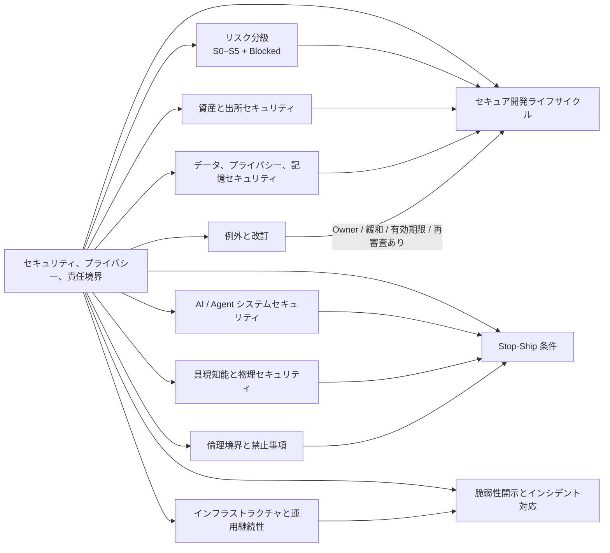
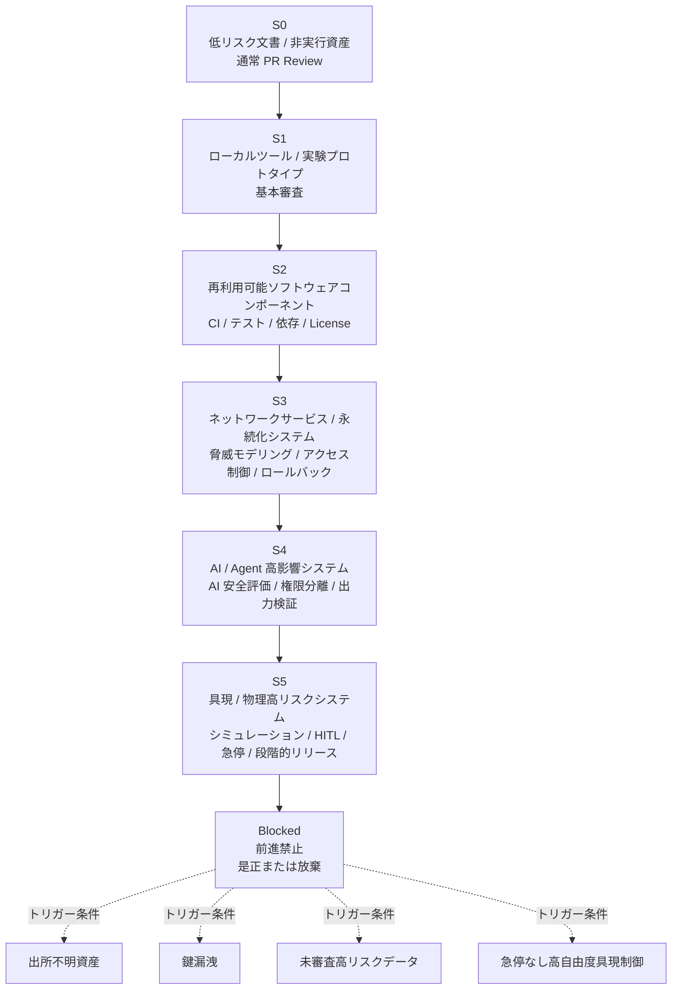
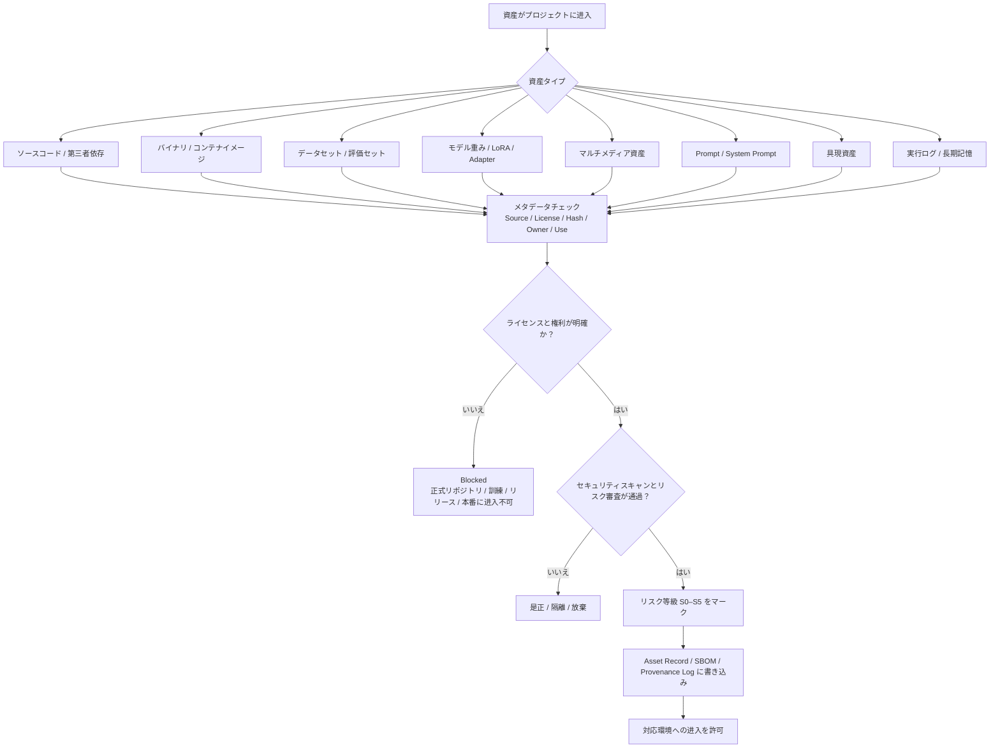
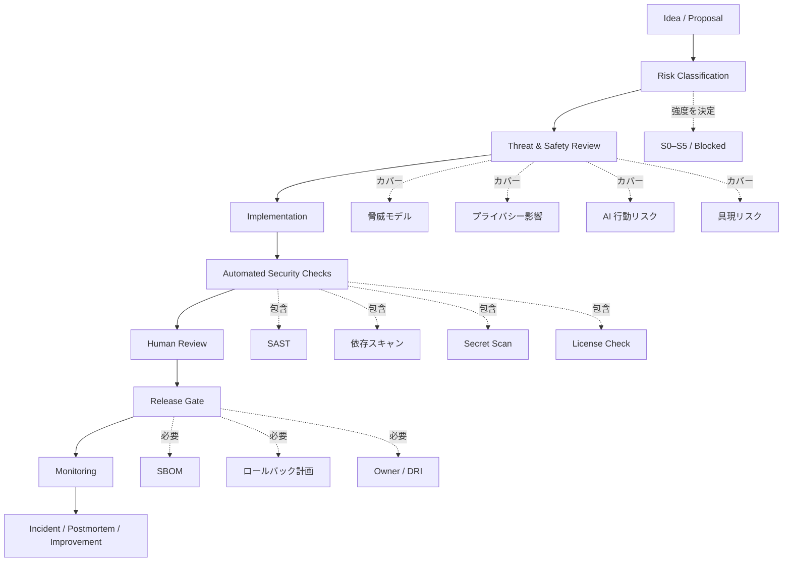
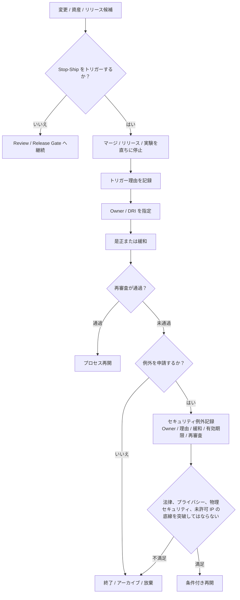
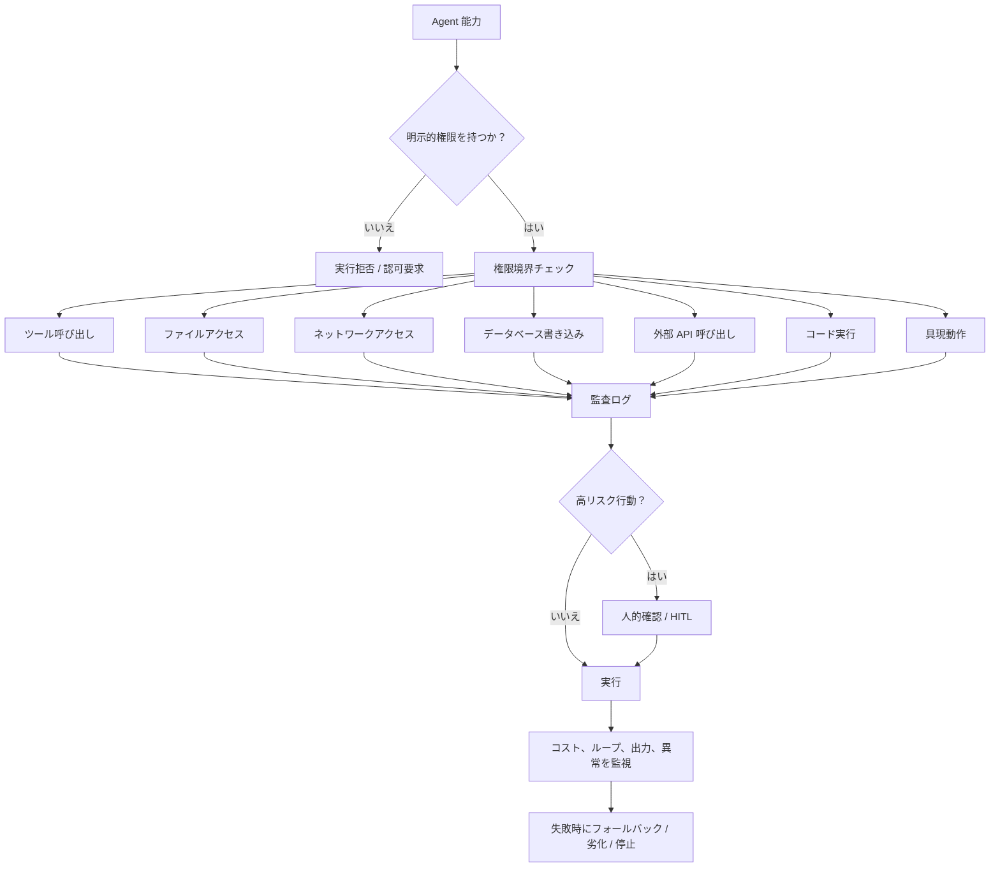
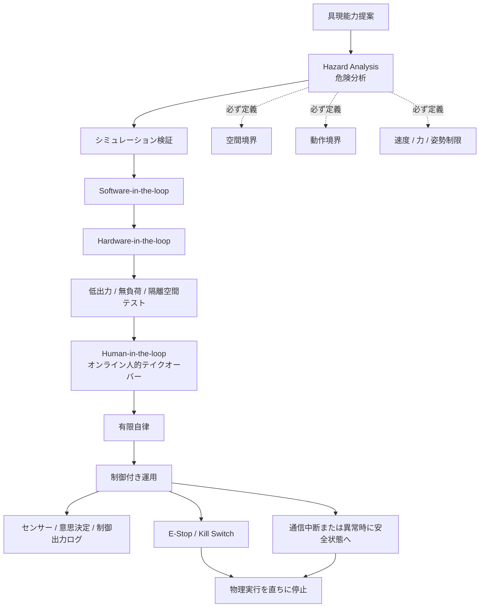

# セキュリティ、プライバシー、責任境界

> 本文書は、輝夜計画におけるソフトウェア、AI Agent、データ、モデル、具現端末、インフラストラクチャ、オープンコミュニティにわたるセキュリティ、プライバシー、コンプライアンス、倫理境界を定義します。完全な実装マニュアルではなく、すべてのエンジニアリング標準、研究開発プロセス、リリースゲート、インシデント対応の上位制約 —— `01-Principles.md` の関連原則の硬い基盤です。

セキュリティはリリース前の最終チェックではなく、立項、設計、実装、評価、リリース、運用、退役に至るプロジェクト全過程の基礎制約です。原則は説明でき、エンジニアリング規範は反復できますが、セキュリティ、プライバシー、コンプライアンス、具現フェイルセーフ、未許可資産境界は、通常のエンジニアリング効率で上書きできません。

本文書が答える問い：

| 問い | 対応章 |
| -------------------------- | ----------------- |
| 何がプロジェクトに入ってよいか？ | §4 資産と出所セキュリティ |
| 何がセキュリティ審査を受けなければならないか？ | §3 リスク分級モデル |
| いつ前進を止めなければならないか？ | §7 Stop-Ship 条件 |
| AI Agent は何ができ、何ができないか？ | §8 AI / Agent セキュリティ |
| 具現端末はいつ実行権を得られるか？ | §9 具現知能と物理セキュリティ |
| ユーザーデータ、記憶、ログはどう扱うか？ | §5 データ、プライバシー、記憶セキュリティ |
| 事故後はどう処理するか？ | §11 脆弱性開示とインシデント対応 |
| 技術的に可能でも行わない行為は？ | §12 倫理境界と禁止事項 |

全体フレームワークは [NIST CSF 2.0](https://csrc.nist.gov/pubs/cswp/29/the-nist-cybersecurity-framework-csf-20/final) のリスクガバナンス思想を取り入れます。特定の実装方式を直接規定するのではなく、統一分類法でセキュリティ業務を理解、評価、優先順位付け、コミュニケーションします。

---

## 1. 目的と適用範囲

本文書は輝夜計画下のすべての成果物に適用されます。ソースコード、第三者依存、バイナリとコンテナイメージ、データセット、モデル重みとファインチューン、マルチメディア資産、Prompt と評価セット、具現資産、実行ログと長期記憶、およびこれらを支えるインフラストラクチャとオープンコミュニティ。

以下の三種類の対象に制約を設けます。

- **資産**：システムに入るすべてのものは、出所が信頼でき、ライセンスが明確で、用途が明示されている必要があります（§4）。
- **変更**：アイデアから本番までの各進化は、リスク分級に応じたゲートを通過しなければなりません（§6）。
- **行為**：実行中にシステムが何をでき、何をできないかは、権限と倫理境界に従わなければなりません（§8、§9、§12）。

本文書は具体的なエンジニアリング標準、RFC、責任者の判断に代わるものではありませんが、いかなる衝突においてもエンジニアリング効率より優先します。具体的なやり方（スキャンツール選定、ゲートスクリプト実装、ライセンス一覧）は `04-Engineering` の各標準と本文書が参照する規範に委ねます。本文書が定めるのは**どのリスクが許容できないか、どの項目が審査を受けなければならないか、どの証拠を残さなければならないか、どのリリースをブロックしなければならないか**のみです。

---

## 2. コアセキュリティ原則



以下八条が本プロジェクトのコアセキュリティルールです。

1. **出所の信頼性** — 出所、ライセンス、ハッシュ、Owner、用途境界のない資産は、コアリポジトリまたは本番システムに入れてはなりません。*資産のクリーンさと出所の追跡可能性* に整合。
2. **最小権限** — Agent の能力は権限に等しくありません。ツール呼び出し、データ書き込み、外部呼び出し、物理動作のいずれも明示的認可が必要です。
3. **行為の監査可能性** — 重要な意思決定には、追跡可能、監査可能、合理的条件下で再現可能な証拠を残す必要があります。*全体可観測性と行動の追跡可能性* に整合。
4. **データ最小化** — 目標達成に必要なデータのみ収集します。インタラクションデータをデフォルトで訓練に使用してはなりません。
5. **高リスクはデフォルトで制限** — 不確実な場合は、監督可能、可逆、中止可能な程度に段階的に解放し、波及が小さく取り消しやすい一歩を優先します。
6. **物理実行権は個別認可** — 物理実行権はモデル能力の自然な延長ではなく、個別に付与・検証・回収される必要のある高リスク権限です。*具現の収束とフェイルセーフ* に整合。
7. **事故は回復可能** — 事故が起きないとは保証しませんが、事故が予見可能、隔離可能、発見可能、ロールバック可能、振り返り可能であることを保証します。
8. **例外は期限付き** — セキュリティ要求から逸脱する例外には、Owner、緩和措置、有効期限、再審査日が必要であり、法律、プライバシー、物理セキュリティ、未許可 IP の底線を突破してはなりません。

---

## 3. リスク分級モデル



リスク分級がなければ、以降のすべての要求は「すべての項目が最高水準」となり、最終的に誰も実行しません。

本プロジェクトは **S0–S5 + Blocked** の内部セキュリティ等級を採用します。リスク階層化の考え方は [EU AI Act](https://digital-strategy.ec.europa.eu/en/policies/regulatory-framework-ai) の許容不可 / 高 / 透明性 / 最小リスク分級に整合します。

| 等級 | タイプ | 例 | 最低要求 |
| ----------- | ---------------- | -------------------------------------------- | ----------------------------------------- |
| **S0** | 低リスク文書 / 非実行資産 | README、通常文書、機微情報のない設計草案 | 通常 PR Review |
| **S1** | ローカルツール / 実験プロトタイプ | ローカルスクリプト、ネットワークアクセスなし PoC | 基本コードレビュー、依存出所チェック |
| **S2** | 再利用可能ソフトウェアコンポーネント | SDK、ライブラリ、CLI、内部サービス | CI、テスト、依存スキャン、License チェック |
| **S3** | ネットワークサービス / 永続化システム | API サービス、データベース、ステートマシン、スケジューラ | 脅威モデリング、アクセス制御、ログ、ロールバック計画 |
| **S4** | AI / Agent 高影響システム | ツール呼び出し Agent、RAG、モデルサービス、記憶システム | AI 安全評価、Prompt Injection 防御、権限分離、出力検証 |
| **S5** | 具現 / 高リスク物理システム | ロボット制御、センサー閉ループ、機械アクチュエータ | シミュレーション検証、物理境界、HITL、急停、段階的リリース |
| **Blocked** | 前進禁止 | 出所不明資産、未許可キャラクター/音色複製、鍵漏洩、未審査高リスクデータ、急停なし高自由度具現制御 | 是正または放棄完了まで直ちに停止 |

分級は変更提案者が初判し、対応階層の Reviewer が確認します。誰でも変更を実際のリスク等級まで引き上げられ、誰も審査回避のために引き下げられません。変更が複数等級に跨る場合は、**最高**等級のゲートに従います。

---

## 4. 資産と出所セキュリティ



この節は「システムに入るものは信頼できるか」を答えます。輝夜計画の資産はコードだけではなく、データ、モデル、音声、画像、3D、動作、ファームウェア、Prompt、評価セット、論文資料、実行ログも含みます。

### 4.1 資産分類

| 資産タイプ | 主要リスク |
| ----------------------- | ------------------------------ |
| ソースコード | License 汚染、コピペ侵害、悪意あるコード、バックドア |
| 第三者依存 | サプライチェーン攻撃、脆弱性、メンテナー離脱、typosquatting |
| バイナリファイル / コンテナイメージ | 隠蔽悪意ペイロード、監査不能、出所検証不能 |
| データセット | 著作権、プライバシー、データ汚染、重複サンプル、バイアス |
| モデル重み / LoRA / Adapter | バックドア、訓練出所不明、ライセンス制限、制御不能行動 |
| マルチメディア資産 | 未許可キャラクター、音色、画像、音楽、フォント、3D モデル |
| Prompt / System Prompt | 内部方針漏洩、リスク回避、追跡不能行動 |
| 評価セット | データ漏洩、訓練セット汚染、指標不正 |
| 具現資産 | CAD、制御パラメータ、ファームウェア、動作ライブラリ、センサー設定 |
| 実行ログ / 記憶 | 個人情報、感情記録、長期アイデンティティ状態、機微コンテキスト |

この節の基準は「問題なさそう」ではなく：

> 出所、ライセンス、ハッシュ、Owner、用途境界のない資産は、コアリポジトリまたは本番システムに入れてはならない。

### 4.2 正式資産が備えるべきメタデータ

S2 以上の資産は少なくとも以下を記録します。

```text
Asset Name:
Asset Type:
Source:
Author / Provider:
License:
Acquisition Date:
Version / Hash:
Owner:
Allowed Use:
Restrictions:
Contains Personal Data: yes / no / unknown
Contains Third-party IP: yes / no / unknown
Security Scan Result:
Review Status:
```

ソフトウェアコンポーネントは SBOM を使用します。[SPDX](https://spdx.dev/) は Linux Foundation 下のオープン標準で、ソフトウェアコンポーネント、SBOM、および AI、データ、セキュリティなどリスク管理関連参照を表現できます。規格は ISO/IEC 5962:2021 国際標準です。著作権とライセンス声明は [REUSE 3.3](https://reuse.software/spec-3.3/) 規範に従い、各ファイルに完全で明確、人と機械が読める著作権・ライセンス情報を提供します。

### 4.3 資産准入ルール（硬規則）

以下の資産は、正式リポジトリ、モデル訓練、公開リリース、本番システムに入れてはなりません。

1. 出所不明または追跡不能なコード、データ、モデル、メディア、バイナリファイル；
2. 未許可使用のキャラクター形象、音色、脚本、音楽、フォント、画像、3D モデル、訓練コーパス；
3. 未処理の個人情報、機微情報、秘密クレデンシャルを含むデータ；
4. ライセンス義務を説明できない第三者依存；
5. 信頼できない配布チャネル由来で、ハッシュまたは署名を検証できないバイナリ資産；
6. 既知の高深刻度脆弱性があり緩和措置のない依存；
7. バックドア、悪意ある行為、データポイズニング、モデルポイズニングリスクのある資産。

サプライチェーン完全性は [SLSA](https://slsa.dev/)（改ざん防止、アーティファクト完全性向上）、[Sigstore](https://www.sigstore.dev/)（アーティファクト署名と透明ログ）、in-toto（初期化からインストールまでの全過程可視性、誰がどの順序でどのステップを実行したかを記録）に整合します。

---

## 5. データ、プライバシー、記憶セキュリティ

輝夜計画の特殊リスクは、長期記憶、人格状態、感情インタラクション、センサー記録、ユーザー嗜好を保存しうることです。これらは通常のログではなく、高機微資産として扱うべきです。

### 5.1 データ処理原則

> 個人データ、長期記憶、感情記録、対話履歴、センサーデータ、アイデンティティ状態は、デフォルトで保護対象データとみなします。明確な目的、権限、保持期限、削除機構がない限り、収集、訓練、共有、公開してはなりません。

コア原則は [GDPR](https://commission.europa.eu/law/law-topic/data-protection/information-business-and-organisations/principles-gdpr_en)（合法・公平・透明、目的制限、データ最小化、正確性、保存制限、完全性と機密性、説明責任）および NIST Privacy Framework（エンタープライズリスク管理を通じてプライバシーリスクを識別・管理）に整合します。

### 5.2 カバーすべき内容

- **データ分類**：公開、内部、機微、個人、長期記憶、具現センサーデータ。
- **最小化収集**：目標達成に必要なデータのみ収集。
- **用途制限**：インタラクション用データをデフォルトで訓練に使用しない。
- **保持期限**：長期記憶には削除、エクスポート、監査機構が必要。
- **アクセス制御**：誰が記憶を読み取り、エクスポート、変更、削除できるか。
- **脱敏と匿名化**：研究ログと公開データは個人情報を漏洩してはならない。
- **データ越境と第三者処理**：外部モデル API、クラウドサービス、ラベリングプラットフォーム使用時は審査が必要。
- **ユーザー知情**：ユーザーはどのデータが保存され、何に使われ、どれくらい保存されるかを知るべき。
- **撤回機構**：ユーザー関連の長期状態の削除または無効化を許可。

境界を一言で：

> 伴走型 AI の親密性は、データ収集拡大、告知義務弱化、ユーザー制御権回避の理由になってはならない。

---

## 6. セキュア開発ライフサイクルとリリースゲート



この節は「変更がどう安全にアイデアから本番へ向かうか」を答えます。[NIST SSDF (SP 800-218)](https://csrc.nist.gov/pubs/sp/800/218/final) に整合：多くの SDLC モデルはソフトウェアセキュリティを詳細に扱わないため、各 SDLC 実装にセキュア開発実践を組み込む必要があります。目標は公開済み脆弱性数の削減、未修正脆弱性悪用影響の低減、再発防止のための根本原因処理です。

### 6.1 ライフサイクルゲート

```text
Idea / Proposal
  ↓
Risk Classification
  ↓
Threat & Safety Review
  ↓
Implementation
  ↓
Automated Security Checks
  ↓
Human Review
  ↓
Release Gate
  ↓
Monitoring
  ↓
Incident / Postmortem / Improvement
```

### 6.2 各段階の最低要求

| 段階 | 答えなければならない問い |
| ------------------- | -------------------------------------- |
| Proposal | どの資産、データ、権限、ネットワーク、モデル、ユーザー、物理世界が関与するか？ |
| Risk Classification | S0–S5 のどの級か？ Blocked をトリガーするか？ |
| Design Review | 脅威モデル、プライバシー影響、AI 行動リスク、ロールバック経路はあるか？ |
| Implementation | 最小権限、入力検証、出力検証、セキュアデフォルトを使用しているか？ |
| CI / CD | テスト、SAST、依存スキャン、Secret スキャン、License チェックを実行しているか？ |
| Release Gate | バージョン、SBOM、変更ログ、移行計画、ロールバック計画を生成しているか？ |
| Operations | ログ、メトリクス、アラート、バックアップ、復旧、インシデント責任者はあるか？ |
| Postmortem | 原因、影響、修正項目、Owner、期限を記録しているか？ |

設計段階の実践は [Microsoft SDL](https://learn.microsoft.com/en-us/compliance/assurance/assurance-microsoft-security-development-lifecycle) に整合：各プロダクト、サービス、機能は明確なセキュリティ・プライバシー要求から始め、設計段階で脅威モデルを作成・継続更新し、リリース前にチェックと承認を完了し、職責分離、静的解析、クレデンシャルスキャンなどの機構でリスクを低減します。成熟度は [OWASP SAMM](https://owaspsamm.org/model/) を参照。ソフトウェアセキュリティ能力を Governance、Design、Implementation、Verification、Operations の五つのビジネス機能に分け、15 種類のセキュリティ実践に細分化します。

---

## 7. Stop-Ship 条件



セキュリティ文書は、**リリース、マージ、実験継続ができない**状況を説明しなければなりません。以下の場合 Stop-Ship をトリガーします。

1. 鍵、クレデンシャル、秘密鍵、アクセストークン、本番設定の漏洩を発見；
2. 出所不明またはライセンス不明のコア資産を導入；
3. 未審査の個人データ、長期記憶、センサーデータを使用；
4. 高リスク依存に既知の悪用可能脆弱性があり緩和措置がない；
5. 公開インターフェースに認証、認可、レート制限、入力検証が欠如；
6. Agent が外部ツールを呼び出せるが、権限境界、監査ログ、人的テイクオーバーが欠如；
7. モデル、RAG、データパイプラインに未処理の Prompt Injection / データポイズニングリスク；
8. 具現端末が物理動作を生成できるが、シミュレーション検証、空間境界、HITL、ハードウェア急停が欠如；
9. 本番システムにロールバック計画、バックアップ計画、インシデント責任者が欠如；
10. 違法、プライバシー侵害、人身傷害、制御不能な外部影響を引き起こしうる変更。

Stop-Ship は懲罰機構ではなく、組織レベルのサーキットブレーカーです。トリガー即停止。明確な Owner が解除または例外（§13）への転換を担当します。進捗圧力で越えてはなりません。

---

## 8. AI / Agent システムセキュリティ



通常の AppSec では Agent をカバーしきれません。本節は [NIST AI RMF](https://www.nist.gov/itl/ai-risk-management-framework) に整合：AI プロダクトの設計、開発、使用、評価に信頼性を組み込みます。信頼性の特性には、有効で信頼できる、安全、堅牢、透明、説明可能、プライバシー強化、有害バイアス管理が含まれます。

### 8.1 カバーすべき AI リスク

[OWASP 2025 LLM Top 10](https://genai.owasp.org/llm-top-10/) に直接整合：

- Prompt Injection；
- Sensitive Information Disclosure；
- Supply Chain；
- Data and Model Poisoning；
- Improper Output Handling；
- Excessive Agency；
- System Prompt Leakage；
- Vector and Embedding Weaknesses；
- Misinformation；
- Unbounded Consumption。

### 8.2 Agent 権限原則（硬境界）

> Agent の能力は Agent の権限に等しくない。
>
> ツール呼び出し、ファイルアクセス、ネットワークアクセス、データベース書き込み、ユーザー通知、外部 API 呼び出し、支払行為、コード実行、具現動作のいずれも、明示的認可を通過しなければならない。

| リスク | 制御 |
| ------------- | ------------------------------------ |
| Prompt Injection | 信頼指令と非信頼コンテンツを区別；外部コンテンツはシステム制約を上書きしてはならない |
| ツール悪用 | 各ツールに権限境界、レート制限、監査ログ |
| 出力注入 | LLM 出力はブラウザ、SQL、Shell、コードインタープリタに入る前に検証 |
| 記憶汚染 | 長期記憶書き込み前に出所、信頼度、撤回機構が必要 |
| RAG 汚染 | ベクトルストア書き込み、検索出所、文書信頼性は追跡可能でなければならない |
| 過度な自律 | 高リスク行動はデフォルトで人的確認が必要 |
| 幻覚 | 事実、行動、法律、安全、物理制御には明示的信頼度または拒否 |
| コスト攻撃 | Token、ツール呼び出し、ループタスク、並行処理に予算制限が必要 |

核心文：

> Agent システムはデフォルトで最小権限、最小自律、最大監査可能性で設計する。

---

## 9. 具現知能と物理セキュリティ



輝夜計画は最終的に物理世界に関与し、リスクレベルは通常ソフトウェアと異なります。本節は `01-Principles.md` の「具現の収束とフェイルセーフ」の具体化です。

> 現実の物理環境に影響を与えうるシステムは、すべてデフォルトで高リスクシステムとみなす。物理実行権はモデル能力の自然な延長ではなく、個別に付与・検証・制限・回収されなければならない権限である。

| 制御項目 | 要求 |
| ------- | ------------------------------- |
| シミュレーション先行 | 物理実行前にシミュレーションまたはオフライン検証を通過 |
| 空間境界 | 許可活動区域、禁止区域、人機距離を明確化 |
| 動作境界 | 速度、力、姿勢、ツール、接触対象を制限 |
| 人間監督 | 高リスク段階では HITL 必須 |
| 急停機構 | ハードウェアレベル E-Stop / Kill Switch が利用可能であること |
| ログ監査 | センサー入力、意思決定、制御出力、人的テイクオーバーを記録 |
| 段階的リリース | シミュレーション、無負荷、低出力、隔離空間から段階的に推進 |
| フェイルセーフ | 通信中断、センサー異常、モデル異常時に安全状態へ |

協働ロボット安全要求は [ISO/TS 15066:2016](https://www.iso.org/standard/62996.html)（ISO 10218-1/-2 の協働操作要求を補完）を参照。その原則は主に産業用ロボット向けですが、他ロボット領域にも参考価値があります。ハードウェア断電と行動収束機構を備える前に、高自由度端末への自律意思決定と物理実行権を付与してはなりません。

---

## 10. インフラストラクチャ、アクセス制御、運用継続性

本節は「中期でダウン、中断、重大事故を起こさない」に対応します。セキュリティ文書は事故ゼロを保証できませんが、以下を保証しなければなりません。

> 事故は予見可能、隔離可能、発見可能、ロールバック可能、振り返り可能である。

カバーすべき内容：

- 認証と MFA；
- 最小権限；
- Secret 管理；
- 環境分離：dev / staging / prod；
- 本番アクセス監査；
- 設定管理；
- データバックアップと復旧演習；
- 可観測性：ログ、メトリクス、Tracing、アラート；
- レート制限とリソース予算；
- カナリアリリースとロールバック；
- 依存サービス劣化戦略；
- インシデント責任者と当番機構。

運用卓越性は [Azure Well-Architected Framework](https://learn.microsoft.com/en-us/azure/well-architected/operational-excellence/principles)（標準化プロセス、可観測性とリリース管理、人的エラーと顧客中断の低減）に整合。インシデント振り返りは Google SRE 実践（ユーザー可視中断、データ損失、ロールバック、監視失敗などのトリガー条件下で postmortem を実施し、blameless を維持、個人非難ではなくシステムとプロセス修正に焦点）に整合。

---

## 11. 脆弱性開示とインシデント対応

> すべての公開リポジトリは `SECURITY.md` を提供しなければなりません。セキュリティ脆弱性は通常 Issue で公開開示してはなりません。メンテナーは私密開示チャネルを提供し、確認後に分級、修正、リリース、公告を行います。

私密開示は [GitHub Private Vulnerability Reporting](https://docs.github.com/code-security/security-advisories/working-with-repository-security-advisories/configuring-private-vulnerability-reporting-for-a-repository) を採用し、セキュリティ研究者が構造化された方式でメンテナーに直接私密提出できるようにし、公開開示や非公式チャネルを回避します。

脆弱性等級：

| 等級 | 例 | 対応 |
| --------- | ------------------------------- | ------------- |
| Critical | リモートコード実行、本番鍵漏洩、Agent 越権実行、具現失控 | 関連リリースを直ちに凍結 |
| High | 権限迂回、機微データ漏洩、高リスク依存脆弱性 | 優先修正、公開詳細を制限 |
| Medium | 局所情報漏洩、DoS、誤った認可境界 | 通常セキュリティ修正 |
| Low | 設定欠陥、文書誤導、低影響脆弱性 | メンテナンス計画に組み込み |

インシデント振り返りテンプレート（blameless）は少なくとも以下を含みます。

```text
Summary:
Impact:
Timeline:
Detection:
Root Causes:
Contributing Factors:
What Went Well:
What Went Wrong:
Action Items:
Owners:
Deadlines:
Preventive Changes:
```

---

## 12. 倫理境界と禁止事項

輝夜計画の倫理境界は、実際に触れうる高リスク領域に焦点を当てます。[OECD AI Principles](https://www.oecd.org/en/topics/sub-issues/ai-principles.html)（AI は信頼でき、人権と民主的価値を尊重すべき）および UNESCO AI 倫理勧告（人権と人の尊厳を尊重し、透明性、公平性、人間監督などの原則に基づく）に整合。

### 12.1 明示的禁止

輝夜計画は以下の用途を開発、リリース、支援してはなりません。

1. 実在人物、架空キャラクター、声、人格、アイデンティティの無許可複製；
2. 同意なしの個人機微情報の収集、推論、公開；
3. ユーザーを依存、恐怖、羞恥、服従、非自発的感情結びつきへ操作；
4. セキュリティ制限を迂回し Agent に未許可操作を実行させる；
5. AI を秘密監視、社会スコア、差別的分類、高圧意思決定に使用；
6. 安全検証と人的テイクオーバーなしに具現高リスク行動を解放；
7. 誤解を招く合成コンテンツの生成、拡散、隠蔽；
8. 出所不明、侵害、漏洩、ポイズニング、悪意構築データでモデルを訓練。

### 12.2 伴走型 AI の特別境界

輝夜計画は通常のツールソフトウェアではなく、伴走型 Agent は長期感情関係を生じうます。

> 伴走型 AI は、ユーザーの孤独、依存、トラウマ、未成年状態、認知脆弱性を利用し、プライバシー、金銭、制御権、現実行動能力の提供を誘導してはならない。

同時に以下を要求します。

- AI アイデンティティの透明性；
- 能力境界の透明性；
- 人間を装わない；
- 未検証の感情、記憶、現実能力を有すると主張しない；
- ユーザーは長期記憶をエクスポート、無効化、削除できる；
- 未成年、心理的脆弱グループ、高依存関係シナリオにはより高い保護を適用。

---

## 13. 例外機構

セキュリティ文書は例外を許可しなければなりませんが、例外が抜け穴になってはなりません。

> セキュリティ要求から逸脱する例外は、以下を満たさなければなりません。
>
> 1. 明確な Owner；
> 2. 書面理由；
> 3. 影響範囲；
> 4. 一時的緩和措置；
> 5. 有効期限；
> 6. 再審査日；
> 7. 法律、プライバシー、物理セキュリティ、未許可 IP の底線を突破してはならない。

例外記録フォーマット：

```text
Exception ID:
Related System:
Risk Level:
Requirement Being Waived:
Reason:
Mitigation:
Owner:
Expiration Date:
Review Date:
Approval:
```

期限切れの例外は自動失効し、未承認とみなします。更新は再承認を経て、前回の問題がなぜ未解決かを明記しなければなりません。

---

## 14. 証拠チェックリスト

セキュリティはスローガンではなく証拠に依ります。リスク等級に応じ、プロジェクトは以下の証拠を提供する必要がある場合があります。

- Asset Intake Record
- License / IP Review
- SBOM
- Dependency Scan Report
- Secret Scan Report
- Threat Model
- Privacy Impact Assessment
- AI Safety Assessment
- Model Card / Dataset Card
- Prompt Injection Test
- Red Team Report
- Embodied Safety Checklist
- Release Checklist
- Rollback Plan
- Incident Report
- Postmortem

オープンソースリポジトリのセキュリティ姿勢自動チェックは [OpenSSF Scorecard](https://scorecard.dev/)（ソースコード、ビルド、依存、テスト、プロジェクトメンテナンスなどのセキュリティリスクを自動チェック評価）および OpenSSF Best Practices Badge（オープンソースプロジェクト自己認証ベストプラクティス）を参照。

---

## 15. 改訂と適用

本文書が定義するセキュリティ、プライバシー、コンプライアンス、具現フェイルセーフ、未許可資産境界は、公開 RFC のみで改訂できます。改訂には、環境が変わったのか、古い衝突が解決しないのか、某条規則が害を及ぼしていることが証明されたのかを明記する必要があります。

`01-Principles.md` の「衝突と改訂」と一致：本文書とエンジニアリング効率が衝突する場合、本文書が優先；本文書と法律、セキュリティ倫理底線が衝突する場合、底線が優先。旧版はバージョン管理に保存され、いつでも照会できます。
