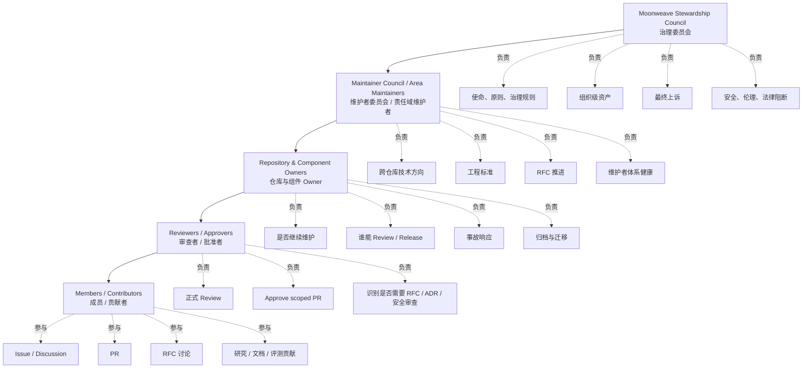
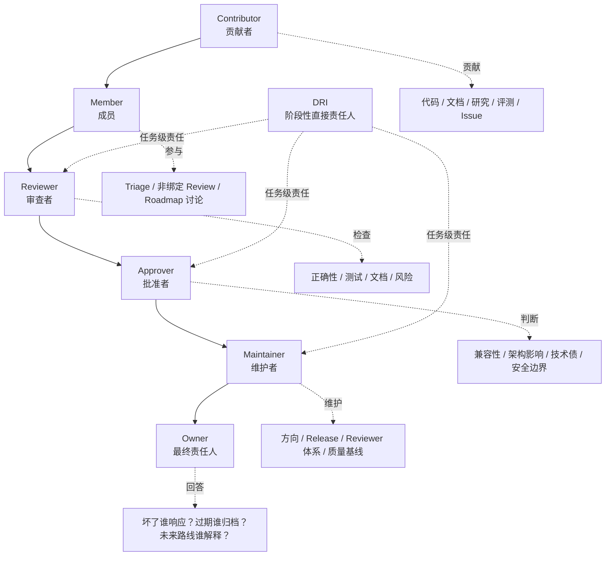
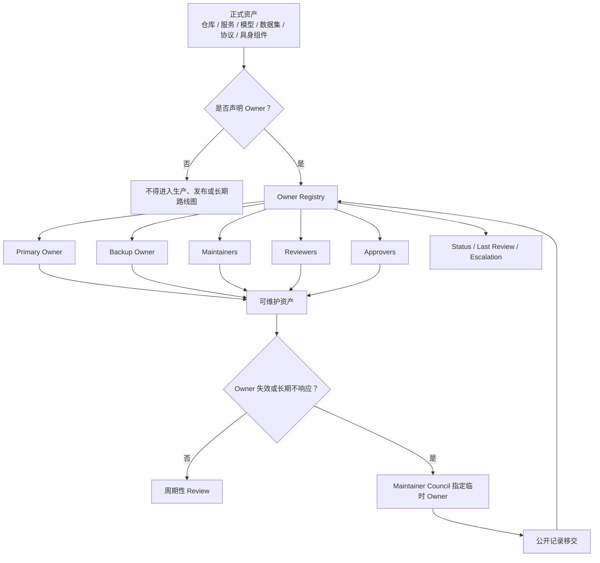
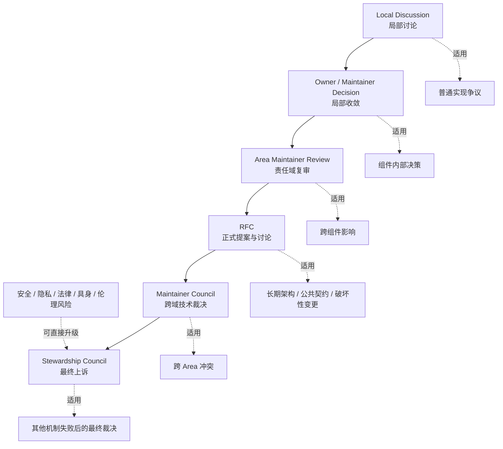

# 组织结构与责任模型

> 本文定义辉夜计划中，责任如何归属，权限如何获得，Owner 如何产生，组织如何扩展，以及当无人负责、多人冲突或系统失效时由谁收敛。它是 `01-Principles.md` 中"可传承的系统优于个人英雄工程""存在比工具重要"在组织层的落地——把责任、权限、范围与升级路径明确化，而不是把权力集中给一个"核心组"。

本文不定义日常沟通规范、RFC 流程、社区贡献流程或代码审查细节；这些由 `03-Collaboration` 与 `04-Engineering` 各文档规定。本文只回答：

> 谁负责？负责什么？凭什么负责？权限到哪里为止？如何进入？如何退出？无人负责怎么办？争议如何升级？组织如何随规模演化？

治理经验吸收自 Apache（PMC/Committer 项目自治）、Kubernetes（Member/Reviewer/Approver/OWNER 分层与 scope-based 权限）、Rust（Council 委托 Team 自治、处理无人负责的工作）、OpenTelemetry（GC/TC/SIG 分工与 SIG 自治理）、Python（Steering Council 作为最终上诉机构、非活跃成员机制）、Jupyter（EC/SSC/Subprojects/Working Groups 多子项目治理）与 CNCF（角色、职责、资格、权限必须文档化）。不照搬任何单一模型——早期不过重，成熟后不依赖单点。

---

## 1. 目的

本文定义辉夜计划的组织角色、责任边界、权限授予、Owner 机制、组织单位创建与归档、角色晋升与退出、争议升级与治理演进方式。

组织角色以责任为中心，而非以职位、资历或身份为中心。本文的每一条规则，都是为了让系统在有人离开后仍能继续——靠一个人撑着的部分，就是将来会断的部分。

---

## 2. 组织原则

以下五条专门约束组织结构，不是 `01-Principles.md` 的重复：

1. **责任优先于头衔** — 组织角色不是身份标签，而是对某个范围承担持续责任的机制。任何权限都必须对应明确的责任范围、可观察的贡献记录和可撤回的信任边界。
2. **分布式自治，中心化收敛** — 日常技术决策由对应 Owner / Maintainer 负责；跨仓库、跨领域、长期不可逆的决策走 RFC；安全、隐私、具身风险由安全责任域阻断；组织级争议由核心治理机构最终收敛。不把所有决策压到一个"核心组"。
3. **Owner 必须明确，系统不得孤儿化** — 任何被正式维护、发布、部署或对外承诺的资产，都必须有明确 Owner。没有 Owner 的资产不得进入生产、发布或长期路线图。
4. **权限随贡献获得，也随不活跃回收** — 维护权限来自持续贡献、良好判断与责任承担。长期不活跃者转为 Emeritus / Inactive，保留历史贡献承认，但不保留需要当前响应能力的权限。
5. **组织结构随规模演进** — 早期以核心维护者与明确 Owner 为主；当贡献者、仓库与风险规模达到治理阈值后，再通过 RFC 引入更正式的选任与委员会机制。早期不过早设计议会制，成熟后不继续依赖单点创始人。

---

## 3. 组织模型



辉夜计划采用"核心治理 + 维护者自治 + 明确 Owner + 临时工作组"的组织模型。这是**责任层级**，不是公司部门层级：

```text
Moonweave Stewardship Council
        ↓
Maintainer Council / Area Maintainers
        ↓
Repository & Component Owners
        ↓
Reviewers / Approvers
        ↓
Members / Contributors
```

- Stewardship Council 负责使命、原则、治理、组织级资产与最终上诉。
- Maintainer Council 负责跨领域工程协调与维护者体系。
- Area / Working Group 负责长期责任域或阶段性任务。
- Repository / Component Owner 对具体资产承担维护责任。
- Reviewer / Approver / Maintainer 通过明确范围获得权限。

---

## 4. 治理实体

### 4.1 Moonweave Stewardship Council（辉夜计划治理委员会）

在项目早期，治理委员会可由初始核心维护者临时承担。当活跃 Maintainer 数量、仓库数量或外部贡献规模达到治理阈值后，应通过 RFC 转入正式选任机制。

**职责**

- 维护项目使命、原则与组织边界；
- 批准或修订组织级治理规则；
- 任命或确认高风险领域 Owner；
- 创建、合并、归档 Area / Working Group；
- 管理组织级资产：GitHub org、域名、发布密钥、商标、主站、核心基础设施；
- 处理跨领域争议；
- 作为最终上诉机构；
- 在安全、伦理或法律风险下执行组织级阻断；
- 定期审查组织健康与 Owner 覆盖率。

**非职责**

治理委员会不直接负责普通 PR 的 Review、普通 Issue 的排期、单个组件的日常技术选择或团队成员的微观任务分配。它拥有广泛权力，但应尽可能少使用——更好的方式是建立标准流程、寻求共识，把委员会作为其他机制失败后的最后上诉机构。它不绕过安全、伦理与隐私边界。

### 4.2 Maintainer Council（维护者委员会）

由各关键责任域的 Maintainer 组成，负责技术与工程健康。

**职责**

- 协调跨仓库技术方向；
- 处理跨组件依赖；
- 维护工程标准；
- 审查长期架构分歧；
- 推动 RFC 进入决策；
- 确认新 Maintainer；
- 审查长期不活跃 Maintainer；
- 维护 release、review、quality 的最低标准；
- 识别无人负责的工作、协调团队结构，保证团队对其责任范围负责。

### 4.3 Area（责任域）

Area 是长期责任域，不是行政部门，也不是目录结构。例如 Agent Systems、AI Infrastructure、Embodiment、Frontend & Design System、Backend & Services、Data & Evaluation、Research、Security、Documentation、Community。

每个 Area 至少定义：

- Scope
- Maintainers
- Reviewers / Approvers
- Owned repositories / components
- Decision authority
- Communication channel
- Review cadence

### 4.4 Working Group（工作组）

Working Group 是为明确目标成立的临时或半临时组织，用于跨领域推进具体事项。例如 Memory Persistence WG、Embodied Safety WG、Moonweave Protocol WG、Evaluation Benchmark WG。

每个 Working Group 必须定义：

- 目标
- 范围
- DRI
- 成员
- 交付物
- 时间边界
- 退出条件

完成后归档；不归档的 Working Group 会膨胀成名义团队堆叠。

---

## 5. 角色定义



保留 7 个角色与 2 个治理实体。角色是项目成员执行的功能——一个人可以承担多个角色，多个成员也可以共同承担同一角色。

### 5.1 Contributor

任何贡献代码、文档、设计、评测、研究、Issue 或反馈的人。

**可以做**：提 Issue；参与 Discussion；提 PR；改文档；提 RFC 草案；提实验日志；报告 Bug；提供评测结果。

**不自动拥有**：merge 权；release 权；安全例外批准权；代表项目发声权；对外承诺项目路线图的权力。

### 5.2 Member

有持续贡献记录、熟悉协作规范并获得信任的参与者。

**可以做**：triage Issue；标注问题分类；给出非绑定 Review；参与 roadmap / milestone 讨论；帮助新人定位问题；参与 RFC 讨论。

**成为条件**

- 至少有若干次有效贡献；
- 熟悉项目原则与协作规范；
- 获得至少两名 Reviewer / Maintainer 推荐；
- 无未解决的安全、合规或行为问题。

### 5.3 Reviewer

对特定范围内的贡献进行正式质量审查。Reviewer 身份限定于代码库的一部分，是 scope-based 的，不是全局身份。

**职责**：Review PR；检查实现是否符合设计；检查测试是否充分；检查文档是否更新；标注潜在风险；辅助新贡献者改进提交。

**权限**：可以给出正式 Review；可以请求修改；可以推荐合并；不一定拥有最终 Approve 权。

### 5.4 Approver

可以接受一个变更进入对应范围。不只看代码对不对，还要判断：

- 是否符合长期架构；
- 是否破坏前后兼容；
- 是否影响 API、Schema 或状态机；
- 是否引入技术债；
- 是否需要 RFC / ADR；
- 是否需要安全审查；
- 是否会影响其他组件。

### 5.5 Maintainer

某一仓库、组件、Area 或 Working Group 的技术维护者，是范围内技术权威。

**职责**：设定对应范围的技术方向；管理路线图；审查 RFC / ADR；维护 release；管理 Reviewer / Approver；处理长期技术债；保证安全和质量门禁；培养新的维护者；在争议中作出局部最终判断。

**不应拥有**：绕过安全和伦理边界的权力；擅自改变组织级原则的权力；无 RFC 修改跨仓库契约的权力；独占维护范围、排斥合理贡献的权力。

### 5.6 Owner

某一资产的最终维护责任人。Owner 偏最终责任归属，Maintainer 偏技术维护——一个组件可以有多个 Maintainer，但最好有一个 Primary Owner。Owner 也可以是 Maintainer，但不必所有 Maintainer 都是 Owner。

Owner 需要回答：

> 这个东西是否还应该存在？谁维护它？谁能 Review？谁能发布？坏了谁响应？过期谁归档？安全事故谁处理？未来路线谁解释？

每个正式资产记录：

```text
Owner:
Backup Owner:
Maintainers:
Reviewers:
Approvers:
Scope:
Status:
Last Reviewed:
Escalation:
```

Owner 不意味着个人独占决策权——不得绕过原则、安全边界、RFC 流程或 Review 要求，也不得长期阻塞合理贡献。

### 5.7 DRI

某一阶段性事项的直接责任人。适合用于一个 release、一个 RFC、一个事故处理、一个迁移计划、一个 benchmark 建设、一个具身安全实验或一个跨仓库重构。

DRI 不一定拥有最高技术权威，但必须负责推动事项收敛：明确目标、同步进展、暴露阻塞、召集决策并归档结果。DRI 是任务级责任，不是长期职位——Owner 是资产级责任，Maintainer 是维护级责任。

---

## 6. Owner 机制



这一节决定长期系统是否会腐烂，因此会以更加规范的方式呈现。

### 6.1 Owner 覆盖规则

所有正式仓库、公共包、部署服务、核心模型、数据集、评测集、协议、Schema、设计系统、具身控制组件与安全敏感基础设施，必须声明 Owner。资产清单与 `02-Security-Ethics.md` §4.1 的资产分类对应。

### 6.2 双 Owner

高风险或长期关键资产应至少有 Primary Owner 与 Backup Owner。只有单一维护者的关键资产必须在 Roadmap 中标注 bus factor 风险。

### 6.3 Owner Registry

仓库内维护一份 Owner Registry：

| Asset | Scope | Primary Owner | Backup Owner | Maintainers | Status | Last Review |
|---|---|---|---|---|---|---|

### 6.4 Owner 失效

当 Owner 在合理期限内无法响应关键安全、发布或维护请求时，Maintainer Council 可以指定临时 Owner。长期不活跃或无法履责的 Owner，应通过公开记录完成移交——保留历史贡献承认，但移除当前活跃权限。

---

## 7. 权限矩阵

| 行为                          | Contributor | Member | Reviewer | Approver | Maintainer | Owner | Council |
| --------------------------- | ----------: | -----: | -------: | -------: | ---------: | ----: | ------: |
| Open Issue / Discussion     |           ✅ |      ✅ |        ✅ |        ✅ |          ✅ |    ✅ |      ✅ |
| Submit PR                   |           ✅ |      ✅ |        ✅ |        ✅ |          ✅ |    ✅ |      ✅ |
| Triage Issue                |             |      ✅ |        ✅ |        ✅ |          ✅ |    ✅ |      ✅ |
| Non-binding Review          |           ✅ |      ✅ |        ✅ |        ✅ |          ✅ |    ✅ |      ✅ |
| Formal Review               |             |        |        ✅ |        ✅ |          ✅ |    ✅ |      ✅ |
| Approve scoped PR           |             |        |          |        ✅ |          ✅ |    ✅ |         |
| Merge scoped PR             |             |        |          |       可选 |          ✅ |    ✅ |         |
| Release scoped component    |             |        |          |          |          ✅ |    ✅ |         |
| Change public API / Schema  |             |        |          |          |  需 RFC/ADR | 需 RFC/ADR | 可裁决 |
| Assign / remove Reviewer    |             |        |          |          |          ✅ |    ✅ |         |
| Assign / remove Maintainer  |             |        |          |          |         提名 |   提名 |     批准 |
| Create / archive repository |             |        |          |          |         提议 |   提议 |     批准 |
| Override safety block      |             |        |          |          |            |       | 不可单独覆盖 |
| Governance revision         |             |        |          |          |         提议 |   提议 | RFC 后批准 |

> 安全、隐私、具身风险和法律合规阻断，不应被普通技术权限覆盖。Stop-Ship 条件（见 `02-Security-Ethics.md` §7）任何角色都不得单独越过。

---

## 8. 晋升机制

**晋升原则**：基于持续贡献、良好判断、责任承担和协作可信度，而不是提交数量、资历、雇主、个人影响力或单次高强度贡献。贡献形式不限于代码，也包括社区、triage、review、设计、基础设施和专业领域知识。

**晋升流程**

```text
Nomination → Evidence → Discussion → Objection Window → Approval → Registry Update
```

Reviewer、Approver、Maintainer 和 Owner 的授予必须通过公开记录完成。提名应说明候选人在对应范围内的贡献、判断力、协作记录和预期职责。Reviewer 升 Approver 需要足够多的实质 PR review 与一段时间作为 Reviewer 的记录；Maintainer / Owner 的提名由现有 Maintainer / Owner 发起，无其他同级 Owner 反对，并通过更新 Registry 体现。

---

## 9. 退出与不活跃

退出不应被视为惩罚。角色状态：

- **Active** — 当前承担责任。
- **Inactive** — 暂时不承担当前响应性职责，但可恢复。
- **Emeritus** — 保留荣誉与历史记录，不保留当前权限。
- **Removed** — 由于安全、行为、滥用权限或长期不适任而移除。

角色退出优先采用 Inactive / Emeritus 机制。只有在严重违反安全、伦理、行为准则或滥用权限时，才使用 Removed。非活跃者继续被列名以尊重贡献，但失去投票、提名和 commit access 等活跃权限。

---

## 10. 组织单位创建与归档

Area 或 Working Group 不是随便创建的，否则组织会膨胀成名义团队堆叠。

**创建条件**

创建长期 Area 或临时 Working Group，必须说明：

- 为什么现有责任域无法覆盖；
- Scope 是什么；
- Non-goals 是什么；
- 初始 Owner / Maintainer 是谁；
- 需要哪些仓库、权限或资源；
- 成功标准是什么；
- Review 周期是什么；
- 何时解散或归档。

**归档条件**

满足以下情况之一，应考虑归档或合并：

- 长期无活跃维护；
- 目标已经完成；
- 范围与其他组织单位重复；
- 产物已迁移到其他 Owner；
- 继续维护成本高于组织价值；
- 无法满足安全或质量基线。

治理文档必须随项目演化而更新，尽早反映真实实践，而不是等到危机出现再修补。

---

## 11. 利益冲突与组织捕获

任何成员在涉及自身雇主、资助方、商业利益、亲属关系、竞争关系或个人重大利益的决策中，必须主动披露潜在利益冲突，并在必要时回避。

当项目进入多机构协作阶段后，治理委员会和关键技术委员会不得由单一外部组织形成实质性多数——同一雇主在治理委员会中的人数应设上限，以避免单一组织控制的外观损害信任。

---

## 12. 争议与升级路径



完整 RFC 流程见 `03-Collaboration/03-RFC-Process.md`，本文只说明争议归谁收敛。

```text
Local Discussion
  ↓
Owner / Maintainer Decision
  ↓
Area Maintainer Review
  ↓
RFC
  ↓
Maintainer Council
  ↓
Stewardship Council Final Appeal
```

**应升级的情况**

- 跨仓库契约冲突；
- 长期架构方向冲突；
- Owner 无法履责；
- 安全或隐私风险争议；
- 具身执行权限争议；
- 公共 API / Schema 破坏性变更；
- 维护者滥用权限；
- 社区行为或治理边界争议。

安全、隐私、法律、具身风险和伦理问题可以直接升级，不必走完全程。最高治理机构不应介入所有问题，但必须能处理其他机制无法解决的问题——它是最后上诉机构，不是日常管理者。

---

## 13. 治理演进

本文定义的是当前阶段的组织结构。当贡献者、仓库与风险规模扩大到现有结构无法承载时，应通过公开 RFC 引入更正式的机制——例如 Maintainer Council 的正式选任、Owner 的周期性审查、选举与投票规则。演进本身就是治理的一部分：组织结构随规模演进，而不是一次性设计成复杂公司制，也不停留在"创始人 + 若干贡献者"的隐性治理。前者过重，后者不可持续。

旧版组织规则存于版本控制，随时可查。
