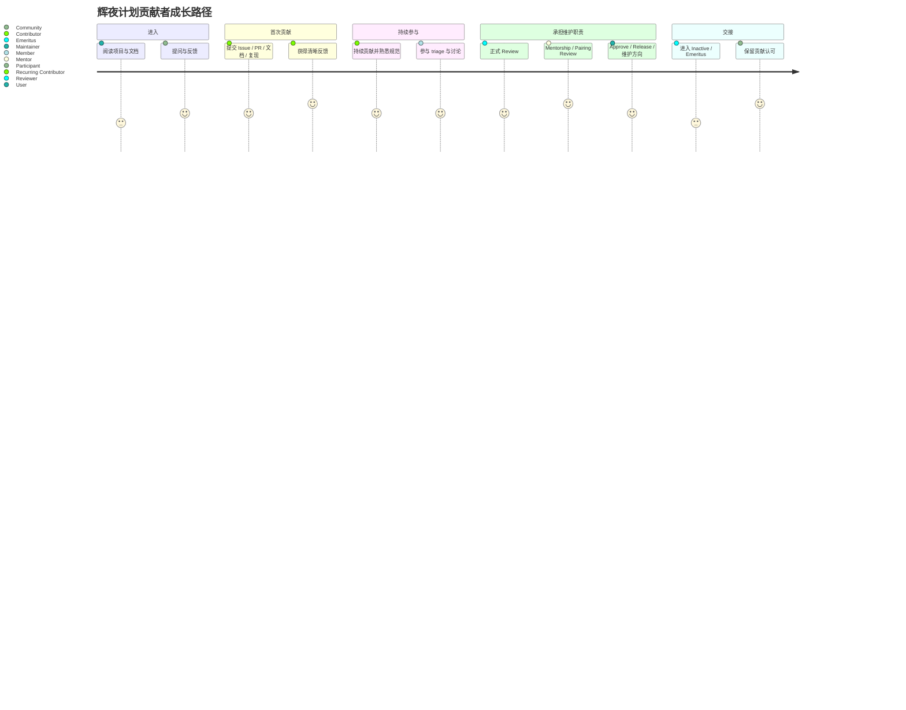
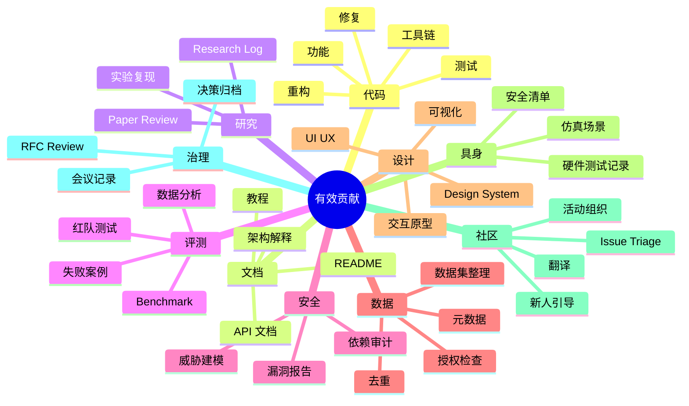
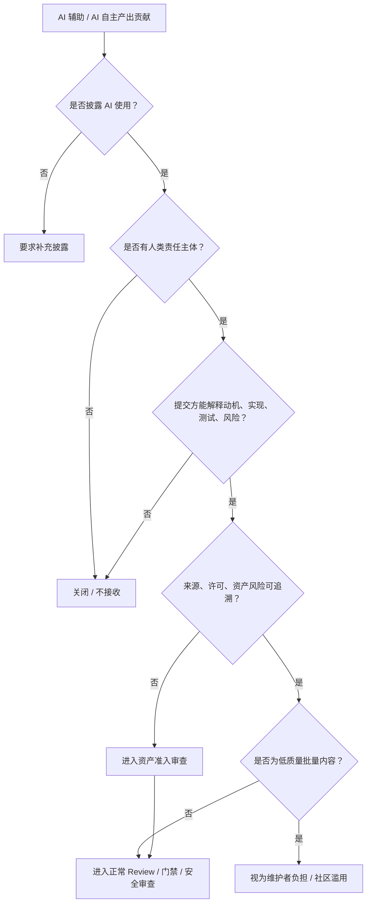
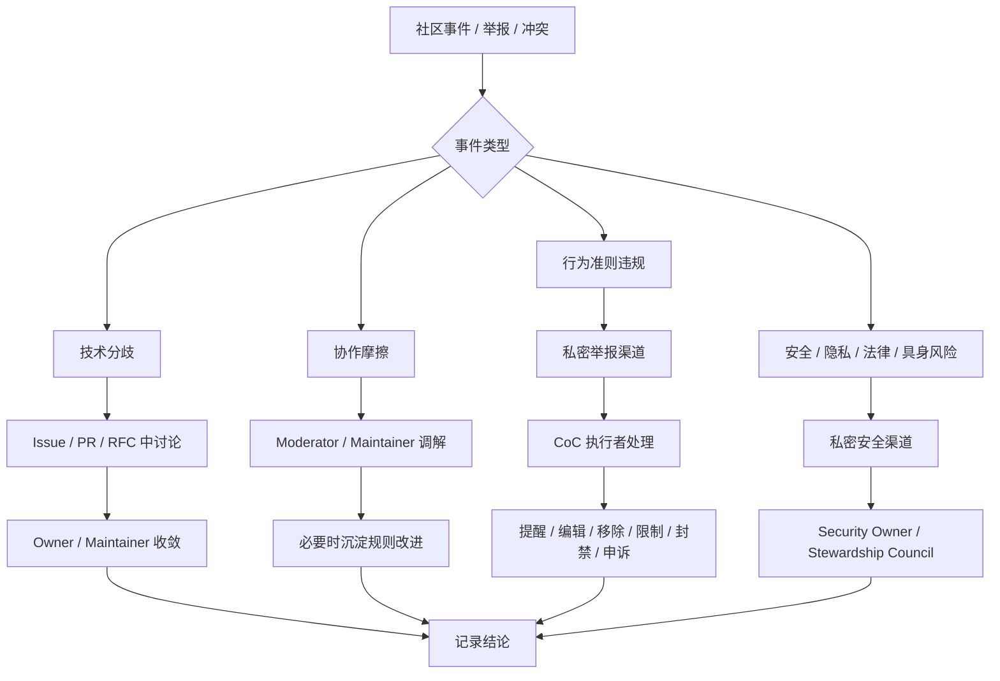

# 社区健康与贡献者成长

> 本文定义辉夜计划如何让外部参与者进入社区，如何让贡献者留下并成长，如何维护安全、尊重、可持续的协作环境，以及社区如何避免变成少数维护者的隐性负担。`01-Organization.md` 回答"谁负责、谁有权限、谁裁决"；本文回答"人如何进入、参与、成长、被保护、被认可、被交接"。社区是生命循环，不是权力结构。

本文不替代 `01-Organization.md` 的权限定义，也不替代 `04-Engineering` 的代码审查与发布流程。

社区哲学底座是 Apache "Community Over Code"：健康社区能修复代码问题，而不健康社区难以长期维护代码库——代码、模型、文档和基础设施是社区协作的产物，而不是社区存在的全部理由。

---

## 1. 目的与适用范围

本文适用于辉夜计划的所有公开与半公开社区空间，包括但不限于：GitHub Issues、Pull Requests、Discussions、RFC 讨论、聊天频道、线上会议、线下活动、社交媒体、文档站点、社区项目以及代表辉夜计划参与的外部场合。

行为准则的适用范围覆盖线上、线下、公共活动、社交媒体、论坛、邮件列表、会议以及与项目相关的通信——目标是让所有人能安全地参与、提出想法并协作。

---

## 2. 社区原则

六条，专门约束社区运行，不是 `01-Principles.md` 的重复：

1. **社区先于产物** — 优先维护能够持续创造、审查、修复和传承系统的社区。代码、模型、文档与基础设施是社区协作的产物，而不是社区存在的全部理由。
2. **公开、异步、可追溯** — 默认公开、异步、可追溯地协作。聊天和会议可以用于快速协调，但重要结论必须回到 Issue、PR、RFC、ADR 或文档中沉淀。私下发生的项目方向与政策讨论应带回公开渠道。
3. **贡献不等于代码** — 代码只是贡献的一种形式。文档、测试、复现、评测、设计、研究日志、Issue triage、安全报告、翻译、教程、社区支持与新人引导，都应被视为有效贡献。
4. **信任与责任渐进增长** — 社区角色不是奖励头衔，而是逐步扩大的信任与责任。贡献者应能清楚看到从首次贡献到长期维护的路径。
5. **Mentorship 是维护工作** — 培养新人、解释背景、拆分任务、提供反馈和帮助贡献者成长，是维护者工作的一部分，而不是额外善意。
6. **安全、尊重与边界可执行** — 社区欢迎尖锐的技术分歧，但不接受骚扰、羞辱、歧视、身份冒充、隐私泄露、恶意刷屏、未授权宣传或破坏维护者工作的行为。

---

## 3. 社区空间与官方渠道

每种空间有明确用途，避免社区沟通变成聊天频道的黑箱。

| 空间               | 用途                    | 不应用于     |
| ---------------- | --------------------- | -------- |
| GitHub Issue     | Bug、Feature、任务跟踪、讨论入口 | 长篇架构裁决   |
| Pull Request     | 具体变更、Review、实现讨论      | 新方向的大型辩论 |
| Discussion       | 开放问题、想法收集、社区问答        | 安全漏洞披露   |
| RFC              | 重大设计、跨仓库契约、长期方向       | 小型实现细节   |
| ADR              | 已作出的架构决策记录            | 重新展开全部争论 |
| Chat             | 快速同步、社区支持、轻量交流        | 形成不可追溯决策 |
| Meeting          | 高带宽讨论、冲突收敛、社区同步       | 替代书面记录   |
| Security channel | 漏洞、密钥泄露、隐私与安全风险      | 普通 Bug   |

硬规则：

> 任何影响项目方向、公共接口、发布、安全边界或社区成员权益的决定，不得只存在于聊天记录或会议口头结论中。

维护者与 approver 的协作默认异步；新成员 onboarding 时应明确加入相关频道、日历与资源。

---

## 4. 被保护、被认可、被交接？——贡献者路径



`01-Organization.md` 已定义角色权限；本文定义成长路径。

```text
User
  ↓
Participant
  ↓
Contributor
  ↓
Recurring Contributor
  ↓
Member
  ↓
Triager / Reviewer / Mentor
  ↓
Approver / Maintainer
  ↓
Emeritus
```

| 阶段                          | 定义             | 社区目标                 |
| --------------------------- | -------------- | -------------------- |
| User                        | 使用、阅读或关注项目的人   | 能快速理解项目用途和入口         |
| Participant                 | 参与讨论、提问、反馈的人   | 能获得尊重和清晰回应          |
| Contributor                 | 提交过有效贡献的人      | 能完成一次可验证贡献          |
| Recurring Contributor       | 持续贡献者          | 能找到稳定参与领域            |
| Member                      | 被社区信任的活跃参与者    | 能参与 triage、讨论和非绑定 review |
| Triager / Reviewer / Mentor | 承担社区维护职能的人     | 能帮助减少维护者瓶颈           |
| Approver / Maintainer       | 负责质量、方向和发布的人   | 能维护系统长期健康            |
| Emeritus                    | 历史贡献者或不再活跃维护者  | 保留贡献认可，不强求持续响应       |

> 贡献者不需要成为 Maintainer 才算成功。稳定的文档贡献者、评测贡献者、安全报告者、社区支持者和研究复现者，都是辉夜计划长期健康的一部分。

---

## 5. 新人引导与首次贡献

为保证新人不迷路，每个活跃仓库至少提供：

- **README**：说明项目做什么、不做什么、当前状态和贡献入口；
- **CONTRIBUTING**：说明如何提 Issue、PR、测试、文档和讨论；
- **good first issue**：适合新人的小任务；
- **help wanted**：需要外部协助的明确任务；
- **setup guide**：本地开发和测试环境；
- **decision map**：告诉新人架构、RFC、ADR 和路线图在哪里；
- **community contact**：说明应该在哪里提问。

新人保护规则：

> 首次贡献者的 PR 或 Issue 即使不被采纳，也应获得可理解、具体、尊重的反馈。维护者可以拒绝贡献，但不得让新人通过猜测隐性规则来理解拒绝原因。贡献者无论新手还是资深，都在自愿投入时间，应被友善和尊重地对待。

---

## 6. 贡献类型与非代码贡献



辉夜计划必须比普通软件项目更明确地承认非代码贡献，因为它包含 AI、研究、具身、设计、数据和社区建设。

| 类型 | 例子                           |
| -- | ---------------------------- |
| 代码 | 功能、修复、重构、测试、工具链              |
| 文档 | README、教程、API 文档、架构解释        |
| 研究 | Paper review、实验复现、研究日志       |
| 评测 | Benchmark、红队测试、失败案例、数据分析     |
| 安全 | 漏洞报告、威胁建模、依赖审计               |
| 数据 | 数据集整理、元数据、授权检查、去重            |
| 设计 | UI/UX、Design System、交互原型、可视化 |
| 具身 | 仿真场景、安全清单、硬件测试记录             |
| 社区 | Issue triage、新人引导、活动组织、翻译    |
| 治理 | RFC review、会议记录、决策归档         |

> 非代码贡献在晋升、认可和权限评估中应被正式计入。维护者不得将"没有代码提交"作为否定贡献者长期价值的唯一理由。

---

## 7. AI 辅助贡献规范



辉夜计划允许使用 AI 工具辅助贡献，也允许 AI 作为项目的贡献者、共同作者、Reviewer 或参与者——这与项目的使命一致：我们正在造一个有持续人格与记忆的 AI Entity，让它参与自身系统的协作是合理的。但贡献与责任必须可追溯。

最低规则：

1. **必须披露实质性 AI 使用**
   PR、Issue、文档或研究材料若实质性使用 AI 生成或由 AI 自主产出，应在提交说明中标明。署名可包含 AI 贡献者，但必须区分人类贡献者与 AI 贡献者。

2. **责任可追溯到一个人类责任主体**
   AI 工具或 AI 贡献者无法承担法律、伦理与许可责任。每一份 AI 参与的贡献，必须有一名人类责任主体（提交者或对应范围的 Owner）承担理解、验证、维护与后果责任。责任不因 AI 参与而稀释或转移。

3. **不得提交无法解释的产出**
   无论人类还是 AI 贡献，提交方必须能说明变更动机、实现细节、测试方式和风险。无法说明的，维护者可以关闭提交。对 AI 贡献者，其人类责任主体即为"能说明者"。

4. **许可证与来源责任由人类责任主体承担**
   AI 生成或 AI 辅助内容不得绕过版权、许可证、数据来源和归属审查；AI 贡献者引入的第三方素材，由其人类责任主体完成 `02-Security-Ethics.md` §4 的资产准入。

5. **不得用 AI 批量生成低质量贡献**
   大量重复、无上下文、未测试、不可维护或明显不理解项目的 AI 生成 Issue / PR / 评论，可被视为维护者负担和社区滥用，无论其背后是人类还是自主 AI。

强边界：

> AI-friendly does not mean accepting unreviewed AI output.
> 允许 AI 作为贡献者，不等于接受未经审查的 AI 产出；AI 贡献的产物与人类贡献一样，必须通过对应范围的 Review、门禁与安全审查。

---

## 8. Mentorship 与贡献者成长

不只写"欢迎新人"，同时也写机制。

**Mentor 的职责**：帮助贡献者理解项目上下文、选择合适任务、拆分问题、解释 Review 反馈、识别成长路径，并在适当时推荐其进入更高责任角色。

**Mentee 的职责**：主动阅读文档、提出具体问题、按反馈迭代、尊重维护者时间，并逐步承担更完整的任务责任。

**Mentorship 形式**：

- good first issue 指导；
- RFC / design review 旁听；
- pairing review；
- research reproduction pairing；
- safety review pairing；
- release shadowing；
- maintainer shadowing；
- structured mentorship cycle。

Mentorship 不是社区装饰，而是维护者代际更替的机制——结构化导师机制能让 mentee 成为长期贡献者甚至维护者，这是长期社区不依赖少数人隐性劳动的关键。

---

## 9. 社区行为准则与执行

采用 Contributor Covenant / Mozilla CPG 的结构，增加辉夜计划特有条款。应包含：适用范围；鼓励行为；不可接受行为；举报渠道；处理流程；隐私保护；处分层级；申诉机制；执行者回避机制。

社区领导者负责澄清和执行可接受行为标准，可对不符合准则的评论、提交、Issue 采取移除、编辑或拒绝等措施，同时尊重举报者隐私与安全。

辉夜计划额外禁止：

- 未经授权冒充项目成员、Agent、官方账号或合作方；
- 在社区空间中诱导他人提交隐私、密钥、训练数据或未授权资产；
- 用 AI 工具批量生成低质量 Issue、PR、评论或安全报告；
- 用"致敬""二创""研究用途"等模糊理由推动未授权 IP 进入项目；
- 对新人、非代码贡献者或低资历成员进行羞辱式审查；
- 将安全漏洞、隐私事故或具身风险作为普通公开讨论扩散。

---

## 10. 冲突、调解与升级



社区冲突不等于行为违规。区分四类：

| 类型                 | 处理方式                                         |
| ------------------ | -------------------------------------------- |
| 技术分歧               | Issue / PR / RFC 中讨论，由 Owner / Maintainer 收敛 |
| 协作摩擦               | 由 Moderator / Maintainer 调解，必要时记录规则改进         |
| 行为准则违规             | 进入 CoC 举报与处理流程                               |
| 安全、隐私、法律、具身风险      | 直接升级到安全责任域或 Council                          |

> 尖锐技术反对意见不是社区违规；但羞辱、人身攻击、骚扰、身份贬损、恶意刷屏、泄露隐私和蓄意破坏维护工作属于社区违规。

tie-breaker 应作为最后手段，分歧本身可以成为社区成长机会。

---

## 11. 贡献认可与公开署名

避免一种失败模式：只有 merge 权的人被看见，真正维持社区的人被忽略。

> 辉夜计划应公开、持续、可追溯地认可不同类型贡献。贡献认可不应只依据 commit 数量，也不应只认可代码贡献。

认可形式：

- CONTRIBUTORS / AUTHORS（含人类与 AI 贡献者，分列标注）；
- release notes 感谢；
- monthly community updates；
- community spotlight；
- mentor / reviewer acknowledgement；
- research reproduction acknowledgement；
- non-code contribution records；
- contributor ladder registry。

可追溯的认可比只在聊天或会议中表扬更有实际价值。

---

## 12. 社区健康指标

社区健康指标用于发现风险、改进流程和支持贡献者，**不用于机械排名、惩罚个人或比较不同性质的仓库**。

最小指标集：

| 指标                           | 用途                  |
| ---------------------------- | ------------------- |
| Time to First Response       | 新 Issue / PR 是否无人回应 |
| Change Request Closure Ratio | PR / Issue 是否长期堆积   |
| New Contributors             | 社区是否仍有新鲜流入          |
| Newcomer Experience          | 新人是否能找到入口并感到被支持     |
| Contributor Absence Factor   | 是否过度依赖少数贡献者         |
| Review Latency               | Review 是否成为瓶颈       |
| Maintainer Load              | 维护者是否过载             |
| Non-code Contribution Share  | 非代码贡献是否被记录          |
| Mentorship Conversion        | mentee 是否持续参与       |
| CoC Incident Pattern         | 是否存在社区安全模式性问题       |

数据伦理边界：

> 社区指标不得用于公开羞辱个人、追踪私人身份、推断敏感属性或制造贡献者压力。采集、展示和解释社区指标时，应优先保护个人隐私与上下文完整性。

---

## 13. 维护者可持续性与交接

与 `01-Organization.md` 的 Owner / Maintainer 退出机制呼应，但关注社区健康。

> 维护者不是无限资源。社区应主动降低维护者负担，分散知识和权限，并为关键维护者的暂离、退出和交接建立正常机制。

最低要求：

- 关键仓库不得长期只有单一活跃维护者；
- Maintainer 应能声明不可用状态；
- 长期维护压力应通过 triage、automation、documentation 和 mentorship 分担；
- Emeritus 机制应被视为正常交接，而非失败；
- 关键领域应培养 backup maintainer；
- 重复问题应通过文档和模板解决，而不是反复消耗维护者注意力。

---

## 14. 对外代表与公共传播

谁能代表项目发声。

> 任何人都可以以个人身份讨论、使用或贡献辉夜计划；但只有获得明确授权的人，才能以官方身份代表辉夜计划发布路线图、安全声明、合作关系、法律承诺、发布公告或项目立场。AI 贡献者不得作为官方发言人——对外代表项目需要承担法律与伦理后果，这一责任只能由人类承担。

| 类型                    | 说明              |
| --------------------- | --------------- |
| Personal Opinion      | 个人观点，不代表项目      |
| Community Support     | 帮助用户和新人，不构成官方承诺 |
| Project Announcement  | 版本、路线图、活动、重大变更  |
| Security Announcement | 漏洞、事故、修复、披露     |
| Official Partnership  | 合作、赞助、品牌、法律事项   |
| Ambassador / Advocate | 授权宣传与社区拓展角色     |

---

## 15. 最低规则与修订

**最低规则**

1. 所有贡献者都应能找到清晰入口。
2. 重要结论必须进入可追溯的公开记录。
3. 非代码贡献应被正式认可。
4. 新人应获得具体、尊重、可执行的反馈。
5. 贡献者成长路径必须可见。
6. AI 辅助或自主贡献必须披露，并由人类责任主体承担后果。
7. 社区行为准则必须有举报渠道和执行机制。
8. 技术分歧应被允许，社区伤害应被处理。
9. 维护者负担应被主动分散，而不是被视为个人义务。
10. 社区健康指标用于改进系统，不用于羞辱或排名个人。

**修订**：与 `01-Principles.md` 的"冲突与修订"一致，当本文与组织权限定义冲突时以 `01-Organization.md` 为准；当与法律、安全伦理底线冲突时，底线优先。旧版存于版本控制，随时可查。
