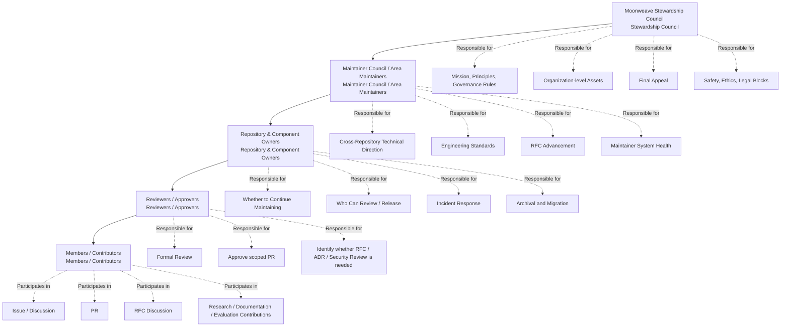
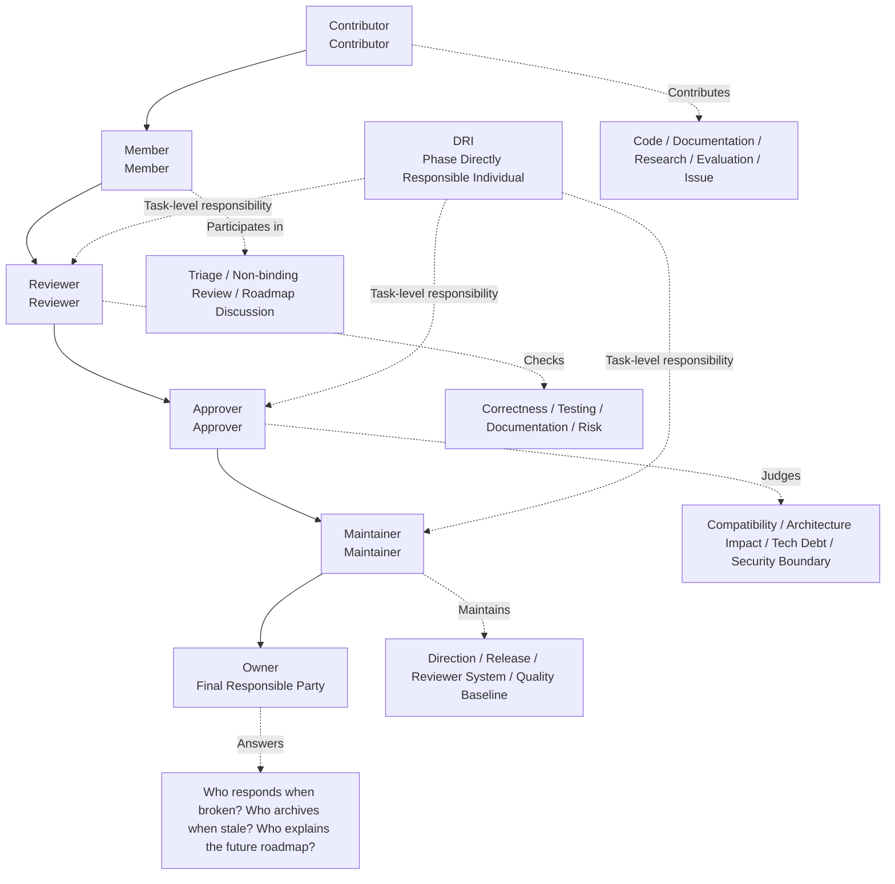
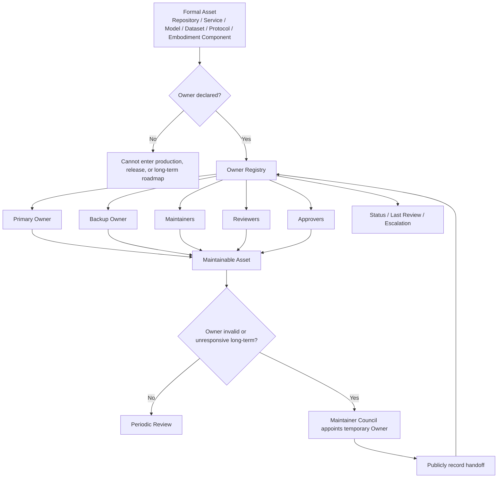
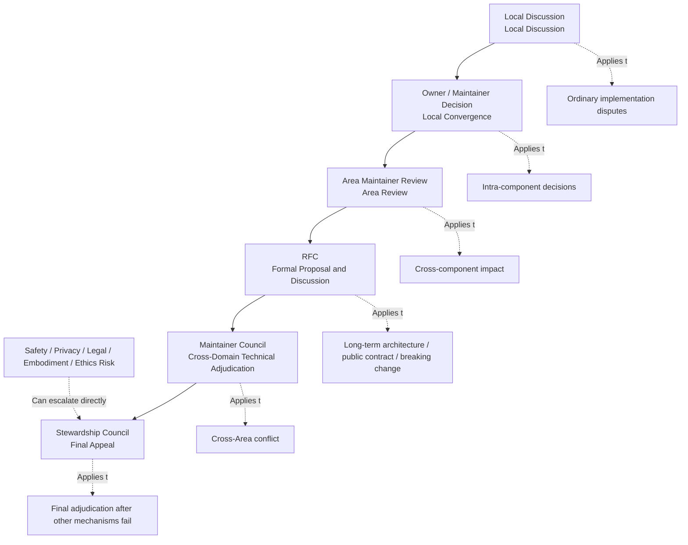

# Organizational Structure and Responsibility Model

> This document defines how responsibility is assigned, how permissions are granted, how Owners are established, how the organization scales, and who converges when no one is responsible, when multiple parties conflict, or when the system fails in the Kaguya Project. It is the organizational-layer implementation of "systems that outlast individuals beat hero engineering" and "existence matters more than tools" from `../../01-Foundation/en/01-Principles.md`—making responsibility, permissions, scope, and escalation paths explicit rather than concentrating power in a "core group."

This document does not define day-to-day communication norms, RFC processes, community contribution workflows, or code review details; those are covered by documents in `../../03-Collaboration/en` and `../../04-Engineering/en`. This document only answers:

> Who is responsible? For what? On what basis? Where do permissions end? How does one join? How does one exit? What happens when no one is responsible? How are disputes escalated? How does the organization evolve with scale?

Governance experience is drawn from Apache (PMC/Committer project autonomy), Kubernetes (Member/Reviewer/Approver/OWNER layering and scope-based permissions), Rust (Council delegating Team autonomy, handling unowned work), OpenTelemetry (GC/TC/SIG division of labor and SIG self-governance), Python (Steering Council as final appeal body, inactive member mechanisms), Jupyter (EC/SSC/Subprojects/Working Groups multi-subproject governance), and CNCF (roles, responsibilities, qualifications, and permissions must be documented). No single model is copied wholesale—early governance stays light; mature governance does not depend on a single point of failure.

---

## 1. Purpose

This document defines the organizational roles, responsibility boundaries, permission grants, Owner mechanisms, creation and archival of organizational units, role promotion and exit, dispute escalation, and governance evolution for the Kaguya Project.

Organizational roles are centered on responsibility, not on titles, seniority, or identity. Every rule in this document exists so the system can continue when people leave—anything held up by a single person is what will break in the future.

---

## 2. Organizational Principles

The following five principles specifically constrain organizational structure; they are not a repeat of `../../01-Foundation/en/01-Principles.md`:

1. **Responsibility over titles** — Organizational roles are not identity labels; they are mechanisms for bearing ongoing responsibility for a given scope. Every permission must correspond to a clear scope of responsibility, observable contribution history, and revocable trust boundaries.
2. **Distributed autonomy, centralized convergence** — Day-to-day technical decisions belong to the relevant Owner / Maintainer; cross-repository, cross-domain, long-term irreversible decisions go through RFC; security, privacy, and embodiment risks are blocked by the security responsibility domain; organization-level disputes are ultimately converged by core governance bodies. Not all decisions are pushed onto a single "core group."
3. **Owners must be explicit; systems must not become orphaned** — Any asset that is formally maintained, released, deployed, or externally committed must have an explicit Owner. Assets without an Owner must not enter production, release, or the long-term roadmap.
4. **Permissions are earned through contribution and reclaimed through inactivity** — Maintenance permissions come from sustained contribution, sound judgment, and responsibility. Long-term inactive members move to Emeritus / Inactive—historical contributions are acknowledged, but permissions requiring current responsiveness are not retained.
5. **Organizational structure evolves with scale** — Early on, core maintainers and explicit Owners dominate; once contributors, repositories, and risk reach governance thresholds, more formal selection and committee mechanisms are introduced through RFC. Do not design a parliamentary system too early; do not continue relying on a single founder once mature.

---

## 3. Organizational Model



The Kaguya Project adopts an organizational model of "core governance + maintainer autonomy + explicit Owners + temporary working groups." This is a **responsibility hierarchy**, not a corporate department hierarchy:

```text
Moonweave Stewardship Council
        ↓
Maintainer Council / Area Maintainers
        ↓
Repository & Component Owners
        ↓
Reviewers / Approvers
        ↓
Members / Contributors
```

- Stewardship Council is responsible for mission, principles, governance, organization-level assets, and final appeal.
- Maintainer Council is responsible for cross-domain engineering coordination and the maintainer system.
- Area / Working Group is responsible for long-term responsibility domains or phased tasks.
- Repository / Component Owner bears maintenance responsibility for specific assets.
- Reviewer / Approver / Maintainer receive permissions through explicit scope.

---

## 4. Governance Entities

### 4.1 Moonweave Stewardship Council

In the early project phase, the Stewardship Council may be temporarily assumed by the initial core maintainers. Once the number of active Maintainers, repositories, or external contribution scale reaches governance thresholds, a formal selection mechanism should be introduced through RFC.

**Responsibilities**

- Maintain project mission, principles, and organizational boundaries;
- Approve or revise organization-level governance rules;
- Appoint or confirm Owners for high-risk domains;
- Create, merge, or archive Area / Working Group;
- Manage organization-level assets: GitHub org, domains, release keys, trademarks, main site, core infrastructure;
- Handle cross-domain disputes;
- Serve as the final appeal body;
- Execute organization-level blocks under security, ethics, or legal risk;
- Periodically review organizational health and Owner coverage.

**Non-responsibilities**

The Stewardship Council does not directly handle Review of ordinary PRs, scheduling of ordinary Issues, day-to-day technical choices for individual components, or micro task assignment for team members. It holds broad authority but should use it as little as possible—the better approach is to establish standard processes, seek consensus, and treat the Council as the last appeal body when other mechanisms fail. It does not bypass security, ethics, or privacy boundaries.

### 4.2 Maintainer Council

Composed of Maintainers from key responsibility domains, responsible for technical and engineering health.

**Responsibilities**

- Coordinate cross-repository technical direction;
- Handle cross-component dependencies;
- Maintain engineering standards;
- Review long-term architectural disagreements;
- Drive RFCs into decision;
- Confirm new Maintainers;
- Review long-term inactive Maintainers;
- Maintain minimum standards for release, review, and quality;
- Identify unowned work, coordinate team structure, and ensure teams are accountable for their scope.

### 4.3 Area

An Area is a long-term responsibility domain—not an administrative department and not a directory structure. Examples include Agent Systems, AI Infrastructure, Embodiment, Frontend & Design System, Backend & Services, Data & Evaluation, Research, Security, Documentation, Community.

Each Area must define at least:

- Scope
- Maintainers
- Reviewers / Approvers
- Owned repositories / components
- Decision authority
- Communication channel
- Review cadence

### 4.4 Working Group

A Working Group is a temporary or semi-temporary organization formed for a specific goal to advance cross-domain work. Examples include Memory Persistence WG, Embodied Safety WG, Moonweave Protocol WG, Evaluation Benchmark WG.

Each Working Group must define:

- Goal
- Scope
- DRI
- Members
- Deliverables
- Time boundary
- Exit conditions

Archive upon completion; Working Groups that are not archived swell into nominal team stacking.

---

## 5. Role Definitions



Seven roles and two governance entities are retained. Roles are functions performed by project members—one person can hold multiple roles, and multiple members can share the same role.

### 5.1 Contributor

Anyone who contributes code, documentation, design, evaluation, research, Issues, or feedback.

**May do**: Open Issues; participate in Discussions; submit PRs; edit documentation; draft RFCs; submit experiment logs; report bugs; provide evaluation results.

**Does not automatically have**: merge rights; release rights; security exception approval; authority to speak on behalf of the project; authority to commit to the project roadmap externally.

### 5.2 Member

A participant with a sustained contribution record, familiarity with collaboration norms, and earned trust.

**May do**: Triage Issues; label and categorize problems; provide non-binding Review; participate in roadmap / milestone discussions; help newcomers locate issues; participate in RFC discussions.

**Requirements to become a Member**

- At least several valid contributions;
- Familiarity with project principles and collaboration norms;
- Recommendation from at least two Reviewers / Maintainers;
- No unresolved security, compliance, or conduct issues.

### 5.3 Reviewer

Conducts formal quality review of contributions within a specific scope. Reviewer identity is limited to part of a codebase—it is scope-based, not a global identity.

**Responsibilities**: Review PRs; check whether implementation matches design; check whether tests are adequate; check whether documentation is updated; flag potential risks; help new contributors improve submissions.

**Permissions**: May provide formal Review; may request changes; may recommend merge; does not necessarily have final Approve authority.

### 5.4 Approver

May accept a change into the corresponding scope. Not only checks whether code is correct, but also judges:

- Whether it aligns with long-term architecture;
- Whether it breaks backward compatibility;
- Whether it affects API, Schema, or state machines;
- Whether it introduces technical debt;
- Whether RFC / ADR is required;
- Whether security review is required;
- Whether it affects other components.

### 5.5 Maintainer

Technical maintainer of a repository, component, Area, or Working Group—the technical authority within scope.

**Responsibilities**: Set technical direction for the corresponding scope; manage roadmap; review RFC / ADR; maintain release; manage Reviewer / Approver; handle long-term technical debt; ensure security and quality gates; develop new maintainers; make local final judgments in disputes.

**Must not have**: Authority to bypass security and ethics boundaries; authority to unilaterally change organization-level principles; authority to modify cross-repository contracts without RFC; authority to monopolize maintenance scope and exclude reasonable contributions.

### 5.6 Owner

Final maintenance accountable party for an asset. Owner emphasizes final responsibility assignment; Maintainer emphasizes technical maintenance—a component may have multiple Maintainers, but ideally one Primary Owner. An Owner may also be a Maintainer, but not every Maintainer need be an Owner.

An Owner must answer:

> Should this thing still exist? Who maintains it? Who can Review? Who can release? Who responds when it breaks? Who archives it when it expires? Who handles security incidents? Who explains the future roadmap?

Each formal asset records:

```text
Owner:
Backup Owner:
Maintainers:
Reviewers:
Approvers:
Scope:
Status:
Last Reviewed:
Escalation:
```

Owner does not mean exclusive personal decision authority—must not bypass principles, security boundaries, RFC process, or Review requirements, and must not long-term block reasonable contributions.

### 5.7 DRI

Directly responsible individual for a phased initiative. Suitable for a release, an RFC, an incident response, a migration plan, benchmark construction, an embodied safety experiment, or a cross-repository refactor.

A DRI does not necessarily hold the highest technical authority, but must drive the initiative to convergence: clarify goals, sync progress, expose blockers, convene decisions, and archive outcomes. DRI is task-level responsibility, not a long-term role—Owner is asset-level responsibility; Maintainer is maintenance-level responsibility.

---

## 6. Owner Mechanism



This section determines whether long-term systems will rot; it is therefore presented in a more normative form.

### 6.1 Owner Coverage Rules

All formal repositories, public packages, deployed services, core models, datasets, evaluation sets, protocols, Schemas, design systems, embodied control components, and security-sensitive infrastructure must declare an Owner. The asset inventory corresponds to asset classification in `../../01-Foundation/en/02-Security-Ethics.md` §4.1.

### 6.2 Dual Owner

High-risk or long-term critical assets should have at least a Primary Owner and a Backup Owner. Critical assets with only a single maintainer must flag bus factor risk in the Roadmap.

### 6.3 Owner Registry

Maintain an Owner Registry within the repository:

| Asset | Scope | Primary Owner | Backup Owner | Maintainers | Status | Last Review |
|---|---|---|---|---|---|---|

### 6.4 Owner Failure

When an Owner cannot respond to critical security, release, or maintenance requests within a reasonable period, the Maintainer Council may designate a temporary Owner. Long-term inactive or unable-to-perform Owners should complete handoff through public record—historical contributions are acknowledged, but current active permissions are removed.

---

## 7. Permission Matrix

| Action                          | Contributor | Member | Reviewer | Approver | Maintainer | Owner | Council |
| --------------------------- | ----------: | -----: | -------: | -------: | ---------: | ----: | ------: |
| Open Issue / Discussion     |           ✅ |      ✅ |        ✅ |        ✅ |          ✅ |    ✅ |      ✅ |
| Submit PR                   |           ✅ |      ✅ |        ✅ |        ✅ |          ✅ |    ✅ |      ✅ |
| Triage Issue                |             |      ✅ |        ✅ |        ✅ |          ✅ |    ✅ |      ✅ |
| Non-binding Review          |           ✅ |      ✅ |        ✅ |        ✅ |          ✅ |    ✅ |      ✅ |
| Formal Review               |             |        |        ✅ |        ✅ |          ✅ |    ✅ |      ✅ |
| Approve scoped PR           |             |        |          |        ✅ |          ✅ |    ✅ |         |
| Merge scoped PR             |             |        |          |       Optional |          ✅ |    ✅ |         |
| Release scoped component    |             |        |          |          |          ✅ |    ✅ |         |
| Change public API / Schema  |             |        |          |          |  Requires RFC/ADR | Requires RFC/ADR | May adjudicate |
| Assign / remove Reviewer    |             |        |          |          |          ✅ |    ✅ |         |
| Assign / remove Maintainer  |             |        |          |          |         Nominate |   Nominate |     Approve |
| Create / archive repository |             |        |          |          |         Propose |   Propose |     Approve |
| Override safety block      |             |        |          |          |            |       | Cannot override alone |
| Governance revision         |             |        |          |          |         Propose |   Propose | Approve after RFC |

> Security, privacy, embodiment risk, and legal compliance blocks must not be overridden by ordinary technical permissions. Stop-Ship conditions (see `../../01-Foundation/en/02-Security-Ethics.md` §7) must not be unilaterally bypassed by any role.

---

## 8. Promotion Mechanism

**Promotion principles**: Based on sustained contribution, sound judgment, responsibility, and collaborative trust—not on submission count, seniority, employer, personal influence, or a single burst of intense contribution. Contribution forms are not limited to code; they also include community, triage, review, design, infrastructure, and domain expertise.

**Promotion process**

```text
Nomination → Evidence → Discussion → Objection Window → Approval → Registry Update
```

Grants of Reviewer, Approver, Maintainer, and Owner must be completed through public record. Nominations should describe the candidate's contributions, judgment, collaboration history, and expected responsibilities within the corresponding scope. Reviewer to Approver requires sufficient substantive PR reviews and a period of service as Reviewer; Maintainer / Owner nominations are initiated by existing Maintainer / Owner, with no objection from peer Owners, and reflected by updating the Registry.

---

## 9. Exit and Inactivity

Exit should not be treated as punishment. Role states:

- **Active** — Currently bearing responsibility.
- **Inactive** — Temporarily not bearing current responsiveness duties, but may be restored.
- **Emeritus** — Retains honor and historical record; does not retain current permissions.
- **Removed** — Removed due to security, conduct, permission abuse, or long-term unsuitability.

Role exit should prefer the Inactive / Emeritus mechanism. Removed is used only for serious violations of security, ethics, code of conduct, or permission abuse. Inactive members remain listed to honor contributions but lose active permissions such as voting, nomination, and commit access.

---

## 10. Organizational Unit Creation and Archival

Area or Working Group must not be created casually; otherwise the organization swells into nominal team stacking.

**Creation requirements**

Creating a long-term Area or temporary Working Group must explain:

- Why existing responsibility domains cannot cover the need;
- What the Scope is;
- What the Non-goals are;
- Who the initial Owner / Maintainer is;
- Which repositories, permissions, or resources are needed;
- What the success criteria are;
- What the Review cadence is;
- When to dissolve or archive.

**Archival conditions**

Consider archival or merge when any of the following applies:

- Long-term lack of active maintenance;
- Goals are complete;
- Scope duplicates another organizational unit;
- Artifacts have migrated to another Owner;
- Continued maintenance cost exceeds organizational value;
- Cannot meet security or quality baselines.

Governance documents must be updated as the project evolves, reflecting real practice early—not patched only after a crisis.

---

## 11. Conflicts of Interest and Organizational Capture

Any member must proactively disclose potential conflicts of interest in decisions involving their employer, funder, commercial interests, family relationships, competitive relationships, or significant personal interests, and recuse themselves when necessary.

Once the project enters multi-institution collaboration, the Stewardship Council and key technical committees must not be substantively dominated by a single external organization—the number of members from the same employer on the Stewardship Council should be capped to avoid the appearance of single-organization control damaging trust.

---

## 12. Disputes and Escalation Path



The full RFC process is in `../../03-Collaboration/en/03-RFC-Process.md`; this document only defines who converges disputes.

```text
Local Discussion
  ↓
Owner / Maintainer Decision
  ↓
Area Maintainer Review
  ↓
RFC
  ↓
Maintainer Council
  ↓
Stewardship Council Final Appeal
```

**When to escalate**

- Cross-repository contract conflicts;
- Long-term architectural direction conflicts;
- Owner unable to perform duties;
- Security or privacy risk disputes;
- Embodied execution permission disputes;
- Public API / Schema breaking changes;
- Maintainer permission abuse;
- Community conduct or governance boundary disputes.

Security, privacy, legal, embodiment risk, and ethics issues may escalate directly without going through the full path. The highest governance body should not intervene in all issues, but must be able to handle what other mechanisms cannot—it is the final appeal body, not the day-to-day manager.

---

## 13. Governance Evolution

This document defines the organizational structure for the current phase. When contributors, repositories, and risk scale beyond what the existing structure can bear, more formal mechanisms should be introduced through public RFC—for example, formal selection of the Maintainer Council, periodic Owner review, election and voting rules. Evolution itself is part of governance: organizational structure evolves with scale—not designed once as a complex corporate hierarchy, and not left at implicit "founder + a few contributors" governance. The former is too heavy; the latter is unsustainable.

Previous versions of organizational rules are stored in version control and are always available for reference.
