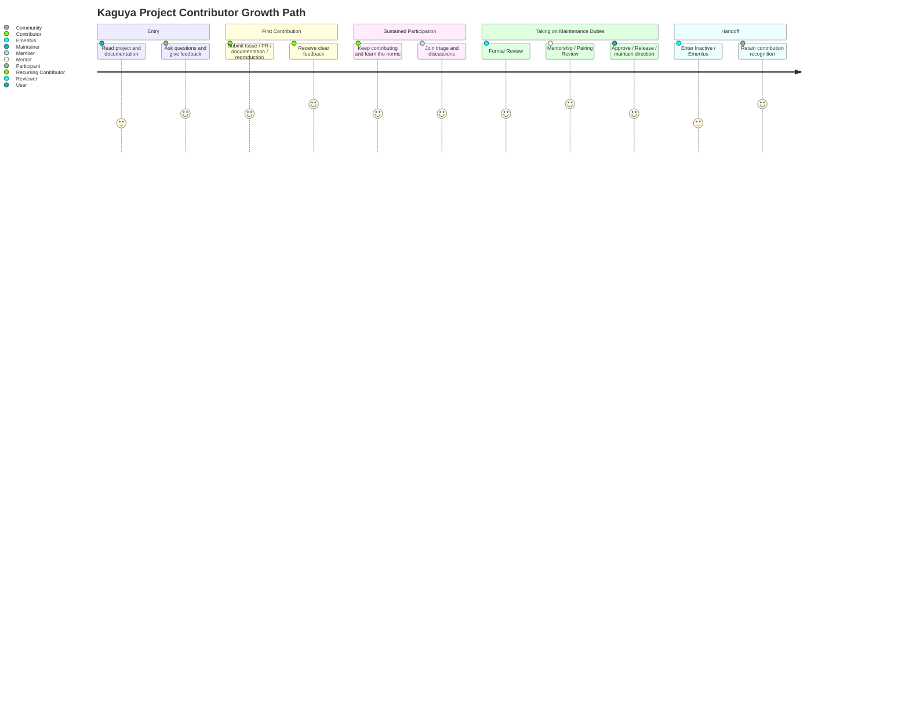
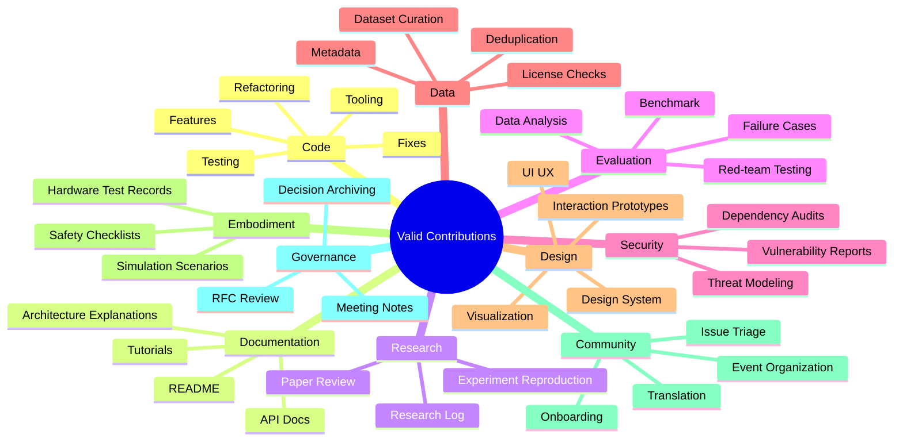
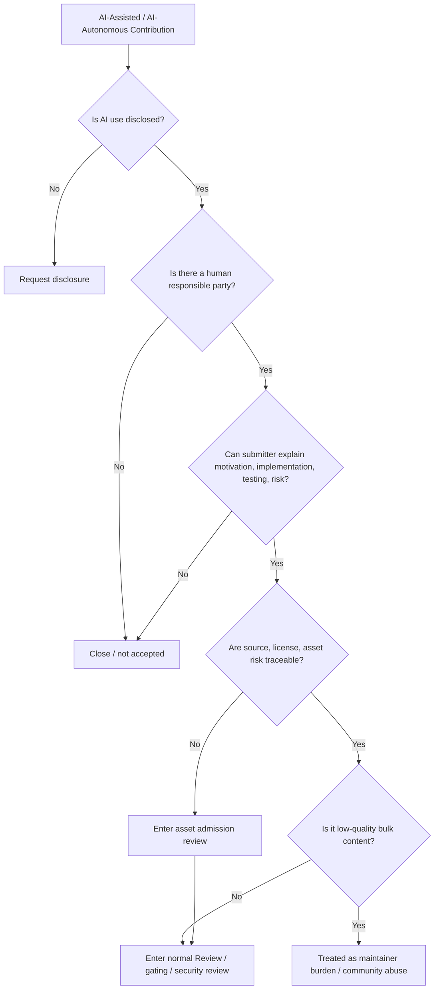
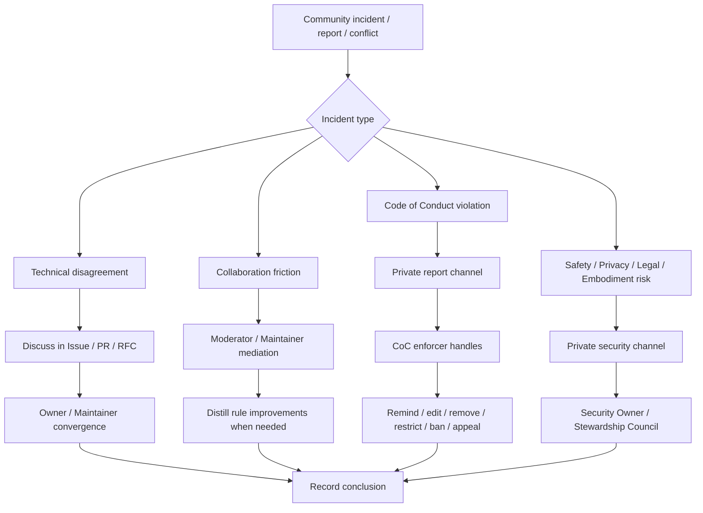

# Community Health and Contributor Growth

> This document defines how the Kaguya Project enables external participants to enter the community, how contributors stay and grow, how a safe, respectful, and sustainable collaboration environment is maintained, and how the community avoids becoming an implicit burden on a few maintainers. `01-Organization.md` answers "who is responsible, who has permissions, who adjudicates"; this document answers "how people enter, participate, grow, are protected, are recognized, and are handed off." Community is the life cycle, not the power structure.

This document does not replace the permission definitions in `01-Organization.md`, nor does it replace code review and release processes in `../../04-Engineering/en`.

The philosophical foundation is Apache's "Community Over Code": a healthy community can fix code problems; an unhealthy community struggles to maintain a codebase long term—code, models, documentation, and infrastructure are products of community collaboration, not the sole reason the community exists.

---

## 1. Purpose and Scope

This document applies to all public and semi-public community spaces of the Kaguya Project, including but not limited to: GitHub Issues, Pull Requests, Discussions, RFC discussions, chat channels, online meetings, offline events, social media, documentation sites, community projects, and external occasions where participants represent the Kaguya Project.

The code of conduct applies online and offline—public events, social media, forums, mailing lists, meetings, and project-related communications—with the goal that everyone can participate safely, propose ideas, and collaborate.

---

## 2. Community Principles

Six principles specifically constrain community operation; they are not a repeat of `../../01-Foundation/en/01-Principles.md`:

1. **Community before artifacts** — Prioritize maintaining a community that can continuously create, review, fix, and pass on systems. Code, models, documentation, and infrastructure are products of community collaboration, not the sole reason the community exists.
2. **Open, asynchronous, traceable** — Collaborate openly, asynchronously, and traceably by default. Chat and meetings may be used for quick coordination, but important conclusions must be captured in Issues, PRs, RFCs, ADRs, or documentation. Project direction and policy discussions that occur privately should be brought back to public channels.
3. **Contribution is not only code** — Code is one form of contribution. Documentation, testing, reproduction, evaluation, design, research logs, Issue triage, security reports, translation, tutorials, community support, and newcomer guidance should all be treated as valid contributions.
4. **Trust and responsibility grow gradually** — Community roles are not reward titles but progressively expanded trust and responsibility. Contributors should clearly see a path from first contribution to long-term maintenance.
5. **Mentorship is maintenance work** — Developing newcomers, explaining context, breaking down tasks, providing feedback, and helping contributors grow are part of maintainer work, not extra goodwill.
6. **Safety, respect, and boundaries are enforceable** — The community welcomes sharp technical disagreement but does not accept harassment, humiliation, discrimination, identity impersonation, privacy leaks, malicious spam, unauthorized promotion, or behavior that disrupts maintainer work.

---

## 3. Community Spaces and Official Channels

Each space has a clear purpose to prevent community communication from becoming an opaque chat-channel black box.

| Space               | Purpose                    | Not for     |
| ---------------- | --------------------- | -------- |
| GitHub Issue     | Bugs, Features, task tracking, discussion entry | Long-form architecture adjudication   |
| Pull Request     | Concrete changes, Review, implementation discussion      | Large debates on new directions |
| Discussion       | Open questions, idea collection, community Q&A        | Security vulnerability disclosure   |
| RFC              | Major design, cross-repository contracts, long-term direction       | Small implementation details   |
| ADR              | Record of architecture decisions already made            | Reopening full debate |
| Chat             | Quick sync, community support, lightweight exchange        | Forming untraceable decisions |
| Meeting          | High-bandwidth discussion, conflict convergence, community sync       | Replacing written records   |
| Security channel | Vulnerabilities, key leaks, privacy and security risks      | Ordinary bugs   |

Hard rule:

> Any decision affecting project direction, public interfaces, release, security boundaries, or community member rights must not exist only in chat logs or verbal meeting conclusions.

Maintainer and approver collaboration is asynchronous by default; new members should be clearly onboarded to relevant channels, calendars, and resources during onboarding.

---

## 4. Protected, Recognized, Handed Off? — Contributor Path



`01-Organization.md` defines role permissions; this document defines the growth path.

```text
User
  ↓
Participant
  ↓
Contributor
  ↓
Recurring Contributor
  ↓
Member
  ↓
Triager / Reviewer / Mentor
  ↓
Approver / Maintainer
  ↓
Emeritus
```

| Stage                          | Definition             | Community goal                 |
| --------------------------- | -------------- | -------------------- |
| User                        | Someone who uses, reads, or follows the project   | Can quickly understand project purpose and entry points         |
| Participant                 | Someone who participates in discussion, asks questions, gives feedback   | Receives respect and clear responses          |
| Contributor                 | Someone who has submitted valid contributions      | Can complete one verifiable contribution          |
| Recurring Contributor       | Sustained contributor          | Can find a stable area of participation            |
| Member                      | Trusted active participant in the community    | Can participate in triage, discussion, and non-binding review |
| Triager / Reviewer / Mentor | Someone bearing community maintenance functions     | Can help reduce maintainer bottlenecks           |
| Approver / Maintainer       | Someone responsible for quality, direction, and release   | Can maintain long-term system health            |
| Emeritus                    | Historical contributor or no-longer-active maintainer  | Retains contribution recognition without requiring ongoing response       |

> Contributors do not need to become Maintainers to succeed. Stable documentation contributors, evaluation contributors, security reporters, community supporters, and research reproducers are all part of the Kaguya Project's long-term health.

---

## 5. Newcomer Onboarding and First Contribution

To ensure newcomers do not get lost, each active repository should provide at least:

- **README**: What the project does and does not do, current status, and contribution entry points;
- **CONTRIBUTING**: How to open Issues, PRs, tests, documentation, and discussions;
- **good first issue**: Small tasks suitable for newcomers;
- **help wanted**: Clear tasks needing external help;
- **setup guide**: Local development and test environment;
- **decision map**: Where newcomers find architecture, RFC, ADR, and roadmap;
- **community contact**: Where to ask questions.

Newcomer protection rule:

> First-time contributors' PRs or Issues should receive understandable, specific, respectful feedback even if not accepted. Maintainers may reject contributions but must not leave newcomers guessing implicit rules to understand rejection. Contributors, whether novice or experienced, voluntarily invest time and should be treated kindly and respectfully.

---

## 6. Contribution Types and Non-Code Contributions



The Kaguya Project must more explicitly acknowledge non-code contributions than a typical software project, because it spans AI, research, embodiment, design, data, and community building.

| Type | Examples                           |
| -- | ---------------------------- |
| Code | Features, fixes, refactors, tests, tooling              |
| Documentation | README, tutorials, API docs, architecture explanation        |
| Research | Paper review, experiment reproduction, research logs       |
| Evaluation | Benchmark, red teaming, failure cases, data analysis     |
| Security | Vulnerability reports, threat modeling, dependency audit               |
| Data | Dataset curation, metadata, authorization checks, deduplication            |
| Design | UI/UX, Design System, interaction prototypes, visualization |
| Embodiment | Simulation scenarios, safety checklists, hardware test records             |
| Community | Issue triage, newcomer guidance, event organization, translation    |
| Governance | RFC review, meeting notes, decision archival         |

> Non-code contributions should be formally counted in promotion, recognition, and permission evaluation. Maintainers must not use "no code commits" as the sole reason to dismiss a contributor's long-term value.

---

## 7. AI-Assisted Contribution Guidelines



The Kaguya Project allows AI tools to assist contributions and allows AI as project contributor, co-author, Reviewer, or participant—consistent with the project mission: we are building an AI Entity with persistent personality and memory, and having it participate in its own system's collaboration is reasonable. But contributions and responsibility must be traceable.

Minimum rules:

1. **Substantial AI use must be disclosed**
   If PRs, Issues, documentation, or research materials substantially use AI-generated or AI-autonomous output, this should be stated in the submission description. Attribution may include AI contributors but must distinguish human contributors from AI contributors.

2. **Responsibility must trace to a human accountable party**
   AI tools or AI contributors cannot bear legal, ethical, or licensing responsibility. Every AI-involved contribution must have a human accountable party (submitter or Owner for the relevant scope) who bears responsibility for understanding, verification, maintenance, and consequences. Responsibility is not diluted or transferred because of AI involvement.

3. **Do not submit unexplainable output**
   Whether human or AI contribution, the submitter must be able to explain change motivation, implementation details, testing approach, and risk. Submissions that cannot be explained may be closed by maintainers. For AI contributors, the human accountable party is the one who "can explain."

4. **License and provenance responsibility rests with the human accountable party**
   AI-generated or AI-assisted content must not bypass copyright, license, data source, and attribution review; third-party material introduced by AI contributors must complete asset admission under `../../01-Foundation/en/02-Security-Ethics.md` §4 by the human accountable party.

5. **Do not use AI to batch-generate low-quality contributions**
   Large volumes of repetitive, context-free, untested, unmaintainable, or obviously project-unaware AI-generated Issues / PRs / comments may be treated as maintainer burden and community abuse, whether driven by humans or autonomous AI.

Strong boundary:

> AI-friendly does not mean accepting unreviewed AI output.
> Allowing AI as contributor does not mean accepting unreviewed AI output; AI contributions, like human contributions, must pass Review, gates, and security review for the relevant scope.

---

## 8. Mentorship and Contributor Growth

Not only "welcome newcomers" in words—mechanisms too.

**Mentor responsibilities**: Help contributors understand project context, choose suitable tasks, break down problems, explain Review feedback, identify growth paths, and when appropriate recommend advancement to higher-responsibility roles.

**Mentee responsibilities**: Actively read documentation, ask specific questions, iterate on feedback, respect maintainer time, and gradually take on more complete task responsibility.

**Mentorship forms**:

- good first issue guidance;
- RFC / design review observation;
- pairing review;
- research reproduction pairing;
- safety review pairing;
- release shadowing;
- maintainer shadowing;
- structured mentorship cycle.

Mentorship is not community decoration—it is the mechanism for maintainer generational turnover. Structured mentorship helps mentees become long-term contributors and even maintainers; this is key to long-term community health without relying on implicit labor from a few people.

---

## 9. Community Code of Conduct and Enforcement

Structured after Contributor Covenant / Mozilla CPG, with Kaguya Project-specific additions. Should include: scope; encouraged behavior; unacceptable behavior; reporting channels; handling process; privacy protection; sanction tiers; appeal mechanism; enforcement recusal.

Community leaders are responsible for clarifying and enforcing acceptable behavior standards and may remove, edit, or reject comments, submissions, or Issues that violate the standards, while respecting reporter privacy and safety.

The Kaguya Project additionally prohibits:

- Unauthorized impersonation of project members, Agents, official accounts, or partners;
- Inducing others in community spaces to submit private data, keys, training data, or unauthorized assets;
- Using AI tools to batch-generate low-quality Issues, PRs, comments, or security reports;
- Using vague reasons such as "homage," "fan work," or "research use" to push unauthorized IP into the project;
- Humiliation-style review of newcomers, non-code contributors, or low-seniority members;
- Spreading security vulnerabilities, privacy incidents, or embodiment risks as ordinary public discussion.

---

## 10. Conflict, Mediation, and Escalation



Community conflict is not the same as conduct violation. Distinguish four types:

| Type                 | Handling                                         |
| ------------------ | -------------------------------------------- |
| Technical disagreement               | Discuss in Issue / PR / RFC; converge by Owner / Maintainer |
| Collaboration friction               | Mediate by Moderator / Maintainer; record rule improvements when needed         |
| Code of conduct violation             | Enter CoC reporting and handling process                               |
| Security, privacy, legal, embodiment risk      | Escalate directly to security responsibility domain or Council                          |

> Sharp technical opposition is not a community violation; humiliation, personal attacks, harassment, identity denigration, malicious spam, privacy leaks, and deliberate disruption of maintainer work are community violations.

Tie-breaker should be a last resort; disagreement itself can be a community growth opportunity.

---

## 11. Contribution Recognition and Public Attribution

Avoid one failure mode: only people with merge rights are visible while those who truly sustain the community are ignored.

> The Kaguya Project should publicly, continuously, and traceably recognize different types of contributions. Recognition should not rely only on commit count, nor only on code contributions.

Recognition forms:

- CONTRIBUTORS / AUTHORS (including human and AI contributors, listed separately);
- release notes acknowledgments;
- monthly community updates;
- community spotlight;
- mentor / reviewer acknowledgement;
- research reproduction acknowledgement;
- non-code contribution records;
- contributor ladder registry.

Traceable recognition has more practical value than praise only in chat or meetings.

---

## 12. Community Health Metrics

Community health metrics are used to discover risk, improve process, and support contributors—**not for mechanical ranking, punishing individuals, or comparing repositories of different nature**.

Minimum metric set:

| Metric                           | Purpose                  |
| ---------------------------- | ------------------- |
| Time to First Response       | Whether new Issues / PRs go unanswered |
| Change Request Closure Ratio | Whether PRs / Issues pile up long term   |
| New Contributors             | Whether the community still has fresh inflow          |
| Newcomer Experience          | Whether newcomers can find entry and feel supported     |
| Contributor Absence Factor   | Whether too few contributors are over-relied upon         |
| Review Latency               | Whether Review becomes a bottleneck       |
| Maintainer Load              | Whether maintainers are overloaded             |
| Non-code Contribution Share  | Whether non-code contributions are recorded          |
| Mentorship Conversion        | Whether mentees continue participating       |
| CoC Incident Pattern         | Whether systemic community safety issues exist       |

Data ethics boundary:

> Community metrics must not be used to publicly shame individuals, track private identity, infer sensitive attributes, or create contributor pressure. When collecting, displaying, and interpreting community metrics, prioritize protecting individual privacy and contextual integrity.

---

## 13. Maintainer Sustainability and Handoff

Echoes the Owner / Maintainer exit mechanism in `01-Organization.md`, but focused on community health.

> Maintainers are not unlimited resources. The community should actively reduce maintainer burden, distribute knowledge and permissions, and establish normal mechanisms for key maintainers' temporary absence, exit, and handoff.

Minimum requirements:

- Critical repositories must not long-term have only a single active maintainer;
- Maintainers should be able to declare unavailability;
- Long-term maintenance pressure should be shared through triage, automation, documentation, and mentorship;
- Emeritus mechanism should be treated as normal handoff, not failure;
- Critical domains should develop backup maintainer;
- Repeated issues should be solved through documentation and templates, not by repeatedly consuming maintainer attention.

---

## 14. External Representation and Public Communication

Who may speak on behalf of the project.

> Anyone may discuss, use, or contribute to the Kaguya Project in a personal capacity; only those with explicit authorization may represent the Kaguya Project officially in publishing roadmaps, security statements, partnerships, legal commitments, release announcements, or project positions. AI contributors must not serve as official spokespeople—representing the project externally requires bearing legal and ethical consequences, which only humans can bear.

| Type                    | Description              |
| --------------------- | --------------- |
| Personal Opinion      | Personal view; does not represent the project      |
| Community Support     | Helping users and newcomers; does not constitute official commitment |
| Project Announcement  | Versions, roadmap, events, major changes  |
| Security Announcement | Vulnerabilities, incidents, fixes, disclosure     |
| Official Partnership  | Partnerships, sponsorship, branding, legal matters   |
| Ambassador / Advocate | Authorized promotion and community outreach role     |

---

## 15. Minimum Rules and Revision

**Minimum rules**

1. All contributors should be able to find clear entry points.
2. Important conclusions must enter traceable public record.
3. Non-code contributions should be formally recognized.
4. Newcomers should receive specific, respectful, actionable feedback.
5. Contributor growth paths must be visible.
6. AI-assisted or autonomous contributions must be disclosed, with consequences borne by a human accountable party.
7. Community code of conduct must have reporting channels and enforcement mechanisms.
8. Technical disagreement should be allowed; community harm should be addressed.
9. Maintainer burden should be actively distributed, not treated as personal obligation.
10. Community health metrics are for improving the system, not shaming or ranking individuals.

**Revision**: Consistent with "Conflict and Revision" in `../../01-Foundation/en/01-Principles.md`; when this document conflicts with organizational permission definitions, `01-Organization.md` takes precedence; when it conflicts with legal or security-ethics baselines, the baseline takes precedence. Previous versions are stored in version control and are always available for reference.
