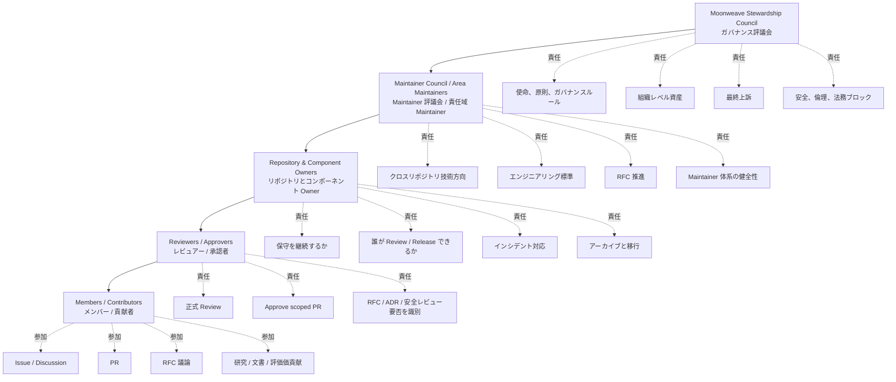
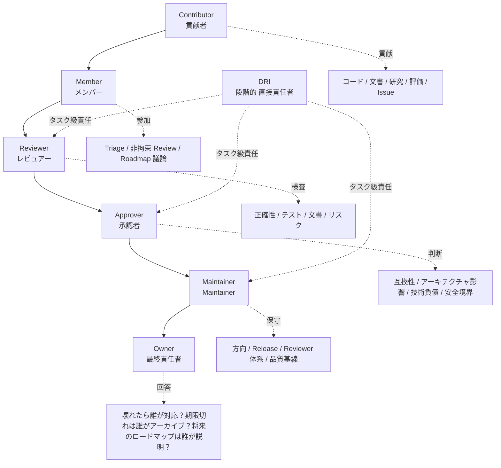
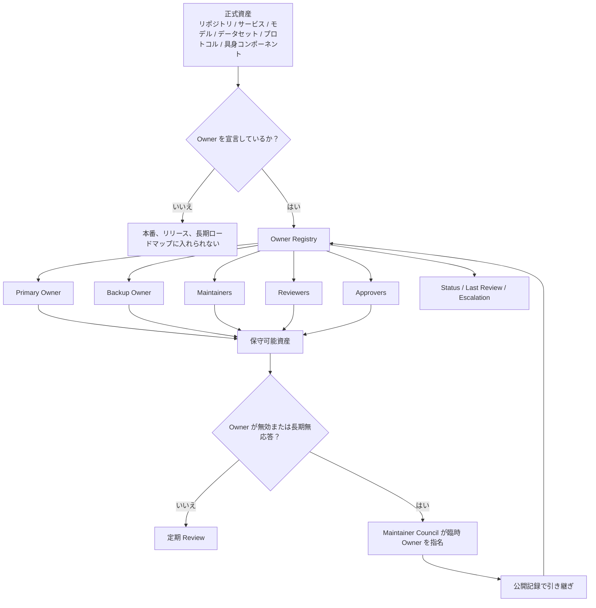
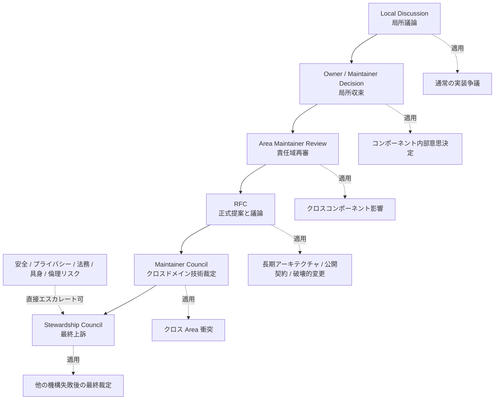

# 組織構造と責任モデル

> 本文書は、輝夜計画において、責任がどのように帰属するか、権限がどのように付与されるか、Owner がどのように生まれるか、組織がどのように拡張するか、そして誰も責任を負わない場合、複数者が衝突する場合、またはシステムが機能不全に陥った場合に誰が収束させるかを定義します。これは `../../01-Foundation/ja/01-Principles.md` における「個人のヒーロー工学よりも継承可能なシステム」「存在はツールより重要」という原則を組織層で具体化したものです——権力を「コアグループ」に集中させるのではなく、責任、権限、スコープ、エスカレーション経路を明確化します。

本文書は、日常のコミュニケーション規範、RFC プロセス、コミュニティ貢献フロー、コードレビューの詳細を定義しません。これらは `03-Collaboration` および `04-Engineering` の各ドキュメントで規定されます。本文書が回答するのは次の点のみです：

> 誰が責任を負うのか？何に対して？その根拠は？権限はどこまでか？どう参加するか？どう退出するか？誰も責任を負わない場合はどうするか？争議はどうエスカレーションするか？組織は規模に応じてどう進化するか？

ガバナンスの経験は、Apache（PMC/Committer によるプロジェクト自治）、Kubernetes（Member/Reviewer/Approver/OWNER の階層化と scope-based 権限）、Rust（Council による Team 自治の委任、誰も責任を負わない作業の処理）、OpenTelemetry（GC/TC/SIG の役割分担と SIG 自己統治）、Python（Steering Council を最終上訴機関とする、非アクティブメンバー機構）、Jupyter（EC/SSC/Subprojects/Working Groups によるマルチサブプロジェクトガバナンス）、CNCF（役割、責務、資格、権限の文書化必須）から吸収されています。いずれか単一モデルの丸写しは行いません——初期段階では過度に重くせず、成熟後は単一点に依存しません。

---

## 1. 目的

本文書は、輝夜計画の組織上の役割、責任境界、権限付与、Owner 機構、組織単位の作成とアーカイブ、役割の昇格と退出、争議のエスカレーション、ガバナンスの進化方法を定義します。

組織上の役割は、職位、年功、身分ではなく責任を中心に据えます。本文書の各ルールは、誰かが去った後もシステムが継続できるように存在します——一人に支えられている部分こそ、将来断絶する部分です。

---

## 2. 組織原則

以下の五つは、組織構造を特に拘束する原則であり、`../../01-Foundation/ja/01-Principles.md` の繰り返しではありません：

1. **肩書きより責任** — 組織上の役割は身分ラベルではなく、特定スコープに対する継続的責任を担う機構です。あらゆる権限は、明確な責任範囲、観察可能な貢献記録、撤回可能な信頼境界に対応しなければなりません。
2. **分散自治、集中収束** — 日常の技術判断は対応する Owner / Maintainer が担います。リポジトリ横断、領域横断、長期的かつ不可逆的な判断は RFC を経由します。安全、プライバシー、具身リスクは安全責任ドメインがブロックします。組織レベルの争議は中核ガバナンス機関が最終的に収束させます。すべての判断を一つの「コアグループ」に押し付けません。
3. **Owner は明確でなければならず、システムを孤児化してはならない** — 正式に保守、リリース、デプロイ、または対外約束されているあらゆる資産には、明確な Owner が必要です。Owner のない資産は、本番、リリース、長期ロードマップに入ってはなりません。
4. **権限は貢献で得られ、非アクティブで回収される** — 保守権限は継続的貢献、良好な判断、責任の引き受けから生まれます。長期非アクティブの者は Emeritus / Inactive に移行し、歴史的貢献は認めますが、現在の応答能力を要する権限は保持しません。
5. **組織構造は規模に応じて進化する** — 初期は中核 Maintainer と明確な Owner が中心です。貢献者、リポジトリ、リスクの規模がガバナンス閾値に達した後、RFC によりより正式な選任と委員会機構を導入します。初期に議会制を早く設計しすぎず、成熟後も創業者単点に依存し続けません。

---

## 3. 組織モデル



輝夜計画は「中核ガバナンス + Maintainer 自治 + 明確な Owner + 一時的 Working Group」の組織モデルを採用します。これは**責任階層**であり、会社の部門階層ではありません：

```text
Moonweave Stewardship Council
        ↓
Maintainer Council / Area Maintainers
        ↓
Repository & Component Owners
        ↓
Reviewers / Approvers
        ↓
Members / Contributors
```

- Stewardship Council は、ミッション、原則、ガバナンス、組織レベル資産、最終上訴を担います。
- Maintainer Council は、領域横断のエンジニアリング調整と Maintainer 体系を担います。
- Area / Working Group は、長期責任ドメインまたは段階的タスクを担います。
- Repository / Component Owner は、具体的資産の保守責任を担います。
- Reviewer / Approver / Maintainer は、明確なスコープを通じて権限を得ます。

---

## 4. ガバナンス実体

### 4.1 Moonweave Stewardship Council（輝夜計画ガバナンス委員会）

プロジェクト初期には、ガバナンス委員会は初期中核 Maintainer が暫定的に担うことができます。アクティブ Maintainer 数、リポジトリ数、外部貢献規模がガバナンス閾値に達したら、RFC により正式な選任機構へ移行すべきです。

**責務**

- プロジェクトのミッション、原則、組織境界の維持；
- 組織レベルガバナンスルールの承認または改訂；
- 高リスク領域 Owner の任命または確認；
- Area / Working Group の作成、統合、アーカイブ；
- 組織レベル資産の管理：GitHub org、ドメイン、リリース鍵、商標、メインサイト、中核インフラ；
- 領域横断争議の処理；
- 最終上訴機関としての機能；
- 安全、倫理、法的リスク下での組織レベルブロックの実行；
- 組織健全性と Owner カバレッジの定期レビュー。

**非責務**

ガバナンス委員会は、通常 PR の Review、通常 Issue のスケジューリング、個別コンポーネントの日常技術選択、チームメンバーの微細なタスク割当を直接担いません。広範な権力を持ちますが、可能な限り少なく使うべきです——より良い方法は標準プロセスを確立し、合意を求め、他の機構が失敗した後の最終上訴機関として委員会を位置づけることです。安全、倫理、プライバシー境界を迂回しません。

### 4.2 Maintainer Council（Maintainer 委員会）

各主要責任ドメインの Maintainer で構成され、技術とエンジニアリングの健全性を担います。

**責務**

- リポジトリ横断の技術方向の調整；
- コンポーネント横断依存の処理；
- エンジニアリング標準の維持；
- 長期アーキテクチャ対立のレビュー；
- RFC の意思決定への推進；
- 新規 Maintainer の確認；
- 長期非アクティブ Maintainer のレビュー；
- release、review、quality の最低基準の維持；
- 誰も責任を負わない作業の特定、チーム構造の調整、チームが責任範囲に対して説明責任を負うことの保証。

### 4.3 Area（責任ドメイン）

Area は長期責任ドメインであり、行政部門でもディレクトリ構造でもありません。例：Agent Systems、AI Infrastructure、Embodiment、Frontend & Design System、Backend & Services、Data & Evaluation、Research、Security、Documentation、Community。

各 Area は少なくとも以下を定義します：

- Scope
- Maintainers
- Reviewers / Approvers
- Owned repositories / components
- Decision authority
- Communication channel
- Review cadence

### 4.4 Working Group（ワーキンググループ）

Working Group は、明確な目標のために設立される一時的または半一時的な組織で、領域横断の具体事項を推進します。例：Memory Persistence WG、Embodied Safety WG、Moonweave Protocol WG、Evaluation Benchmark WG。

各 Working Group は以下を定義しなければなりません：

- 目標
- スコープ
- DRI
- メンバー
- 成果物
- 時間境界
- 退出条件

完了後はアーカイブします。アーカイブされない Working Group は、名目上のチームの積み重ねに膨張します。

---

## 5. 役割定義



7 つの役割と 2 つのガバナンス実体を保持します。役割はプロジェクトメンバーが実行する機能です——一人が複数役割を担え、複数メンバーが同一役割を共担できます。

### 5.1 Contributor

コード、ドキュメント、設計、評価、研究、Issue、フィードバックを貢献するすべての人。

**できること**：Issue の起票；Discussion への参加；PR の提出；ドキュメントの修正；RFC 草案の提出；実験ログの提出；Bug 報告；評価結果の提供。

**自動的には持たない**：merge 権；release 権；安全例外承認権；プロジェクトを代表して発言する権限；対外でプロジェクトロードマップを約束する権限。

### 5.2 Member

継続的貢献記録があり、協働規範に精通し、信頼を得た参加者。

**できること**：Issue の triage；問題分類のラベル付け；非拘束 Review の提供；roadmap / milestone 議論への参加；新人の問題特定支援；RFC 議論への参加。

**なる条件**

- 有効な貢献が複数回あること；
- プロジェクト原則と協働規範に精通していること；
- Reviewer / Maintainer から少なくとも 2 名の推薦があること；
- 未解決の安全、コンプライアンス、行動上の問題がないこと。

### 5.3 Reviewer

特定スコープ内の貢献に対する正式な品質レビューを行います。Reviewer 身分はコードベースの一部に限定され、scope-based であり、グローバルな身分ではありません。

**責務**：PR の Review；実装が設計に合致するかの確認；テストが十分かの確認；ドキュメントが更新されているかの確認；潜在リスクの明記；新規貢献者の提出改善支援。

**権限**：正式 Review の提供；修正要求；マージ推薦——必ずしも最終 Approve 権を持つとは限りません。

### 5.4 Approver

対応スコープへの変更受け入れができます。コードが正しいかだけでなく、以下も判断します：

- 長期アーキテクチャに合致するか；
- 後方互換を破壊するか；
- API、Schema、状態機械に影響するか；
- 技術的負債を導入するか；
- RFC / ADR が必要か；
- 安全レビューが必要か；
- 他コンポーネントに影響するか。

### 5.5 Maintainer

特定リポジトリ、コンポーネント、Area、Working Group の技術 Maintainer で、スコープ内の技術権威です。

**責務**：対応スコープの技術方向設定；ロードマップ管理；RFC / ADR レビュー；release 維持；Reviewer / Approver 管理；長期技術的負債の処理；安全と品質ゲートの保証；新 Maintainer の育成；争議における局所的最終判断。

**持ってはならない**：安全・倫理境界の迂回権；組織レベル原則の独断変更権；RFC なしでのリポジトリ横断契約変更権；保守スコープの独占と合理的貢献の排除権。

### 5.6 Owner

特定資産の最終保守責任者です。Owner は最終責任帰属、Maintainer は技術保守を強調します——一コンポーネントに複数 Maintainer がいても、Primary Owner は ideally 一人です。Owner は Maintainer でもよいですが、すべての Maintainer が Owner である必要はありません。

Owner が答えるべきこと：

> このものはまだ存在すべきか？誰が保守するか？誰が Review できるか？誰がリリースできるか？壊れたら誰が対応するか？期限切れで誰がアーカイブするか？安全事故は誰が処理するか？将来ロードマップを誰が説明するか？

各正式資産は以下を記録します：

```text
Owner:
Backup Owner:
Maintainers:
Reviewers:
Approvers:
Scope:
Status:
Last Reviewed:
Escalation:
```

Owner は個人独占の意思決定権を意味しません——原則、安全境界、RFC プロセス、Review 要件を迂回してはならず、合理的貢献を長期ブロックしてもなりません。

### 5.7 DRI

段階的事項の直接責任者です。一 release、一 RFC、インシデント対応、移行計画、benchmark 構築、具身安全実験、リポジトリ横断リファクタに適します。

DRI は必ずしも最高技術権威を持ちませんが、事項の収束推進が必須です：目標明確化、進捗同期、ブロッカー暴露、意思決定招集、結果アーカイブ。DRI はタスクレベル責任であり、長期職位ではありません——Owner は資産レベル責任、Maintainer は保守レベル責任です。

---

## 6. Owner 機構



この節は長期システムが腐敗するかを左右するため、より規範的に提示します。

### 6.1 Owner カバレッジルール

すべての正式リポジトリ、公開パッケージ、デプロイサービス、中核モデル、データセット、評価セット、プロトコル、Schema、デザインシステム、具身制御コンポーネント、安全敏感インフラは Owner を宣言しなければなりません。資産一覧は `../../01-Foundation/ja/02-Security-Ethics.md` §4.1 の資産分類に対応します。

### 6.2 デュアル Owner

高リスクまたは長期重要資産は、少なくとも Primary Owner と Backup Owner を持つべきです。単一 Maintainer のみの重要資産は、Roadmap で bus factor リスクを明記しなければなりません。

### 6.3 Owner Registry

リポジトリ内に Owner Registry を維持します：

| Asset | Scope | Primary Owner | Backup Owner | Maintainers | Status | Last Review |
|---|---|---|---|---|---|---|

### 6.4 Owner 失効

Owner が合理的期限内に重要な安全、リリース、保守要求に応答できない場合、Maintainer Council は暫定 Owner を指定できます。長期非アクティブまたは職務不能の Owner は、公開記録による移管を完了すべきです——歴史的貢献は認め、現在のアクティブ権限は削除します。

---

## 7. 権限マトリクス

| 行為                          | Contributor | Member | Reviewer | Approver | Maintainer | Owner | Council |
| --------------------------- | ----------: | -----: | -------: | -------: | ---------: | ----: | ------: |
| Open Issue / Discussion     |           ✅ |      ✅ |        ✅ |        ✅ |          ✅ |    ✅ |      ✅ |
| Submit PR                   |           ✅ |      ✅ |        ✅ |        ✅ |          ✅ |    ✅ |      ✅ |
| Triage Issue                |             |      ✅ |        ✅ |        ✅ |          ✅ |    ✅ |      ✅ |
| Non-binding Review          |           ✅ |      ✅ |        ✅ |        ✅ |          ✅ |    ✅ |      ✅ |
| Formal Review               |             |        |        ✅ |        ✅ |          ✅ |    ✅ |      ✅ |
| Approve scoped PR           |             |        |          |        ✅ |          ✅ |    ✅ |         |
| Merge scoped PR             |             |        |          |       任意 |          ✅ |    ✅ |         |
| Release scoped component    |             |        |          |          |          ✅ |    ✅ |         |
| Change public API / Schema  |             |        |          |          |  RFC/ADR 必要 | RFC/ADR 必要 | 裁定可 |
| Assign / remove Reviewer    |             |        |          |          |          ✅ |    ✅ |         |
| Assign / remove Maintainer  |             |        |          |          |         指名 |   指名 |     承認 |
| Create / archive repository |             |        |          |          |         提案 |   提案 |     承認 |
| Override safety block      |             |        |          |          |            |       | 単独上書き不可 |
| Governance revision         |             |        |          |          |         提案 |   提案 | RFC 後承認 |

> 安全、プライバシー、具身リスク、法的コンプライアンスによるブロックは、通常の技術権限で上書きしてはなりません。Stop-Ship 条件（`../../01-Foundation/ja/02-Security-Ethics.md` §7 参照）は、いかなる役割も単独で越えてはなりません。

---

## 8. 昇格機構

**昇格原則**：継続的貢献、良好な判断、責任の引き受け、協働信頼に基づきます。提出数、年功、雇用主、個人影響力、単発の高強度貢献に基づきません。貢献形態はコードに限りません。コミュニティ、triage、review、設計、インフラ、専門領域知識も含みます。

**昇格プロセス**

```text
Nomination → Evidence → Discussion → Objection Window → Approval → Registry Update
```

Reviewer、Approver、Maintainer、Owner の付与は公開記録を通じて行わなければなりません。指名は、対応スコープにおける候補者の貢献、判断力、協働記録、期待責務を説明すべきです。Reviewer から Approver への昇格には、十分な実質的 PR review と Reviewer としての一定期間の記録が必要です。Maintainer / Owner の指名は既存 Maintainer / Owner が開始し、同級 Owner の反対がなく、Registry 更新で反映されます。

---

## 9. 退出と非アクティブ

退出は罰と見なすべきではありません。役割状態：

- **Active** — 現在責任を担っている。
- **Inactive** — 一時的に現在の応答性責務を担わないが、復帰可能。
- **Emeritus** — 名誉と歴史記録を保持し、現在の権限は保持しない。
- **Removed** — 安全、行動、権限濫用、長期不適任により削除。

役割退出は Inactive / Emeritus 機構を優先します。Removed は、安全、倫理、行動規範、権限濫用の重大違反時のみ使用します。非アクティブ者は貢献を尊重するため列名を続けますが、投票、指名、commit access などのアクティブ権限を失います。

---

## 10. 組織単位の作成とアーカイブ

Area や Working Group を漫然と作成してはなりません。そうでなければ組織は名目チームの積み重ねに膨張します。

**作成条件**

長期 Area または一時 Working Group の作成には、以下を説明しなければなりません：

- 既存責任ドメインでカバーできない理由；
- Scope とは何か；
- Non-goals とは何か；
- 初期 Owner / Maintainer は誰か；
- 必要なリポジトリ、権限、リソース；
- 成功基準；
- Review 周期；
- いつ解散またはアーカイブするか。

**アーカイブ条件**

以下のいずれかに該当する場合、アーカイブまたは統合を検討します：

- 長期アクティブ保守がない；
- 目標が完了した；
- 他組織単位とスコープが重複する；
- 成果物が他 Owner に移行した；
- 継続保守コストが組織価値を上回る；
- 安全または品質ベースラインを満たせない。

ガバナンス文書はプロジェクト進化に伴い更新し、危機後の修繕ではなく、早期に実践を反映すべきです。

---

## 11. 利益相反と組織キャプチャ

雇用主、資金提供元、商業利益、親族関係、競合関係、個人の重大利益が関わる判断では、潜在的利益相反を自発的に開示し、必要に応じて回避しなければなりません。

プロジェクトが複数機関連携段階に入った後、ガバナンス委員会と主要技術委員会は、単一外部組織による実質的多数を形成してはなりません——同一雇用主のガバナンス委員会人数に上限を設け、単一組織支配の外見が信頼を損なうことを防ぎます。

---

## 12. 争議とエスカレーション経路



完全な RFC プロセスは `../../03-Collaboration/ja/03-RFC-Process.md` を参照してください。本文書は争議を誰が収束させるかのみを説明します。

```text
Local Discussion
  ↓
Owner / Maintainer Decision
  ↓
Area Maintainer Review
  ↓
RFC
  ↓
Maintainer Council
  ↓
Stewardship Council Final Appeal
```

**エスカレーションすべき状況**

- リポジトリ横断契約の衝突；
- 長期アーキテクチャ方向の衝突；
- Owner の職務不能；
- 安全またはプライバシーリスク争議；
- 具身実行権限争議；
- 公開 API / Schema の破壊的変更；
- Maintainer の権限濫用；
- コミュニティ行動またはガバナンス境界争議。

安全、プライバシー、法律、具身リスク、倫理問題は、全程を経ず直接エスカレーションできます。最高ガバナンス機関はすべての問題に介入すべきではありませんが、他機構が解決できない問題を処理できなければなりません——最終上訴機関であり、日常管理者ではありません。

---

## 13. ガバナンス進化

本文書は現段階の組織構造を定義します。貢献者、リポジトリ、リスク規模が既存構造の限界を超えたら、公開 RFC によりより正式な機構を導入すべきです——例：Maintainer Council の正式選任、Owner の周期性レビュー、選挙と投票ルール。進化自体がガバナンスの一部です：組織構造は規模に応じて進化し、複雑な会社制として一度設計するのでも、「創業者 + 若干の貢献者」の暗黙ガバナンスに留まるのでもありません。前者は過重、後者は持続不可能です。

旧版組織ルールはバージョン管理に保存され、いつでも参照できます。
