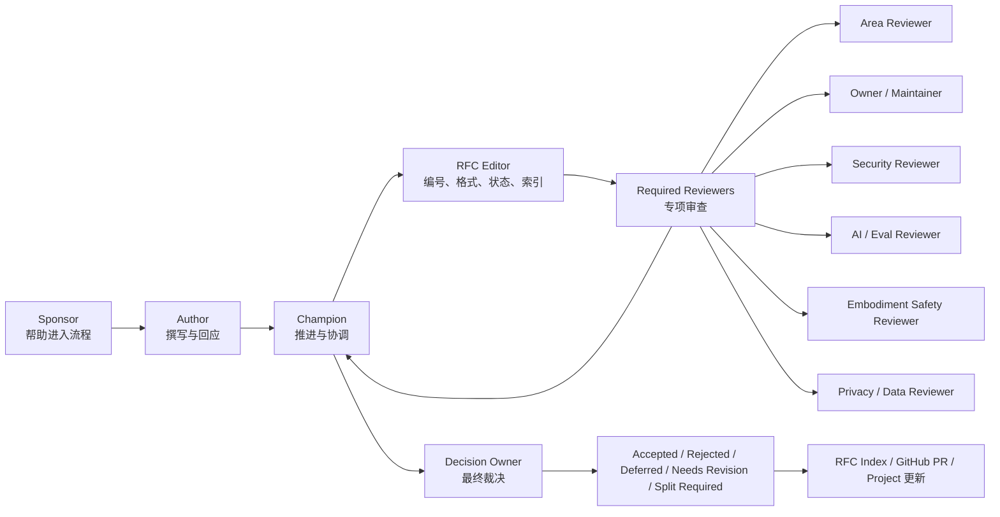
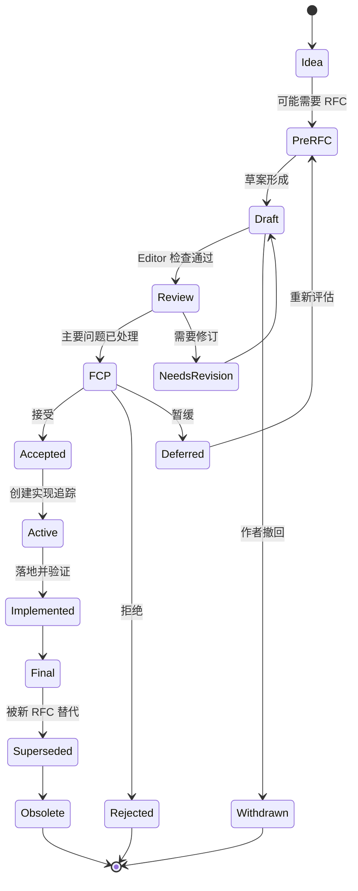
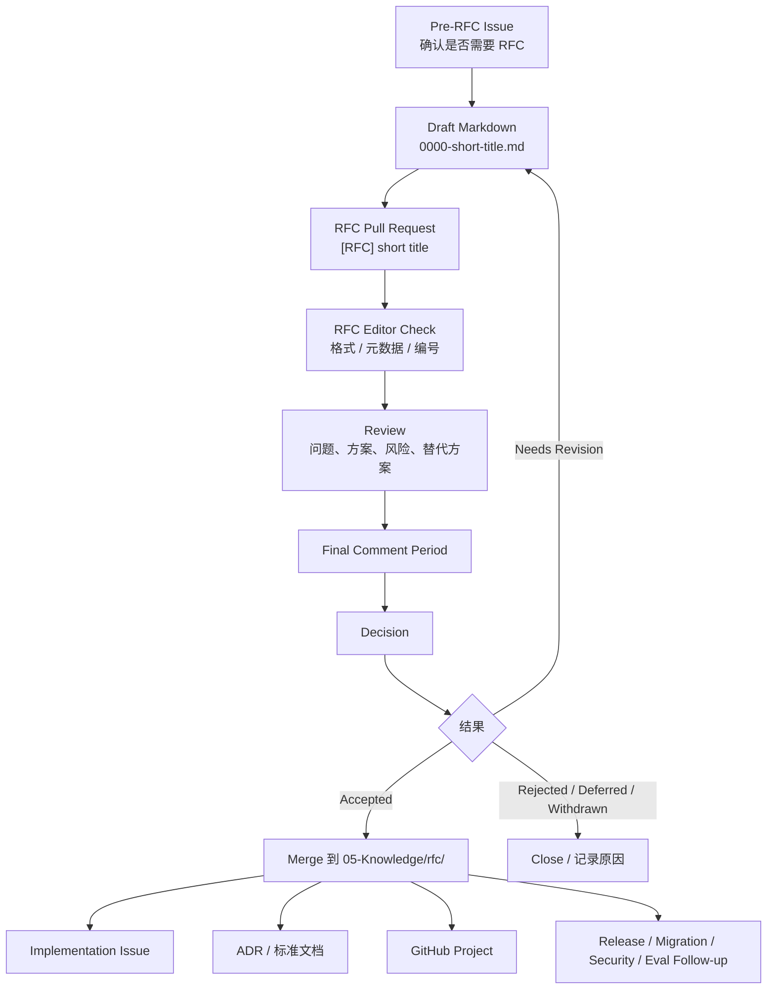
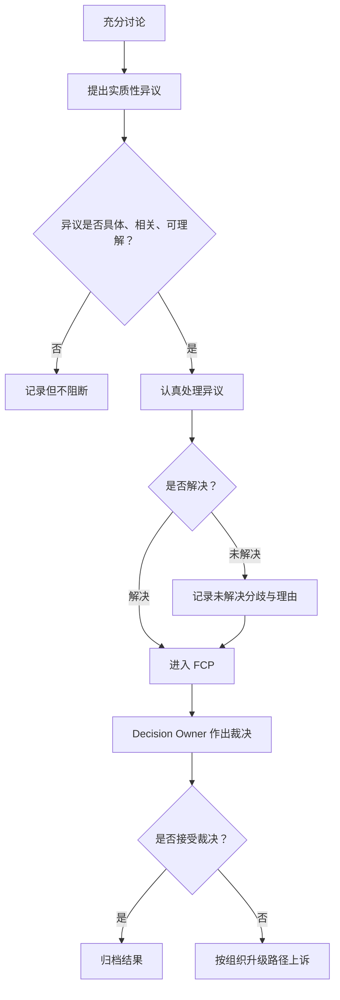
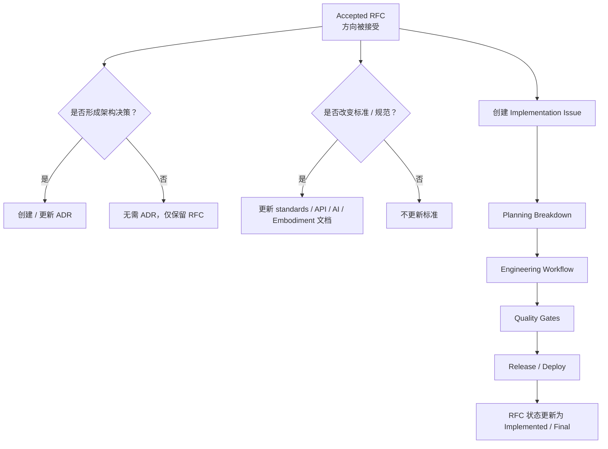

# RFC 流程

> 本文是辉夜计划重大变更的正式决策流程，不是普通"提案模板"。当一个想法影响长期架构、公共接口、跨仓库契约、AI Agent 行为、安全边界、具身控制、组织治理或长期维护责任时，必须通过 RFC 流程完成公开论证、审查、决策、归档与落地追踪。小改动走 Issue / PR，大改动先经过结构化设计和社区审查。

---

## 1. 目的

RFC 是辉夜计划处理重大变更的正式机制。它用于在实现前公开阐明问题、方案、取舍、风险、迁移和责任，并为长期演进留下可追溯的决策记录。

本文回答：什么变更必须写 RFC、什么不需要、谁能发起、谁推进、谁审查、谁裁决、如何讨论、何时进入最终评议、什么叫达成共识、通过后意味着什么、如何追踪实现、RFC 是否可修改。

---

## 2. RFC 与其他协作机制的关系

| 机制               | 用途                                               |
| ---------------- | ------------------------------------------------ |
| **Issue**        | 具体问题、任务、Bug、需求讨论                                 |
| **Discussion**   | 早期想法、开放问题、社区反馈                                   |
| **Planning**     | 从 Idea 到 Prototype / Engineering / Release 的项目推进 |
| **RFC**          | 重大变更的正式提案、论证和决策                                  |
| **ADR**          | 已经作出的架构决策记录                                      |
| **Design Doc**   | 某个被接受方向下的详细工程设计                                  |
| **PR**           | 代码、文档或配置实现                                       |
| **Release Note** | 对用户和维护者说明已发布变化                                   |

一句话边界：

> RFC 记录"我们是否应该这样做，以及为什么"。ADR 记录"我们已经做出了什么架构决定"。Design Doc 记录"具体如何实现"。PR 记录"实际变更是什么"。Release Note 记录"对使用者产生了什么影响"。

Accepted / Rejected / Superseded / Final 的 RFC 原则上不再大幅修改——它是历史记录，正式行为应维护在对应标准、规范或 ADR 中。

---

## 3. 什么时候需要 RFC

满足任一条件，**必须**走 RFC：

1. 改变公共 API、协议、Schema、状态机或领域契约；
2. 引入新的长期基础设施、运行时、调度系统、数据管线或模型服务；
3. 跨越两个以上仓库、Area 或团队责任域；
4. 引入、替换或弃用核心技术栈、框架、模型、数据库、消息系统或部署模式；
5. 影响安全、隐私、权限、数据保留、长期记忆或合规边界；
6. 引入高自治 Agent 行为、工具调用权限、长期记忆写入或外部系统写操作；
7. 影响具身终端、传感器、执行器、仿真到现实迁移或物理安全；
8. 造成破坏性变更、迁移成本、兼容性风险或长期维护责任；
9. 修改组织治理、角色权限、原则、安全伦理边界或社区规则；
10. 建立对外承诺，例如公开标准、SDK、协议、长期 Roadmap、正式发布能力；
11. 引入高成本、难回滚或强绑定的架构选择；
12. 废弃、替换、归档核心系统或公共能力。

---

## 4. 什么时候不需要 RFC

通常不需要 RFC：

1. 修复明确 Bug，且不改变公共行为或兼容性；
2. 文档、拼写、格式、示例、注释改进；
3. 局部重构，不改变外部语义；
4. 测试补充、CI 优化、静态分析改进；
5. 局部性能优化，且无架构、副作用或兼容性变化；
6. 只影响单个仓库内部实现，且 Owner 明确同意；
7. 已被现有 RFC / ADR 覆盖的实现细节。

> 如果不确定是否需要 RFC，默认先创建 RFC Triage Issue，由对应 Owner / Maintainer 判断。

---

## 5. RFC 类型

| 类型                        | 用途                         | 决策责任                                 |
| ------------------------- | -------------------------- | ------------------------------------ |
| **Engineering RFC**       | 架构、基础设施、服务、工具链、工程标准        | Maintainer Council / Area Maintainer |
| **API / Protocol RFC**    | 公共 API、Schema、协议、状态机、兼容策略  | API Owner + 相关 Area Owner            |
| **AI System RFC**         | Agent 架构、模型生命周期、工具调用、记忆、评测 | AI Systems Owner + Security Reviewer |
| **Embodiment RFC**        | 具身终端、仿真、传感器、执行器、物理动作权限     | Embodiment Owner + Safety Reviewer   |
| **Research RFC**          | 长期研究路线、评测基准、数据集标准、复现协议     | Research Owner                       |
| **Security / Ethics RFC** | 安全边界、隐私规则、高风险行为、披露机制       | Security Owner + Stewardship Council |
| **Governance RFC**        | 原则、组织、角色、社区规则、流程修订         | Stewardship Council                  |
| **Informational RFC**     | 记录背景、调研、方向说明，不直接产生强制规范    | 仅记录，无强制决策                           |

---

## 6. 角色



### 6.1 Author

RFC 的主要撰写者。职责：撰写 RFC；收集背景、数据、替代方案和风险；回应 Review；维护 RFC 状态；记录已解决和未解决问题。

### 6.2 Champion

RFC 的推进者。Author 可以是 Champion，但不必相同。职责：判断 RFC 是否值得推进；组织讨论；协调 Reviewer；推动进入 FCP；协助达成共识；确保结果被归档。每个 RFC 必须有 champion。

### 6.3 Sponsor

帮助作者进入流程的人，尤其适合外部贡献者或新人。职责：判断提案是否适合 RFC；帮助作者理解流程；帮助找到正确 Reviewer；确保 RFC 不因格式和流程问题被无谓阻塞。

### 6.4 RFC Editor

负责流程与格式，不负责技术裁决。职责：分配 RFC 编号；检查模板完整性；维护状态字段；维护 RFC Index；协助归档、重命名、链接实现 Issue；保证 RFC 元数据可检索。初始审查关注结构、格式、标题、语言和完整性，而非技术接受与否。

### 6.5 Required Reviewers

根据 RFC 类型和风险等级指定。最低规则：

> 每个 RFC 至少需要：1 名相关 Area Reviewer；1 名 Owner 或 Maintainer；1 名非作者 Reviewer。若涉及安全、隐私、AI Agent、长期记忆、具身、公共协议或破坏性变更，必须增加对应专项 Reviewer。指定 Reviewer 不应是提案文本作者，并应具备相关专业能力。

### 6.6 Decision Owner

最终裁决人或裁决组织：

- 单 Area RFC：对应 Area Owner / Maintainer 裁决；
- 跨 Area RFC：Maintainer Council 裁决；
- Security / Ethics RFC：Security Owner + Stewardship Council 裁决；
- Governance RFC：Stewardship Council 裁决；
- 争议重大且无法收敛：Stewardship Council 最终裁决。

---

## 7. 生命周期状态



| 状态                             | 含义                        |
| ------------------------------ | ------------------------- |
| **Idea**                       | 尚未形成 RFC，只是早期想法           |
| **Pre-RFC**                    | 已确认可能需要 RFC，正在收集背景和范围     |
| **Draft**                      | RFC 草案已形成，但还未正式审查         |
| **Review**                     | RFC 已通过格式检查，进入正式审查        |
| **Final Comment Period (FCP)** | 最终评议期，最后收集阻断性异议           |
| **Accepted**                   | 方向被接受，可以进入实现规划            |
| **Rejected**                   | 已拒绝，必须记录理由                |
| **Deferred**                   | 暂缓，原因通常是缺少 Owner、证据、资源或时机 |
| **Withdrawn**                  | 作者主动撤回                    |
| **Active / Implementable**     | 已接受且进入实现跟踪                |
| **Implemented / Final**        | 已落地并通过验证                  |
| **Superseded**                 | 被后续 RFC 替代                |
| **Obsolete**                   | 已不再适用，仅保留历史记录             |

---

## 8. 提交流程



### 8.1 Pre-RFC

入口：GitHub Discussion；GitHub Issue；Planning Discovery；Research Log；Incident Postmortem；Security Review；Maintainer 提案；Community feedback；Agent 自动发现的架构缺口。

Pre-RFC 的目标不是写完整方案，而是确认：是否真的需要 RFC；问题是否清楚；影响范围是否足够重大；是否已有重复 RFC / ADR / Issue；是否存在明显安全、合规或来源阻断；是否能找到 Champion / Sponsor / Owner。正式撰写前先公开验证想法，避免作者在明显不适用或重复的想法上投入过多时间。

### 8.2 Draft

推荐命名：`05-Knowledge/rfc/0000-short-title.md`（未编号前可放 `drafts/`），通过后改为 `05-Knowledge/rfc/0007-short-title.md`。

编号规则：RFC 编号由 RFC Editor 分配；草案阶段使用 0000；正式进入 Review 或 Accepted 后使用固定编号；编号一旦分配，不得复用。

### 8.3 Submit

1. 作者从 RFC 模板创建 Markdown 文件；
2. 提交到 `moonweave-guidelines` 仓库；
3. 以 Pull Request 形式打开 RFC；
4. PR 标题使用 `[RFC] short title`；
5. PR 必须链接 Pre-RFC Issue / Discussion / Planning item；
6. RFC Editor 检查格式和元数据；
7. 通过格式检查后进入 Review。

用 PR 而非 Issue：版本历史清楚；评论可以逐段发生；审查状态可见；可通过 CODEOWNERS 请求相关 Reviewer；通过 merge 表达正式归档。

---

## 9. Review 要求

Review 围绕问题、取舍和风险，不是单纯润色。必须检查：问题是否真实；目标和非目标是否清楚；方案是否足够具体；替代方案是否被认真比较；安全、隐私、合规、IP 风险是否说明；AI / Agent 风险是否说明；具身风险是否说明；迁移、兼容、回滚是否可行；测试、评测、观测是否可行；Owner、DRI、实现路径是否明确；是否需要拆分为多个 RFC。

### 审查矩阵

| RFC 类型                | 必需审查                                                                            |
| --------------------- | ------------------------------------------------------------------------------- |
| Engineering RFC       | Area Maintainer、Owner、至少 1 名独立 Reviewer                                         |
| API / Protocol RFC    | API Owner、前端代表、后端代表、兼容性 Reviewer                                                |
| AI System RFC         | AI Owner、Security Reviewer、Evaluation Reviewer、Data/Memory Reviewer             |
| Embodiment RFC        | Embodiment Owner、Safety Reviewer、Hardware/Simulation Reviewer、Security Reviewer |
| Research RFC          | Research Owner、Reproducibility Reviewer、Data Reviewer                           |
| Security / Ethics RFC | Security Owner、Privacy Reviewer、Stewardship Council                             |
| Governance RFC        | Stewardship Council、Maintainer Council、Community Reviewer                       |

横向审查对应 Security、Privacy、AI Safety、Embodiment Safety、Architecture、Community Impact——应在 RFC 成熟过程中持续寻求，而不是到最后才补。

强规则：

> 作者不得是唯一 Reviewer。Champion 不得单独裁决自己的 RFC。涉及安全、隐私、具身、人身风险或未授权资产的 RFC，不得通过普通技术多数意见绕过专项审查。

---

## 10. Final Comment Period

FCP 是"最后评议期"，不是重新展开无限讨论。

**触发**：当 Decision Owner 认为 RFC 已经足够成熟，且主要问题都已被处理时，可以发起 FCP。

**推荐时长**：

- 普通 RFC：7 个自然日；
- 跨 Area / API / Infra RFC：10–14 个自然日；
- Security / AI / Embodiment / Governance RFC：14–21 个自然日；
- 紧急 RFC：可缩短，但必须说明理由。

**FCP 开始前必须有一条总结评论**：当前方案；已解决的问题；接受的代价；未采纳的替代方案；已知风险；是否存在未解决异议；预期裁决（Accept / Reject / Defer）。重大修改可能触发新的 FCP。

---

## 11. 共识与裁决



采用 **Rough Consensus + Responsible Decision**：

**共识不等于**：多数投票；所有人同意；没有评论；沉默自动通过；资深者说了算；作者坚持到最后就获胜。

**有效异议必须是**：具体的；可理解的；与项目原则、目标、风险或事实相关；能说明该问题为什么阻断接受；最好给出替代方案、修改建议或可验证条件。

**裁决**：FCP 结束后，Decision Owner 作出 `Accepted / Rejected / Deferred / Withdrawn / Needs Revision / Split Required`。裁决必须写入 RFC PR 的最终评论，并在 RFC 文件中记录：

```text
Decision:
Decision Owner:
Decision Date:
Resolution Link:
Accepted Trade-offs:
Rejected Alternatives:
Unresolved Concerns:
Follow-up Issues:
```

共识不是多数投票，也不是所有人都满意；关键是严肃处理实质性异议，并向反对者解释为什么其关切未被采纳。只数赞成/反对人数会让重要少数意见被噪声淹没。

**上诉路径**：对裁决不服可升级至上一级决策实体（Area → Maintainer Council → Stewardship Council），最终上诉机构见 `01-Organization.md` §12。

---

## 12. Accepted 之后



> RFC Accepted 只表示方向被接受，可以进入实现规划。它不意味着相关代码、配置、模型、服务或具身行为可以绕过 PR Review、安全审查、质量门禁或发布流程。RFC active 不是 rubber stamp，不保证最终一定合并。

Accepted 后必须创建或更新：Implementation Issue；GitHub Project item；Owner / DRI；ADR（如形成架构决策）；standards 文档（如改变标准）；release checklist（如影响发布）；migration issue（如涉及兼容）；security review issue（如涉及安全）；evaluation issue（如涉及 AI / Agent）；embodied safety checklist（如涉及物理执行）。

形成"RFC → 标准 → 实现"三段式：通过后创建 spec 集成 issue，规范集成后再为相关实现创建 backlog issue。

---

## 13. Rejected / Deferred / Withdrawn

拒绝、暂缓和撤回必须记录原因，并保留历史记录：

- **Rejected**：记录拒绝理由与未采纳的替代方案，避免同一争议反复出现。
- **Deferred**：记录暂缓原因（缺 Owner、证据、资源或时机）与重新评估条件。
- **Withdrawn**：作者主动撤回，记录撤回原因。

被拒绝的 RFC 仍保留在 RFC Index，作为历史记录与防重复参考。

---

## 14. 修订、废弃与替代

Accepted / Rejected / Superseded / Final 的 RFC 原则上不做实质性修改。如后续设计发生重大变化，应提交 Amendment RFC 或新的 RFC，并在旧 RFC 中标记 `superseded_by`。

允许的小修：拼写；链接；状态；implementation issue；ADR 链接；release 链接；明确不改变决策含义的注释。

实质修订必须走：

```text
Revision PR → Reviewer check → 必要时 FCP → Decision Owner approval
```

---

## 15. RFC 与 ADR 的关系

> 当 RFC 被接受并导致架构决策时，必须生成或更新 ADR。RFC 说明提案过程和取舍；ADR 说明最终架构决策及其后果。

| RFC 状态                      | ADR 动作                             |
| --------------------------- | ---------------------------------- |
| Accepted Engineering RFC    | 创建 ADR                             |
| Accepted API / Protocol RFC | 更新 API 标准 + 可能创建 ADR               |
| Accepted AI System RFC      | 更新 AI Systems 标准 + 可能创建 ADR        |
| Accepted Embodiment RFC     | 更新 Safety / Embodiment 标准 + 创建 ADR |
| Rejected RFC                | 通常不创建 ADR，但保留 RFC 记录               |
| Superseded RFC              | 更新相关 ADR 状态                        |

---

## 16. 快速通道与紧急通道

### 16.1 Fast-track RFC

适用：已有充分共识；低风险；范围小；明显修复现有流程漏洞；不涉及安全、隐私、具身、公共协议和破坏性变更。

流程：`Draft → Review → 3–5 天 FCP → Decision`。

### 16.2 Emergency RFC

适用：安全事故；生产中断；合规风险；具身风险；高危漏洞；重大外部依赖失效。

规则：紧急 RFC 可以先由 Owner / Security Owner / Stewardship Council 作出临时决策，但必须在事后补充 RFC 或 ADR，记录背景、风险、决策、替代方案和后续修复。高风险发布需要明确检查点，但真实工程也需要在紧急情况下保留可追溯的决策记录。

---

## 17. 平台与自动化

### 17.1 GitHub

- RFC 以 PR 形式提交到 `moonweave-guidelines`；
- RFC PR 使用 `[RFC]` 前缀；
- 所有 RFC PR 自动进入 `Moonweave RFC Pipeline` Project；
- 使用 label 表示类型、状态、风险和 Area；
- 使用 CODEOWNERS 自动请求相关 Reviewer；
- FCP 开始和结束由 RFC Editor 或 Bot 标记；
- 通过后 merge 到 `05-Knowledge/rfc/`。

推荐标签：

```text
rfc / rfc:pre / rfc:draft / rfc:review / rfc:fcp / rfc:accepted / rfc:rejected / rfc:deferred / rfc:withdrawn
type:engineering / type:api-protocol / type:ai-system / type:embodiment / type:research / type:security / type:governance
risk:S0 ... risk:S5
area:agent / area:infra / area:frontend / area:backend / area:embodiment / area:research
needs:security-review / needs:privacy-review / needs:ai-safety-review / needs:embodiment-review / needs:owner / needs:decision
```

### 17.2 飞书

飞书只做提醒、协调和会议，不做事实源。`mw-rfc-review`（审查提醒）、`mw-engineering`（工程 RFC 通知）、`mw-security-private`（安全敏感 RFC）、`mw-embodiment`（具身 RFC 审查）、`mw-announcements`（Accepted / Rejected / FCP 公告）。

规则：飞书中产生的 RFC 结论必须回写到 GitHub PR 或 RFC 文件。飞书投票、表情、口头同意不能作为 RFC 决策依据。

### 17.3 Notion

可维护索引和阅读视图，但不作为 RFC 原文事实源：RFC Index；RFC Calendar；RFC Review Queue；RFC Decision Summary；Area RFC Map。

### 17.4 Agent：Kaguya RFC Steward

功能：检查 RFC 模板完整性；标记缺失 Owner / Champion / risk_level；自动把 RFC PR 加入 Project；根据 type 和 area 请求 Reviewer；FCP 开始、剩余 48 小时、结束时提醒；汇总开放问题；检测 stale RFC；生成 decision summary 草稿；Accepted 后创建 implementation issue 草稿。

限制：

> Agent 不得自动接受、拒绝、合并 RFC。Agent 不得替代 Decision Owner。Agent 不得在安全敏感 RFC 中向普通频道泄露内容。

### 17.5 RFC Pipeline 字段

| 字段                     | 类型            | 说明                                                                           |
| ---------------------- | ------------- | ---------------------------------------------------------------------------- |
| `RFC ID`               | Text          | RFC-0000 / RFC-0007                                                          |
| `Status`               | Single select | Pre / Draft / Review / FCP / Accepted / Rejected / Deferred / Active / Final |
| `Type`                 | Single select | Engineering / API / AI / Embodiment / Research / Security / Governance       |
| `Risk`                 | Single select | S0–S5                                                                        |
| `Area`                 | Single select | Agent / Infra / Frontend / Backend / Embodiment / Research / Security        |
| `Champion`             | User/Text     | 推进人                                                                          |
| `Decision Owner`       | User/Text     | 裁决人                                                                          |
| `Required Reviewers`   | Text          | 必需审查角色                                                                       |
| `FCP Start`            | Date          | 最终评议开始                                                                       |
| `FCP End`              | Date          | 最终评议结束                                                                       |
| `Implementation Issue` | URL           | 通过后的实现追踪                                                                     |
| `ADR`                  | URL           | 如形成架构决策                                                                      |
| `Next Review`          | Date          | 下一复审日期                                                                       |
| `Blocking Issues`      | Text          | 阻断问题                                                                         |

---

## 18. 通过与拒绝标准

### 18.1 通过标准

RFC 可被接受，当且仅当：

1. 问题真实且值得解决；
2. 提案范围清楚；
3. 目标和非目标明确；
4. 方案足够具体，可以指导实现；
5. 主要替代方案已被比较；
6. 已知风险被记录并有缓解方案；
7. 兼容、迁移、回滚策略明确；
8. 必要的安全、隐私、AI、具身、运维审查已完成；
9. 必要 Reviewer 已审查；
10. 实质性异议已被处理、解释或记录；
11. 有明确 Owner / DRI；
12. 接受后的下一步可执行。

### 18.2 拒绝或暂缓标准

1. 问题不成立或证据不足；
2. 方案过宽、不可执行或不可验证；
3. 明显违反原则、安全伦理或合规边界；
4. 没有 Owner / DRI；
5. 迁移成本或维护成本明显高于收益；
6. 替代方案明显更简单或风险更低；
7. 实质性异议未被处理；
8. 需要先做实验、评测或原型验证。

---

## 19. RFC 模板

模板文件放在 `05-Knowledge/rfc/0000-template.md`（或 `templates/rfc-template.md`）。完整结构：

```markdown
---
rfc: RFC-0000
title:
status: Draft
type: Engineering | API-Protocol | AI-System | Embodiment | Research | Security-Ethics | Governance | Informational
authors:
champion:
sponsor:
decision_owner:
area:
risk_level: S0 | S1 | S2 | S3 | S4 | S5
created:
updated:
fcp_start:
fcp_end:
decision_date:
related_issues:
related_prs:
related_adrs:
supersedes:
superseded_by:
---

# RFC-0000: Title

## 1. Summary
## 2. Motivation
## 3. Goals
## 4. Non-goals
## 5. Background
## 6. Proposal
## 7. Detailed Design
## 8. Alternatives Considered
## 9. Compatibility and Migration
## 10. Security, Privacy and IP Impact
## 11. AI / Agent Impact
## 12. Embodiment Impact
## 13. Observability and Operations
## 14. Test and Evaluation Plan
## 15. Rollout and Rollback Plan
## 16. Documentation and Education
## 17. Implementation Plan
## 18. Drawbacks and Risks
## 19. Unresolved Questions
## 20. Rejected Ideas
## 21. Decision (FCP 后填写)
```

模板综合了动机、规范、理由、兼容、安全、参考实现、拒绝方案的要求，以及测试、毕业标准、升级/降级、版本偏差和生产准备的要求；对辉夜计划额外加入 AI / Agent、长期记忆、资产来源和具身安全影响。

---

## 20. 反模式

以下行为属于 RFC 反模式：

1. 用 RFC 替代 Issue 处理小问题；
2. 用 RFC 堆砌抽象愿景，但没有可执行方案；
3. 在 PR 中争论重大架构，绕过 RFC；
4. RFC 没有 Owner / Champion；
5. RFC 不写替代方案；
6. RFC 只写收益，不写代价；
7. RFC 通过后没有 implementation issue；
8. RFC Accepted 后被当作实现自动合并许可；
9. 通过飞书投票或私聊决定 RFC；
10. 用沉默当作共识；
11. 少数异议未被处理就宣布通过；
12. RFC 长期 Draft 但无人推进；
13. 把安全、隐私、具身风险留到实现阶段才讨论；
14. 重大修改不重启 Review / FCP；
15. Rejected RFC 不记录理由，导致同一争议反复出现。

---

## 21. 核心规则与修订

最重要的 5 条核心规则：

1. 重大变更先 RFC，后实现。
2. RFC 必须有 Champion、Owner、Decision Owner。
3. 共识不是投票；实质性异议必须被处理和记录。
4. Accepted 只表示方向通过，不等于实现自动合并。
5. RFC 的结果必须连接到 ADR、Implementation Issue、Project 和 Release。

本文只能通过 Governance RFC 修订（这是本文定义的流程适用于自身的体现）。与 `01-Principles.md` 的"冲突与修订"一致：当本文与组织权限或安全规则冲突时，以对应专项文档为准；当与法律、安全伦理底线冲突时，底线优先。旧版存于版本控制，随时可查。

这一套机制吸收了 Rust 的轻量 Markdown RFC、Python 的状态与历史记录、Go 的"先简短 issue，必要时设计文档"、Kubernetes 的生产准备意识、OpenTelemetry 的"RFC → 规范 → 实现"链路、TC39 的阶段成熟度与 reviewer sign-off，以及 IETF 对 rough consensus 的理解——服务辉夜计划的长期演进，而不是制造形式化负担。
