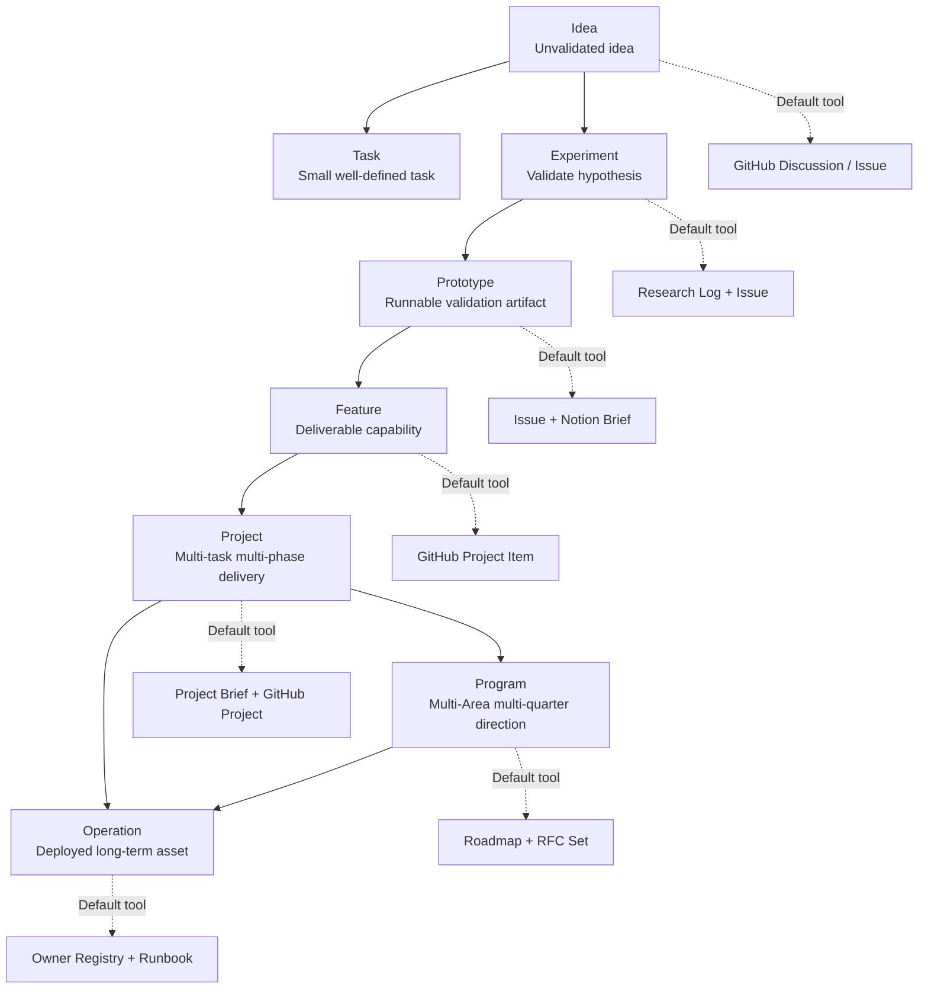
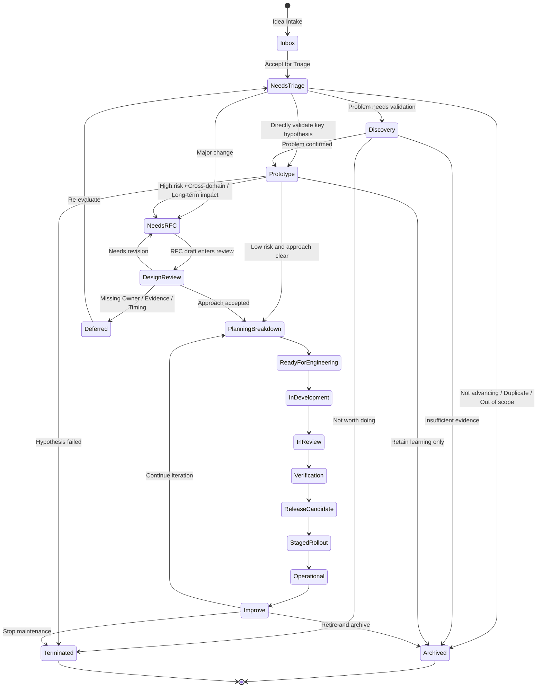
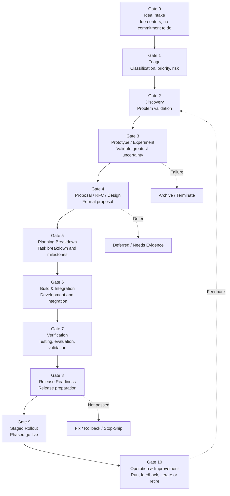
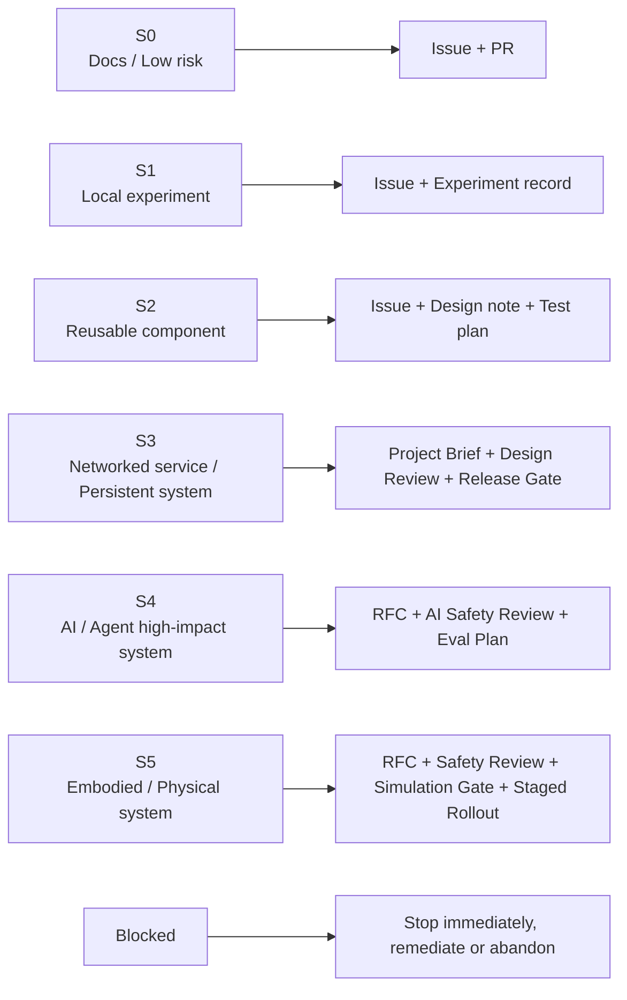
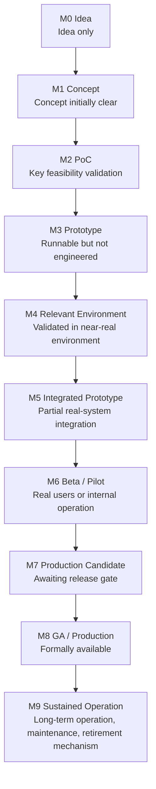

# Collaboration Planning Standards

> This document defines how the Kaguya Project determines whether an idea, experiment, prototype, or requirement is worth pursuing; how to validate it; how to enter RFC / design; how to break down into engineering tasks; how to complete testing, release, go-live, operations, and postmortem; and when to pause, archive, or terminate. It is the unified flow for all projects from **Idea → Prototype → Engineering → Release → Operation**—not merely a Roadmap document or project management tool guide.

This document does not replace the formal decision process in `03-RFC-Process.md`, security review in `../../01-Foundation/en/02-Security-Ethics.md`, or role and permission definitions in `../../02-Governance/en/01-Organization.md`. This document defines only planning object flow, gates, maturity, and responsibility assignment.

---

## 1. Purpose

This document defines the unified planning flow for the Kaguya Project from ideas, experiments, and prototypes through formal engineering, release, operation, and archival.

The goal of planning is not to create process burden, but to ensure every piece of work has a clear problem, Owner, risk level, validation method, delivery standard, and follow-on responsibility. There are only two goals: land what is truly worth doing, and exit gracefully what is not.

---

## 2. Planning Principles

Eight principles specifically constraining the planning system:

1. **Start from the problem, not the implementation** — Before any project enters engineering, it must state what problem it solves, whom it serves, why now, and what loss occurs if it is not done. For the Kaguya Project, "customer" is not necessarily a commercial user—it may be Agent systems, research workflows, open-source contributors, future embodied terminals, Infra runtime environments, long-term memory systems, developers, and maintainers. Every project should answer: Who benefits? What changes after this exists? Why is this better than the current state? Why now? What should not be built?
2. **Validate high uncertainty before heavy engineering** — Early in a project, prioritize validating the greatest uncertainty: technical feasibility, data availability, model capability sufficiency, controllable security boundaries, whether the system is truly needed, whether it breaks existing architecture, whether maintenance cost is acceptable. Do not prioritize building a complete system first.
3. **A prototype is not a production system** — Prototypes are for learning; they must not silently become production dependencies without Owner, tests, documentation, security review, and operational responsibility. Notebook / demo / script temporarily given to others, depended on by other systems, with nobody daring to change or delete—that rot path must be blocked at the prototype stage.
4. **Risk determines process intensity** — Low-risk, reversible, small-scope changes proceed lightly; high-risk, cross-repository, irreversible changes involving security/privacy/embodiment/long-term state require stronger review. Reuse S0–S5 and Blocked levels from `../../01-Foundation/en/02-Security-Ethics.md` §3.
5. **Plans must have an Owner; execution must have a DRI** — Every planning object must have an Owner (long-term responsibility for asset or direction); every active initiative must have a DRI (driving work to the next gate). Projects without a DRI cannot enter active status; projects without an Owner cannot enter long-term maintenance or production.
6. **Roadmap is commitment management, not a wish list** — Projects entering the Roadmap must have clear value, scope, Owner, risk level, target phase, and next review date. Unvalidated ideas should not enter the Roadmap directly—they belong in Idea Backlog or Discovery Queue.
7. **Decisions must be captured; status must be visible** — Project status, risk, blockers, milestones, Owner, and decision rationale must be traceable. GitHub Projects is the source of truth for engineering planning; chat, meetings, and Notion may reference but must not create parallel facts.
8. **Done is not merge; release is not success** — A project is truly landed only after validation, release, monitoring, handoff, and feedback loop completion.

---

## 3. Work Objects and Planning Levels



Planning objects are layered; otherwise small Issues and multi-year projects get mixed together.

| Level | Definition | Examples | Default tool |
| ----- | ---------- | -------- | ------------ |
| **Idea** | Unvalidated idea | "Do we need an Agent Memory Inspector?" | GitHub Discussion / Issue |
| **Task** | Small, well-defined task | Fix bug, add docs, add tests | GitHub Issue |
| **Experiment** | Short work to validate a hypothesis | Compare two memory retrieval strategies | Research Log + Issue |
| **Prototype** | Runnable but not engineered validation artifact | Agent sandbox demo | Issue + Notion Brief |
| **Feature** | Deliverable capability | New API, UI module, evaluation tool | GitHub Project Item |
| **Project** | Multi-task, multi-phase delivery | Memory Persistence v1 | Project Brief + GitHub Project |
| **Program** | Multi-Area, multi-quarter direction | Embodied Runtime Roadmap | Roadmap + RFC set |
| **Operation** | Long-running deployed asset | API service, model service, data pipeline | Owner Registry + Runbook |

Issue / Project / RFC boundaries: Small-scope, low-risk, reversible changes → Issue + PR; coordination of multiple tasks → Project; impact on architecture, public contracts, long-term maintenance, security boundaries, or multiple repositories → RFC; architecture choices already made → ADR.

---

## 4. Lifecycle Overview



Status fields:

| Status | Meaning |
| ------ | ------- |
| `Inbox` | New idea, not yet classified |
| `Needs Triage` | Awaiting initial screening |
| `Discovery` | Problem validation in progress |
| `Prototype` | Prototype / experiment |
| `Needs RFC` | Formal proposal required |
| `Design Review` | Design under review |
| `Planning Breakdown` | Task and milestone breakdown |
| `Ready for Engineering` | Ready for formal development |
| `In Development` | In development |
| `In Review` | PR / Design / Safety Review |
| `Verification` | Integration, testing, evaluation |
| `Release Candidate` | Release candidate |
| `Staged Rollout` | Gradual or phased go-live |
| `Operational` | In long-term operation |
| `Improve` | Iterating based on feedback |
| `Paused` | Paused |
| `Archived` | Archived |
| `Terminated` | Terminated |

Phases may overlap or be skipped in high-certainty cases, but key outputs and responsibilities must remain explicit.



---

## 5. Risk and Maturity



All planning objects must be tagged with:

- **Risk**: S0–S5 / Blocked (consistent with `../../01-Foundation/en/02-Security-Ethics.md` §3)
- **Maturity**: M0–M9 (see below)
- **Owner**, **DRI**, **Area**, **Next Review**

Risk determines process intensity:

| Risk level | Planning intensity |
| ---------- | ------------------ |
| S0 docs / low risk | Issue + PR sufficient |
| S1 local experiment | Issue + experiment record |
| S2 reusable component | Issue + design note + test plan |
| S3 networked service / persistent system | Project Brief + Design Review + Release Gate |
| S4 AI / Agent high-impact system | RFC + AI Safety Review + Eval Plan |
| S5 embodied / physical system | RFC + Safety Review + Simulation Gate + Staged Rollout |

### Moonweave Maturity Level



| Level | Name | Definition |
| ----- | ---- | ---------- |
| **M0** | Idea | Idea only, not yet validated |
| **M1** | Concept | Problem and concept initially clear |
| **M2** | Proof of Concept | Key feasibility validated |
| **M3** | Prototype | Runnable prototype, not yet engineered |
| **M4** | Relevant Environment | Validated in near-real environment |
| **M5** | Integrated Prototype | Integrated with partial real systems |
| **M6** | Beta / Pilot | Real users or internal operation |
| **M7** | Production Candidate | Near production requirements, awaiting release gate |
| **M8** | GA / Production | Formally available with support and operations |
| **M9** | Sustained Operation | Long-term operation with maintenance, iteration, and retirement mechanism |

---

## 6. Gate 0: Idea Intake

**Goal**: Bring ideas into the system without committing to doing them.

**Entry points**: GitHub Discussion; GitHub Issue; Feishu / WeChat / Discord community discussion; Research log; User feedback; Incident postmortem; RFC reverse breakdown; Maintainer / Owner proposal; Agent-discovered system gaps.

**Minimum Idea format**:

```markdown
# Idea

## Summary
One sentence describing the idea.

## Problem
What problem exists today?

## Why now
Why is it worth considering now?

## Affected area
Agent / Infra / Frontend / Backend / Embodiment / Research / Docs / Security

## Expected value
What might it improve?

## Known risks
Security, privacy, compliance, AI, embodiment, maintenance cost, and other risks.

## Related links
Issue / PR / RFC / ADR / Research log / external reference
```

**Gate 0 exit**:

| Outcome | Meaning |
| ------- | ------- |
| `Accept for Triage` | Enter initial screening |
| `Needs Clarification` | Insufficient information |
| `Duplicate` | Similar item already exists |
| `Out of Scope` | Outside project boundaries |
| `Blocked by Security / IP` | Security or provenance block triggered |
| `Archive` | Retain but do not advance |

---

## 7. Gate 1: Triage

**Goal**: Convert ideas into assessable planning objects.

**Triage must complete**: Type, Area, Risk level, Potential Owner, Suggested DRI, Priority, Maturity target, Required process (Issue / Experiment / RFC / ADR / Project), Next step.

**Type classification**: `bug` / `feature` / `research` / `experiment` / `prototype` / `infra` / `security` / `embodiment` / `docs` / `rfc` / `deprecation` / `release`.

**Priority**—not P0/P1/P2 alone; combine these dimensions:

| Field | Question |
| ----- | -------- |
| Mission Alignment | Does it serve long-term goals? |
| Impact | How broad is the outcome impact? |
| Urgency | Does it block other work? |
| Confidence | Is evidence sufficient? |
| Cost | How high are people and time cost? |
| Risk | How high are security, privacy, engineering, embodiment risks? |
| Maintenance Burden | How high is long-term maintenance cost? |
| Reversibility | Is rollback easy if wrong? |

---

## 8. Gate 2: Discovery / Problem Validation

**Goal**: Confirm the problem is real, worth solving, and boundaries are clear enough.

**Must go through Discovery**: New systems; new productized capabilities; new public APIs; new Agent behavior; new model services; new long-term state or memory mechanisms; new embodied control capabilities; cross-repository refactors; high-maintenance platform work.

**Discovery output**:

```markdown
# Discovery Brief

## Problem Statement
## Users / Stakeholders
## Current State
## Evidence
## Success Metrics
## Non-goals
## Risk Classification (S0–S5)
## Alternatives (at least 2, including "do nothing")
## Recommendation (Prototype / RFC / Backlog / Reject / Archive)
```

When the problem is not yet well understood, validate user problem, goals, and key metrics first—not jump straight to building.

---

## 9. Gate 3: Prototype / Experiment

**Goal**: Validate the greatest uncertainty at minimum cost.

**Prototype types**:

| Type | Purpose | Example |
| ---- | ------- | ------- |
| `Research Spike` | Validate theory or paper method | Reproduce a memory paper |
| `Technical Spike` | Validate engineering feasibility | Test state machine persistence approach |
| `UX Prototype` | Validate interaction and information architecture | Agent state inspector UI |
| `AI Eval Prototype` | Validate model capability and evaluation | Long-term personality consistency benchmark |
| `Embodied Simulation` | Validate physical control preconditions | Simulation environment action boundary test |
| `Integration Prototype` | Validate multi-system connection | Agent tool-chain demo |

**Prototype must clearly state**: Hypothesis; What is being tested; What is intentionally ignored; Dataset / Asset source; Environment; Success criteria; Failure criteria; Risk level; Owner; Expiration date; Promotion path; Cleanup path.

**Prototype prohibitions**: Must not default to production; must not bypass asset provenance review; must not use unreviewed personal data; must not connect real users, production systems, or embodied terminals without boundaries; must not be long-term dependency of other systems without an engineering plan.

**Gate 3 exit**:

| Outcome | Next step |
| ------- | --------- |
| `Promote to RFC / Design` | Enter formal proposal |
| `Promote to Engineering` | Low risk and clear design—may engineer directly |
| `Continue Experiment` | Insufficient information—continue with time limit |
| `Archive` | Learned but do not advance |
| `Terminate` | Hypothesis failed—stop investment |

ML system challenges are not just training models but building complete systems including configuration, data collection and validation, testing, metadata, Serving, and monitoring; experiments must also record what worked and what did not to maintain reproducibility.

---

## 10. Gate 4: Proposal / RFC / Design

**Goal**: Convert validated problem and approach into a formal plan that is reviewable, discussable, and executable.

**When RFC is required**—if any condition is met, must enter RFC or equivalent formal proposal:

- Cross-repository or cross-Area;
- Changes public API, protocol, Schema, or state machine;
- Introduces long-term infrastructure;
- Changes security, privacy, permission, or data processing boundaries;
- Introduces highly autonomous Agent behavior;
- Involves embodied control, sensors, actuators, or physical risk;
- Introduces major dependencies or technology stack;
- Causes migration not easily rolled back;
- Forms long-term commitment to open-source community or external users.

Ordinary fixes do not need formal proposals, but major features, architecture, and process changes need public design, community input, and decision records. Discuss publicly before formal writing to avoid investing heavily then finding direction inapplicable. See `03-RFC-Process.md` for detailed process.

**Minimum RFC / Design content**: Summary; Problem; Goals; Non-goals; Background; Proposed solution; Alternatives; Risks and mitigations; Security / privacy impact; AI / Agent impact; Embodiment impact (if any); Data and asset provenance; Compatibility and migration; Testing / evaluation plan; Observability plan; Rollout and rollback plan; Owner / DRI; Milestones; Success metrics; Exit criteria.

---

## 11. Gate 5: Planning Breakdown

**Goal**: Break approved design into executable, trackable, deliverable work packages.

**Must complete**: Project Brief updated; RFC / Design accepted or low-risk exemption; Owner and DRI confirmed; tasks broken into Issues; key dependencies marked; milestones set; Release strategy stated; Quality bar defined; Security / privacy / AI / embodiment reviews scheduled; documentation, testing, evaluation, and operations work included in plan.

**Engineering Issue fields**: Title; Context; Scope; Acceptance criteria; Out of scope; Risk level; Owner / Assignee; Related RFC / ADR; Dependencies; Test requirement; Documentation requirement; Rollout impact.

**Milestone rules**—a Milestone is not just a date; it must express a verifiable system state.

Good example:

```markdown
Memory Persistence v1:
- Agent state can be saved, restored and inspected in local runtime.
- State schema is versioned.
- Migration path from v0 is documented.
- Integration tests cover crash recovery.
```

Bad example:

```markdown
Finish phase one of memory system.
```

---

## 12. Gate 6: Build & Integration

**Goal**: Execute engineering implementation and continuously sync status, risk, and scope changes.

**Development period rules**: All implementation work must link to an Issue; all PRs must link to Issue / RFC / ADR; scope changes must write back to Project Brief or RFC; new risks must be tagged immediately; items blocked beyond agreed time must escalate; do not use PR discussion to replace RFC-level directional debate.

**Status update requirements**—active projects update at least weekly: Status; Progress; Blockers; Risks; Scope changes; Next step; Need decision. If no update for two planning cycles, auto-mark as `Stale / Needs DRI Review`.

---

## 13. Gate 7: Verification

**Goal**: Confirm the system not only "runs" but meets delivery standards.

| Dimension | Must answer |
| --------- | ----------- |
| Functional | Are requirements implemented? |
| Integration | Does it interact correctly with related systems? |
| Compatibility | Does it break API / Schema / data? |
| Security | Does it pass security checks? |
| Privacy | Does it comply with data and memory rules? |
| AI Evaluation | Does it pass capability, safety, stability evaluation? |
| Embodiment | Does it pass simulation, boundaries, E-Stop, HITL requirements? |
| Observability | Are logs, metrics, Tracing, alerts in place? |
| Documentation | Are user, developer, maintainer docs updated? |
| Operations | Are runbook, rollback, Owner in place? |

AI project verification should not look at benchmarks alone—it should also cover risk, context, measurement, and governance (aligned with NIST AI RMF Govern / Map / Measure / Manage).

---

## 14. Gate 8: Release Readiness

**Goal**: Confirm the system may be released, go live, be made public, or enter long-term operation.

**Release Readiness Checklist**:

```markdown
## Ownership
- [ ] Primary Owner confirmed
- [ ] Backup Owner confirmed
- [ ] DRI confirmed
- [ ] Escalation path confirmed

## Engineering
- [ ] All blocking Issues closed
- [ ] Required tests passed
- [ ] CI passed
- [ ] Documentation updated
- [ ] Changelog updated
- [ ] Version strategy clear

## Security & Privacy
- [ ] Dependency scan passed
- [ ] Secret scan passed
- [ ] License / provenance check passed
- [ ] Data processing description complete
- [ ] Permission boundaries checked

## AI / Agent
- [ ] Tool permissions reviewed
- [ ] Prompt injection risk assessed
- [ ] Output validation defined
- [ ] Long-term memory write rules clear
- [ ] Eval report archived

## Embodiment, if applicable
- [ ] Simulation validation passed
- [ ] Space / motion / force limits defined
- [ ] HITL enabled
- [ ] E-Stop verified
- [ ] Sensor and actuator logs auditable

## Operations
- [ ] Monitoring enabled
- [ ] Alerting enabled
- [ ] Runbook complete
- [ ] Rollback plan complete
- [ ] Backup / restore verified
- [ ] Incident channel confirmed

## Launch
- [ ] Release notes prepared
- [ ] Feature flag / staged rollout configured
- [ ] User or community announcement prepared
- [ ] Post-launch review scheduled
```

Reliability and operations requirements should enter design and build early—late PRR involvement brings high rework cost. Stop-Ship conditions (see `../../01-Foundation/en/02-Security-Ethics.md` §7) freeze release immediately; nobody may override with schedule pressure.

---

## 15. Gate 9: Staged Rollout

**Goal**: Reduce release risk by gradually expanding impact surface.

| Stage | Description | Requirements |
| ----- | ----------- | ------------ |
| `Internal` | Core developers only | Fast feedback |
| `Dogfood` | Real internal project use | Record issues and experience |
| `Alpha` | External trial but unstable | Clear limits and risks |
| `Beta` | Feature near stable | Exit criteria defined |
| `Release Candidate` | Candidate formal release | Blockers only |
| `GA` | Formally available | Owner, support, docs, operations complete |
| `Deprecated` | Deprecated | Migration path and timeline |
| `Archived` | Maintenance stopped | Status clear |

Experiments should have hypothesis, success/failure criteria, short cycle, and result report; Beta should have clear exit criteria; publicly available capabilities should complete security, observability, disaster recovery, SLA, scalability preparation before stability.

---

## 16. Gate 10: Operation & Improvement

**Goal**: Enter long-term operation—not unmaintained after release.

**Operational Acceptance**—before formally entering operation must have: Owner Registry updated; Runbook archived; Monitoring dashboard linked; Incident process clear; Known issues recorded; Post-launch review scheduled; Follow-up backlog created; Success metrics and observation window defined.

**Post-launch Review**:

```markdown
# Post-launch Review

## What shipped
## Expected outcome
## Actual outcome
## Metrics
## User / maintainer feedback
## Incidents or regressions
## What worked
## What did not work
## Follow-up actions
## Keep / iterate / rollback / deprecate
```

After release, monitor usage, metrics, and qualitative feedback, and create follow-up Issues.

---

## 17. Project Classification and Minimum Process

Different project types should not follow identical full process.

### 17.1 Documentation / Low-Risk Changes

```text
Issue / PR → Review → Merge
```

Requirements: Relevant Owner Review; does not change principles, governance, or public commitments; does not involve security, privacy, or legal risk.

### 17.2 Ordinary Engineering Features

```text
Issue → Triage → Design note → Task breakdown → Implementation → Verification → Release notes
```

Applies to: Small APIs; UI features; Tool improvements; Internal service changes; Low-risk reversible features.

### 17.3 Research / Experiment

```text
Research question → Hypothesis → Experiment plan → Run → Research log → Decision: archive / iterate / promote
```

Requirements: Clear hypothesis; Data and configuration recorded; Random seed and environment recorded; Results reproducible; Conclusions not overstated; Does not auto-enter production.

### 17.4 AI / Agent Capabilities

```text
Problem validation → Prototype → Eval design → Safety review → RFC / Design → Implementation → Red team / benchmark / regression eval → Staged rollout → Monitoring
```

Requirements: Capability boundaries; Failure modes; Tool permissions; Memory write rules; Prompt injection protection; Output validation; Eval report; Rollback mechanism.

### 17.5 Embodied / Physical Systems

```text
Concept → Hazard analysis → Simulation → Low-risk prototype → Controlled physical test → HITL operation → Staged autonomy → Operational acceptance
```

Requirements: Simulation first; Action boundaries; Spatial boundaries; Speed / force / tool limits; E-Stop; HITL; Log audit; Security re-review; Strict release gate.

---

## 18. Tool System: GitHub, Notion, Feishu, Agent

### 18.1 GitHub Projects

Establish organization-level `Moonweave Roadmap` and Area Projects (`Moonweave Agent Systems` / `Moonweave AI Infra` / `Moonweave Embodiment` / `Moonweave Frontend & Design` / `Moonweave Research` / `Moonweave Security`) as engineering planning source of truth, avoiding status scattered across tools.

**Recommended fields**:

| Field | Type | Description |
| ----- | ---- | ----------- |
| `Type` | Single select | bug / feature / research / experiment / RFC / release |
| `Area` | Single select | Agent / Infra / Frontend / Backend / Embodiment / Research |
| `Lifecycle` | Single select | Inbox / Discovery / Prototype / Build / Verification / Launch |
| `Risk` | Single select | S0–S5 / Blocked |
| `Maturity` | Single select | M0–M9 |
| `Priority` | Single select | P0–P3 |
| `Owner` | User / text | Long-term responsible person |
| `DRI` | User / text | Current phase driver |
| `Target Milestone` | Milestone | Target milestone |
| `Confidence` | Single select | Low / Medium / High |
| `Blocked by` | Text / linked issue | Blocker |
| `Canonical Doc` | URL | RFC / ADR / Notion / Research Log |
| `Next Review` | Date | Next review date |
| `Launch Stage` | Single select | internal / alpha / beta / GA / deprecated |
| `Last Update` | Date | Last status update time |

**Recommended views**: `Roadmap`; `Current Iteration`; `RFC Pipeline`; `Release Readiness`; `Security / Risk`; `Stale / Blocked`; `By Area`; `By Owner`.

### 18.2 Notion

Suitable for: Roadmap narrative; Project Brief; Owner Registry; Planning meeting notes; Quarterly review; Research planning; Onboarding; Project index; Runbook index. Engineering task source of truth remains GitHub.

### 18.3 Feishu

Suitable for: Planning meeting; Calendar cadence; Milestone / RFC / Release review reminder; Blocking issue escalation; Agent digest push. Not suitable as sole Roadmap, sole task system, sole decision record, or sole project status.

### 18.4 Planning Agent

**Kaguya Planner** — Weekly Roadmap digest; flags items missing Owner / DRI; flags items missing risk level; flags stale issues; flags overdue milestones; summarizes blocked items; reminds upcoming review dates.

**Kaguya Gatekeeper** — Checks Gate entry conditions; generates readiness checklist; checks missing RFC / ADR / Issue links; checks release readiness missing tests, docs, Owner, rollback. **May prompt only—must not auto-approve**.

**Kaguya Chronicle** — Drafts planning meeting action items; generates project status summary; links decisions back to Issue / RFC / ADR; generates update drafts pending human DRI confirmation.

Hard rule:

> Agents may remind, summarize, check, and draft; Agents cannot replace DRI, Owner, Maintainer, or Council in making planning commitments.

---

## 19. Planning Cadence

| Cadence | Content | Output |
| ------- | ------- | ------ |
| Continuous | Idea intake | Issue / Discussion |
| Weekly / Biweekly | Triage | Update Project status |
| Biweekly | Engineering planning | Current iteration plan |
| Monthly | Roadmap review | Milestone adjustment |
| Per RFC window | RFC review | RFC decision |
| Per release | Release readiness | Release checklist |
| Post-launch | Post-launch review | Post-launch review |
| Quarterly | Portfolio review | Roadmap / Owner / Risk review |

Planning meetings must follow `01-Communication.md` standards: no agenda, no meeting; no DRI, no meeting; no expected output, no meeting; async-solvable defaults to no meeting.

---

## 20. Definition of Ready / Done

### 20.1 Ready for Discovery

Problem initially clear; relevant background or evidence; potential Owner; not obviously out of scope; Blocked security items not triggered.

### 20.2 Ready for Prototype

Hypothesis clear; success / failure criteria clear; experiment boundaries clear; data and asset sources acceptable; expiration date set; Owner / DRI assigned.

### 20.3 Ready for Engineering

Problem validated; design passed Issue / Design / RFC review; Owner / DRI clear; tasks decomposable; risk level clear; quality standards clear; test, documentation, release, and rollback strategy defined; high-risk items passed security / AI / embodiment pre-review.

### 20.4 Ready for Release

Feature complete; tests passed; documentation updated; security checks passed; monitoring and alerting ready; rollback plan complete; release notes complete; Owner and support path clear; necessary staged rollout plan complete.

### 20.5 Done

A project is Done only when all of the following are met:

- Target feature or outcome delivered;
- Acceptance criteria passed;
- Documentation and change records complete;
- Monitoring, alerting, runbook, or research log complete;
- Related Issue / PR / RFC / ADR cross-linked;
- Feedback and follow-ups recorded;
- Owner accepted long-term maintenance responsibility, or project explicitly archived.

---

## 21. Pause, Archive, and Terminate

Planning documents must allow "not doing"—otherwise Roadmap becomes a junk pile.

### Pause

Applies when: Dependencies incomplete; Resources temporarily insufficient; Risk needs re-evaluation; External environment changed; Waiting for RFC outcome. Requirements: State pause reason; Record resume conditions; Set review date; Retain Owner.

### Archive

Applies when: Experiment complete but not advancing; Docs or code retain historical value; Superseded by alternative; Project complete but no longer actively developed. Requirements: Mark status; State archive reason; Link alternative; Clean Roadmap commitments.

### Terminate

Applies when: Hypothesis failed; Risk unacceptable; Maintenance cost too high; No longer aligned with mission; Asset provenance or compliance unresolvable; No Owner found; Technical direction explicitly abandoned. Requirements: Record termination reason; Record lessons learned; Clean permissions, resources, branches, deployments, and docs; Publish migration or deprecation notice when necessary.

---

## 22. Anti-Patterns

The following are planning anti-patterns:

1. Chat inspiration directly into long-term engineering;
2. Prototype without expiration date;
3. Demo production-dependent without Owner;
4. Roadmap with wishes only, no resources or responsibility;
5. PR carrying architecture debate;
6. Milestones with dates only, no verifiable system state;
7. Security, privacy, AI, embodiment risk reviewed only before release;
8. Go-live without rollback plan;
9. Project status exists only in Feishu group chat;
10. Every idea enters Roadmap;
11. Long no update but nobody archives;
12. Failed experiment unrecorded, causing repeated pitfalls.

---

## 23. Revision

This document may only be revised through a public RFC; revision must state whether planning scale changed, old conflicts persist, or a rule proved harmful. Consistent with "Conflict and Revision" in `../../01-Foundation/en/01-Principles.md`: when this document conflicts with RFC process, security review, or organizational permissions, the corresponding specialized document takes precedence; when conflicting with legal or security-ethics baselines, the baseline takes precedence. Previous versions stored in version control, always accessible.

Only when the chain established here—Idea → Triage → Discovery → Prototype → RFC / Design → Engineering Breakdown → Build → Verification → Release → Operation → Improve / Retire—is upheld will the Kaguya Project avoid two common failures: **many ideas but nothing truly landed, or many demos but nothing maintainable long-term**.
