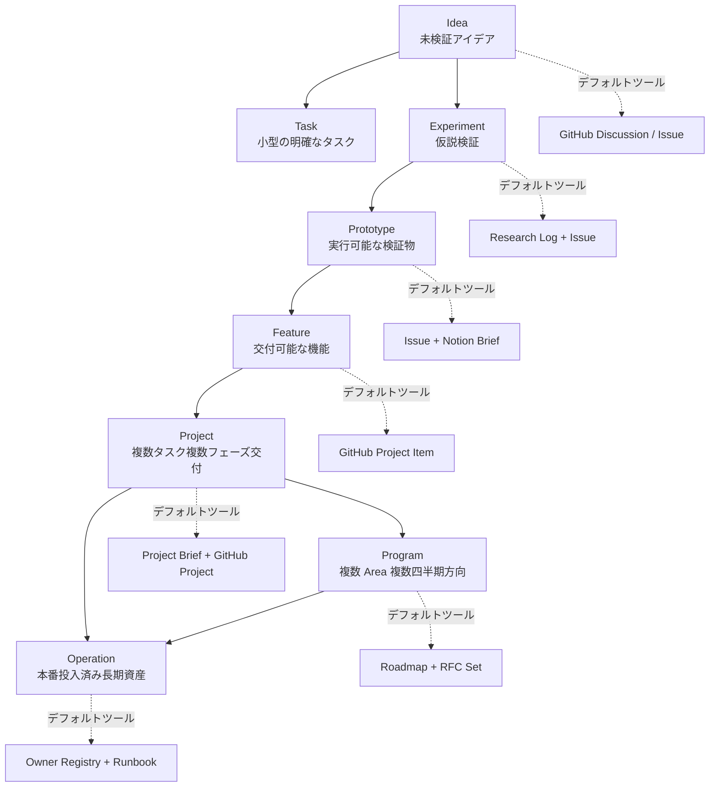
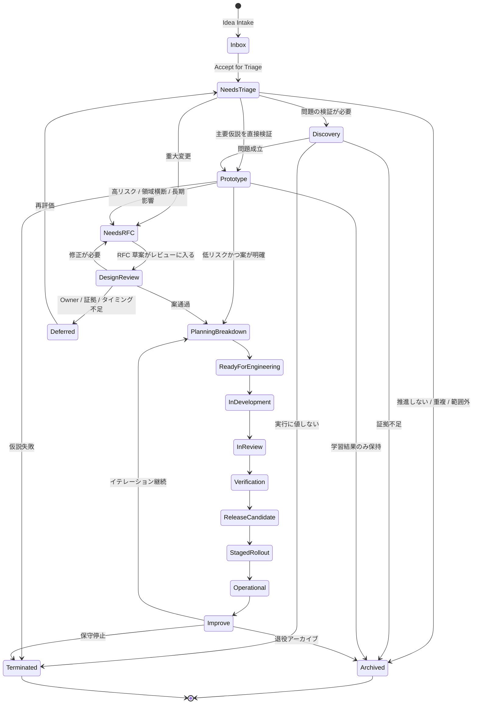
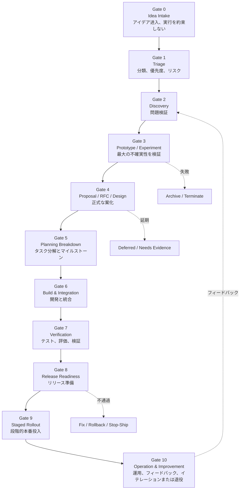
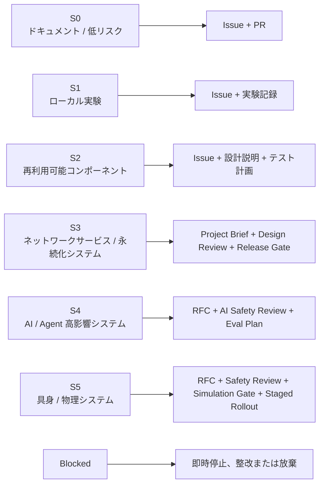
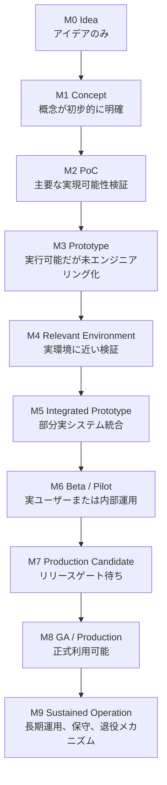

# 協業計画規範

> 本文は、輝夜計画がアイデア、実験、プロトタイプ、または要件から始まり、それが実行に値するかをどう判断するか、どう検証するか、RFC / 設計にどう入るか、エンジニアリングタスクにどう分解するか、テスト、リリース、本番投入、運用、振り返りをどう完了するか、いつ一時停止、アーカイブ、終了するかを定義します。すべてのプロジェクトの **Idea → Prototype → Engineering → Release → Operation** に共通する統一フローです——単なる Roadmap ドキュメントでも、プロジェクト管理ツールの説明でもありません。

本文は `03-RFC-Process.md` の正式意思決定プロセス、`../../01-Foundation/ja/02-Security-Ethics.md` のセキュリティレビュー、`../../02-Governance/ja/01-Organization.md` のロール権限定義に代わるものではありません。本文は計画対象の流れ、ゲート、成熟度、責任帰属のみを定義します。

---

## 1. 目的

本文は、輝夜計画がアイデア、実験、プロトタイプから正式なエンジニアリング化、リリース、運用、アーカイブに至る統一計画フローを定義します。

計画の目的はプロセス負担を作ることではなく、すべての作業に明確な問題、Owner、リスク等級、検証方法、交付基準、後続責任があることを保証することです。目標は二つだけです。本当に実行に値することを着地させ、値しないことを体面を保って撤退させることです。

---

## 2. 計画原則

計画システムを特に拘束する八条：

1. **実装ではなく問題から始める** — エンジニアリング化に入る前に、何の問題を解決するか、誰にサービスするか、なぜ今か、やらないと何の損失があるかを説明する必要があります。輝夜計画では「顧客」は必ずしも商用ユーザーではなく、Agent システム、研究フロー、オープンソースコントリビューター、将来の具身端末、Infra 実行環境、長期記憶システム、開発者とメンテナーである場合もあります。各プロジェクトは Who benefits? What changes after this exists? Why is this better than the current state? Why now? What should not be built? に答えるべきです。
2. **高不確実性を先に検証し、重いエンジニアリングは後** — プロジェクト初期は最大の不確実性を優先検証します。技術的実現可能性、データ取得可能性、モデル能力の十分性、セキュリティ境界の制御可能性、システムが本当に必要か、既存アーキテクチャを破壊しないか、保守コストが許容可能か。完全システムの構築を優先しません。
3. **プロトタイプは本番システムではない** — プロトタイプは学習用です。Owner、テスト、ドキュメント、セキュリティレビュー、運用責任なしに、静かに本番依存になってはなりません。Notebook / demo / script が一時的に他人に渡され、他システムに依存され、誰も変更・削除を恐れる——その腐敗パスはプロトタイプ段階で塞ぐ必要があります。
4. **リスクがプロセス強度を決める** — 低リスク、可逆、小範囲変更は軽量推進；高リスク、リポジトリ横断、不可逆、セキュリティ/プライバシー/具身/長期状態を含む変更はより強いレビューが必要です。`../../01-Foundation/ja/02-Security-Ethics.md` §3 の S0–S5 と Blocked 等級を再利用します。
5. **計画には Owner、実行には DRI が必須** — 各計画対象には Owner（資産または方向の長期責任）が必要です。各アクティブ推進事項には DRI（次のゲートまで推進する責任者）が必要です。DRI のないプロジェクトはアクティブ状態に入れません。Owner のないプロジェクトは長期保守または本番に入れません。
6. **Roadmap はコミットメント管理であり、願望リストではない** — Roadmap に入るプロジェクトは明確な価値、範囲、Owner、リスク等級、目標フェーズ、次回レビュー日時が必要です。未検証アイデアは Roadmap に直接入れず、Idea Backlog または Discovery Queue に置きます。
7. **決定は記録し、状態は可視化する** — プロジェクト状態、リスク、ブロッカー、マイルストーン、Owner、決定根拠は追跡可能である必要があります。GitHub Projects はエンジニアリング計画の事実源です。チャット、会議、Notion は参照できますが、並行の事実を作ってはなりません。
8. **完了はマージではなく、リリースは成功ではない** — プロジェクトは検証、リリース、監視、引き継ぎ、フィードバックループ完了後に初めて真に着地したと言えます。

---

## 3. 作業対象と計画階層



計画対象を階層化しないと、小 Issue と多年プロジェクトが混在します。

| 階層 | 定義 | 例 | デフォルトツール |
| ---- | ---- | -- | ---------------- |
| **Idea** | 未検証アイデア | 「Agent Memory Inspector は必要か？」 | GitHub Discussion / Issue |
| **Task** | 小さく明確なタスク | bug 修正、ドキュメント追加、テスト追加 | GitHub Issue |
| **Experiment** | 仮説検証の短期作業 | 2 種類の memory retrieval 戦略比較 | Research Log + Issue |
| **Prototype** | 実行可能だが未エンジニアリング化の検証物 | Agent sandbox demo | Issue + Notion Brief |
| **Feature** | 交付可能な機能 | 新 API、UI モジュール、評価ツール | GitHub Project Item |
| **Project** | 複数タスク・複数フェーズの交付 | Memory Persistence v1 | Project Brief + GitHub Project |
| **Program** | 複数 Area、複数四半期の方向 | Embodied Runtime Roadmap | Roadmap + RFC set |
| **Operation** | 本番投入済み長期資産 | API サービス、モデルサービス、データパイプライン | Owner Registry + Runbook |

Issue / Project / RFC の境界：小範囲、低リスク、可逆変更 → Issue + PR；複数タスクの調整 → Project；アーキテクチャ、公共契約、長期保守、セキュリティ境界、複数リポジトリへの影響 → RFC；すでに下されたアーキテクチャ選択 → ADR。

---

## 4. ライフサイクル概要



状態フィールド：

| 状態 | 意味 |
| ---- | ---- |
| `Inbox` | 新アイデア、未分類 |
| `Needs Triage` | トリアージ待ち |
| `Discovery` | 問題検証中 |
| `Prototype` | プロトタイプ / 実験中 |
| `Needs RFC` | 正式提案が必要 |
| `Design Review` | 設計レビュー中 |
| `Planning Breakdown` | タスクとマイルストーン分解中 |
| `Ready for Engineering` | 正式開発に入れる |
| `In Development` | 開発中 |
| `In Review` | PR / Design / Safety Review 中 |
| `Verification` | 統合、テスト、評価中 |
| `Release Candidate` | リリース候補 |
| `Staged Rollout` | 段階的または灰度本番投入 |
| `Operational` | 長期運用に入った |
| `Improve` | フィードバックに基づき継続イテレーション |
| `Paused` | 一時停止 |
| `Archived` | アーカイブ |
| `Terminated` | 終了 |

フェーズは重なったり、高確信度でスキップしたりできますが、重要なアウトプットと責任は明確である必要があります。



---

## 5. リスクと成熟度



すべての計画対象には以下を付与する必要があります：

- **Risk**: S0–S5 / Blocked（`../../01-Foundation/ja/02-Security-Ethics.md` §3 と一致）
- **Maturity**: M0–M9（下記参照）
- **Owner**、**DRI**、**Area**、**Next Review**

リスクがプロセス強度を決めます：

| リスク等級 | 計画強度 |
| ---------- | -------- |
| S0 ドキュメント / 低リスク | Issue + PR で十分 |
| S1 ローカル実験 | Issue + 実験記録 |
| S2 再利用可能コンポーネント | Issue + 設計説明 + テスト計画 |
| S3 ネットワークサービス / 永続化システム | Project Brief + Design Review + Release Gate |
| S4 AI / Agent 高影響システム | RFC + AI Safety Review + Eval Plan |
| S5 具身 / 物理システム | RFC + Safety Review + Simulation Gate + Staged Rollout |

### Moonweave Maturity Level



| 等級 | 名称 | 定義 |
| ---- | ---- | ---- |
| **M0** | Idea | アイデアのみ、未検証 |
| **M1** | Concept | 問題と概念が初步的に明確 |
| **M2** | Proof of Concept | 重要な実現可能性を検証済み |
| **M3** | Prototype | 実行可能プロトタイプあり、未エンジニアリング化 |
| **M4** | Relevant Environment | 実環境に近い環境で検証 |
| **M5** | Integrated Prototype | 一部の実システムと統合 |
| **M6** | Beta / Pilot | 実ユーザーまたは内部運用あり |
| **M7** | Production Candidate | 本番要件に近い、リリースゲート待ち |
| **M8** | GA / Production | 正式利用可能、サポートと運用あり |
| **M9** | Sustained Operation | 長期運用、保守・イテレーション・退役メカニズムあり |

---

## 6. Gate 0：Idea Intake

**目標**：アイデアをシステムに入れるが、実行を約束しない。

**入口**：GitHub Discussion；GitHub Issue；飞书 / 微信 / Discord コミュニティ議論；研究ログ；ユーザーフィードバック；インシデント postmortem；RFC 逆分解；Maintainer / Owner 提案；Agent 自動発見のシステムギャップ。

**Idea 最低形式**：

```markdown
# Idea

## Summary
アイデアを一文で説明。

## Problem
現在何の問題があるか？

## Why now
なぜ今検討に値するか？

## Affected area
Agent / Infra / Frontend / Backend / Embodiment / Research / Docs / Security

## Expected value
何が改善される可能性があるか？

## Known risks
セキュリティ、プライバシー、コンプライアンス、AI、具身、保守コストなどのリスク。

## Related links
Issue / PR / RFC / ADR / Research log / external reference
```

**Gate 0 出口**：

| 結果 | 意味 |
| ---- | ---- |
| `Accept for Triage` | トリアージに入る |
| `Needs Clarification` | 情報不足 |
| `Duplicate` | 類似事項あり |
| `Out of Scope` | プロジェクト境界外 |
| `Blocked by Security / IP` | セキュリティまたは出所によるブロック |
| `Archive` | 保持するが推進しない |

---

## 7. Gate 1：Triage

**目標**：アイデアを判断可能な計画対象に変換する。

**Triage で完了必須**：Type、Area、Risk level、Potential Owner、Suggested DRI、Priority、Maturity target、Required process（Issue / Experiment / RFC / ADR / Project）、Next step。

**種別分類**：`bug` / `feature` / `research` / `experiment` / `prototype` / `infra` / `security` / `embodiment` / `docs` / `rfc` / `deprecation` / `release`。

**優先度**——P0/P1/P2 だけでなく、以下の次元を組み合わせます：

| フィールド | 質問 |
| ---------- | ---- |
| Mission Alignment | 長期目標に資するか？ |
| Impact | 成果の影響範囲はどれほどか？ |
| Urgency | 他作業をブロックするか？ |
| Confidence | 証拠は十分か？ |
| Cost | 人的・時間コストはどれほどか？ |
| Risk | セキュリティ、プライバシー、エンジニアリング、具身リスクはどれほどか？ |
| Maintenance Burden | 長期保守コストはどれほどか？ |
| Reversibility | 失敗時にロールバックしやすいか？ |

---

## 8. Gate 2：Discovery / Problem Validation

**目標**：問題が実在し、解決に値し、境界が十分明確であることを確認する。

**Discovery 必須の事項**：新システム；新製品化能力；新公共 API；新 Agent 行動；新モデルサービス；新長期状態または記憶メカニズム；新具身制御能力；リポジトリ横断リファクタ；高保守コストのプラットフォーム化作業。

**Discovery アウトプット**：

```markdown
# Discovery Brief

## Problem Statement
## Users / Stakeholders
## Current State
## Evidence
## Success Metrics
## Non-goals
## Risk Classification (S0–S5)
## Alternatives (少なくとも 2 つ、「やらない」を含む)
## Recommendation (Prototype / RFC / Backlog / Reject / Archive)
```

問題が十分理解されていないうちは、構築に直接入らず、ユーザ問題、目標、重要指標を先に検証します。

---

## 9. Gate 3：Prototype / Experiment

**目標**：最小コストで最大の不確実性を検証する。

**プロトタイプ種別**：

| 種別 | 用途 | 例 |
| ---- | ---- | -- |
| `Research Spike` | 理論または論文手法の検証 | ある memory paper の再現 |
| `Technical Spike` | エンジニアリング実現可能性の検証 | 状態機械永続化案のテスト |
| `UX Prototype` | インタラクションと情報アーキテクチャの検証 | Agent state inspector UI |
| `AI Eval Prototype` | モデル能力と評価の検証 | 長期人格一貫性 benchmark |
| `Embodied Simulation` | 物理制御前提条件の検証 | シミュレーション環境動作境界テスト |
| `Integration Prototype` | 複数システム接続の検証 | Agent ツールチェーン demo |

**プロトタイプに明記必須**：Hypothesis；What is being tested；What is intentionally ignored；Dataset / Asset source；Environment；Success criteria；Failure criteria；Risk level；Owner；Expiration date；Promotion path；Cleanup path。

**プロトタイプ禁止事項**：デフォルトで本番に入ってはならない；資産出所レビューを迂回してはならない；未レビュー個人データを使用してはならない；境界なしで実ユーザー、本番システム、具身端末に接続してはならない；エンジニアリング計画なしに他システムに長期依存されてはならない。

**Gate 3 出口**：

| 結果 | 後続 |
| ---- | ---- |
| `Promote to RFC / Design` | 正式案に入る |
| `Promote to Engineering` | 低リスクかつ案が明確、直接エンジニアリング化可 |
| `Continue Experiment` | 情報不足、期限付きで継続 |
| `Archive` | 学びはあるが推進しない |
| `Terminate` | 仮説失敗、投入停止 |

ML システムの課題はモデル訓練だけでなく、設定、データ収集と検証、テスト、メタデータ、Serving、監視を含む完全システムの構築です。実験は何が有効で無効かも記録し、再現性を保つ必要があります。

---

## 10. Gate 4：Proposal / RFC / Design

**目標**：検証済みの問題と案を、レビュー可能、議論可能、実行可能な正式計画に変換する。

**RFC が必須な場合**——いずれか一つでも該当すれば、RFC または同等の正式提案に入る必要があります：

- リポジトリ横断または Area 横断；
- 公共 API、プロトコル、Schema、状態機械の変更；
- 長期インフラの導入；
- セキュリティ、プライバシー、権限、データ処理境界の変更；
- 高自律 Agent 行動の導入；
- 具身制御、センサー、アクチュエーター、物理リスクの関与；
- 重大依存または技術スタックの導入；
- 容易にロールバックできない移行の発生；
- オープンソースコミュニティまたは外部ユーザーへの長期コミットメント。

通常修正は正式提案不要ですが、重大機能、アーキテクチャ、プロセス変更には公開設計、コミュニティ入力、決定記録が必要です。正式執筆前に公開議論し、大量投入後に方向が不適と判明するのを避けます。詳細プロセスは `03-RFC-Process.md` を参照。

**RFC / Design 最低内容**：Summary；Problem；Goals；Non-goals；Background；Proposed solution；Alternatives；Risks and mitigations；Security / privacy impact；AI / Agent impact；Embodiment impact (if any)；Data and asset provenance；Compatibility and migration；Testing / evaluation plan；Observability plan；Rollout and rollback plan；Owner / DRI；Milestones；Success metrics；Exit criteria。

---

## 11. Gate 5：Planning Breakdown

**目標**：レビュー通過した案を、実行可能、追跡可能、交付可能な作業パッケージに分解する。

**完了必須**：Project Brief 更新済み；RFC / Design 受理または低リスク免除；Owner と DRI 確認済み；タスクを Issues に分解；重要依存を付与；マイルストーン設定；Release strategy 説明；Quality bar 定義；Security / privacy / AI / embodiment reviews スケジュール；ドキュメント、テスト、評価、運用作業を計画に含む。

**エンジニアリング Issue フィールド**：Title；Context；Scope；Acceptance criteria；Out of scope；Risk level；Owner / Assignee；Related RFC / ADR；Dependencies；Test requirement；Documentation requirement；Rollout impact。

**Milestone ルール**——Milestone は日付だけではなく、検証可能なシステム状態を表現する必要があります。

良い例：

```markdown
Memory Persistence v1:
- Agent state can be saved, restored and inspected in local runtime.
- State schema is versioned.
- Migration path from v0 is documented.
- Integration tests cover crash recovery.
```

悪い例：

```markdown
記憶システム第一段階を完了する。
```

---

## 12. Gate 6：Build & Integration

**目標**：エンジニアリング実装を実行し、状態、リスク、範囲変化を継続同期する。

**開発期ルール**：すべての実装作業は Issue にリンク；すべての PR は Issue / RFC / ADR にリンク；範囲変化は Project Brief または RFC に書き戻し；新リスクは即時付与；約定時間超過のブロックはエスカレーション；PR 議論で RFC 級の方向争いを代替してはならない。

**状態更新要件**——アクティブプロジェクトは少なくとも週次更新：Status；Progress；Blockers；Risks；Scope changes；Next step；Need decision。2 計画サイクル更新なしは `Stale / Needs DRI Review` を自動付与。

---

## 13. Gate 7：Verification

**目標**：システムが「動く」だけでなく、交付基準を満たすことを確認する。

| 次元 | 答える必要があること |
| ---- | -------------------- |
| Functional | 要件を実装したか？ |
| Integration | 関連システムと正しく相互作用するか？ |
| Compatibility | API / Schema / データを破壊しないか？ |
| Security | セキュリティチェックを通過したか？ |
| Privacy | データと記憶ルールに適合するか？ |
| AI Evaluation | 能力、安全、安定性評価を通過したか？ |
| Embodiment | シミュレーション、境界、E-Stop、HITL 要件を通過したか？ |
| Observability | ログ、指標、Tracing、アラートがあるか？ |
| Documentation | ユーザー、開発者、メンテナードキュメントは更新されたか？ |
| Operations | runbook、rollback、Owner があるか？ |

AI プロジェクトの検証は benchmark だけを見てはならず、リスク、コンテキスト、測定、ガバナンスもカバーします（NIST AI RMF の Govern / Map / Measure / Manage に整合）。

---

## 14. Gate 8：Release Readiness

**目標**：システムがリリース、本番投入、公開、または長期運用に入れることを確認する。

**Release Readiness Checklist**：

```markdown
## Ownership
- [ ] Primary Owner 確認済み
- [ ] Backup Owner 確認済み
- [ ] DRI 確認済み
- [ ] Escalation path 確認済み

## Engineering
- [ ] すべてのブロッキング Issue クローズ
- [ ] 必要テスト通過
- [ ] CI 通過
- [ ] ドキュメント更新
- [ ] 変更ログ更新
- [ ] バージョン戦略明確

## Security & Privacy
- [ ] 依存スキャン通過
- [ ] Secret スキャン通過
- [ ] License / provenance チェック通過
- [ ] データ処理説明完了
- [ ] 権限境界チェック済み

## AI / Agent
- [ ] Tool permissions レビュー済み
- [ ] Prompt injection リスク評価済み
- [ ] 出力検証定義済み
- [ ] 長期記憶書き込みルール明確
- [ ] Eval report アーカイブ済み

## Embodiment, if applicable
- [ ] シミュレーション検証通過
- [ ] 空間 / 動作 / 力制限定義済み
- [ ] HITL 有効
- [ ] E-Stop 検証済み
- [ ] センサーとアクチュエータログ監査可能

## Operations
- [ ] Monitoring 有効
- [ ] Alerting 有効
- [ ] Runbook 完了
- [ ] Rollback plan 完了
- [ ] Backup / restore 検証済み
- [ ] Incident channel 確認済み

## Launch
- [ ] Release notes 準備済み
- [ ] Feature flag / staged rollout 設定済み
- [ ] ユーザーまたはコミュニティ公告準備済み
- [ ] Post-launch review スケジュール済み
```

信頼性と運用要件は設計と構築の早い段階に入るべきです——PRR の遅い介入は高い手戻りコストをもたらします。Stop-Ship 条件（`../../01-Foundation/ja/02-Security-Ethics.md` §7 参照）発動時はリリースを即時凍結し、誰も進捗圧力で越えてはなりません。

---

## 15. Gate 9：Staged Rollout

**目標**：リリースリスクを下げ、影響面を段階的に拡大する。

| フェーズ | 説明 | 要件 |
| -------- | ---- | ---- |
| `Internal` | コア開発者のみ | 迅速フィードバック |
| `Dogfood` | プロジェクト内部の実使用 | 問題と体験を記録 |
| `Alpha` | 外部試用可だが不安定 | 制限とリスクを明示 |
| `Beta` | 機能はほぼ安定 | 退出基準あり |
| `Release Candidate` | 正式リリース候補 | ブロッカーのみ修正 |
| `GA` | 正式利用可能 | Owner、サポート、ドキュメント、運用完備 |
| `Deprecated` | 非推奨 | 移行パスとタイムライン |
| `Archived` | 保守停止 | 状態明確 |

実験には仮説、成功/失敗基準、短周期、結果報告が必要です。Beta には明確な退出基準が必要です。公開利用可能な能力は安定前にセキュリティ、可観測性、災害復旧、SLA、スケーラビリティ等の準備を完了すべきです。

---

## 16. Gate 10：Operation & Improvement

**目標**：リリース後放置ではなく、長期運用に入る。

**Operational Acceptance**——正式運用状態に入る前に必須：Owner Registry 更新；Runbook アーカイブ；Monitoring dashboard リンク；Incident process 明確；Known issues 記録；Post-launch review スケジュール；Follow-up backlog 作成；成功指標と観察ウィンドウ定義。

**Post-launch Review**：

```markdown
# Post-launch Review

## What shipped
## Expected outcome
## Actual outcome
## Metrics
## User / maintainer feedback
## Incidents or regressions
## What worked
## What did not work
## Follow-up actions
## Keep / iterate / rollback / deprecate
```

リリース後は利用状況、指標、定性フィードバックを監視し、後続 Issue を作成します。

---

## 17. プロジェクト分類と最小プロセス

プロジェクト種別ごとに完全同一プロセスを通すべきではありません。

### 17.1 ドキュメント / 低リスク変更

```text
Issue / PR → Review → Merge
```

要件：関連 Owner Review；原則、ガバナンス、公共コミットメントを変更しない；セキュリティ、プライバシー、法務リスクを含まない。

### 17.2 通常エンジニアリング機能

```text
Issue → Triage → Design note → Task breakdown → Implementation → Verification → Release notes
```

適用：小型 API；UI 機能；ツール改善；内部サービス変更；低リスク可逆機能。

### 17.3 研究 / 実験

```text
Research question → Hypothesis → Experiment plan → Run → Research log → Decision: archive / iterate / promote
```

要件：仮説明確；データと設定記録；乱数シードと環境記録；結果再確認可能；結論を誇大にしない；自動で本番に入らない。

### 17.4 AI / Agent 能力

```text
Problem validation → Prototype → Eval design → Safety review → RFC / Design → Implementation → Red team / benchmark / regression eval → Staged rollout → Monitoring
```

要件：能力境界；失敗モード；ツール権限；記憶書き込みルール；Prompt injection 防御；出力検証；Eval 報告；ロールバックメカニズム。

### 17.5 具身 / 物理システム

```text
Concept → Hazard analysis → Simulation → Low-risk prototype → Controlled physical test → HITL operation → Staged autonomy → Operational acceptance
```

要件：シミュレーション先行；動作境界；空間境界；速度 / 力 / ツール制限；E-Stop；HITL；ログ監査；セキュリティ再レビュー；厳格リリースゲート。

---

## 18. ツールシステム：GitHub、Notion、飞书、Agent

### 18.1 GitHub Projects

組織レベルの `Moonweave Roadmap` と複数 Area Project（`Moonweave Agent Systems` / `Moonweave AI Infra` / `Moonweave Embodiment` / `Moonweave Frontend & Design` / `Moonweave Research` / `Moonweave Security`）をエンジニアリング計画の事実源として確立し、状態が複数ツールに散在するのを避けます。

**推奨フィールド**：

| フィールド | 型 | 説明 |
| ---------- | -- | ---- |
| `Type` | Single select | bug / feature / research / experiment / RFC / release |
| `Area` | Single select | Agent / Infra / Frontend / Backend / Embodiment / Research |
| `Lifecycle` | Single select | Inbox / Discovery / Prototype / Build / Verification / Launch |
| `Risk` | Single select | S0–S5 / Blocked |
| `Maturity` | Single select | M0–M9 |
| `Priority` | Single select | P0–P3 |
| `Owner` | User / text | 長期責任者 |
| `DRI` | User / text | 現フェーズ推進者 |
| `Target Milestone` | Milestone | 目標マイルストーン |
| `Confidence` | Single select | Low / Medium / High |
| `Blocked by` | Text / linked issue | ブロッカー |
| `Canonical Doc` | URL | RFC / ADR / Notion / Research Log |
| `Next Review` | Date | 次回レビュー |
| `Launch Stage` | Single select | internal / alpha / beta / GA / deprecated |
| `Last Update` | Date | 最終状態更新日時 |

**推奨ビュー**：`Roadmap`；`Current Iteration`；`RFC Pipeline`；`Release Readiness`；`Security / Risk`；`Stale / Blocked`；`By Area`；`By Owner`。

### 18.2 Notion

適する用途：Roadmap narrative；Project Brief；Owner Registry；Planning meeting notes；Quarterly review；Research planning；Onboarding；Project index；Runbook index。エンジニアリングタスクの事実源は GitHub に戻します。

### 18.3 飞书

適する用途：Planning meeting；Calendar cadence；Milestone / RFC / Release review reminder；Blocking issue escalation；Agent digest プッシュ。唯一の Roadmap、唯一のタスクシステム、唯一の決定記録、唯一のプロジェクト状態としては不適。

### 18.4 Planning Agent

**Kaguya Planner** — 週次 Roadmap digest を生成；Owner / DRI 欠如をマーク；リスク等級欠如をマーク；stale issue をマーク；overdue milestone をマーク；blocked items を集約；review date 期限間近をリマインド。

**Kaguya Gatekeeper** — Gate 進入条件をチェック；readiness checklist を生成；RFC / ADR / Issue リンク欠如をチェック；release readiness のテスト、ドキュメント、Owner、rollback 欠如をチェック。**提示のみ——自動承認不可**。

**Kaguya Chronicle** — planning meeting の action items を草案化；project status summary を生成；決定を Issue / RFC / ADR にリンク；人間 DRI 確認待ちの更新草案を生成。

硬いルール：

> Agent はリマインド、要約、チェック、草案作成ができる。Agent は DRI、Owner、Maintainer、Council の計画コミットメントを代替できない。

---

## 19. Planning Cadence

| リズム | 内容 | 成果物 |
| ------ | ---- | ------ |
| Continuous | Idea intake | Issue / Discussion |
| Weekly / Biweekly | Triage | Project 状態更新 |
| Biweekly | Engineering planning | 現イテレーション計画 |
| Monthly | Roadmap review | Milestone 調整 |
| Per RFC window | RFC review | RFC 決定 |
| Per release | Release readiness | Release checklist |
| Post-launch | リリース後振り返り | Post-launch review |
| Quarterly | Portfolio review | Roadmap / Owner / Risk review |

計画会議は `01-Communication.md` 規範に従う必要があります。アジェンダなしでは開かない；DRI なしでは開かない；期待成果物なしでは開かない；非同期解決可能なものはデフォルトで会議を開かない。

---

## 20. Definition of Ready / Done

### 20.1 Ready for Discovery

Problem が初步的に明確；関連背景または証拠あり；潜在 Owner あり；明らかに out of scope ではない；Blocked セキュリティ項目未発動。

### 20.2 Ready for Prototype

仮説明確；成功 / 失敗基準明確；実験境界明確；データと資産出所許容可能；有効期限あり；Owner / DRI あり。

### 20.3 Ready for Engineering

問題検証済み；案が Issue / Design / RFC レビュー通過；Owner / DRI 明確；タスク分解可能；リスク等級明確；品質基準明確；テスト、ドキュメント、リリース、ロールバック戦略定義済み；高リスク事項がセキュリティ / AI / 具身事前レビュー通過。

### 20.4 Ready for Release

機能完了；テスト通過；ドキュメント更新；セキュリティチェック通過；監視とアラート準備完了；rollback plan 完了；release notes 完了；Owner と support path 明確；必要な staged rollout 計画完了。

### 20.5 Done

以下をすべて満たした場合にのみ Done とします：

- 目標機能または成果が交付された；
- 受け入れ基準を通過した；
- ドキュメントと変更記録が完了した；
- 監視、アラート、runbook または研究ログが完了した；
- 関連 Issue / PR / RFC / ADR が相互リンクされた；
- フィードバックと後続項目が記録された；
- Owner が長期保守責任を引き受けた、またはプロジェクトが明示的にアーカイブされた。

---

## 21. 一時停止、アーカイブ、終了

計画ドキュメントは「やらない」を許容しなければなりません。そうでなければ Roadmap はゴミ山になります。

### Pause

適用：依存未完了；リソース一時不足；リスク再評価必要；外部環境変化；RFC 結果待ち。要件：一時停止理由を説明；再開条件を記録；レビュー日を設定；Owner を保持。

### Archive

適用：実験完了だが推進しない；ドキュメントまたはコードに歴史的価値；代替案に置換；プロジェクト完了だが活発開発なし。要件：状態をマーク；アーカイブ理由を説明；代替案をリンク；Roadmap コミットメントを整理。

### Terminate

適用：仮説失敗；リスク許容不可；保守コスト過大；使命に不再適合；資産出所またはコンプライアンス問題解決不可；Owner 見つからず；技術路線が明示的に廃止。要件：終了理由を記録；学んだ内容を記録；権限、リソース、ブランチ、デプロイ、ドキュメントを整理；必要に応じ移行または非推奨説明を公開。

---

## 22. アンチパターン

以下は計画アンチパターンと見なします：

1. チャットのインスピレーションから直接長期エンジニアリングへ；
2. 有効期限のないプロトタイプ；
3. Owner なしで本番依存される Demo；
4. 願望のみでリソースと責任のない Roadmap；
5. PR がアーキテクチャ争いを担う；
6. 日付のみで検証可能システム状態のないマイルストーン；
7. セキュリティ、プライバシー、AI、具身リスクをリリース直前までレビュー；
8. ロールバック計画なしの本番投入；
9. プロジェクト状態が飞书グループチャットにのみ存在；
10. すべてのアイデアが Roadmap に入る；
11. 長期未更新だが誰もアーカイブしない；
12. 失敗実験が記録されず、同じ轍を踏む。

---

## 23. 改訂

本文は公開 RFC による改訂のみ可能です。改訂には計画規模の変化、古い衝突の解決不能、あるルールが害を及ぼしたことのいずれかを明記する必要があります。`../../01-Foundation/ja/01-Principles.md` の「衝突と改訂」と一致：本文が RFC プロセス、セキュリティレビュー、組織権限と衝突する場合、対応する専門ドキュメントが優先します。法務、セキュリティ倫理の最低限の基準と衝突する場合、その基準が優先します。旧版はバージョン管理に保存され、いつでも参照できます。

本文が確立する連鎖——Idea → Triage → Discovery → Prototype → RFC / Design → Engineering Breakdown → Build → Verification → Release → Operation → Improve / Retire——が守られるとき、輝夜計画は二つのよくある失敗を避けられます：**アイデアは多いが何も真に着地しない、または Demo は多いが長期保守できるものがない**。
