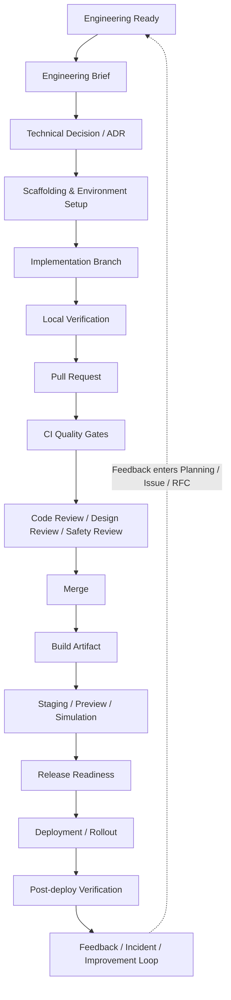
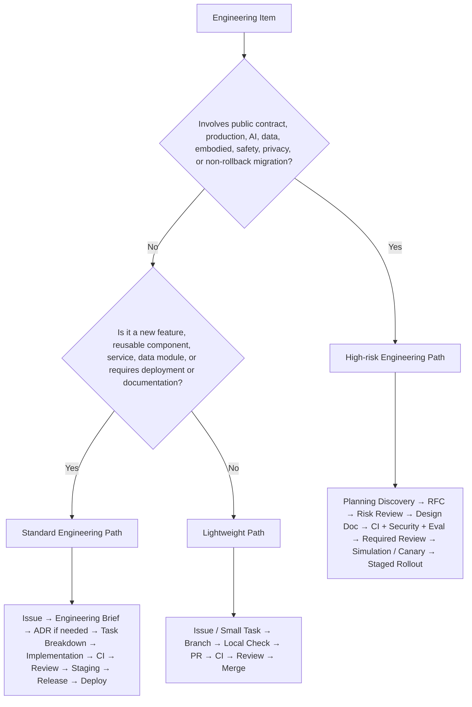
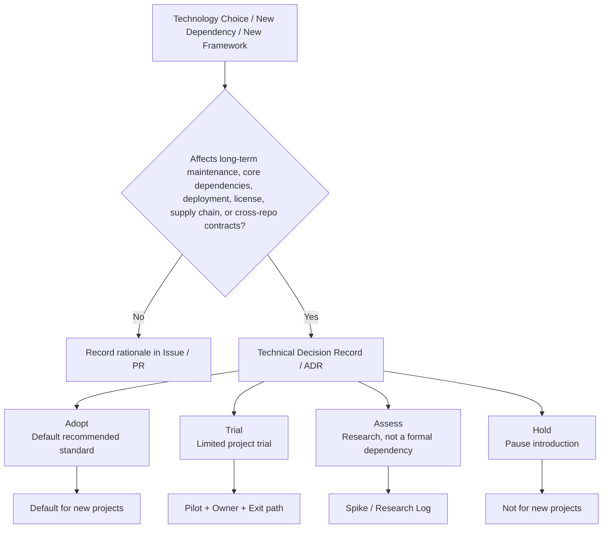
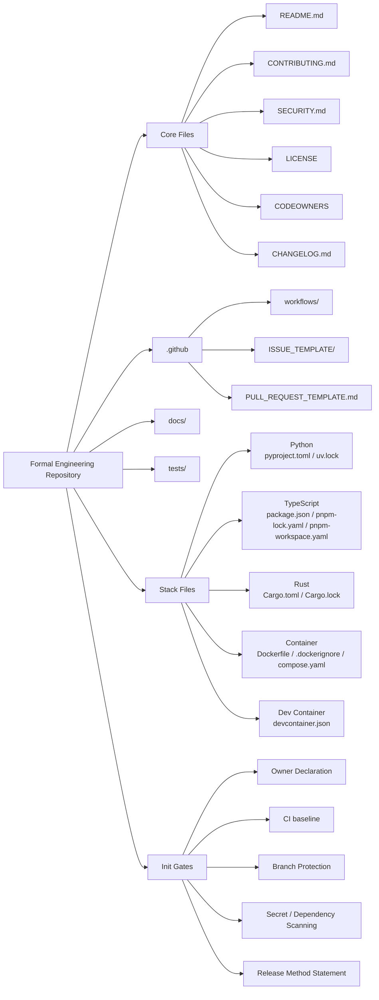
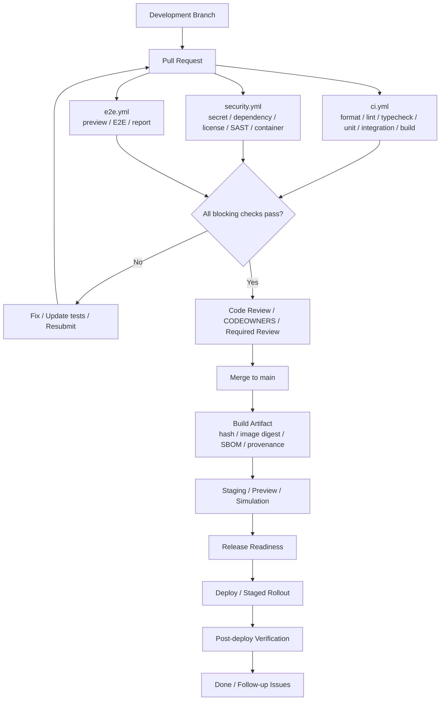

# Engineering Workflow

> This document defines the unified workflow for engineering work in the Kaguya Project—from design through delivery—for software, AI Agents, frontend and backend systems, infrastructure, data pipelines, model services, toolchains, and embodied systems. It focuses on "how to complete work in an engineering manner," including technical design confirmation, implementation preparation, development branches, local verification, Pull Request, Code Review, CI/CD, build, deployment, release verification, issue feedback, and the fix loop.

This document does not replace:

- `../../03-Collaboration/en/02-Planning.md`: decides whether to do something, when, and how to break it down;
- `../../03-Collaboration/en/03-RFC-Process.md`: handles major design and cross-repository decisions;
- `02-Quality-Assurance.md`: defines testing and quality standard details;
- `../../01-Foundation/en/02-Security-Ethics.md`: defines security, privacy, AI, and embodied risk boundaries;
- `04-Engineering/standards/*`: defines specific technical standards for frontend, backend, API, AI systems, and more.

---

## 1. Purpose and Scope

This document defines the unified engineering process for the Kaguya Project—from engineering readiness, design, technology selection, implementation, verification, Review, CI/CD, release, deployment, monitoring, to the feedback loop.

The goal of the engineering workflow is not to create approval overhead, but to ensure that all formal engineering changes entering the system remain traceable, reproducible, reviewable, verifiable, and rollback-capable. GitHub Flow emphasizes collaboration through short branches and Pull Requests; Google defines the primary goal of code review as continuously improving overall codebase health; NIST SSDF emphasizes embedding secure development practices into the SDLC; Google SRE manages launch risk through release engineering, canary, rollback, and launch checklists. The Kaguya Project engineering protocol builds on this foundation with additional requirements for AI Agent behavior, long-term memory, model services, and embodied safety.

Applies to all code, configuration, data, models, infrastructure, documentation, and toolchain changes in all formal Kaguya Project repositories.

---

## 2. Core Principles

Eight principles, specifically governing engineering execution:

1. **Traceable** — Every change must be traceable to Issue / RFC / ADR, implementer, reviewer, build process, and deployment records.
2. **Reproducible** — Build, test, and deployment must not depend on implicit local configuration or manual steps; lockfiles, containers, and CI environments must be rebuildable.
3. **Reviewable** — All formal changes must go through structured Pull Request and Code Review; direct push to protected branches is not allowed.
4. **Verifiable** — Each stage should have automated or executable verification; CI is not "good enough to run" but an engineering fact verification system.
5. **Rollback-capable** — Changes deployed to production must have a rollback path; changes that cannot be easily rolled back require stronger release review.
6. **Maintainable** — Code, documentation, monitoring, alerts, and Owner must be delivered together; systems without an Owner are treated as unmaintained liabilities.
7. **Risk-tiered** — Low risk proceeds lightly; high risk receives heavy review; do not block all small changes with the heaviest process, nor let critical changes through with the lightest.
8. **Merge is not done; deployment is not success** — True completion requires release verification, monitoring, feedback, and Owner acceptance.

---

## 3. Engineering Process Overview



Not every change needs to pass through all nodes. Process intensity is determined by workflow tiering.

---

## 4. Workflow Tiering



Not all items follow the same heavy process. Three paths cover everything from documentation fixes to production infrastructure.

### 4.1 Lightweight Path

Applicable to:

- Documentation fixes;
- Small bugs;
- Localized refactoring;
- Single-repository internal implementation;
- No public API / Schema / state machine impact;
- No security, privacy, AI, or embodied risk.

Process:

```text
Issue / Small Task
  ↓
Branch
  ↓
Local Check
  ↓
PR
  ↓
CI
  ↓
Review
  ↓
Merge
```

Requirements:

- Must have a PR;
- Must pass CI;
- At least one Reviewer;
- Direct push to main is not allowed;
- If affecting an Owner scope, must request corresponding Owner / CODEOWNER Review.

### 4.2 Standard Engineering Path

Applicable to:

- New features;
- Reusable components;
- Frontend-backend collaborative features;
- Internal services;
- Data processing modules;
- Toolchain changes;
- Changes requiring documentation, testing, deployment, or migration.

Process:

```text
Issue
  ↓
Engineering Brief
  ↓
Technical Decision / ADR if needed
  ↓
Task Breakdown
  ↓
Implementation
  ↓
Local + CI Verification
  ↓
PR Review
  ↓
Staging / Preview
  ↓
Release Readiness
  ↓
Deploy
  ↓
Post-deploy Review
```

Requirements:

- Must have Owner and DRI;
- Must have acceptance criteria;
- Must describe test plan;
- Must describe documentation impact;
- If introducing new dependencies or technologies, should have selection records;
- If affecting running systems, should have deployment, rollback, and monitoring plans.

### 4.3 High-risk Engineering Path

Applicable to:

- Public API / protocol / Schema / state machine;
- Long-term infrastructure;
- Production services;
- AI Agent tool invocation;
- Long-term memory writes;
- Model services;
- User data;
- Security, privacy, compliance;
- Embodied terminals, sensors, actuators;
- Migrations that are hard to roll back.

Process:

```text
Planning Discovery
  ↓
RFC
  ↓
Risk Review
  ↓
Engineering Brief
  ↓
ADR / Design Doc
  ↓
Implementation Plan
  ↓
Development
  ↓
CI + Security + Evaluation Gates
  ↓
Required Reviews
  ↓
Staging / Simulation / Canary
  ↓
Release Readiness Sign-off
  ↓
Staged Rollout
  ↓
Post-release Monitoring
  ↓
Postmortem / Follow-up
```

Requirements:

- Must go through RFC or explicit exemption;
- Must complete security / privacy / AI / embodied specialized review;
- Must have Release Readiness Checklist;
- Must have rollback, degradation, or Kill Switch;
- Must have Owner, Backup Owner, and incident escalation path.

Google SRE defines canary release as: first expose a small portion of real traffic to the candidate version and compare against a control group to reduce the blast radius of bad changes. Releases in the Kaguya Project involving Agent behavior, model services, data pipelines, or embodied terminals must follow this pattern.

---

## 5. Engineering Ready: Conditions Before Entering Engineering

Items output from `../../03-Collaboration/en/02-Planning.md` cannot go directly into development. The entry gates defined by the engineering workflow are as follows.

### 5.1 Ready for Engineering

An item may enter formal engineering development only when all of the following are satisfied:

- Problem is clearly defined;
- Scope and Non-goals are explicit;
- Owner and DRI are confirmed;
- Risk level is labeled (reuse S0–S5 and Blocked from `../../01-Foundation/en/02-Security-Ethics.md` §3);
- Related Issue / RFC / ADR are linked;
- Acceptance criteria are defined;
- Technical dependencies are identified;
- Test strategy is defined;
- Documentation impact is identified;
- Security, privacy, AI, and embodied risks are pre-screened;
- No Blocked-level provenance, compliance, or security issues exist.

### 5.2 Conditions That Do Not Allow Entry into Engineering

The following items must not enter formal engineering development:

- Only a one-line idea with no problem definition;
- No Owner;
- No acceptance criteria;
- Dependence on code, data, models, or assets of unknown provenance;
- Involving production, user data, Agent autonomy, or embodied actions without risk tiering;
- Architectural changes bypassing RFC;
- Prototypes required to connect directly to production.

---

## 6. Engineering Brief

For standard and above engineering changes, write a lightweight Engineering Brief first. It is shorter than an RFC and more specific than an Issue. Design logic must precede code structure: before writing code, at minimum clarify Domain Concepts → State → Invariants → Interfaces → Failure Modes → Implementation.

Template:

```markdown
# Engineering Brief

## Summary
One sentence describing what will be done.

## Context
What is the current system state? What are the related Issue / RFC / ADR?

## Problem
What is the specific engineering problem?

## Goals
What this effort aims to achieve.

## Non-goals
What this effort will not do.

## Domain Model
What core concepts, states, interfaces, and data entities are involved?

## Invariants
What conditions must always hold?

## Proposed Approach
Implementation path.

## Alternatives
At minimum explain "do nothing" and one alternative.

## Technical Decisions
Choices for language, framework, storage, protocol, dependencies, containers, deployment, etc.

## Risks
Security, privacy, AI, embodied, compatibility, performance, maintenance risks.

## Testing Plan
Unit, integration, contract, E2E, evaluation, regression tests.

## Rollout / Rollback
How to release and how to roll back.

## Observability
Logging, metrics, Tracing, alerts.

## Owner / DRI
Long-term Owner and current driver.
```

---

## 7. Technology Selection Process



The Kaguya Project spans Python, TypeScript, Rust, containers, data, models, frontend and backend, and Agent Infra; technology stack management must follow a structured approach.

### 7.1 Selection Tiering

Uses a four-level technology radar, aligned with Thoughtworks Technology Radar Adopt / Trial / Assess / Hold tiers:

| Tier | Meaning | Usage Rules |
|------|---------|-------------|
| **Adopt** | Organization-recommended standard | Default for new projects |
| **Trial** | Allowed in limited projects | Must have Owner and exit path |
| **Assess** | Research only, not for formal dependencies | Only for experiments or Spikes |
| **Hold** | Pause introduction | New projects must not use |

### 7.2 When a Technology Selection Record Is Required

The following situations require a Technical Decision or ADR:

- Introducing a new language;
- Introducing a new frontend framework;
- Introducing a new backend framework;
- Introducing a new database, vector store, message queue, or cache;
- Introducing a new model framework, Agent framework, or inference service;
- Introducing a new deployment platform, container runtime, or cloud service;
- Replacing an existing core dependency;
- Introducing tools with high long-term maintenance cost;
- Introducing dependencies with unclear license, compliance, or supply chain risk.

### 7.3 Technology Selection Must Answer

```markdown
Technology:
Category:
Adoption level: Adopt / Trial / Assess / Hold
Problem solved:
Alternatives considered:
Why now:
Expected lifetime:
Owner:
Operational burden:
Security / license risk:
Community health:
Migration cost:
Exit strategy:
Decision:
```

### 7.4 Default Technology Baseline

The following is the initial engineering baseline for the Kaguya Project; finer standards go in `standards/`:

| Domain | Default Baseline |
|--------|------------------|
| Source control | GitHub |
| Planning / PR / CI | GitHub Issues / PR / Projects / Actions |
| Python | `pyproject.toml` + `uv` + `uv.lock` |
| TypeScript / Frontend | `pnpm` workspace + `pnpm-lock.yaml` |
| Rust | Cargo |
| Container | OCI-compatible image + Dockerfile |
| CI/CD | GitHub Actions |
| Code ownership | CODEOWNERS |
| Versioning | SemVer where public API exists |
| Commit convention | Conventional Commits |
| Security scan | Secret scanning, dependency scan, code scan |
| Supply chain | SBOM / provenance for release artifacts |
| E2E web tests | Playwright or equivalent |
| Python tests | pytest or equivalent |
| Data / ML pipeline | dataset manifest, validation report, model/eval artifact |

---

## 8. Repository and Engineering Scaffolding



Every formal engineering repository should have a unified baseline.

### 8.1 Required Files

```text
README.md
CONTRIBUTING.md
SECURITY.md
LICENSE
CODEOWNERS
CHANGELOG.md
.github/
  workflows/
  ISSUE_TEMPLATE/
  PULL_REQUEST_TEMPLATE.md
docs/
tests/
```

Add by technology stack:

```text
pyproject.toml          # Python
uv.lock

package.json            # TypeScript / Frontend
pnpm-lock.yaml
pnpm-workspace.yaml

Cargo.toml              # Rust
Cargo.lock

Dockerfile              # Container
.dockerignore
compose.yaml

devcontainer.json       # Dev Container
```

### 8.2 Repository Initialization Gates

After a formal repository is created, the following must be completed:

- Owner declaration;
- README complete;
- License explicit;
- SECURITY.md complete;
- CODEOWNERS complete;
- CI baseline complete;
- Branch protection enabled;
- Secret scanning / dependency scanning enabled;
- Issue / PR templates complete;
- Release method documented.

OpenSSF Scorecard can automatically check repository security heuristic metrics; formal Kaguya Project repositories should use Scorecard as a security baseline reference.

---

## 9. Development Environment and Reproducibility

### 9.1 Local Development Environment

All formal repositories must provide a reproducible local development entry point. Minimum requirements:

- One command to install dependencies;
- One command to run tests;
- One command to start local services;
- Locked language runtime and dependency versions;
- Explicit environment variable template;
- No dependence on implicit configuration on personal machines.

Standard commands:

```text
Python:
  uv sync
  uv run pytest
  uv run <service>

TypeScript:
  pnpm install --frozen-lockfile
  pnpm test
  pnpm dev

Rust:
  cargo build
  cargo test
  cargo fmt --check
  cargo clippy
```

### 9.2 Dev Container

For cross-language, complex dependencies, or embodied / simulation environments, provide a Dev Container or equivalent containerized development environment.

Use Dev Container when:

- Dependencies include GPU, simulators, ROS, system libraries, or complex native dependencies;
- Local environment setup cost is high;
- New hire onboarding cost is high;
- CI and local environments are often inconsistent;
- Isolated experimental dependencies are needed.

### 9.3 Environment Variables

Repositories may commit `.env.example`; real `.env` must not be committed. All secrets must be injected through controlled secret manager or GitHub Actions secrets / environment secrets. GitHub secret scanning scans Git history for hardcoded credentials; GitHub environments can set manual approval, wait timers, and branch restrictions for deployment jobs.

---

## 10. Branch, Commit, and PR Workflow

### 10.1 Branch Model

Uses GitHub Flow, not heavy Git Flow:

```text
main
 ├── feat/<short-name>
 ├── fix/<short-name>
 ├── docs/<short-name>
 ├── refactor/<short-name>
 ├── experiment/<short-name>
 └── release/<version>   # Only when a stable release branch is needed
```

### 10.2 main Branch Rules

main must always remain buildable, testable, and releasable.

Prohibited:

- Direct push to main;
- Force push to main;
- Merge skipping CI;
- Merge without Review;
- Unauthorized modification of release artifacts.

Branch protection must at minimum require:

- PR Review;
- Required status checks passing;
- CODEOWNER Review;
- Conversations resolved;
- Linear history or squash merge;
- Signed commits / verified commits (if project requires);
- Force push not allowed;
- Protected branch deletion not allowed.

### 10.3 Commit Convention

Uses Conventional Commits, aligned with SemVer feature, fix, and breaking change expression:

```text
<type>(<scope>): <description>
```

Common types:

| type | Meaning |
|------|---------|
| `feat` | New feature |
| `fix` | Bug fix |
| `docs` | Documentation |
| `refactor` | Refactoring |
| `test` | Tests |
| `perf` | Performance |
| `ci` | CI/CD |
| `chore` | Build or auxiliary tools |
| `revert` | Revert |

Examples:

```text
feat(agent): add memory retrieval state transition
fix(runtime): prevent scheduler race condition
docs(api): clarify error response schema
refactor(frontend): split agent inspector panel
test(eval): add regression cases for tool-call failure
```

---

## 11. Implementation Phase Work Rules

### 11.1 Small Commits

Changes should be as small, focused, and reviewable as possible. One PR solves one clear problem.

Recommended PR size:

| Type | Recommendation |
|------|----------------|
| Documentation / typo | Small PR |
| Bug fix | Small PR with reproduction test |
| New feature | Can be split into multiple PRs |
| Refactoring | Separated from behavior changes |
| Migration | Phased PRs |
| Large change | RFC / ADR first, then phased implementation |

### 11.2 Pre-implementation Checks

Before starting to code, developers should confirm:

- Whether an Issue exists;
- Whether RFC / ADR is needed;
- Whether Owner is known;
- Whether acceptance criteria are known;
- Whether testing approach is known;
- Whether public contracts will be affected;
- Whether data, models, state, permissions, or deployment will be affected;
- Whether frontend/backend / API / Schema sync is needed;
- Whether documentation updates are needed.

### 11.3 Pre-commit Local Checks

Before submitting a PR, the author must complete minimum local checks:

- formatter;
- linter;
- type check;
- unit tests;
- affected integration tests;
- dependency lockfile check;
- secret scan if available;
- generated files up to date.

Standard commands:

```text
Python:
  uv run ruff format --check .
  uv run ruff check .
  uv run mypy .
  uv run pytest

TypeScript:
  pnpm format:check
  pnpm lint
  pnpm typecheck
  pnpm test

Rust:
  cargo fmt --check
  cargo clippy --all-targets --all-features
  cargo test
```

---

## 12. Pull Request Standards

### 12.1 PR Must Include

```markdown
## Summary
What was done.

## Motivation
Why it was done.

## Changes
Main change points.

## Test Plan
How to verify.

## Risk
Risks and rollback approach.

## Compatibility
Whether API / Schema / data / state is affected.

## Security / Privacy
Whether permissions, user data, secrets, dependencies, models, or asset provenance are involved.

## AI / Agent Impact
Whether Agent behavior, tool invocation, memory, RAG, or evaluation is affected.

## Deployment
Whether deployment, migration, feature flag, or configuration changes are needed.

## Links
Issue / RFC / ADR / Design Doc / Research Log.
```

### 12.2 What PR Should Not Carry

PR should not be used for first-time discussion of major direction. The following must go to Issue / RFC / ADR first:

- Whether to adopt new architecture;
- Whether to change public API;
- Whether to introduce new services;
- Whether to rewrite the system;
- Whether to change security boundaries;
- Whether to grant Agent new permissions;
- Whether to have embodied systems perform new actions.

### 12.3 Draft PR

Draft PR can be used to expose implementation direction, CI issues, and design risks early. Draft PR must not be merged and must not be treated as formal Review completion.

### 12.4 PR Ready Checklist

```markdown
- [ ] Linked issue / RFC / ADR
- [ ] Scope is clear
- [ ] Tests added or updated
- [ ] Docs updated
- [ ] CI passes
- [ ] No secret / credential
- [ ] No unexplained dependency
- [ ] No public contract change without review
- [ ] Rollback / migration considered
- [ ] Owner / CODEOWNER requested
```

---

## 13. Code Review Process

### 13.1 Review Goals

> The goal of Code Review is not to find perfect code, but to ensure every normal change does not reduce overall system health.

Consistent with Google Code Review standards: Review should tend toward approval when a CL clearly improves overall codebase health, even if it is not perfect.

### 13.2 Review Dimensions

Reviewers should at minimum check:

- Correctness
- Design fit
- Maintainability
- Testability
- Security
- Privacy
- Performance
- Compatibility
- Observability
- Documentation
- Operational risk

### 13.3 Required Review

| Change Type | Review Requirements |
|-------------|----------------------|
| Small documentation change | 1 Reviewer |
| Ordinary code | 1 Reviewer + CI |
| Owner scope code | CODEOWNER Review |
| Public API / Schema | API Owner + affected client Owner |
| Infra / deployment | Infra Owner + rollback plan |
| Security-sensitive | Security Reviewer |
| AI / Agent behavior | AI Systems Reviewer + Eval result |
| Embodiment | Embodiment Safety Reviewer |
| Breaking change | RFC / ADR + migration plan |

---

## 14. CI Quality Gates



CI is not "good enough to run" but an engineering fact verification system.

### 14.1 CI Layering

Every formal repository should have at least the following workflows:

```text
ci.yml
  - format
  - lint
  - typecheck
  - unit-test
  - integration-test
  - build

security.yml
  - secret scan
  - dependency scan
  - license check
  - SAST / code scan
  - container scan (if applicable)

release.yml
  - version check
  - artifact build
  - SBOM / provenance
  - publish

e2e.yml
  - preview environment
  - E2E tests
  - report artifact

nightly.yml
  - slow tests
  - full regression
  - long-running eval
```

### 14.2 CI Must Produce Inspectable Results

CI should not only return pass / fail. Key workflows should upload:

- test report;
- coverage report;
- lint report;
- typecheck result;
- E2E trace / screenshot / video;
- build artifact;
- container image digest;
- SBOM;
- provenance / attestation;
- benchmark result;
- eval report.

### 14.3 CI Blocking Rules

The following failures must block merge:

- format / lint / typecheck failure;
- unit test failure;
- required integration test failure;
- secret scan hit;
- high-severity dependency vulnerability without exemption;
- license check failure;
- container build failure;
- public API snapshot not updated;
- data / model artifact missing provenance;
- release artifact cannot be built.

High-risk changes should also block on:

- AI eval failure;
- prompt injection regression failure;
- data validation failure;
- migration dry run failure;
- rollback test failure;
- simulation safety test failure;
- readiness / health check failure.

---

## 15. Test Trigger Points

Detailed test strategy is in `02-Quality-Assurance.md`; this section defines when testing enters the engineering process.

### 15.1 Test Layering

```text
Static Checks
  ↓
Unit Tests
  ↓
Component Tests
  ↓
Integration Tests
  ↓
Contract Tests
  ↓
End-to-End Tests
  ↓
Release Candidate Tests
  ↓
Post-deploy Checks
```

The Kaguya Project retains the pyramid principle of "fewer and more critical at higher layers" (Google Testing Blog empirical ratio: 70% unit / 20% integration / 10% E2E). Actual ratios may be adjusted but should not be inverted.

### 15.2 Test Requirements by Stage

| Stage | Required Tests |
|-------|----------------|
| Local | affected unit / lint / typecheck |
| PR | unit + integration + changed area tests |
| Merge to main | full CI |
| Nightly | slow tests + regression + eval |
| Release Candidate | E2E + migration + performance + security |
| Post-deploy | smoke test + health check + monitoring |

### 15.3 AI / Agent Testing

AI / Agent related PRs should also include:

- eval dataset version;
- prompt / policy snapshot;
- model version;
- tool permission matrix;
- memory write / read behavior tests;
- prompt injection regression;
- hallucination / uncertainty checks;
- cost / latency budget;
- failure mode report.

Google's ML Test Score paper proposes 28 test and monitoring requirements for assessing production ML system readiness and reducing technical debt. Kaguya Project AI / Agent systems should use this as a reference baseline.

### 15.4 Data Testing

Data pipelines must validate:

- schema;
- null / missing;
- range;
- distribution drift;
- duplicates;
- label quality;
- provenance;
- PII / sensitive fields;
- train / eval contamination;
- dataset version.

---

## 16. Build and Artifact Management

### 16.1 Build Artifact

Any formal release artifact must be traceable. Every release artifact must record:

- source commit;
- build workflow;
- dependency lockfile;
- build environment;
- artifact hash;
- container image digest;
- SBOM;
- provenance;
- signer / attestation;
- release version.

SLSA focuses on software supply chain integrity and build provenance; OCI Image Specification defines container image interoperability baseline. Kaguya Project formal release artifacts should progressively reach SLSA Level 2 and above.

### 16.2 Container Rules

Container images must:

- use explicit base image;
- pin base image version or digest;
- use multi-stage build;
- use `.dockerignore`;
- not install unrelated packages;
- not write secrets;
- run as non-root where possible;
- be built and tested in CI;
- record image digest at release.

---

## 17. Release and Deployment Workflow

### 17.1 Environment Layering

```text
local
  ↓
dev
  ↓
preview / ephemeral
  ↓
staging
  ↓
canary
  ↓
production
```

### 17.2 Preview Environment

Frontend, API, Agent UI, documentation sites, etc. are suitable for PR Preview:

- UI changes;
- API contract demo;
- documentation site;
- Agent state inspector;
- demo / playground;
- integration validation.

### 17.3 Release Readiness Checklist

```markdown
## Ownership
- [ ] Owner confirmed
- [ ] Backup Owner confirmed
- [ ] DRI confirmed
- [ ] Escalation path confirmed

## Code
- [ ] CI passed
- [ ] Required reviews completed
- [ ] No unresolved conversations
- [ ] Changelog updated
- [ ] Version updated

## Tests
- [ ] Unit passed
- [ ] Integration passed
- [ ] E2E passed if applicable
- [ ] Contract tests passed
- [ ] Migration dry run passed if applicable

## Security
- [ ] Secret scan passed
- [ ] Dependency scan passed
- [ ] License check passed
- [ ] Container scan passed if applicable
- [ ] SBOM / provenance generated if release artifact

## AI / Data
- [ ] Dataset versions recorded
- [ ] Eval report archived
- [ ] Model / prompt / policy version recorded
- [ ] Tool permissions reviewed
- [ ] Data validation passed

## Operations
- [ ] Rollback plan ready
- [ ] Monitoring dashboard linked
- [ ] Alerts configured
- [ ] Runbook updated
- [ ] Smoke test defined
```

Google SRE Launch Coordination Engineering uses launch checklists to review reliability, scalability, and launch risk. Kaguya Project Release Readiness directly reuses this approach.

### 17.4 Rollout

Production release defaults to staged rollout. High-risk releases must not go full production at once. Typical sequence:

```text
staging
  ↓
internal dogfood
  ↓
canary 1% / limited users
  ↓
canary 10%
  ↓
regional / area rollout
  ↓
full rollout
```

### 17.5 Post-deploy Verification

After deployment, the following must be completed:

- health check;
- smoke test;
- key metrics check;
- error rate check;
- latency check;
- log anomaly check;
- rollback readiness check;
- user-facing validation;
- Agent / model behavior spot check (if applicable).

DORA metrics recommend measuring software delivery throughput and stability through deployment frequency, change lead time, failed deployment recovery time, etc. The Kaguya Project should progressively establish observability for Deployment Frequency, Lead Time, Change Failure Rate, and Time to Restore.

---

## 18. Issue Feedback and Fix Loop

### 18.1 Bug Lifecycle

```text
Report
  ↓
Triage
  ↓
Reproduce
  ↓
Root Cause
  ↓
Fix
  ↓
Regression Test
  ↓
Release
  ↓
Verify
  ↓
Close
```

### 18.2 Bug Issue Must Include

- Expected behavior
- Actual behavior
- Reproduction steps
- Environment
- Version / commit
- Logs / screenshots
- Impact
- Regression: yes / no / unknown
- Related release
- Owner

### 18.3 Fix Requirements

Bug fixes must not only fix the current symptom. At least one of the following must be added:

- regression test;
- stronger validation;
- clearer error message;
- better logging;
- documentation update;
- monitoring alert;
- runbook update.

### 18.4 Hotfix

Hotfix allows shortened process but must not eliminate records.

After hotfix, must supplement:

- incident / bug issue;
- root cause;
- regression test;
- release note;
- postmortem if production impact;
- follow-up technical debt ticket.

NIST SSDF aims include reducing published software vulnerability count, reducing impact of unfixed vulnerabilities, and addressing root causes to prevent recurrence—consistent with hotfix requirements to supplement root cause and regression tests.

---

## 19. AI-assisted Engineering Rules

The Kaguya Project allows AI-assisted development but must define responsibility boundaries clearly.

### 19.1 Permitted AI Assistance

- Generate draft code;
- Generate test drafts;
- Explain errors;
- Summarize PR;
- Generate documentation drafts;
- Assist migration scripts;
- Generate evaluation sample drafts.

### 19.2 Prohibited

- Submit code the author cannot explain;
- Submit unverified AI-generated tests;
- Use AI-generated code to bypass license / provenance review;
- Input secrets, private data, or undisclosed designs into external AI services;
- Let AI automatically approve PR, merge, or release;
- Let AI make final decisions on high-risk Agent / embodied permissions.

### 19.3 Hard Rule

> AI-generated does not mean review-exempt. Human author remains fully responsible.

---

## 20. Tools and Automation

### 20.1 GitHub Actions Recommended Pipeline

Standard job structure:

```text
pull_request:
  validate-metadata
  install
  format
  lint
  typecheck
  unit-test
  integration-test
  build
  dependency-review
  secret-scan
  license-check

push main:
  full-test
  build-artifacts
  container-build
  sbom
  provenance
  publish-preview

release tag:
  release-build
  sign
  attest
  publish
  deploy-staging
  smoke-test
  promote-production
```

### 20.2 Recommended CI Strategy

- Install dependencies using lockfile;
- Use matrix to test key language versions / OS / runtime;
- Reuse workflows; avoid each repository copying complex logic;
- Cache dependencies but must not cache secrets;
- Generate artifacts and reports;
- Use environment protection for high-risk deployments;
- Release workflow may only trigger from protected branch or tag;
- External contributor workflows require controlled approval.

### 20.3 Workflow Status and Labels

Unified GitHub labels:

**Status labels:**

```text
status:ready
status:in-progress
status:blocked
status:needs-review
status:needs-design
status:needs-rfc
status:needs-security-review
status:needs-ai-review
status:needs-embodiment-review
status:ready-to-merge
status:ready-to-release
status:released
status:verified
status:stale
status:archived
```

**Type labels:**

```text
type:bug
type:feature
type:refactor
type:docs
type:test
type:infra
type:api
type:frontend
type:backend
type:agent
type:model
type:data
type:embodiment
type:security
```

**Risk labels:**

```text
risk:S0
risk:S1
risk:S2
risk:S3
risk:S4
risk:S5
risk:blocked
```

### 20.4 Kaguya Engineering Agents

The following Agents may assist in the engineering workflow, but are always advisory and automation roles; they must not automatically approve, merge, or replace human responsibility judgment:

| Agent | Function | Permission Boundary |
|-------|----------|---------------------|
| **Kaguya CI Guardian** | Monitor CI status, flag flaky tests, notify blocks | May comment, may label, may not merge |
| **Kaguya Release Steward** | Check Release Readiness Checklist, generate release summary | May generate checklist, may not approve release |
| **Kaguya Dependency Watcher** | Monitor dependency updates, security advisories, license changes | May create Issue, may not auto-upgrade |
| **Kaguya Eval Reporter** | Summarize AI eval results, flag regressions | May comment on PR, may not approve |

> Agents may remind, summarize, check, and generate reports; they must not automatically approve PR, merge, release, or make final decisions on high-risk permissions.

---

## 21. Definition of Done

### 21.1 General Engineering Items

An engineering item may be marked Done only when all of the following are satisfied:

- Code or artifact is merged;
- Required tests have passed;
- Required Review is complete;
- Documentation is updated;
- Changelog or Release Note is updated;
- Related Issue / PR / RFC / ADR are cross-linked;
- Deployment or release is complete, or explicitly noted as not required;
- Post-deploy smoke test has passed;
- Monitoring, alerts, logging, or runbook is updated;
- Owner has accepted long-term maintenance responsibility;
- Follow-up issues are recorded.

### 21.2 Research / AI / Data Items

In addition to general conditions:

- Experiment configuration archived;
- Data version archived;
- Model / prompt / policy version archived;
- Eval report archived;
- Known failure modes archived.

### 21.3 Embodied Items

In addition to general conditions:

- Simulation verification archived;
- Physical test records archived;
- HITL / E-Stop check complete;
- Risk boundaries archived;
- Human takeover path verified.

---

## 22. Anti-patterns

The following are engineering workflow anti-patterns:

1. Starting major implementation without Issue / RFC / ADR;
2. Prototype code entering production without review;
3. First discussing architecture direction in PR;
4. main branch not buildable;
5. CI failure bypassed by manual verbal approval;
6. Tests only cover happy path;
7. Too many, too slow, too brittle E2E tests;
8. Fix bug only, no regression test;
9. Introduce dependency without explaining rationale and license;
10. Write secrets in Dockerfile;
11. Release without rollback plan;
12. No monitoring after deployment;
13. Release artifact not traceable to commit;
14. Agent code change without eval;
15. Data change without schema / quality validation;
16. Embodied action without simulation and E-Stop verification;
17. Hotfix without follow-up records and root cause analysis;
18. Long-term dependence on single maintainer's local knowledge.

---

## 23. Revision

This document may only be revised through public RFC. Revisions must state whether engineering scale changed, old conflicts persist, or a rule was proven harmful. Consistent with "Conflict and Revision" in `../../01-Foundation/en/01-Principles.md`: when this document conflicts with RFC process, security review, or organizational authority, the corresponding specialized document takes precedence; when conflicting with legal or security ethics bottom lines, the bottom line takes precedence. Previous versions are stored in version control and are always retrievable.

Only when the chain established by this document—Design → Decision → Implementation → Verification → Review → Build → Release → Deploy → Observe → Improve—is maintained will the Kaguya Project avoid three common failures: **prototypes without gates becoming production dependencies; Agent / data / model / embodied changes lacking specialized verification; formal artifacts not traceable to code, configuration, data, build process, and Owner**.
