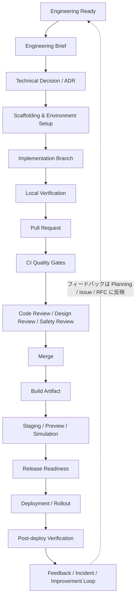
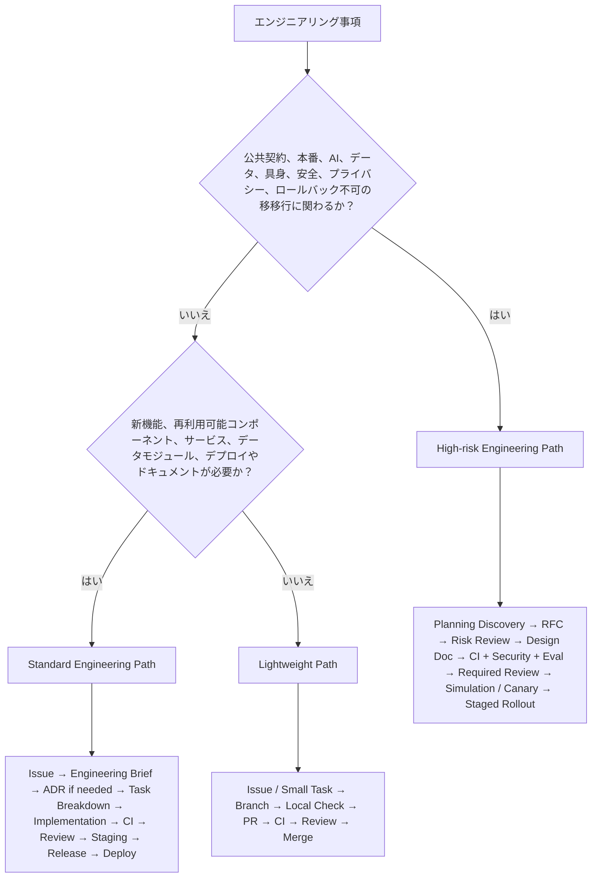
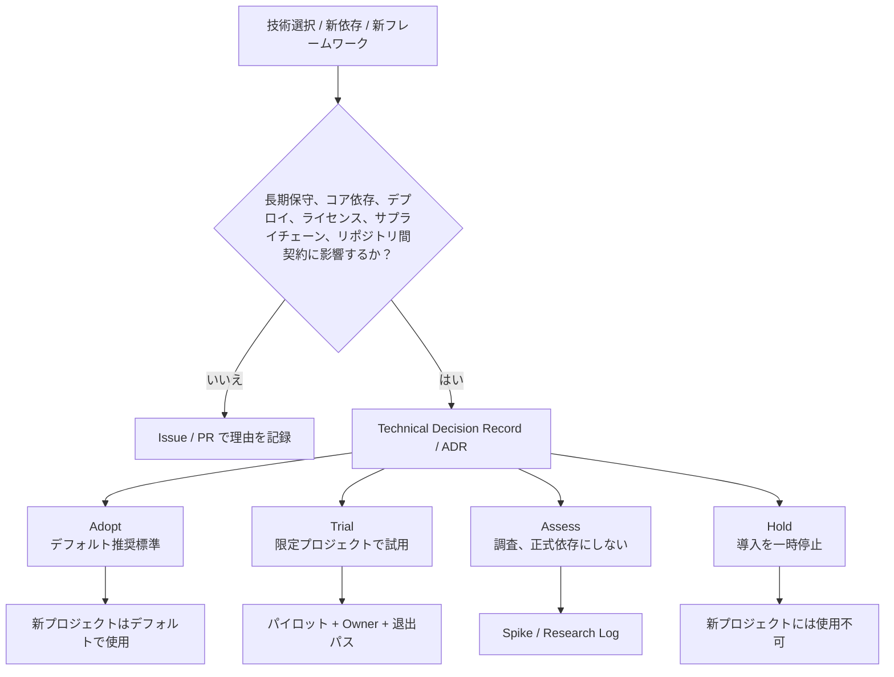
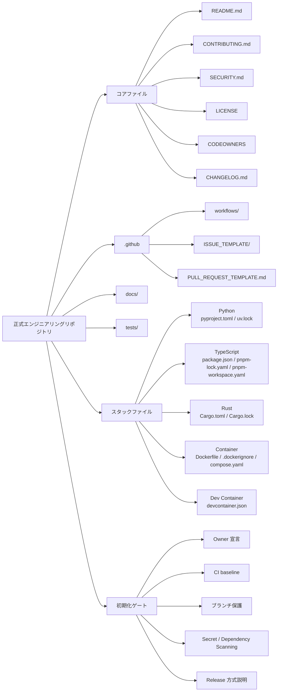
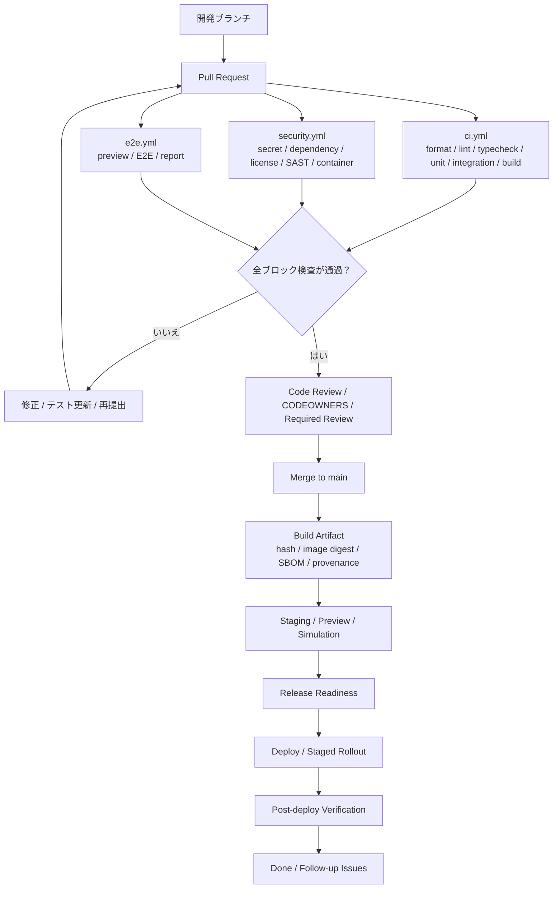

# エンジニアリングワークフロー

> 本文書は、輝夜計画におけるソフトウェア、AI Agent、フロントエンド／バックエンドシステム、インフラストラクチャ、データパイプライン、モデルサービス、ツールチェーン、および具身関連エンジニアリングが、設計からデリバリーまで統一されたワークフローに従うことを定義します。本文書は「エンジニアリング的にどのように作業を完了するか」に焦点を当て、技術方案の確認、実装準備、開発ブランチ、ローカル検証、Pull Request、Code Review、CI/CD、ビルド、デプロイ、リリース検証、問題フィードバック、および修正ループを含みます。

本文書は以下に代わるものではありません：

- `../../03-Collaboration/ja/02-Planning.md`：実施するか、いつ実施するか、どのように分解するかを決定します；
- `../../03-Collaboration/ja/03-RFC-Process.md`：重大な設計およびクロスリポジトリの意思決定を扱います；
- `02-Quality-Assurance.md`：テストおよび品質基準の詳細を定義します；
- `../../01-Foundation/ja/02-Security-Ethics.md`：セキュリティ、プライバシー、AI、および具身リスクの境界を定義します；
- `04-Engineering/standards/*`：フロントエンド、バックエンド、API、AI システムなどの具体的な技術基準を定義します。

---

## 1. 目的と適用範囲

本文書は、輝夜計画におけるエンジニアリング準備、設計、技術選定、実装、検証、Review、CI/CD、リリース、デプロイ、モニタリング、フィードバックループまでの統一エンジニアリングプロセスを定義します。

エンジニアリングワークフローの目的は、承認オーバーヘッドを生み出すことではなく、すべての正式なエンジニアリング変更がシステムに入る際に、追跡可能、再現可能、レビュー可能、検証可能、ロールバック可能であることを保証することです。GitHub Flow は短いブランチと Pull Request による協業を重視します。Google は Code Review の第一目標をコードベース全体の健全性の継続的改善と定義しています。NIST SSDF はセキュア開発プラクティスを SDLC に組み込むことを強調します。Google SRE はリリースエンジニアリング、canary、rollback、launch checklist によりリリースリスクを管理します。輝夜計画のエンジニアリングプロトコルは、この基盤の上に AI Agent の振る舞い、長期記憶、モデルサービス、具身安全に関する専門要件を追加しています。

輝夜計画のすべての正式リポジトリにおけるコード、設定、データ、モデル、インフラストラクチャ、ドキュメント、ツールチェーンの変更に適用されます。

---

## 2. コア原則

8 項目。エンジニアリング実行を専門に規律します：

1. **追跡可能** — すべての変更は、Issue / RFC / ADR、実装者、レビュアー、ビルドプロセス、デプロイ記録に遡及できなければなりません。
2. **再現可能** — ビルド、テスト、デプロイは暗黙のローカル設定や手動ステップに依存してはなりません。lockfile、container、CI 環境は再構築可能でなければなりません。
3. **レビュー可能** — すべての正式な変更は、構造化された Pull Request と Code Review を経なければなりません。保護ブランチへの直接 push は許可されません。
4. **検証可能** — 各段階には自動化または実行可能な検証手段が必要です。CI は「動けばよい」ものではなく、エンジニアリング事実の検証システムです。
5. **ロールバック可能** — 本番にデプロイされた変更にはロールバック経路が必要です。容易にロールバックできない変更は、より厳格なリリースレビューを受けなければなりません。
6. **保守可能** — コード、ドキュメント、モニタリング、アラート、Owner は同期してデリバリーされなければなりません。Owner のいないシステムは、放置された負債とみなされます。
7. **リスク分級** — 低リスクは軽量に進め、高リスクは重度のレビューを受けます。最重プロセスですべての小変更を塞がず、最軽プロセスで重要な変更を通さないこと。
8. **マージは完了ではない、デプロイは成功ではない** — 真の完了には、リリース検証、モニタリング、フィードバック、Owner の受け入れが必要です。

---

## 3. エンジニアリングプロセス概要



すべての変更がすべてのノードを通過する必要はありません。プロセスの強度はワークフロー分級によって決まります。

---

## 4. ワークフロー分級



すべての事項が同じ重いプロセスを通るわけではありません。3 つのパスが、ドキュメント修正から本番インフラまでをカバーします。

### 4.1 Lightweight Path：軽量変更

適用対象：

- ドキュメント修正；
- 小さな Bug；
- 局所的なリファクタリング；
- 単一リポジトリ内部実装；
- 公共 API / Schema / 状態機への影響なし；
- セキュリティ、プライバシー、AI、具身リスクなし。

プロセス：

```text
Issue / Small Task
  ↓
Branch
  ↓
Local Check
  ↓
PR
  ↓
CI
  ↓
Review
  ↓
Merge
```

要件：

- PR が必須；
- CI 合格が必須；
- 少なくとも 1 名の Reviewer；
- main への直接 push は不可；
- Owner 範囲に影響する場合、対応する Owner / CODEOWNER Review を依頼すること。

### 4.2 Standard Engineering Path：標準エンジニアリング変更

適用対象：

- 新機能；
- 再利用可能コンポーネント；
- フロントエンド／バックエンド協業機能；
- 内部サービス；
- データ処理モジュール；
- ツールチェーン改造；
- ドキュメント、テスト、デプロイ、または移行を要する変更。

プロセス：

```text
Issue
  ↓
Engineering Brief
  ↓
Technical Decision / ADR if needed
  ↓
Task Breakdown
  ↓
Implementation
  ↓
Local + CI Verification
  ↓
PR Review
  ↓
Staging / Preview
  ↓
Release Readiness
  ↓
Deploy
  ↓
Post-deploy Review
```

要件：

- Owner と DRI が必須；
- 受入基準が必須；
- テスト計画の説明が必須；
- ドキュメント影響の説明が必須；
- 新依存または新技術を導入する場合、選型記録が必要；
- 稼働システムに影響する場合、デプロイ、ロールバック、モニタリング計画が必要。

### 4.3 High-risk Engineering Path：高リスクエンジニアリング変更

適用対象：

- 公共 API / プロトコル / Schema / 状態機；
- 長期インフラストラクチャ；
- 本番サービス；
- AI Agent ツール呼び出し；
- 長期記憶書き込み；
- モデルサービス；
- ユーザーデータ；
- セキュリティ、プライバシー、コンプライアンス；
- 具身端末、センサー、アクチュエータ；
- ロールバックが困難な移行。

プロセス：

```text
Planning Discovery
  ↓
RFC
  ↓
Risk Review
  ↓
Engineering Brief
  ↓
ADR / Design Doc
  ↓
Implementation Plan
  ↓
Development
  ↓
CI + Security + Evaluation Gates
  ↓
Required Reviews
  ↓
Staging / Simulation / Canary
  ↓
Release Readiness Sign-off
  ↓
Staged Rollout
  ↓
Post-release Monitoring
  ↓
Postmortem / Follow-up
```

要件：

- RFC または明確な豁免を経由すること；
- セキュリティ / プライバシー / AI / 具身の专项レビューを完了すること；
- Release Readiness Checklist が必須；
- ロールバック、降格、または Kill Switch が必須；
- Owner、Backup Owner、事故エスカレーション経路が必須。

Google SRE の canary release の定義：候補バージョンに少量の実トラフィックを先に接触させ、コントロール群と比較し、悪い変更の影響範囲を縮小すること。輝夜計画において Agent 振る舞い、モデルサービス、データパイプライン、具身端末を伴うリリースは、このパターンに従う必要があります。

---

## 5. Engineering Ready：エンジニアリング入り口前の条件

`../../03-Collaboration/ja/02-Planning.md` の出力物は直接開発に入れません。エンジニアリングワークフローが定義する入り口ゲートは以下のとおりです。

### 5.1 Ready for Engineering

以下の条件をすべて満たした場合のみ、正式なエンジニアリング開発に入れます：

- Problem が明確である；
- Scope と Non-goals が明確である；
- Owner と DRI が確認済みである；
- リスク等級が付与されている（`../../01-Foundation/ja/02-Security-Ethics.md` §3 の S0–S5 と Blocked を再利用）；
- 関連 Issue / RFC / ADR がリンクされている；
- 受入基準が定義されている；
- 技術依存が特定されている；
- テスト戦略が定義されている；
- ドキュメント影響が特定されている；
- セキュリティ、プライバシー、AI、具身リスクが初期スクリーニング済みである；
- Blocked 級の出所、コンプライアンス、セキュリティ問題が存在しない。

### 5.2 エンジニアリング入り口が許可されない場合

以下の事項は正式なエンジニアリング開発に入れてはなりません：

- 問題定義のない一行のアイデアのみ；
- Owner がいない；
- 受入基準がない；
- 出所不明のコード、データ、モデル、素材に依存している；
- 本番、ユーザーデータ、Agent 自律、具身動作を伴うがリスク分級がない；
- アーキテクチャ変更が RFC を迂回している；
- プロトタイプが本番に直接接続されるよう要求されている。

---

## 6. Engineering Brief：エンジニアリング設計ブリーフ

標準以上のエンジニアリング変更では、先に軽量な Engineering Brief を作成します。RFC より短く、Issue より具体です。設計ロジックはコード構造に先行し、コードを書く前に少なくとも Domain Concepts → State → Invariants → Interfaces → Failure Modes → Implementation を明確にする必要があります。

テンプレート：

```markdown
# Engineering Brief

## Summary
何をするかを一文で説明する。

## Context
現在のシステム状態は？関連 Issue / RFC / ADR は？

## Problem
具体的なエンジニアリング問題は何か？

## Goals
今回達成すること。

## Non-goals
今回行わないこと。

## Domain Model
関与するコア概念、状態、インターフェース、データエンティティは？

## Invariants
常に成立しなければならない条件は？

## Proposed Approach
実装経路。

## Alternatives
少なくとも「何もしない」と 1 つの代替案を説明する。

## Technical Decisions
言語、フレームワーク、ストレージ、プロトコル、依存、コンテナ、デプロイ方式などの選択。

## Risks
セキュリティ、プライバシー、AI、具身、互換性、性能、保守リスク。

## Testing Plan
単体、統合、契約、E2E、評価、回帰テスト。

## Rollout / Rollback
リリース方法、ロールバック方法。

## Observability
ログ、メトリクス、Tracing、アラート。

## Owner / DRI
長期 Owner と現在の推進者。
```

---

## 7. 技術選定プロセス



輝夜計画は Python、TypeScript、Rust、コンテナ、データ、モデル、フロントエンド／バックエンド、Agent Infra を扱うため、技術スタック管理には規律が必要です。

### 7.1 選型分級

Thoughtworks Technology Radar の Adopt / Trial / Assess / Hold 分层と一致する 4 段階の技術レーダーを採用します：

| 等級 | 意味 | 使用ルール |
|------|------|------------|
| **Adopt** | 組織推奨標準 | 新規プロジェクトのデフォルト |
| **Trial** | 限定プロジェクトでの試用可 | Owner と退出経路が必須 |
| **Assess** | 調査可、正式依存には不可 | 実験または Spike のみ |
| **Hold** | 導入一時停止 | 新規プロジェクトでは使用不可 |

### 7.2 技術選型記録が必須となる場合

以下の場合、Technical Decision または ADR を作成する必要があります：

- 新言語の導入；
- 新フロントエンドフレームワークの導入；
- 新バックエンドフレームワークの導入；
- 新データベース、ベクトル DB、メッセージキュー、キャッシュの導入；
- 新モデルフレームワーク、Agent フレームワーク、推論サービスの導入；
- 新デプロイプラットフォーム、コンテナランタイム、クラウドサービスの導入；
- 既存コア依存の置換；
- 長期保守コストの高いツールの導入；
- ライセンス、コンプライアンス、サプライチェーンリスクが不明瞭な依存の導入。

### 7.3 技術選型で回答すべき項目

```markdown
Technology:
Category:
Adoption level: Adopt / Trial / Assess / Hold
Problem solved:
Alternatives considered:
Why now:
Expected lifetime:
Owner:
Operational burden:
Security / license risk:
Community health:
Migration cost:
Exit strategy:
Decision:
```

### 7.4 デフォルト技術ベースライン

以下は輝夜計画の初期エンジニアリングベースラインです。より詳細な基準は `standards/` に置きます：

| 領域 | デフォルトベースライン |
|------|------------------------|
| Source control | GitHub |
| Planning / PR / CI | GitHub Issues / PR / Projects / Actions |
| Python | `pyproject.toml` + `uv` + `uv.lock` |
| TypeScript / Frontend | `pnpm` workspace + `pnpm-lock.yaml` |
| Rust | Cargo |
| Container | OCI-compatible image + Dockerfile |
| CI/CD | GitHub Actions |
| Code ownership | CODEOWNERS |
| Versioning | SemVer where public API exists |
| Commit convention | Conventional Commits |
| Security scan | Secret scanning, dependency scan, code scan |
| Supply chain | SBOM / provenance for release artifacts |
| E2E web tests | Playwright or equivalent |
| Python tests | pytest or equivalent |
| Data / ML pipeline | dataset manifest, validation report, model/eval artifact |

---

## 8. リポジトリとエンジニアリング足場



各正式エンジニアリングリポジトリには統一ベースラインが必要です。

### 8.1 必須ファイル

```text
README.md
CONTRIBUTING.md
SECURITY.md
LICENSE
CODEOWNERS
CHANGELOG.md
.github/
  workflows/
  ISSUE_TEMPLATE/
  PULL_REQUEST_TEMPLATE.md
docs/
tests/
```

技術スタック別に追加：

```text
pyproject.toml          # Python
uv.lock

package.json            # TypeScript / Frontend
pnpm-lock.yaml
pnpm-workspace.yaml

Cargo.toml              # Rust
Cargo.lock

Dockerfile              # Container
.dockerignore
compose.yaml

devcontainer.json       # Dev Container
```

### 8.2 リポジトリ初期化ゲート

正式リポジトリ作成後、以下を完了する必要があります：

- Owner 宣言；
- README 完成；
- License 明確化；
- SECURITY.md 完成；
- CODEOWNERS 完成；
- CI baseline 完成；
- ブランチ保護有効化；
- Secret scanning / dependency scanning 有効化；
- Issue / PR テンプレート完成；
- リリース方式の説明完成。

OpenSSF Scorecard はリポジトリのセキュリティヒューリスティック指標を自動チェックできます。輝夜計画の正式リポジトリは Scorecard をセキュリティベースラインの参考とします。

---

## 9. 開発環境と再現性

### 9.1 ローカル開発環境

すべての正式リポジトリは再現可能なローカル開発入口を提供する必要があります。最低要件：

- 依存インストールを 1 コマンドで実行；
- テスト実行を 1 コマンドで実行；
- ローカルサービス起動を 1 コマンドで実行；
- 言語ランタイムと依存バージョンを固定；
- 環境変数テンプレートを明示；
- 個人マシンの暗黙設定に依存しない。

標準コマンド：

```text
Python:
  uv sync
  uv run pytest
  uv run <service>

TypeScript:
  pnpm install --frozen-lockfile
  pnpm test
  pnpm dev

Rust:
  cargo build
  cargo test
  cargo fmt --check
  cargo clippy
```

### 9.2 Dev Container

クロス言語、複雑依存、具身／シミュレーション環境では、Dev Container または同等のコンテナ化開発環境を提供します。

Dev Container を使用すべき場合：

- GPU、シミュレータ、ROS、システムライブラリ、複雑な native dependency に依存；
- ローカル環境設定コストが高い；
- 新人 onboarding コストが高い；
- CI とローカル環境が頻繁に不一致；
- 実験依存の隔離が必要。

### 9.3 環境変数

リポジトリは `.env.example` をコミット可能ですが、実際の `.env` はコミットしてはなりません。すべての secret は、制御された secret manager または GitHub Actions secrets / environment secrets 経由で注入します。GitHub secret scanning は Git 履歴内のハードコードされた資格情報をスキャンします。GitHub environments はデプロイタスクに人工承認、待機時間、ブランチ制限を設定できます。

---

## 10. ブランチ、コミット、PR ワークフロー

### 10.1 ブランチモデル

GitHub Flow を採用し、重量級 Git Flow は採用しません：

```text
main
 ├── feat/<short-name>
 ├── fix/<short-name>
 ├── docs/<short-name>
 ├── refactor/<short-name>
 ├── experiment/<short-name>
 └── release/<version>   # 安定リリースブランチが必要な場合のみ
```

### 10.2 main ブランチルール

main は常にビルド可能、テスト可能、リリース可能である必要があります。

禁止事項：

- main への直接 push；
- main への force push；
- CI をスキップしたマージ；
- Review なしのマージ；
- 未承認の release artifact 変更。

ブランチ保護は少なくとも以下を要求する必要があります：

- PR Review；
- 必要な status checks 合格；
- CODEOWNER Review；
- conversation resolved；
- linear history or squash merge；
- signed commits / verified commits（プロジェクトが要求する場合）；
- force push 不可；
- protected branch 削除不可。

### 10.3 コミット規約

Conventional Commits を採用し、SemVer の feature、fix、breaking change 表現と接続します：

```text
<type>(<scope>): <description>
```

常用 type：

| type | 意味 |
|------|------|
| `feat` | 新機能 |
| `fix` | Bug 修正 |
| `docs` | ドキュメント |
| `refactor` | リファクタリング |
| `test` | テスト |
| `perf` | 性能 |
| `ci` | CI/CD |
| `chore` | ビルドまたは補助ツール |
| `revert` | ロールバック |

例：

```text
feat(agent): add memory retrieval state transition
fix(runtime): prevent scheduler race condition
docs(api): clarify error response schema
refactor(frontend): split agent inspector panel
test(eval): add regression cases for tool-call failure
```

---

## 11. 実装段階の作業ルール

### 11.1 小さなコミット

変更は可能な限り小さく、焦点を絞り、Review 可能であるべきです。1 つの PR は 1 つの明確な問題のみを解決します。

推奨 PR サイズ：

| 種類 | 推奨 |
|------|------|
| ドキュメント / typo | 小 PR |
| Bug fix | 再現テスト付き小 PR |
| 新機能 | 複数 PR に分割可 |
| リファクタリング | 振る舞い変更と分離 |
| 移行 | 段階的 PR |
| 大規模変更 | 先に RFC / ADR、その後段階的実装 |

### 11.2 実装前チェック

コーディング開始前に、開発者は以下を確認する必要があります：

- Issue が存在するか；
- RFC / ADR が必要か；
- Owner を把握しているか；
- 受入基準を把握しているか；
- テスト方法を把握しているか；
- 公共契約に影響するか；
- データ、モデル、状態、権限、デプロイに影響するか；
- フロントエンド／バックエンド / API / Schema の同期が必要か；
- ドキュメント更新が必要か。

### 11.3 ローカルコミット前チェック

PR 提出前に、作者は最低限のローカルチェックを完了する必要があります：

- formatter；
- linter；
- type check；
- unit tests；
- affected integration tests；
- dependency lockfile check；
- secret scan if available；
- generated files up to date。

標準コマンド：

```text
Python:
  uv run ruff format --check .
  uv run ruff check .
  uv run mypy .
  uv run pytest

TypeScript:
  pnpm format:check
  pnpm lint
  pnpm typecheck
  pnpm test

Rust:
  cargo fmt --check
  cargo clippy --all-targets --all-features
  cargo test
```

---

## 12. Pull Request 規約

### 12.1 PR に含める必須項目

```markdown
## Summary
何をしたか。

## Motivation
なぜ行ったか。

## Changes
主要な変更点。

## Test Plan
検証方法。

## Risk
リスクとロールバック方法。

## Compatibility
API / Schema / データ / 状態への影響の有無。

## Security / Privacy
権限、ユーザーデータ、secret、依存、モデル、資産出所への関与の有無。

## AI / Agent Impact
Agent 振る舞い、ツール呼び出し、記憶、RAG、評価への影響の有無。

## Deployment
デプロイ、移行、feature flag、設定変更の要否。

## Links
Issue / RFC / ADR / Design Doc / Research Log。
```

### 12.2 PR が担うべきでない内容

PR は重大な方向性の初回議論に使用してはなりません。以下は先に Issue / RFC / ADR に入る必要があります：

- 新アーキテクチャの採用可否；
- 公共 API の変更可否；
- 新サービスの導入可否；
- システムの書き換え可否；
- セキュリティ境界の変更可否；
- Agent への新権限付与可否；
- 具身システムによる新動作の実行可否。

### 12.3 Draft PR

Draft PR は実装方向、CI 問題、設計リスクを早期に公開するために使用できます。Draft PR はマージしてはならず、正式 Review 完了とみなしてはなりません。

### 12.4 PR Ready Checklist

```markdown
- [ ] Linked issue / RFC / ADR
- [ ] Scope is clear
- [ ] Tests added or updated
- [ ] Docs updated
- [ ] CI passes
- [ ] No secret / credential
- [ ] No unexplained dependency
- [ ] No public contract change without review
- [ ] Rollback / migration considered
- [ ] Owner / CODEOWNER requested
```

---

## 13. Code Review プロセス

### 13.1 Review 目標

> Code Review の目標は完璧なコードを探すことではなく、通常の変更がシステム全体の健全性を低下させないことを保証することです。

Google Code Review 標準と一致：CL がコードベース全体の健全性を明確に改善する場合、完璧でなくても Review は承認に傾くべきです。

### 13.2 Review 次元

Reviewer は少なくとも以下をチェックします：

- Correctness
- Design fit
- Maintainability
- Testability
- Security
- Privacy
- Performance
- Compatibility
- Observability
- Documentation
- Operational risk

### 13.3 Required Review

| 変更種類 | Review 要件 |
|----------|-------------|
| ドキュメント小改 | 1 Reviewer |
| 通常コード | 1 Reviewer + CI |
| Owner 範囲コード | CODEOWNER Review |
| 公共 API / Schema | API Owner + 影響クライアント Owner |
| Infra / deployment | Infra Owner + rollback plan |
| Security-sensitive | Security Reviewer |
| AI / Agent behavior | AI Systems Reviewer + Eval result |
| Embodiment | Embodiment Safety Reviewer |
| Breaking change | RFC / ADR + migration plan |

---

## 14. CI 品質ゲート



CI は「動けばよい」ものではなく、エンジニアリング事実の検証システムです。

### 14.1 CI 階層

各正式リポジトリには少なくとも以下の workflow が必要です：

```text
ci.yml
  - format
  - lint
  - typecheck
  - unit-test
  - integration-test
  - build

security.yml
  - secret scan
  - dependency scan
  - license check
  - SAST / code scan
  - container scan (if applicable)

release.yml
  - version check
  - artifact build
  - SBOM / provenance
  - publish

e2e.yml
  - preview environment
  - E2E tests
  - report artifact

nightly.yml
  - slow tests
  - full regression
  - long-running eval
```

### 14.2 CI は検査可能な結果を产出する必要がある

CI は pass / fail のみを返してはなりません。主要 workflow は以下をアップロードする必要があります：

- test report；
- coverage report；
- lint report；
- typecheck result；
- E2E trace / screenshot / video；
- build artifact；
- container image digest；
- SBOM；
- provenance / attestation；
- benchmark result；
- eval report。

### 14.3 CI ブロックルール

以下の失敗はマージをブロックする必要があります：

- format / lint / typecheck 失敗；
- 単体テスト失敗；
- 必要な統合テスト失敗；
- secret scan ヒット；
- 高危依存脆弱性に豁免なし；
- license チェック失敗；
- container build 失敗；
- 公共 API snapshot 未更新；
- データ / モデル artifact に出所なし；
- release artifact ビルド不可。

高リスク変更ではさらにブロック：

- AI eval 失敗；
- prompt injection regression 失敗；
- data validation 失敗；
- migration dry run 失敗；
- rollback test 失敗；
- simulation safety test 失敗；
- readiness / health check 失敗。

---

## 15. テストトリガーポイント

詳細なテスト戦略は `02-Quality-Assurance.md` を参照。本節はテストがエンジニアリングプロセスに入るタイミングを定義します。

### 15.1 テスト階層

```text
Static Checks
  ↓
Unit Tests
  ↓
Component Tests
  ↓
Integration Tests
  ↓
Contract Tests
  ↓
End-to-End Tests
  ↓
Release Candidate Tests
  ↓
Post-deploy Checks
```

輝夜計画は「上層ほど少なく、安定し、重要」というピラミッド原則を保持します（Google Testing Blog 経験値：70% unit / 20% integration / 10% E2E）。実際の比率は調整可能ですが、逆転してはなりません。

### 15.2 各段階のテスト要件

| 段階 | 必須テスト |
|------|------------|
| Local | affected unit / lint / typecheck |
| PR | unit + integration + changed area tests |
| Merge to main | full CI |
| Nightly | slow tests + regression + eval |
| Release Candidate | E2E + migration + performance + security |
| Post-deploy | smoke test + health check + monitoring |

### 15.3 AI / Agent テスト

AI / Agent 関連 PR にはさらに以下を含める必要があります：

- eval dataset バージョン；
- prompt / policy snapshot；
- model バージョン；
- tool permission matrix；
- memory write / read behavior tests；
- prompt injection regression；
- hallucination / uncertainty checks；
- cost / latency budget；
- failure mode report。

Google の ML Test Score 論文は、本番 ML システムの準備度評価と技術的負債低減のため 28 項目のテストおよびモニタリング要件を提示しています。輝夜計画の AI / Agent システムはこれを参考ベースラインとします。

### 15.4 データテスト

データパイプラインは以下を検証する必要があります：

- schema；
- null / missing；
- range；
- distribution drift；
- duplicates；
- label quality；
- provenance；
- PII / sensitive fields；
- train / eval contamination；
- dataset version。

---

## 16. ビルドとアーティファクト管理

### 16.1 Build Artifact

すべての正式リリース産物は追跡可能である必要があります。各 release artifact は以下を記録する必要があります：

- source commit；
- build workflow；
- dependency lockfile；
- build environment；
- artifact hash；
- container image digest；
- SBOM；
- provenance；
- signer / attestation；
- release version。

SLSA はソフトウェアサプライチェーン完全性と build provenance に焦点を当てます。OCI Image Specification はコンテナイメージ相互運用のベースラインを定義します。輝夜計画の正式リリース産物は段階的に SLSA Level 2 以上を達成する必要があります。

### 16.2 Container ルール

コンテナイメージは以下を満たす必要があります：

- 明確な base image を使用；
- base image バージョンまたは digest を固定；
- multi-stage build を使用；
- `.dockerignore` を使用；
- 無関係なパッケージをインストールしない；
- secret を書き込まない；
- 可能な限り non-root で実行；
- CI でビルドおよびテスト；
- リリース時に image digest を記録。

---

## 17. リリースとデプロイワークフロー

### 17.1 環境階層

```text
local
  ↓
dev
  ↓
preview / ephemeral
  ↓
staging
  ↓
canary
  ↓
production
```

### 17.2 Preview Environment

フロントエンド、API、Agent UI、ドキュメントサイトなどは PR Preview に適しています：

- UI 変更；
- API contract demo；
- ドキュメントサイト；
- Agent state inspector；
- demo / playground；
- integration validation。

### 17.3 Release Readiness Checklist

```markdown
## Ownership
- [ ] Owner 確認
- [ ] Backup Owner 確認
- [ ] DRI 確認
- [ ] Escalation path 確認

## Code
- [ ] CI passed
- [ ] Required reviews completed
- [ ] No unresolved conversations
- [ ] Changelog updated
- [ ] Version updated

## Tests
- [ ] Unit passed
- [ ] Integration passed
- [ ] E2E passed if applicable
- [ ] Contract tests passed
- [ ] Migration dry run passed if applicable

## Security
- [ ] Secret scan passed
- [ ] Dependency scan passed
- [ ] License check passed
- [ ] Container scan passed if applicable
- [ ] SBOM / provenance generated if release artifact

## AI / Data
- [ ] Dataset versions recorded
- [ ] Eval report archived
- [ ] Model / prompt / policy version recorded
- [ ] Tool permissions reviewed
- [ ] Data validation passed

## Operations
- [ ] Rollback plan ready
- [ ] Monitoring dashboard linked
- [ ] Alerts configured
- [ ] Runbook updated
- [ ] Smoke test defined
```

Google SRE の Launch Coordination Engineering は launch checklist で信頼性、拡張性、リリースリスクをレビューします。輝夜計画の Release Readiness はこの考え方を直接再利用します。

### 17.4 Rollout

本番リリースはデフォルトで staged rollout を使用します。高リスクリリースは一括本番投入してはなりません。典型的な順序：

```text
staging
  ↓
internal dogfood
  ↓
canary 1% / limited users
  ↓
canary 10%
  ↓
regional / area rollout
  ↓
full rollout
```

### 17.5 Post-deploy Verification

デプロイ後、以下を完了する必要があります：

- health check；
- smoke test；
- key metrics check；
- error rate check；
- latency check；
- log anomaly check；
- rollback readiness check；
- user-facing validation；
- Agent / model behavior spot check（if applicable）。

DORA 指標は、デプロイ頻度、変更リードタイム、失敗デプロイ復旧時間などでソフトウェアデリバリー吞吐量と安定性を測定することを推奨します。輝夜計画は Deployment Frequency、Lead Time、Change Failure Rate、Time to Restore の可観測性を段階的に確立する必要があります。

---

## 18. 問題フィードバックと修正ループ

### 18.1 Bug Lifecycle

```text
Report
  ↓
Triage
  ↓
Reproduce
  ↓
Root Cause
  ↓
Fix
  ↓
Regression Test
  ↓
Release
  ↓
Verify
  ↓
Close
```

### 18.2 Bug Issue に含める必須項目

- Expected behavior
- Actual behavior
- Reproduction steps
- Environment
- Version / commit
- Logs / screenshots
- Impact
- Regression: yes / no / unknown
- Related release
- Owner

### 18.3 修正要件

Bug 修正は現在の現象のみを直してはなりません。少なくとも以下の 1 つを追加する必要があります：

- regression test；
- stronger validation；
- clearer error message；
- better logging；
- documentation update；
- monitoring alert；
- runbook update。

### 18.4 Hotfix

Hotfix はプロセス短縮を許可しますが、記録の省略は許可されません。

Hotfix 後、以下を補完する必要があります：

- incident / bug issue；
- root cause；
- regression test；
- release note；
- postmortem if production impact；
- follow-up technical debt ticket。

NIST SSDF の目標の 1 つは、公開ソフトウェアの脆弱性数を減らし、未修正脆弱性の影響を低減し、根因に対処して再発を防ぐことです。Hotfix 後の根因および回帰テスト補完要件と一致します。

---

## 19. AI 支援エンジニアリングルール

輝夜計画は AI 支援開発を許可しますが、責任境界を明確にする必要があります。

### 19.1 許可される AI 支援

- 草稿コード生成；
- テスト草案生成；
- エラー説明；
- PR 要約；
- ドキュメント草稿生成；
- 移行スクリプト支援；
- 評価サンプル草稿生成。

### 19.2 禁止事項

- 作者が説明できないコードの提出；
- 未検証 AI 生成テストの提出；
- license / provenance レビューを迂回する AI 生成コードの使用；
- secret、私有データ、未公開設計を外部 AI サービスに入力；
- AI による PR 自動承認、自動マージ、自動リリース；
- 高リスク Agent / 具身権限について AI が最終判断。

### 19.3 硬規則

> AI-generated does not mean review-exempt. Human author remains fully responsible.

---

## 20. ツールと自動化

### 20.1 GitHub Actions 推奨パイプライン

標準 job 構造：

```text
pull_request:
  validate-metadata
  install
  format
  lint
  typecheck
  unit-test
  integration-test
  build
  dependency-review
  secret-scan
  license-check

push main:
  full-test
  build-artifacts
  container-build
  sbom
  provenance
  publish-preview

release tag:
  release-build
  sign
  attest
  publish
  deploy-staging
  smoke-test
  promote-production
```

### 20.2 推奨 CI 戦略

- lockfile で依存をインストール；
- matrix で主要言語バージョン / OS / runtime をテスト；
- workflow を再利用し、各リポジトリが複雑ロジックを複製しない；
- 依存をキャッシュするが secret はキャッシュしない；
- artifact とレポートを生成；
- 高リスクデプロイでは environment protection を使用；
- release workflow は保護ブランチまたは tag からのみトリガー；
- 外部コントリビューター workflow には制御された承認が必要。

### 20.3 Workflow 状態とラベル

統一 GitHub labels：

**状態ラベル：**

```text
status:ready
status:in-progress
status:blocked
status:needs-review
status:needs-design
status:needs-rfc
status:needs-security-review
status:needs-ai-review
status:needs-embodiment-review
status:ready-to-merge
status:ready-to-release
status:released
status:verified
status:stale
status:archived
```

**種類ラベル：**

```text
type:bug
type:feature
type:refactor
type:docs
type:test
type:infra
type:api
type:frontend
type:backend
type:agent
type:model
type:data
type:embodiment
type:security
```

**リスクラベル：**

```text
risk:S0
risk:S1
risk:S2
risk:S3
risk:S4
risk:S5
risk:blocked
```

### 20.4 Kaguya Engineering Agents

以下の Agent はエンジニアリングワークフローで支援を提供できますが、常に助言および自動化の役割であり、自動承認、自動マージ、人間の責任判断の代替はしてはなりません：

| Agent | 職能 | 権限境界 |
|-------|------|----------|
| **Kaguya CI Guardian** | CI 状態監視、flaky test マーキング、ブロック通知 | コメント可、ラベル可、マージ不可 |
| **Kaguya Release Steward** | Release Readiness Checklist チェック、リリース要約生成 | checklist 生成可、リリース承認不可 |
| **Kaguya Dependency Watcher** | 依存更新、セキュリティ公告、license 変化の監視 | Issue 作成可、自動アップグレード不可 |
| **Kaguya Eval Reporter** | AI eval 結果集約、回帰マーキング | PR コメント可、承認不可 |

> Agent は通知、集約、チェック、レポート生成ができます。PR 自動承認、自動マージ、自動リリース、高リスク権限の最終判断はしてはなりません。

---

## 21. Definition of Done

### 21.1 一般エンジニアリング事項

以下の条件をすべて満たした場合のみ、エンジニアリング事項を Done とマークできます：

- コードまたは産物がマージ済み；
- 必要なテストが合格；
- 必要な Review が完了；
- ドキュメントが更新済み；
- 変更ログまたは Release Note が更新済み；
- 関連 Issue / PR / RFC / ADR が相互リンク済み；
- デプロイまたはリリースが完了、または不要である旨が明記；
- post-deploy smoke test が合格；
- モニタリング、アラート、ログ、runbook が更新済み；
- Owner が長期保守責任を受け入れ；
- フォローアップ問題が記録済み。

### 21.2 研究 / AI / データ事項

一般条件に加え、以下を追加：

- 実験設定のアーカイブ；
- データバージョンのアーカイブ；
- モデル / prompt / policy バージョンのアーカイブ；
- eval report のアーカイブ；
- 既知 failure mode のアーカイブ。

### 21.3 具身事項

一般条件に加え、以下を追加：

- シミュレーション検証のアーカイブ；
- 物理テスト記録のアーカイブ；
- HITL / E-Stop チェック完了；
- リスク境界のアーカイブ；
- 人間 takeover 経路の検証。

---

## 22. アンチパターン

以下はエンジニアリングワークフローのアンチパターンです：

1. Issue / RFC / ADR なしで重大実装を開始；
2. レビューなしでプロトタイプコードが本番に入る；
3. PR で初めてアーキテクチャ方向を議論；
4. main ブランチがビルド不可；
5. CI 失敗を口頭で承認；
6. テストが happy path のみをカバー；
7. E2E テストが多すぎ、遅すぎ、脆すぎ；
8. Bug 修正のみで回帰テストを補わない；
9. 依存を導入するが理由とライセンスを説明しない；
10. Dockerfile に secret を書き込む；
11. rollback plan なしでリリース；
12. デプロイ後にモニタリングを見ない；
13. release artifact が commit に遡及できない；
14. Agent コード変更に eval がない；
15. データ変更に schema / quality validation がない；
16. 具身動作にシミュレーションと E-Stop 検証がない；
17. Hotfix 後に記録と根因分析を補わない；
18. 単一保守者のローカル知識に長期依存。

---

## 23. 改訂

本文書は公開 RFC による改訂のみ可能です。改訂には、エンジニアリング規模の変化、古い衝突の継続、あるルールが害を及ぼすことが証明されたかを明記する必要があります。`../../01-Foundation/ja/01-Principles.md` の「衝突と改訂」と一致：本文書が RFC プロセス、セキュリティレビュー、組織権限と衝突する場合、対応する専門文書が優先；法律、セキュリティ倫理ボトムラインと衝突する場合、ボトムラインが優先。旧版はバージョン管理に保存され、いつでも参照可能。

本文書が確立するチェーン——Design → Decision → Implementation → Verification → Review → Build → Release → Deploy → Observe → Improve——が守られる場合のみ、輝夜計画は 3 つの一般的失敗を回避できます：**ゲートなしプロトタイプが本番依存になる；Agent / データ / モデル / 具身変更に専門検証が欠ける；正式産物がコード、設定、データ、ビルドプロセス、Owner に遡及できない**。
