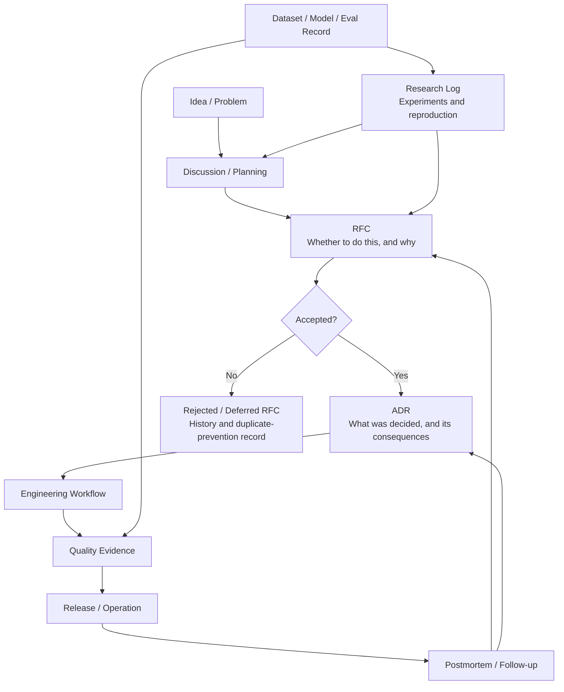

# Documentation Writing and Knowledge Asset Management Standards

> This document defines the rules for writing, maintaining, reviewing, versioning, expiration, and archiving of documentation, decision records, research records, data records, model records, and operational records in the Kaguya Project. Documentation is not an afterthought that follows code completion—it is infrastructure that makes the system understandable, maintainable, reproducible, auditable, and transferable. An engineering outcome is truly complete only when its knowledge records are sufficient for successors to understand, verify, and take over.

This document does not replace:

- `../../03-Collaboration/en/03-RFC-Process.md`: the formal decision process for major proposals;
- `../../04-Engineering/en/01-Workflow.md`: the engineering implementation workflow;
- `../../04-Engineering/en/02-Quality-Assurance.md`: quality evidence standards;
- `../../01-Foundation/en/02-Security-Ethics.md`: security, privacy, compliance, and ethical boundaries.

This document covers **knowledge management issues not addressed by the above documents**: which knowledge must be recorded? Where is it recorded? Who is responsible for maintaining it? How should it be written to be readable, reviewable, reproducible, and inheritable? When does documentation expire, become obsolete, or get superseded?

---

## 1. Purpose and Scope

This document defines the knowledge asset management system for the Kaguya Project.

The Kaguya Project is not a single codebase—it is a long-evolving AI Agent, Infra, research, and embodied systems ecosystem. Many risks do not come from "no code exists," but from "only one person knows why it was designed this way," "it was only mentioned in some chat log," or "it was only stated verbally in a meeting." The goal of this document is to turn such tacit knowledge into traceable, reviewable, and inheritable formal assets.

This applies to all formal repositories, documentation sites, and internal knowledge bases within the Kaguya Project: repository READMEs, user and developer documentation, API / protocol / Schema references, RFC / ADR / Engineering Brief / Design Doc, experiment logs / paper reviews / reproduction records, Dataset Card / Model Card / Evaluation Report, Runbook / Incident Report / Postmortem / Release Notes.

The documentation system as a whole adopts Diátaxis's four-part framework (Tutorial / How-to / Reference / Explanation, each serving different reader needs), Write the Docs' Docs as Code philosophy (documentation uses the same Issue, Git, Review, and automation workflows as code), and GitLab's practice of treating documentation as the product's single source of truth (SSoT).

---

## 2. Documentation Principles

Eight principles, specifically governing knowledge asset management:

1. **Documentation is a knowledge asset, not supplementary notes** — Any knowledge that needs to be understood, maintained, reproduced, reviewed, or handed off by others should be treated as a knowledge asset. Knowledge assets must have a source of truth, Owner, status, and lifecycle. For the Kaguya Project, knowledge rot is not "documentation falling behind"—it is "the system becoming incomprehensible and non-transferable."

2. **Single source of truth (SSoT)** — Each important piece of knowledge can have only one authoritative source of truth. Other locations may reference, summarize, or index it, but must not create conflicting facts. When Feishu, Notion, PR comments, and formal documentation disagree, formal documentation (or the corresponding record in Git) takes precedence.

3. **Docs as Code** — Formal documentation is managed in Git by default, modified via PR, subject to Review, automatically checkable, and historically traceable. Code changes that affect users, interfaces, deployment, or maintenance must be accompanied by documentation updates. Important knowledge must not exist only in chat logs.

4. **Choose type first, then write content** — Do not mix tutorials, procedural steps, reference material, and background explanations in the same document. Before writing, first determine whether the reader is learning (Tutorial), completing a task (How-to), looking up facts (Reference), or seeking understanding (Explanation).

5. **Write for the reader's task, not the author's journey** — Documentation should start from the task the reader needs to complete and the questions they need answered, not from the order in which the author implemented the system. Readers do not care about your development diary—they want to know "what do I need to do now?" and "why is it this way?"

6. **Important conclusions must be traceable** — Why a particular architecture was adopted, why an interface was deprecated, why a model evaluation passed, why an experiment failed, why a security exception was accepted—these conclusions must link to Issue / PR / RFC / ADR / experiment logs / evaluation reports or incident postmortems.

7. **Documentation has status and validity period** — Documentation is not correct forever. Every formal document must express its current status: Draft / Active / Deprecated / Superseded / Archived. Documentation without status cannot be trusted.

8. **Research documentation must support reproduction** — Experiment logs, data records, and model records must retain sufficient information for others to understand the experiment purpose, environment, inputs, configuration, results, and conclusions—even if the original author has left.

---

## 3. Document Types and Sources of Truth

| Document Type | Purpose | Authoritative Source of Truth | When Required |
|---------------|---------|-------------------------------|---------------|
| README | Help readers quickly determine what the project is and how to get started | Root directory of each repository | All formal repositories |
| Tutorial | Guide newcomers through their first successful experience | `docs/` or documentation site | When targeting external users or newcomers |
| How-to | Help users complete a specific task | `docs/` / Runbook | When there is a recurring operational need |
| Reference | Precisely describe API, CLI, configuration, Schema | Generated documentation + source specification | When public interfaces exist |
| Explanation | Explain concepts, background, design trade-offs | Documentation site / repo docs | When concepts are complex or cross-team |
| RFC | Proposal, argumentation, and decision for major changes | `05-Knowledge/rfc/` | Before major changes |
| ADR | Architecture decisions that have been made | `05-Knowledge/adr/` | After architectural decisions |
| Research Log | Experiments, reproductions, negative results | `05-Knowledge/research-logs/` | For formal research or reusable experiments |
| Dataset Card | Dataset source, composition, license, usage, limitations | Data repository / research logs | When datasets are reused, used for training, or evaluated |
| Model Card | Model purpose, training, evaluation, limitations | Model repository / model registry | When models are published or deployed |
| Runbook | Operational procedures and incident handling | repo docs / internal wiki | When services are deployed |
| Release Notes | Communicate release changes to users | GitHub Release / changelog | With each formal release |
| Postmortem | Incident facts, impact, root cause, action items | incident archive | After P0/P1 or high-risk incidents |

Core rule: **One fact can have only one authoritative source.** If you write a how-to guide in Notion, but the repository README contains a different version, readers won't know whom to trust—that is a source-of-truth conflict.

---

## 4. Document Metadata

All formal knowledge documents should maintain minimum metadata at the file header, enabling automation tools and Review to assess document status:

**Required fields:**

- `owner` — Who is responsible for keeping this document correct;
- `status` — Draft / Active / Deprecated / Superseded / Archived;
- `updated` — Date of last substantive update;
- `last_reviewed` — Date last confirmed still correct;
- `visibility` — public / internal / restricted;
- `type` — Document type.

**Recommended fields:**

- `audience` — Target readers;
- `area` — Area (Agent / Infra / Frontend / Backend / Data / Embodiment / Research);
- `review_cycle` — Review cycle;
- `related_rfcs` / `related_adrs` / `related_issues` — Related decisions and work items;
- `supersedes` / `superseded_by` — Supersession relationships;
- `sensitivity` — Whether it involves security / privacy / IP-sensitive content.

Metadata format may use YAML front matter or be presented structurally in the document's opening section; the specific format is determined by repository convention.

---

## 5. README Standards

README is the entry point for every repository—it should not be written as a marketing page, nor as a complete manual. GitHub Open Source Guides recommend that README answers: what the project does, why it is useful, how to get started, and where to get help.

### 5.1 Recommended README Structure

A qualified README should include:

- **Project name and one-line positioning** — Readers can determine relevance in 5 seconds;
- **Status** — Experimental / Active / Production / Deprecated / Archived;
- **What the project does** — What problem it solves;
- **Position within the Kaguya Project** — Relationship to other repositories and systems;
- **Quick start** — Shortest path to a runnable state;
- **Core concepts** — No more than 5 key terms;
- **Usage** — Basic usage examples;
- **Development** — Local development, test, and build commands;
- **Documentation links** — Links to complete documentation, API Reference, RFC / ADR;
- **Security** — How to report security issues;
- **Contributing** — How to participate;
- **License** — License;
- **Owner** — Responsible person and contact information.

### 5.2 README Anti-patterns

- Slogans without runnable instructions;
- Installation steps that are outdated and never updated;
- No indication of current status;
- No Owner;
- Stuffing a complete architecture design document into the README;
- README inconsistent with actual CLI / API behavior.

---

## 6. Tutorial / How-to / Reference / Explanation

This section adopts Diátaxis's four-part framework as the top-level classification, tailored to Kaguya Project scenarios.

### 6.1 Tutorial

**Purpose**: Guide readers through their first successful experience. The reader is learning, not completing work.

Suitable scenarios: First run of an Agent, first startup of frontend/backend, first evaluation run, first use of a simulation environment.

Writing rules: Linear progression; each step is executable; must include verification of results; do not assume reader knows internal architecture; do not expand on extensive theory—link background to Explanation.

### 6.2 How-to

**Purpose**: Help users with foundational knowledge complete a specific task. The reader knows what they want to do and needs operational guidance.

Suitable scenarios: How to release a version, how to add an API endpoint, how to run model evaluation, how to handle flaky tests, how to execute database migrations.

Writing rules: Title uses "How to..."; solves only one task; conditions placed before instructions; instructions use numbered lists; do not explain excessive background.

### 6.3 Reference

**Purpose**: Provide accurate, complete, searchable facts. The reader is looking up specific parameters, fields, or behavior.

Suitable scenarios: API Reference, CLI Reference, configuration items, Schema, state machines, error codes, Agent Tool Interface.

Writing rules: Neutral, complete, searchable; do not mix in tutorial narrative; prioritize auto-generation from source specifications where possible; public interface Reference must indicate version and compatibility.

Microsoft's reference documentation guidelines emphasize: reference documentation should help developers quickly find needed information through standardized structure and consistent phrasing.

### 6.4 Explanation

**Purpose**: Explain background, principles, design trade-offs, and conceptual models. The reader is seeking understanding.

Suitable scenarios: State persistence design philosophy, reasons for domain contract unification, Agent Memory architecture, embodied safety boundary principles, evaluation system design.

Writing rules: May include narrative and background; do not disguise as procedural steps; link to RFC / ADR / Reference; do not replace formal decision records.

---

## 7. API, Protocol, and Generated Documentation

The Kaguya Project spans frontend, backend, Agent, Infra, data, and embodied execution. Documentation for public contracts must be strongly constrained.

### 7.1 Basic Requirements

All public API, Schema, Protocol, Event, State Machine, Agent Tool Interface, and data formats must have authoritative specification documentation, at minimum including: version, Owner, status, compatibility policy, field descriptions, error semantics, examples, and migration notes.

### 7.2 Generated Documentation Rules

- Reference that can be auto-generated from source specifications (OpenAPI / Proto / GraphQL SDL) should not be manually duplicated;
- Handwritten documentation explains "why" and "how to use"; generated documentation describes "what it is";
- Public contract changes must link to RFC / ADR / PR;
- Breaking changes must have migration documentation and version notes.

The Kubernetes documentation system adopts a "handwritten explanation + auto-generated reference" model: API Reference, kubectl Reference, etc. are auto-generated from source code; concepts and task guides are written by humans. The Kaguya Project should adopt the same division of labor.

---

## 8. Architecture Documentation, RFC, and ADR



### 8.1 RFC

RFC records the proposal background, problem, solution, alternatives, risks, discussion, and final decision for major changes. It answers: **Should we do this? Why?**

The complete RFC process and template are defined in `../../03-Collaboration/en/03-RFC-Process.md`. This document only emphasizes documentation management rules: RFC is a historical record; Accepted / Rejected / Superseded RFCs should not be substantially modified retroactively. Subsequent actions should be maintained in ADR, standard documentation, or implementation Issues.

### 8.2 ADR

ADR records architecture decisions that have been made: context at the time, decision content, excluded alternatives, rationale, and consequences. It answers: **What have we decided? What consequences will this bring?**

ADR should be maintained as an append-only log—accepted records are not rewritten retroactively; if a decision changes, write a new ADR and link to the original record. Microsoft Azure Well-Architected Framework recommends that ADR should only record decisions affecting system structure, key quality attributes, or decisions that are difficult to reverse.

Recommended ADR structure: Status (Proposed / Accepted / Deprecated / Superseded) → Context → Decision → Consequences → Alternatives Considered → Related RFCs → Superseded By.

### 8.3 Engineering Brief and Design Doc

Engineering Brief is defined in `../../04-Engineering/en/01-Workflow.md` §6. Design Doc is detailed technical design after RFC acceptance and before implementation. Both are knowledge assets and should have Owner and status; changes go through PR Review.

---

## 9. Research Logs, Paper Review, and Experiment Records

`05-Knowledge/research-logs/` is a very important knowledge directory in the Kaguya Project. The project involves Agent research, AI Infra exploration, and embodied intelligence experiments—this directory must store not only "successful results," but also "process" and "failures."

### 9.1 Experiment Logs

Each formal experiment or reusable exploratory work should record: research question, hypothesis, motivation, experiment environment (code version / data version / model version / configuration / hardware / random seed), method, evaluation metrics, raw results, analysis, negative results, limitations, reproduction method, and conclusions.

Core rules:

- Failed experiments must also be recorded—negative results prevent repeated waste;
- Results must link to code, configuration, data, and environment versions;
- If reproduction is not possible, the reason must be stated;
- Experiment conclusions must not overstate applicability;
- Experiment status should be marked: in progress / complete / archived / voided.

The Turing Way defines reproducibility as data and code being available and analysis being fully re-runnable. Kaguya Project research logs should meet this as the minimum standard.

### 9.2 Paper Review

Review records for papers relevant to the Kaguya Project: citation information, abstract, problem, method, evidence, strengths and weaknesses, assumptions, significance to the Kaguya Project, reproducibility assessment, risk assessment, follow-up actions (whether reproduction / experiment / RFC / engineering is needed).

### 9.3 Dataset Records

Each formally used dataset should maintain complete records: identity information (name / version / Owner / source / license / storage / access control), motivation, composition, collection process, preprocessing, permitted uses, prohibited uses, privacy and authorization issues, bias and limitations, quality check results, and version history.

Datasheets for Datasets proposes that datasets should be accompanied by documentation explaining their motivation, composition, collection process, and recommended uses. FAIR principles require digital assets to be Findable, Accessible, Interoperable, and Reusable. Datasets formally reused or published by the Kaguya Project should satisfy both requirements.

---

## 10. Dataset Card, Model Card, and AI Asset Records

### 10.1 Dataset Card

Dataset Card is aimed at data users, helping them determine whether a dataset suits their purpose. Minimum content: name and version, source and license, scale and format, data composition description, preprocessing notes, recommended and prohibited uses, bias and limitations, privacy and sensitive information declarations, quality check results, citation method, and related experiments/models.

Hugging Face Dataset Cards practice can serve as a format reference, but the Kaguya Project should additionally emphasize source compliance (aligned with `../../01-Foundation/en/02-Security-Ethics.md` §4 Asset and Source Security).

### 10.2 Model Card

Model Card is aimed at model users and reviewers. Minimum content: name and version, base model, training data sources, training parameters, evaluation results and metrics, applicable scenarios and out-of-scope uses, limitations and bias, security considerations, inference cost and latency, known failure modes, rollback or alternative options, citation method.

Model Cards for Model Reporting requires that published models be accompanied by documentation explaining applicable boundaries, evaluation procedures, and limitations. Every formal model service in the Kaguya Project should maintain a Model Card.

### 10.3 Agent Behavior Record

A documentation type specific to the Kaguya Project: any Agent with tool invocation, long-term memory, user interaction, or external action capabilities requires a behavior record. Content includes: Agent identity and version, capability scope, tool list and permission boundaries, memory strategy, persona/behavior constraints, evaluation results, known failure modes, security mitigation measures, human handoff method, audit log requirements, and version history.

---

## 11. Runbook, Incident, Release, and Operational Documentation

### 11.1 Runbook

Runbook is aimed at maintainers, not ordinary user tutorials. Production services must have a Runbook.

Content should cover: system purpose, Owner and escalation path, system overview and dependencies, monitoring Dashboard links, alert descriptions, common operational steps, incident handling procedures, rollback methods, backup and recovery methods, known failure modes, and related links.

Rules: Runbook must be usable during incidents (operable under time pressure); must not contain keys or credentials; must be regularly exercised or reviewed.

### 11.2 Incident Report / Postmortem

P0/P1 or high-risk incidents must produce an Incident Report, recording: summary, impact scope and duration, timeline, detection method, root cause, contributing factors, resolution method, what went well, what went poorly, action items (including Owner / Due / Tracking Issue), and subsequent documentation updates.

The purpose of Postmortem is to capture lessons and prevent recurrence—not to assign individual blame. Action items must be trackable; they cannot stop at "be more careful next time."

### 11.3 Release Notes

Release Notes are aimed at users and maintainers, not a copy of the Git log. Should include: summary of key changes, breaking changes, new features, fixes, security updates, migration notes, known issues, and contributor acknowledgments. Language should allow users who don't read code to understand the impact.

---

## 12. Writing Style and Language Standards

### 12.1 Basic Style

Precise, concise, direct, task-oriented. Avoid promotional tone, undefined abbreviations, stacked abstract nouns, and writing uncertain conclusions as facts. Google Developer Documentation Style Guide and Microsoft Writing Style Guide share common advice: use active voice, second person, clear conditional ordering, and descriptive links.

### 12.2 Chinese and English Rules

Kaguya Project documentation is primarily in Chinese; English terms follow these rules:

- First occurrence: Chinese term (English Term) or English Term (Chinese explanation);
- Subsequently, prefer the established term; do not use multiple translations for the same concept within the same repository;
- Proper nouns, protocol names, tool names, API names remain in original form;
- Uncertain translations go into the Glossary, not ad-hoc translation in each document.

### 12.3 Prohibited Expressions

The following phrasing should be avoided or replaced in formal documentation:

- "Obviously," "simply," "just need to," "very easy" — hides reader cost and environmental differences;
- "As everyone knows," "needless to say" — assumes reader knowledge;
- "Absolutely secure," "perfect," "will never" — hides risk and limitation boundaries;
- "Production-ready" without corresponding quality evidence — unverified assertions are not documentation.

---

## 13. Markdown, Code Examples, Diagrams, and Media

### 13.1 Markdown Standards

- Use GitHub Flavored Markdown (GFM);
- Each document has only one H1 (the title);
- Heading levels do not skip (do not go from H2 directly to H4);
- Use relative links to reference documents within the same repository;
- Code blocks must specify language;
- Command examples must be copyable (without irrelevant shell prompt symbols);
- Tables are for structured comparison, not long-form prose;
- Images must have alt text;
- Do not commit media assets that cannot be traced to source.

### 13.2 Code Examples

Code examples are executable promises in documentation. Requirements:

- Minimally runnable, not dependent on author's local paths or implicit environment;
- Explicit dependency versions;
- Do not contain real keys or credentials;
- Have expected output;
- Consistent with current API / CLI version;
- Key examples should enter CI testing (doc test).

### 13.3 Diagrams

- Simple flowcharts use Mermaid (versionable, diffable);
- Complex architecture diagrams retain source files + exported images (both committed);
- UI screenshots annotated with version and date (screenshots expire);
- Research charts link to generation scripts and data versions.

Diagrams must have traceable source files; must not leak privacy, keys, or undisclosed information in diagrams; architecture diagrams must link to related RFC / ADR.

---

## 14. Documentation Workflow and Review

### 14.1 Documentation Change Workflow

```text
Identify doc need
  ↓
Choose doc type
  ↓
Create draft (PR)
  ↓
Technical review
  ↓
Docs review (readability, accuracy, completeness)
  ↓
Security / privacy / AI / IP review (if applicable)
  ↓
Merge
  ↓
Publish / index
  ↓
Periodic review
  ↓
Update / deprecate / archive
```

### 14.2 Situations Requiring Synchronized Documentation Updates

If any condition is met, the PR must include documentation updates or new documentation:

- Add, modify, or delete public API / Schema / CLI / configuration;
- Modify deployment, environment variables, or runtime methods;
- Modify Agent behavior, tool permissions, or memory strategy;
- Modify models, datasets, or evaluation methods;
- Modify security, privacy, or compliance boundaries;
- Modify embodied control, simulation, or actuator behavior;
- Release a new version;
- Deprecate or archive features;
- Incidents affecting usage or maintenance methods.

### 14.3 Documentation Review Requirements

| Document Type | Required Review |
|---------------|-----------------|
| README | Repo Owner |
| Tutorial / How-to | Technical Reviewer + target reader perspective |
| Reference | API / Schema Owner |
| RFC | Reviewers defined in `../../03-Collaboration/en/03-RFC-Process.md` |
| ADR | Architecture Owner / Maintainer |
| Research Log | Research Reviewer |
| Dataset Card | Data Owner + License / Privacy Reviewer |
| Model Card | AI Owner + Eval Reviewer |
| Runbook | Service Owner + Infra / SRE Reviewer |
| Security-sensitive docs | Security Reviewer |

---

## 15. Documentation Versioning, Expiration, Deprecation, and Archiving

### 15.1 Document Status Definitions

| Status | Meaning |
|--------|---------|
| **Draft** | Draft; cannot serve as source of truth |
| **Active** | Currently valid; authoritative fact |
| **Deprecated** | Still readable, but not recommended as basis for new work |
| **Superseded** | Replaced by new document; link to replacement document |
| **Archived** | Historical record; retained only for audit and traceability value |

### 15.2 Review Cycles

| Document Type | Default Review Cycle |
|---------------|---------------------|
| Principles / governance / engineering standards | 6–12 months |
| README | 3–6 months |
| API / Reference | Each release |
| Runbook | After each related incident + quarterly |
| RFC | Do not modify history; only add superseding RFC |
| ADR | Do not modify history; only add superseding ADR |
| Research Log | Archive after experiment completion |
| Dataset / Model Card | Each data or model version change |
| Security docs | Quarterly or after major risk changes |

### 15.3 Versioned Documentation

Enable versioned documentation only when users must read different instructions based on specific software versions. Kubernetes maintains documentation for only the current version and the previous four versions—this limited window is more sustainable than "maintaining all historical versions forever." The Kaguya Project should introduce documentation versioning only after formal public APIs stabilize, to avoid premature maintenance burden.

### 15.4 Documentation Deprecation Workflow

Documentation deprecation is not deletion. Workflow: Mark as Deprecated or Superseded → Add replacement path in document header → Update related indexes → Set archive date → After archiving, move to historical directory or mark as Archived. Archived documents should remain in version control to support audit and traceability.

---

## 16. Documentation Quality Checks and Automation

Documentation should also enter CI.

### 16.1 Automation Check Baseline

Formal documentation repository CI should include:

- Markdown lint (heading levels, format consistency);
- Link checking (broken links, broken anchors);
- Spell checking;
- Prose lint (Vale or equivalent tool, checking style rules);
- Front matter validation (whether Owner / status / updated exist);
- Code block syntax validation;
- Prohibited pattern scanning (secret / token / hardcoded credentials);
- Generated documentation consistency checks (whether generated Reference is synchronized with source specification).

Vale is a prose-oriented linter supporting custom style rules; markdownlint is a Markdown static analysis tool. Together they can cover documentation structure and language quality.

### 16.2 Kaguya Doc Steward

The Kaguya Project may deploy a documentation Agent to assist knowledge management: check for documents missing Owner or expired review date, check for broken links, check whether README lacks status / Owner / Quick start, check whether accepted RFC has corresponding Implementation Issue, check whether ADR lacks superseded links, check whether Research Log lacks data / code / configuration / results, generate weekly Documentation Health Digest.

> Kaguya Doc Steward may remind, summarize, and create draft PRs; must not automatically modify factual conclusions; must not replace Owner confirmation that documentation is valid; must not push summaries of restricted documents to public channels.

---

## 17. AI-Assisted Writing Standards

The Kaguya Project permits AI-assisted documentation work, but documentation is always human-owned.

**Permitted:**

- Draft structure and outlines;
- Rewrite and polish sentences;
- Summarize meeting notes;
- Draft summaries from RFC / ADR;
- Check terminology consistency;
- Generate initial FAQ or Glossary entries.

**Prohibited:**

- Publishing unverified AI output as fact;
- Using AI to fabricate citations, experiment results, API behavior, or historical decisions;
- Inputting undisclosed code, keys, user data, or research data into external AI services;
- Using AI to automatically approve RFC, ADR, Research Log, or security documentation;
- Using AI to generate technical documentation the author cannot explain.

> AI-assisted documentation remains human-owned documentation. Author bears full responsibility for content.

---

## 18. Templates and Checklists

The following templates are supporting deliverables of the Kaguya Project knowledge management system; specific content iterates with practice and is placed in `templates/` or the corresponding repository's `docs/`:

- README template
- Tutorial template
- How-to template
- Reference template
- Explanation template
- RFC template
- ADR template
- Research Log template
- Paper Review template
- Dataset Record template
- Dataset Card template
- Model Card template
- Agent Behavior Record template
- Runbook template
- Incident Report / Postmortem template
- Release Notes template

### Definition of Done for Documentation

A formal document is considered complete only when all of the following conditions are met:

- Document type correctly chosen;
- Has Owner;
- Has explicit status;
- Has target audience;
- Facts have sources or citation support;
- Links are functional;
- Examples are runnable or limitations are noted;
- Related Issue / PR / RFC / ADR are cross-linked;
- Security, privacy, IP information is not leaked;
- Required Review is complete;
- Added to index or navigation;
- Next review time is set.

---

## 19. Anti-patterns

The following behaviors are documentation and knowledge management anti-patterns:

1. Code only, no README;
2. README has only project slogans, no Quick start and current status;
3. Documentation facts scattered across Feishu, Notion, PR comments, and personal memory, with no authoritative source of truth;
4. Tutorial, reference, explanation, and decision records mixed in one document;
5. PR changes interfaces but does not update Reference and usage documentation;
6. After RFC acceptance, no ADR, Implementation Issue, or standard documentation update;
7. ADR rewritten retroactively instead of adding superseding ADR;
8. Experiments record only successful results, not configuration, data versions, and failures;
9. Datasets lack source, license, usage, and limitation documentation;
10. Model release without Model Card and Eval Report;
11. Runbook passed on verbally only after incidents;
12. Diagrams without source files, cannot be updated or traced;
13. Example code not runnable without explanation;
14. Documentation without Owner, no one responsible for correctness;
15. Deprecated content without replacement path guidance;
16. Documentation expired but still used as source of truth;
17. AI-generated documentation not verified by humans;
18. Writing long documents for "completeness," but readers cannot complete any task from them.

---

## 20. Revision

This document may only be revised through a public RFC. Revisions must state whether knowledge management practices have proven too heavy or insufficient, new asset types lack coverage, or a rule hinders rather than promotes knowledge accumulation in practice. Consistent with "Conflicts and Revision" in `../../01-Foundation/en/01-Principles.md`: when this document conflicts with security review or organizational authority, the corresponding specialized document takes precedence; baseline principles take priority. Previous versions are stored in version control and are always accessible.

The hard core of this document has only five points:

1. All formal knowledge must have a source of truth.
2. All formal documents must have Owner and status.
3. All important engineering and research conclusions must be traceable.
4. Documentation changes must enter Review and automated checks.
5. Expired knowledge must be marked, superseded, or archived.

Hold these five points, and `05-Knowledge/` will not be just a folder of materials—it will be the Kaguya Project's long-term organizational memory system: recording why things were done, how they were done, what was attempted, what failed, what was decided, and how successors can continue to take over.
