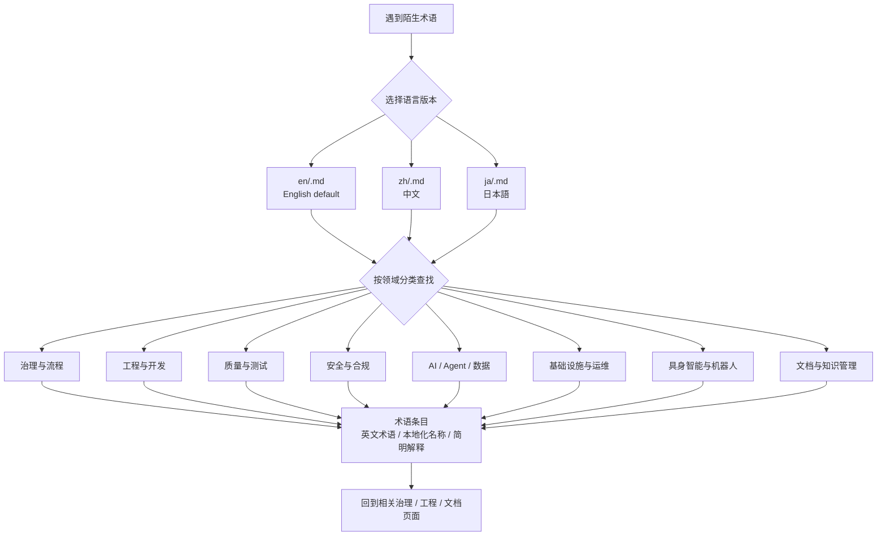

# 术语表

> **语言**：[English](README.md) · [中文](README.zh.md) · [日本語](README.ja.md)

本目录为辉夜计划治理文档中使用的所有关键概念、方法和术语提供定义。

## 语言版本

| 语言 | 目录 |
|----------|------|
| **English**（默认） | [`en/`](en/) |
| **中文** | [`zh/`](zh/) |
| **日本語** | [`ja/`](ja/) |

## 分类

| # | English | 中文 | 日本語 |
|---|---------|------|--------|
| 01 | [Governance & Process](en/01-governance-and-process.md) | [治理与流程](zh/01-governance-and-process.md) | [ガバナンスとプロセス](ja/01-governance-and-process.md) |
| 02 | [Engineering & Development](en/02-engineering-and-development.md) | [工程与开发](zh/02-engineering-and-development.md) | [エンジニアリングと開発](ja/02-engineering-and-development.md) |
| 03 | [Quality & Testing](en/03-quality-and-testing.md) | [质量与测试](zh/03-quality-and-testing.md) | [品質とテスト](ja/03-quality-and-testing.md) |
| 04 | [Security & Compliance](en/04-security-and-compliance.md) | [安全与合规](zh/04-security-and-compliance.md) | [セキュリティとコンプライアンス](ja/04-security-and-compliance.md) |
| 05 | [AI, Agent & Data](en/05-ai-agent-and-data.md) | [AI、Agent 与数据](zh/05-ai-agent-and-data.md) | [AI・エージェント・データ](ja/05-ai-agent-and-data.md) |
| 06 | [Infrastructure & Operations](en/06-infrastructure-and-operations.md) | [基础设施与运维](zh/06-infrastructure-and-operations.md) | [インフラストラクチャと運用](ja/06-infrastructure-and-operations.md) |
| 07 | [Embodiment & Robotics](en/07-embodiment-and-robotics.md) | [具身智能与机器人](zh/07-embodiment-and-robotics.md) | [身体性知能とロボティクス](ja/07-embodiment-and-robotics.md) |
| 08 | [Documentation & Knowledge](en/08-documentation-and-knowledge.md) | [文档与知识管理](zh/08-documentation-and-knowledge.md) | [ドキュメンテーションと知識管理](ja/08-documentation-and-knowledge.md) |

## 使用方式

- **默认语言为英文。** 切换到 `zh/` 查看中文版，切换到 `ja/` 查看日文版。
- 三个版本覆盖相同术语，结构一致。
- 术语按领域组织，不按字母排序——先找到对应领域。
- 每个条目以英文术语为标题，给出本地化名称与简明解释。

