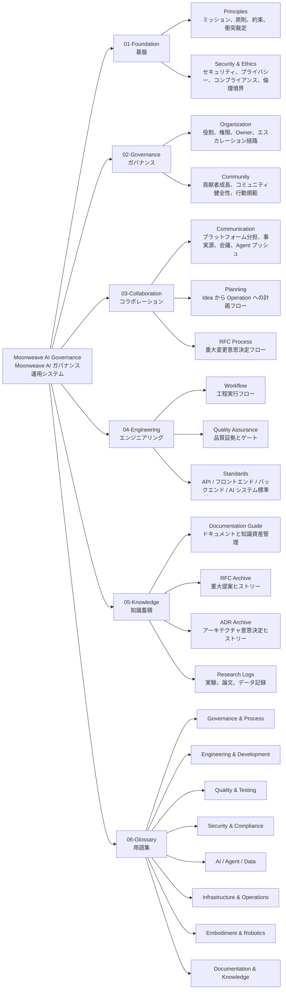
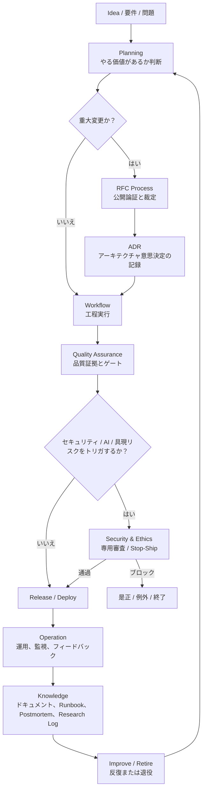
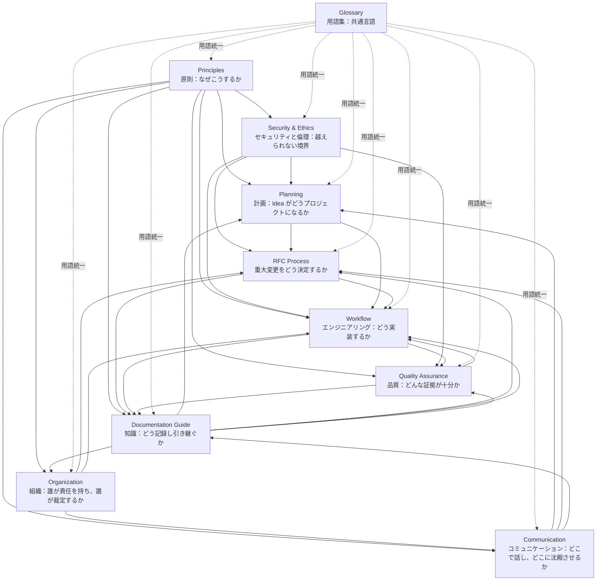

# Moonweave AI Governance · Moonweave AI ガバナンスリポジトリ

> **言語**: [English](README.md) · [中文](README.zh.md) · [日本語](README.ja.md)

本リポジトリは Moonweave/Kaguya Project（輝夜計画）の原則、組織構造、コラボレーションプロトコル、エンジニアリングワークフロー、品質基準、知識管理プラクティスを定義します——これは自律 Agent、AI インフラ、具身知能を統合する長期ライフサイクルの AI アーキテクチャです。

これはコードではありません。これはプロジェクトの運用システムです。ソフトウェア、AI/Agent システム、データパイプライン、モデルサービス、具身ロボティクスにわたるエンジニアリングを安全、トレーサブル、持続可能にするためのルール、プロセス、標準です。

## 構造概要



## Idea から Operation へのワークフロー



## ドキュメント関係



## ディレクトリ構造

```text
01-Foundation/          原則とセキュリティ倫理基線
02-Governance/          組織、役割、コミュニティルール
03-Collaboration/       コミュニケーション、計画、RFC プロセス
04-Engineering/         ワークフロー、品質保証、技術標準
05-Knowledge/           ドキュメントガイドと知識資産管理
06-Glossary/            英 / 中 / 日 の用語定義
governance-skills/      Agent Skills・コマンド・テンプレート・CLI・プラットフォームアダプタ
                        本ガバナンス体系を呼出可能・検査可能なツールへコンパイル
```

| セクション | 日本語 |
|---------|--------|
| **01-Foundation** | [原則](01-Foundation/ja/01-Principles.md) · [セキュリティ](01-Foundation/ja/02-Security-Ethics.md) |
| **02-Governance** | [組織](02-Governance/ja/01-Organization.md) · [コミュニティ](02-Governance/ja/02-Community.md) |
| **03-Collaboration** | [コミュニケーション](03-Collaboration/ja/01-Communication.md) · [プランニング](03-Collaboration/ja/02-Planning.md) · [RFC](03-Collaboration/ja/03-RFC-Process.md) |
| **04-Engineering** | [ワークフロー](04-Engineering/ja/01-Workflow.md) · [品質](04-Engineering/ja/02-Quality-Assurance.md) |
| **05-Knowledge** | [ドキュメント](05-Knowledge/ja/01-Documentation-Guide.md) |
| **06-Glossary** | [日本語](06-Glossary/README.ja.md) |
| **governance-skills** | [Skills](governance-skills/README.ja.md) — Agent Skills・CLI・プラットフォームアダプタ |

## 主要概念

- **すべてのエンジニアリング変更はトレーサブル、再現可能、レビュー可能、検証可能、リバース可能でなければならない。**
- **リスクがプロセス強度を決める**——低リスクでリバース可能な変更は軽量プロセス、本番・AI・具身システムは重量級プロセス。
- **品質は証拠であり、感覚ではない**——すべてのシステム主張には検証可能な証明が伴う必要がある。
- **プロトタイプが暗黙に本番依存になってはならない。**
- **AI / Agent / 具身変更には従来のソフトウェアテストを超えた専用検証が必要。**

## 使い方

- **新規プロジェクトを始める** → [Principles](01-Foundation/ja/01-Principles.md) を読み、次に [Workflow](04-Engineering/ja/01-Workflow.md) §5（Engineering Ready）を読む。
- **重大な変更を提案する** → [RFC Process](03-Collaboration/ja/03-RFC-Process.md) を読む。
- **エンジニアリングタスクを実装する** → [Workflow](04-Engineering/ja/01-Workflow.md) を読む。
- **品質要件を理解する** → [Quality Assurance](04-Engineering/ja/02-Quality-Assurance.md) を読む。
- **ドキュメントを書く** → [Documentation Guide](05-Knowledge/ja/01-Documentation-Guide.md) を読む。
- **見慣れない用語に出会ったら** → [Glossary](06-Glossary/README.ja.md) を参照する。

## 言語

すべてのドキュメントは三言語で提供されます：

| 言語 | パス | 備考 |
|----------|------|-------|
| **中文 (中国語)** | 各セクションのルート（例: `01-Foundation/01-Principles.md`） | 主/権威バージョン |
| **English** | `en/` サブディレクトリ（例: `01-Foundation/en/01-Principles.md`） | 完全翻訳 |
| **日本語** | `ja/` サブディレクトリ（例: `01-Foundation/ja/01-Principles.md`） | 完全翻訳 |

本 README の三言語版：[English](README.md) · [中文](README.zh.md) · [日本語](README.ja.md)。[Glossary](06-Glossary/README.ja.md) は同じ `en/` / `zh/` / `ja/` 構造を用い、英語をデフォルトとします。

## ステータス

**Active**——本リポジトリは活発に開発中です。Foundation、Governance、Collaboration、Engineering、Knowledge の各セクションは完成しています。技術標準ディレクトリ（`04-Engineering/standards/`）はまだ整備中で、継続的に拡充されています。

## License

[MIT](LICENSE)

## Ownership

Moonweave AI コアチームが保守します。ガバナンス文書の変更には [03-Collaboration/03-RFC-Process.md](03-Collaboration/ja/03-RFC-Process.md) で定義される RFC プロセスの承認が必要です。
