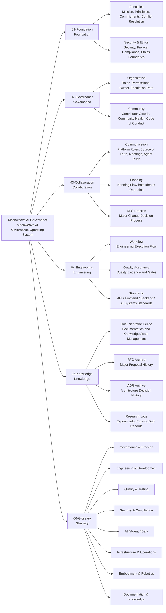
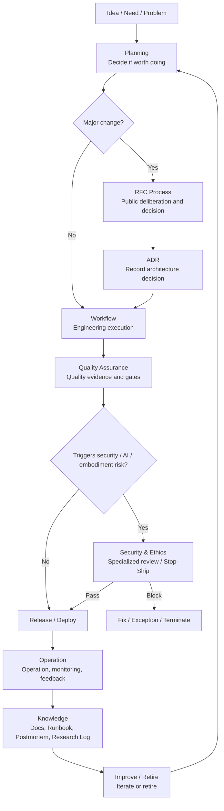
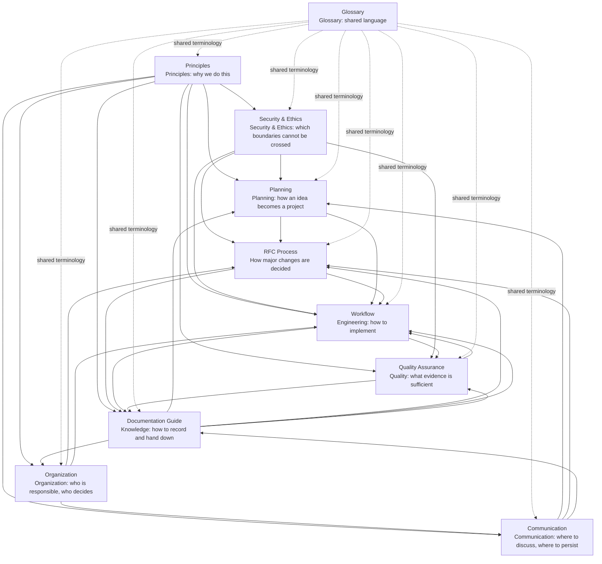

# Moonweave AI Governance · Moonweave AI Governance Repository

> **Language**: [English](README.md) · [中文](README.zh.md) · [日本語](README.ja.md)

This repository defines the principles, organizational structure, collaboration protocols, engineering workflows, quality standards, and knowledge management practices for the Moonweave/Kaguya Project — a long-lifecycle AI architecture integrating autonomous agents, AI infrastructure, and embodied intelligence.

This is not code. This is the project's operating system: the rules, processes, and standards that enable safe, traceable, and sustainable engineering across software, AI/Agent systems, data pipelines, model services, and embodied robotics.

## Structure Overview



## Idea to Operation Workflow



## Document Relationships



## Directory Structure

```text
01-Foundation/          Principles and security-ethics baseline
02-Governance/          Organization, roles, and community rules
03-Collaboration/       Communication, planning, and RFC process
04-Engineering/         Workflow, quality assurance, and technical standards
05-Knowledge/           Documentation guide and knowledge asset management
06-Glossary/            Term definitions in English, Chinese, and Japanese
```

| Section | English |
|---------|---------|
| **01-Foundation** | [Principles](01-Foundation/en/01-Principles.md) · [Security & Ethics](01-Foundation/en/02-Security-Ethics.md) |
| **02-Governance** | [Organization](02-Governance/en/01-Organization.md) · [Community](02-Governance/en/02-Community.md) |
| **03-Collaboration** | [Communication](03-Collaboration/en/01-Communication.md) · [Planning](03-Collaboration/en/02-Planning.md) · [RFC](03-Collaboration/en/03-RFC-Process.md) |
| **04-Engineering** | [Workflow](04-Engineering/en/01-Workflow.md) · [Quality](04-Engineering/en/02-Quality-Assurance.md) |
| **05-Knowledge** | [Documentation](05-Knowledge/en/01-Documentation-Guide.md) |
| **06-Glossary** | [English](06-Glossary/README.md) |

## Key Concepts

- **All engineering changes must be traceable, reproducible, reviewable, verifiable, and reversible.**
- **Risk determines process intensity** — lightweight for low-risk reversible changes; heavyweight for production, AI, and embodied systems.
- **Quality is evidence, not feeling** — every system claim must be backed by checkable proof.
- **Prototypes must not silently become production dependencies.**
- **AI/Agent/Embodied changes require specialized validation beyond traditional software testing.**

## How to Use This Repository

- **Starting a new project** → Read [Principles](01-Foundation/en/01-Principles.md), then [Workflow](04-Engineering/en/01-Workflow.md) §5 (Engineering Ready).
- **Proposing a significant change** → Read [RFC Process](03-Collaboration/en/03-RFC-Process.md).
- **Implementing an engineering task** → Read [Workflow](04-Engineering/en/01-Workflow.md).
- **Understanding quality requirements** → Read [Quality Assurance](04-Engineering/en/02-Quality-Assurance.md).
- **Writing documentation** → Read [Documentation Guide](05-Knowledge/en/01-Documentation-Guide.md).
- **Encountering an unfamiliar term** → Check the [Glossary](06-Glossary/README.md).

## Languages

All documents are available in three languages:

| Language | Path | Notes |
|----------|------|-------|
| **中文 (Chinese)** | `zh/` companion files & section roots (e.g., `01-Foundation/01-Principles.md`) | Full translation |
| **English** | `en/` subdirectory (e.g., `01-Foundation/en/01-Principles.md`) | Primary/canonical version |
| **日本語 (Japanese)** | `ja/` subdirectory (e.g., `01-Foundation/ja/01-Principles.md`) | Full translation |

This README in three languages: [English](README.md) · [中文](README.zh.md) · [日本語](README.ja.md). The [Glossary](06-Glossary/README.md) uses the same `en/` / `zh/` / `ja/` structure with English as default.

## Status

**Active** — This repository is under active development. Foundation, Governance, Collaboration, Engineering, and Knowledge sections are complete. The technical standards directory (`04-Engineering/standards/`) is still being refined and continues to be expanded.

## License

[MIT](LICENSE)

## Ownership

Maintained by the Moonweave AI core team. Changes to governance documents require RFC process approval as defined in [03-Collaboration/03-RFC-Process.md](03-Collaboration/en/03-RFC-Process.md).
