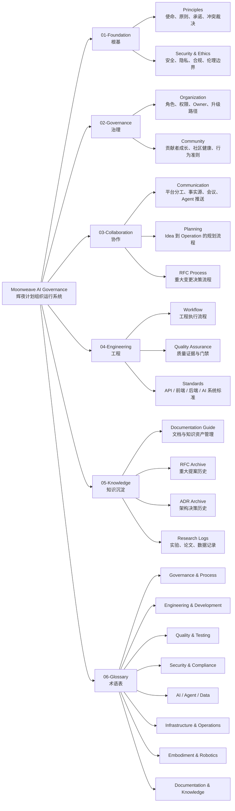
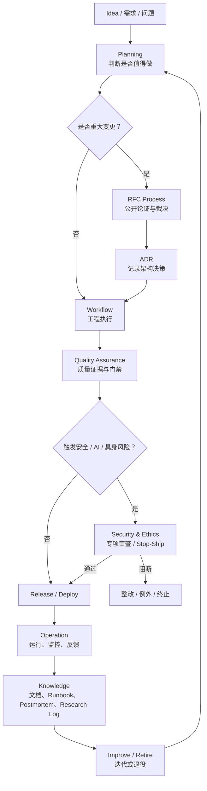
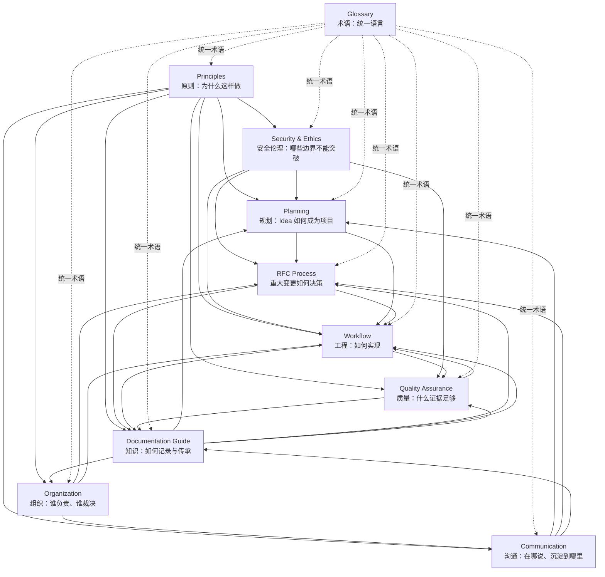

# Moonweave AI Governance · 辉夜计划治理仓库

> **语言**：[English](README.md) · [中文](README.zh.md) · [日本語](README.ja.md)

本仓库为 Moonweave/Kaguya Project（辉夜计划）定义原则、组织结构、协作协议、工程工作流、质量标准与知识管理实践——这是一个整合自主 Agent、AI 基础设施与具身智能的长生命周期 AI 架构。

这不是代码。这是项目的运行系统：使软件、AI/Agent 系统、数据流水线、模型服务与具身机器人之上的工程能够安全、可追溯、可持续开展的规则、流程与标准。

## 结构概览



## Idea 到 Operation 工作流



## 文档关系



## 目录结构

```text
01-Foundation/          原则与安全伦理基线
02-Governance/          组织、角色与社区规则
03-Collaboration/       沟通、规划与 RFC 流程
04-Engineering/         工作流、质量保障与技术标准
05-Knowledge/           文档规范与知识资产管理
06-Glossary/            英 / 中 / 日 术语定义
governance-skills/      Agent Skills、命令、模板、CLI 与平台适配器
                        将本治理体系编译为可调用、可检查的工具
```

| 章节 | 中文 |
|---------|------|
| **01-Foundation** | [原则](01-Foundation/01-Principles.md) · [安全伦理](01-Foundation/02-Security-Ethics.md) |
| **02-Governance** | [组织](02-Governance/01-Organization.md) · [社区](02-Governance/02-Community.md) |
| **03-Collaboration** | [沟通](03-Collaboration/01-Communication.md) · [规划](03-Collaboration/02-Planning.md) · [RFC](03-Collaboration/03-RFC-Process.md) |
| **04-Engineering** | [工作流](04-Engineering/01-Workflow.md) · [质量](04-Engineering/02-Quality-Assurance.md) |
| **05-Knowledge** | [文档规范](05-Knowledge/01-Documentation-Guide.md) |
| **06-Glossary** | [中文](06-Glossary/README.zh.md) |
| **governance-skills** | [Skills](governance-skills/README.zh.md) — Agent Skills、CLI 与平台适配器 |

## 关键概念

- **所有工程变更必须可追溯、可复现、可评审、可验证、可回滚。**
- **风险决定流程强度**——低风险可回滚变更走轻量流程；生产、AI 与具身系统走重量级流程。
- **质量是证据，不是感觉**——每一条系统主张都必须有可核查的证明。
- **原型不得静默地成为生产依赖。**
- **AI / Agent / 具身变更需要传统软件测试之外的专项验证。**

## 使用方式

- **启动新项目** → 阅读 [Principles](01-Foundation/01-Principles.md)，再读 [Workflow](04-Engineering/01-Workflow.md) §5（Engineering Ready）。
- **提出重大变更** → 阅读 [RFC Process](03-Collaboration/03-RFC-Process.md)。
- **执行工程任务** → 阅读 [Workflow](04-Engineering/01-Workflow.md)。
- **了解质量要求** → 阅读 [Quality Assurance](04-Engineering/02-Quality-Assurance.md)。
- **撰写文档** → 阅读 [Documentation Guide](05-Knowledge/01-Documentation-Guide.md)。
- **遇到陌生术语** → 查阅 [Glossary](06-Glossary/README.zh.md)。

## 语言版本

所有文档提供三种语言：

| 语言 | 路径 | 说明 |
|----------|------|-------|
| **中文** | 各章节根目录（如 `01-Foundation/01-Principles.md`） | 完整翻译 |
| **English** | `en/` 子目录（如 `01-Foundation/en/01-Principles.md`） | 主版本 / 权威版本 |
| **日本語** | `ja/` 子目录（如 `01-Foundation/ja/01-Principles.md`） | 完整翻译 |

本 README 的三语版本：[English](README.md) · [中文](README.zh.md) · [日本語](README.ja.md)。[Glossary](06-Glossary/README.zh.md) 采用同样的 `en/` / `zh/` / `ja/` 结构，以英文为默认。

## 状态

**Active**——本仓库处于活跃开发中。Foundation、Governance、Collaboration、Engineering、Knowledge 各章节已完成。技术标准目录（`04-Engineering/standards/`）尚待完善，仍在持续补充。

## License

[MIT](LICENSE)

## Ownership

由 Moonweave AI 核心团队维护。治理文档的变更需按 [03-Collaboration/03-RFC-Process.md](03-Collaboration/03-RFC-Process.md) 中定义的 RFC 流程批准。
